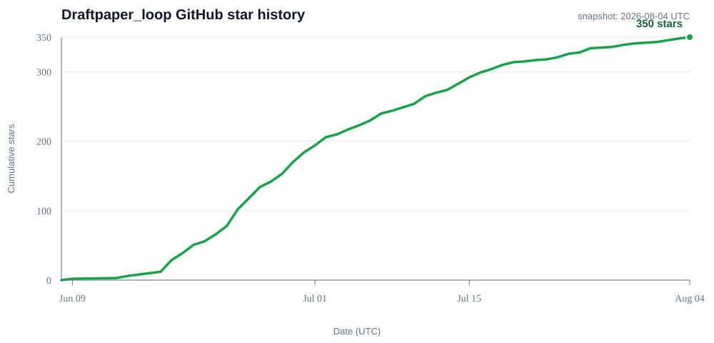

<div align="center">

[](#核心科研能力)
[](#完整科研工作流)
[](#文献引用与独立审稿)
[](#学科插件与科研能力扩展)
[](#快速开始)
[](./pyproject.toml)
[](#贡献者许可证商业使用和联系方式)

# Draftpaper-loop

**阿里巴巴希望天下没有难做的生意，而 Draftpaper-loop 希望天下没有难写的论文。**

**从研究 idea、学科方法和真实数据出发，生成可审计科研图表、完整论文与可追溯 `main.pdf` 的本地科研工作流。**

[English](./README.md) | [中文](./README.zh-CN.md)

</div>

Draftpaper-loop 把论文写作组织成证据优先的科研 loop：先确认研究问题和可行性，再匹配或补齐数据与方法能力，执行分析并确认图表是否支撑论断，随后基于同一证据版本完成正文、引用核查、学科审查、独立盲评和 PDF 发布。

## 项目定位与当前版本

### 用户可以用它完成什么

- 从研究 idea、已有数据、参考文献或项目代码创建结构化论文项目。
- 生成中英文研究蓝图、claim contract、统计验证要求和主图故事板，并集中交由用户确认。
- 识别单一或交叉学科，匹配 `data_connector`、`method_template` 和 `review_rule`，调用真实项目代码完成数据处理、模型训练、统计分析和科研制图。
- 在能力不足时审计 project-local 代码，并从现有插件、AcademicForge metadata 或公开科研代码仓库形成可追溯的补齐任务。
- 让主图追溯到 research-plan claim、cohort、data plugin、method plugin、run output、evidence ID 和学科审稿规则。
- 按 Results → Introduction → Data → Methods → Discussion 的证据顺序生成正文，并从阶段代码、公式、图表和参考文献重建科学叙事。
- 在正文完成后核查引用支撑、参考文献格式、学科统计标准、结果表述和复现材料，再交给两位独立盲评者。
- 一次补齐作者、单位、ORCID、基金、致谢、数据/代码链接、新文献和定点段落修订，预览候选 PDF 后发布同一 hash 绑定的 `main.pdf`。

**当前版本：v0.43.2。** v0.43 系列整合了文献显式准入、研究合同加固、天文学语义隔离和完整论文生产环境验收。此后 `main` 新增证据治理与“先改后审”、可读的确认点变化说明、插件重跑成功后的状态恢复，以及分层 CI；这些主干更新尚未打新版本标签，发布版与主干更新分别列在[最近更新](#最近更新)中。

## 核心科研能力

| 科研环节 | 主要能力 | 关键产物 |
|---|---|---|
| 研究设计 | idea 解析、期刊画像、中英文研究蓝图、claim/statistical/figure contracts 和人工确认 | confirmed plan hash、claims、figure storyboard |
| 学科能力 | 单学科/交叉学科识别，数据、方法和审稿插件匹配，project-local 审计和能力补齐 | discipline/capability contracts、plugin bindings |
| 数据与方法 | 数据清单、可行性、阶段归属代码、真实方法运行、公式和变量提取 | data/method manifests、run/formula manifests |
| 图表与证据 | 语义 figure/panel contract、figure-code trace、结果有效性和 Result Support | 主图组、附录图、result manifest、evidence registry |
| 科学写作 | Paper Narrative Engine、章节证据包、Codex 自由写作、Scientific Editor | Results、Introduction、Data、Methods、Discussion |
| 文献与引用 | 学科化多源检索、Zotero、本地 PDF/结构化导入、对称学科门禁、论文身份核验、按需全文、抓取后复核、评分保全、双语 HTML 和引用审计 | identity/fetch receipts、active snapshot、quarantine、`library.bib`、citation evidence、final audit |
| 审稿与发布 | Results 后学科审查、两位独立盲评、作者补全事务、编译和 release hash | reviewer reports、completion packet、`main.pdf` |
| 运行环境与发布 | 只读环境合同、原生 PDF 解析检查、系统 Git 识别，以及隔离的 XeLaTeX/pdfLaTeX/BibTeX 验收 | environment contract、验收回执、双语环境报告 |

<!-- capability:checkpoint_summary_and_runtime_handshake -->
<!-- capability-meta: id=checkpoint_summary_and_runtime_handshake; status=implemented; since=0.35 -->
**确认点透明度与运行时身份。** 每次人工确认前，Draftpaper-loop 都会生成中英文可读决定页、artifact manifest、confirmation request、DecisionBrief、科学指纹、机器审计 JSON 和可读性报告。Agent 会先给出决定页的项目相对路径与本机绝对路径，再说明语义变化、未解决事项和确认含义；技术审计只在显式请求时从 JSON 渲染到缓存。`session-preflight` 会在写入项目之前绑定源码 checkout、wheel、Python、CommandSpec、schema registry、Skill 副本和 plugin catalog。
<!-- /capability:checkpoint_summary_and_runtime_handshake -->

<!-- capability:metadata_first_research_code_sources -->
<!-- capability-meta: id=metadata_first_research_code_sources; status=implemented; since=0.36 -->
**Metadata-first 科研代码来源。** 保留文献可以同步绑定 metadata-only 的 GitHub/Zenodo 代码线索、DOI/版本谱系、provider receipt 和稳定 literature work identity。索引会区分论文来源与代码来源；发现阶段不下载、不安装、不执行代码，也不会把代码线索自动变成正文引用或插件。
<!-- /capability:metadata_first_research_code_sources -->

<!-- capability:safe_research_code_archive_inspection -->
<!-- capability-meta: id=safe_research_code_archive_inspection; status=implemented; since=0.36 -->
**安全归档检查。** 用户单独确认下载后，系统会检查 checksum、路径逃逸、符号链接/设备文件、大小/压缩比、许可证一致性和静态结构，之后才允许进入插件晋升候选。metadata enrichment 和静态检查阶段永不执行第三方代码。
<!-- /capability:safe_research_code_archive_inspection -->

<!-- capability:discipline_aware_literature_identity -->
<!-- capability-meta: id=discipline_aware_literature_identity; status=implemented; since=0.40 -->
**学科感知文献身份闭环。** `search-literature` 默认使用 `resolve_then_fetch_on_demand`：NASA ADS、OpenAlex 等学科化来源负责发现候选，Core 对 shortlist 生成 hash-bound 身份收据，只有身份明确且确有证据需要时才调用 wheel 内 vendored paper-fetch。抓取后的真实标题、摘要和正文必须再次通过主题、学科和用途门禁；错误、歧义和历史 orphan 不进入活动文献快照。`audit-literature-integrity` 验证 active work 到全文产物的可达性，`quarantine-orphan-literature` 默认只生成 preview，必须提供 packet hash 才能 apply，并支持哈希校验回滚。
操作方式见[学科感知文献检索与身份核验](docs/discipline_aware_literature.zh-CN.md)。
<!-- /capability:discipline_aware_literature_identity -->

**证据身份与可读阶段审查。** 当前框架会在 Result Support 或 checkpoint 审查前验证 `MetricEvidence`、`CountEvidence`、`AggregationContract`、`PrimaryMetricContract`、`RunEvidenceBundle` 和 `FigureCodeTrace v2`。`dpl.checkpoint_summary.v6` 将作者可读的 `HumanDecisionBrief` 与 JSON-first 完整审计分离，记录 scientific/audit/presentation 三类指纹，将 StageActivity 限定在当前 checkpoint window，并把主图与决定陈述绑定。系统先核对身份再比较数值；不同 cohort、run、模型、验证设计或分母会被标记为不可直接比较，不会被静默合并。 确认页直接用文字说明哪个事实或图表发生了变化、原值与新值或科学含义是什么，以及去哪里核查当前证据。缺少上一版图像时会明确提示；哈希仍保留在技术审计中。

**证据治理与延后对账。** 修订周期现在把可信科学基线、实时工作区和每一代候选版本分开保存。`author_edit` 允许作者先连续修改正文、图表、代码和方法，再统一进行一次证据对账；`live` 模式则保留即时的上游路由。系统会发现声明科研目录中的编辑器直接修改，同时把生成回执和缓存排除在科研漂移集合之外。绑定 packet 会通过 JSON Pointer 或可审计的 CSV/TSV 唯一键行选择器读取真实来源值；只读命令 `audit-evidence-governance` 可生成结构化治理报告和可选的中英文 HTML。LaTeX/PDF 预览会明确标记为未对账草稿，不能直接成为发布版本。严格晋升要求候选哈希、父基线与不可变的 C3 用户确认回执精确匹配；科研语义变化必须先经过同一候选的用户确认，再完成对账。基线损坏、覆盖不完整、绑定过期或缺少治理自检时会阻止发布，但不会删除作者草稿。

### 从早期版本到当前框架

- **v0.1-v0.13：论文项目与科研阶段地基。** 建立参考文献、期刊画像、research plan、方法/结果/讨论写作、artifact 追踪、Zotero、数据观察、科研绘图和阶段归属代码。
- **v0.14-v0.20：学科插件与结果支撑链。** 引入数据连接器、方法模板、review rules、插件充分性、AcademicForge/GitHub 候选补齐、跨学科执行账本和 Results 后学科审查。
- **v0.21-v0.28：科学叙事与证据语义。** 引入 Paper Narrative Engine、章节证据包、自由写作与 Scientific Editor、run/cohort/estimand 绑定、语义图表合同、独立盲审和可复现审稿包。
- **v0.28.1-v0.33：事务、发布与精确恢复。** 完成 artifact DAG、统一 CommandSpec、科学非零退出状态、作者补全事务、稳定段落定位、跨期刊/跨平台 wheel 回归、Result Support v3 和 release hash 绑定。
- **v0.34-v0.35：全学科文献质量与文档证据。** Query Contract v2 保留多语言主题锚点，provider 按学科和语言规划，相关性与角色覆盖由内容证据决定，本地 PDF 规范化为绑定 work identity 的 evidence passage。pypdf 是默认路径；官方 MinerU Agent 只在授权且满足质量条件时升级；自建 CPU/GPU MinerU 只通过通用 endpoint 合同和部署建议支持。
- **v0.36-v0.37：代码来源、阶段透明度与发布质量闭环。** 保留文献时同步发现 GitHub/Zenodo metadata-only 代码来源，保留 version DOI、paper-era lineage、许可证和 provider receipt；人工确认前生成中文阶段成果包并返回双重路径；runtime preflight、语义漂移治理、归档安全审查、Ruff no-new-debt、源码/wheel/Skill/schema parity 和 Definition of Done 审计共同保护发布一致性。stars/forks 和论文/软件引用量用于候选排序与解释，不能替代科研验证。
- **v0.37.1-v0.40：委托审查、纵向一致性与文献身份闭环。** 分级 Agent delegation、StageActivityBundle、不可变科学基线和 canonical facts 保护多轮执行；Query Contract v3、对称学科冲突、默认身份解析、按需全文、抓取后复核、active snapshot 可达性和可回滚 quarantine 共同阻止跨学科误召回及历史 orphan 重新进入写作上下文。
- **v0.41：可读科学确认与语义连续性。** v5 checkpoint 让决定页可读而不丢失技术审计；科学、审计与呈现身份分离。派生产物或呈现重建会沿用有效用户确认；指标、cohort、split、方法、图表语义或论断边界变化会用明确的语义差异重新打开 C3。
- **v0.42-v0.43 与后续 main 更新：审阅、部署与迭代证据治理。** 统一审阅包、文献准入、完整论文生产环境和学科隔离合同，进一步衔接“先改后审”、事实/图表可读变化、插件重跑恢复与分层 CI。v0.43.2 之后的改动在下方单列，待正式打标签后再归入新版本。

版本号用于解释能力来源；日常使用由当前研究问题和项目状态驱动，`status`、`doctor` 和 `run-pipeline` 会给出下一步。

## 快速开始

### 0. 验收完整的论文生产环境

Python extras 只安装 Draftpaper 的 Python 能力，不会安装 TeX 发行版、Visual C++ 运行库或系统 Git。Windows 请按[环境部署手册](docs/environment_deployment.zh-CN.md)采用 MiKTeX 25.12 私有安装路线，然后执行：

```powershell
.\tools\bootstrap_windows_environment.ps1 -Mode Check
.\.venv\Scripts\python -m draftpaper_cli doctor --target publication --json
.\.venv\Scripts\python -m draftpaper_cli verify-environment --target publication --compile-latex --output .tmp\environment-verification
```

验收命令只会把 JSON 回执、双语报告、PDF 和日志写入指定输出目录。不要在真实论文项目内运行；端到端验收还需要在独立的 Draftpaper 临时项目中编译一次。

### 1. 安装真实论文常用的绘图档位

PowerShell：

```powershell
git clone https://github.com/xiejhhhhhh/Draftpaper_loop.git
cd Draftpaper_loop
py -3.11 -m venv .venv
.\.venv\Scripts\python -m pip install -U pip
.\.venv\Scripts\python -m pip install -c requirements\runtime-constraints.txt -e ".[plotting]"
.\.venv\Scripts\draftpaper doctor --json
```

bash/macOS/Linux：

```bash
git clone https://github.com/xiejhhhhhh/Draftpaper_loop.git
cd Draftpaper_loop
python3.11 -m venv .venv
source .venv/bin/activate
python -m pip install -U pip
python -m pip install -c requirements/runtime-constraints.txt -e ".[plotting]"
draftpaper doctor --json
```

### 2. 让 Codex 驱动工作流

在 Codex 中打开仓库目录，并说明 idea、数据位置、目标期刊和已有代码：

```text
使用当前仓库中的 Draftpaper-loop 为这个 idea 创建论文项目。
先读取 idea、数据和已有代码，识别学科与能力缺口，生成中文版研究蓝图给我确认；
确认后按项目状态执行数据、方法、图表、论文写作、引用核查、两位独立盲评和 PDF 编译。
```

Codex 负责科研推理和自然行文；阶段状态、证据绑定、写入范围与人工确认由 Draftpaper-loop CLI 合同记录。

### 3. 最短 CLI 路径

```powershell
draftpaper create-project --idea "Your research idea" --field "astronomy machine learning" --target-journal MNRAS
draftpaper status --project .\projects\<project>
draftpaper run-pipeline --project .\projects\<project>
```

`run-pipeline` 会在研究蓝图、结果支撑路线和最终发布检查点停下并推荐下一条命令。论文项目默认位于 `projects/<project>/`，成稿位于 `projects/<project>/latex/main.pdf`。

基础教学视频：[Bilibili](https://www.bilibili.com/video/BV1LKjS6gEh4/)

## 完整科研工作流

```text
idea、已有数据、项目代码与文献
  -> 创建独立论文项目
  -> 识别学科与目标期刊
  -> 检索/导入文献并建立引用证据
  -> 生成中英文研究蓝图、claims、统计合同和主图故事板
  -> 用户集中确认研究蓝图
  -> 评估插件充分性并审计 project-local 能力
  -> 执行数据插件、方法插件和真实项目代码
  -> 生成主图组、支撑图、结果表与证据注册表
  -> 验证结果是否支撑研究论断
  -> 接受证据、收窄论断或补充数据/方法
  -> Results -> Introduction -> Data -> Methods -> Discussion
  -> Results 后复合学科 review-rule 审查与语义修复
  -> 最终作者补全和定点修订
  -> 最终 citation audit
  -> 两位独立盲评者
  -> 完整性、期刊格式和 PDF 编译验证
  -> 确认 release hash
  -> latex/main.pdf
```

### Loop 和人工控制

```text
读取项目状态
  -> 选择当前阶段动作
  -> 执行并生成结构化产物
  -> 验证科学合同和文件 hash
  -> 记录 artifact、run、evidence 和人工决策
  -> 输入变化时精确标记下游 stale
  -> 诊断失败并回到对应阶段
  -> 重复直到成稿可发布
```

确定性合同负责项目状态、cohort/run 身份、插件来源、图表语义、公式、引用、stale 传播、写集和 release hash。Codex 或其他 Agent 负责开放性的文献理解、方法设计、科研推理和自然写作。

三个集中人工确认点是：

1. **研究蓝图确认**：一起查看研究问题、claims、cohort、数据/方法需求、统计标准、主图组和可行性边界。
2. **关键结果与论断支撑确认**：一起查看真实运行、核心图表、指标、不确定性和最大可支持论断，并决定后续路线。
3. **最终稿与发布确认**：一起查看作者补全 packet、候选 PDF、最终引用审计、两位盲评意见和 release hash。

在展示上述任一确认点之前，Draftpaper-loop 会先在
`review/checkpoints/<checkpoint_id>/` 写出一个离线成果包。用户应先打开中英文
`stage_summary` 决定页：它展示科学问题、相对上次的语义变化、主事实与主图、论断边界、
排除范围和重新确认条件；完整技术审计保留为 `stage_audit.json`，仅在需要时按需渲染。
研究蓝图另使用版本化 `HumanReviewPacket`，且必须等本轮待办完成后才请求确认。Agent 会先给出
决定页的项目相对路径和本机绝对路径，再说明差异、阻断项和确认含义。决定是否需要新的 C3
由 `scientific_decision_sha256` 而非不断变化的审计包 hash 决定；科学内容未变时会使用
continuity receipt。详见[人工确认点成果包](docs/human_checkpoints.zh-CN.md)。

### 结果支撑不足时的两条路线

<!-- capability:result_support_two_routes -->
<!-- capability-meta: id=result_support_two_routes; status=implemented; since=0.18 -->
- **论断收窄路线**：冻结已确认图表和指标，下调 claim 强度并重新生成受影响正文。
- **数据/方法补强路线**：补充数据角色、清洗、方法实现或验证，随后重跑相应的证据、图表和正文链。
当前按整份 result-support checkpoint 选择一条路线，多 claim 独立分治列为后续能力。
<!-- /capability:result_support_two_routes -->

<!-- capability:result_support_checkpoint_v3 -->
<!-- capability-meta: id=result_support_checkpoint_v3; status=implemented; since=0.32 -->
Result Support v3 优先读取当前 resolved evidence，其次读取 selected run manifest 和明确 run-bound 的结果表。路线绑定当前 checkpoint hash；Results 后发现的 cohort、指标或图表证据问题会回流到同一个 checkpoint，保持正文与证据版本一致。
<!-- /capability:result_support_checkpoint_v3 -->

## 学科插件与科研能力扩展

**插件失败后的恢复。** 同一需求、同一插件的更晚有效项目执行可以解除旧执行失败；不同绑定的成功、fixture 或缺少合格输出证据的事件不能解除，之后的新失败仍会阻塞。执行账本保留完整历史，当前产物有效性另由证据与漂移检查验证。

### 数据、方法和审稿规则

`draftpaper_cli/discipline_modules/<discipline>/` 注册三类正式科研插件：

- **`data_connectors`**：数据访问、读取、解析、清洗、标准化、cohort 构建和质量检查。
- **`method_templates`**：统计分析、特征工程、模型训练、验证、消融、不确定性估计和科研制图。
- **`review_rules`**：按学科和方法核验统计标准、baseline、split/leakage、拟合或分类质量、校准、稳健性、图表-论断一致性与复现要求。

插件 manifest 声明运行等级、验证等级、依赖、输入输出、fixture 和 provenance。合同、mock 和 fixture 用于验证接口；主图证据要求经过真实项目或 live 运行验证的输出及 hash。

research plan 生成 discipline/capability contracts，将每个 claim 和 figure requirement 分配给主学科、次学科及相应 data/method/review 能力。能力缺口按以下顺序补齐：

1. 审计项目现有数据/方法代码和运行产物，形成受限 `project_local` binding。
2. 搜索当前 registry 中可复用的插件。
3. 从 AcademicForge 等 registry metadata 提取候选能力。
4. 审计公开科研代码仓库的许可证、结构、复现性和输入输出。
5. 由 Codex 生成项目专属实现并在当前项目验证。
6. 通用能力另行经过 generalize、fixture、overlap、license 和人工确认后 promote。

数据与方法补齐路线都有可审计结果、且关键输入或实现仍缺失时，图表阶段才形成明确阻塞诊断。

### 主图可追溯链

```text
research-plan claim
  -> data requirement -> data plugin/project-local binding
  -> method requirement -> method plugin/project-local binding
  -> verified run output
  -> evidence ID and cohort view
  -> figure/panel contract
  -> Results claim
  -> applicable discipline review rules
```

数据和方法插件生成真实图表输入与方法输出；匹配的 `review_rule` 在 `review-results-with-discipline-rules` 阶段核验图表和 Results 表述。

### 外部能力如何进入插件体系

公开科研代码和 AcademicForge 采用 metadata-first 的候选流程，保留 repository、commit、license、依赖、输入输出、运行等级和来源记录。候选通过 `generalize-plugin-candidate`、`validate-plugin-candidate`、`package-plugin-contribution`、`preflight-plugin-contribution`、`review-plugin-contribution` 和人工确认的 `promote-plugin-candidate` 后进入正式学科模块。

保留文献和锚点文献还可以生成 metadata-only 的 GitHub/Zenodo 科研代码线索，
记录论文 `work_id`、仓库或版本 DOI、release/commit、许可证、checksum 线索和
provider 时间戳。`knowledge_base` 默认选择最新稳定版本并保留论文时期谱系；只有
`reproduction` 模式要求论文关联的精确版本。stars、forks、论文被引量和软件引用量
是分开的采用度/影响度信号，不能证明科学正确性。检索不会下载或执行第三方代码；
归档下载必须经过人工确认、checksum/许可证检查和 fixture 验证后才能考虑晋升。
详见[科研代码来源](docs/research_code_sources.zh-CN.md)。

`workflow_recipe`、`paper_contract` 和 `shared_capability` 留在支撑层；其中可验证的统计、baseline、ablation、split/leakage、引用支撑和复现条件可以回流为 `review_rule_candidate`。全部命令见[CLI 命令参考](docs/cli_reference.md)。

本仓库在 `third_party/` 保存上游快照、来源指针、固定 commit 和许可证说明；随 wheel 运行的 paper-fetch fallback 位于 `draftpaper_cli/_vendor/paper_fetch_skill`。

## 图表、证据与科学写作

### 从确认蓝图生成图表

`plan-figures` 读取已确认的 research plan、claims、cohort、data/method requirements、统计合同和已有证据，生成主图组、supporting/appendix 图和 caption 合同。每组图的首句概括整体科学结论，后续句子逐一解释 panel、cohort、估计量、不确定性和 claim boundary。

`generate-analysis-code` 依据 figure contract 和已绑定能力生成阶段归属代码。执行失败写入 `figure_execution_diagnosis.json/.html`，区分数据缺口、方法缺口、依赖问题、运行错误、结果质量不足和需要用户确认，并推荐对应修复命令。

### 同一证据版本驱动正文

Paper Narrative Engine 读取 Scientific Evidence Registry、result manifest、figure story arc、文献比较矩阵、阶段代码和公式 trace，生成章节证据包与段落目标。Codex 在证据边界内自由写作；写后合同核验数字、cohort、run、模型、指标量纲、引用角色、内部路径和论断强度。

- **Results**：解释主图组和关键表格，并用支撑/附录图完成稳健性、不确定性和边界说明。
- **Introduction**：根据研究问题、研究意义、文献证据和 Results 已确定的贡献组织研究空白。
- **Data**：从 data connector、data inventory、cohort registry 和阶段代码重建来源、样本、变量、预处理和缺失性。
- **Methods**：从 method plugin、真实实现、run manifest、公式 AST 和 figure-code trace 提炼方法阶段，解释核心公式、变量、假设及其与结果图表的关系。
- **Discussion**：将本研究结果与比较文献证据对应，分析机制、创新、不足、外推边界和后续工作。

`record-observation` 只保存已经展示给用户的阶段分析摘要。路径、命令、凭证、manifest 字段和本地文件名留在内部 context。

### 精确 stale 和恢复

<!-- capability:scientific_gates_and_artifact_dag -->
<!-- capability-meta: id=scientific_gates_and_artifact_dag; status=implemented; since=0.30 -->
科学门控、非零退出状态、统一 change taxonomy 和 artifact DAG 共同决定项目可继续的状态。数据、cohort、方法、run、指标、主图或 claim 变化会重开对应科学链；引用局部修订、作者 metadata 和纯展示修改采用更窄的 stale 范围。
<!-- /capability:scientific_gates_and_artifact_dag -->

项目通过 `project_passport.yaml`、`artifact_ledger.jsonl`、`checkpoint_ledger.jsonl`、`integrity_ledger.jsonl` 和 artifact hash 记录阶段、输入、输出、人工确认与恢复理由。`doctor --explain` 和 `diagnose-gate-failures` 用于解释当前状态及下一步。

## 文献、引用与独立审稿

文献阶段保存 BibTeX、reference registry、citation evidence、阅读笔记、单篇摘要和可用 PDF/全文证据。检索结果、用户提供文献和 Zotero collection 都保留来源与选择策略，写作时按 direct support、方法 provenance、数据来源、比较语境和背景分配引用角色。

### 多源文献与本地文档

文献注册表可以在同一个项目中合并在线检索、Zotero、本地文件夹、结构化文件和手工记录。Provider Router 增加了 OpenAlex、PubMed、Europe PMC、DBLP、NASA ADS 等学科入口，并保留原有通用 provider；某个 provider 失败时会记录为降级结果，不会把“未检索到”误写成“没有相关文献”。每条记录都会保留规范化标识符、来源记录、字段级 provenance、去重决策、文件 hash 和逻辑定位信息。

本地文献库可以只读登记，不必迁移；也可以选择按 hash 复制附件：

```powershell
draftpaper add-literature-source --project <project> --type local-folder --path <folder> --recursive
draftpaper collect-literature --project <project>
draftpaper reconcile-literature --project <project>
draftpaper review-literature-coverage --project <project>
draftpaper record-remote-parser-consent --project <project> --decision project --service official-agent --document-class published-public
draftpaper parse-literature-document --project <project> --input <paper.pdf> --document-class published-public
draftpaper benchmark-literature-quality --output docs/benchmarks/literature_quality.json
draftpaper benchmark-document-parsers --output docs/benchmarks/document_parser_quality.json
```

文献确认后，可以先查看可能复用的代码来源，不复制也不执行：

```powershell
draftpaper enrich-literature-code-leads --project <project> --selection-mode knowledge_base
draftpaper inspect-research-code-source --project <project> --candidate-id <id>
```

文献 HTML 索引会区分在线检索、Zotero、本地 PDF、GitHub 和 Zenodo 来源。只有
明确加入 `--include-online` 时才访问公开 provider API；metadata-only enrichment
不会安装或运行仓库代码。

本地 PDF 文件夹以及 BibTeX/RIS/JSON 文件会以 `local_import` 来源保留；在线检索、Zotero、手工记录和继承记录会在 HTML 文献索引及来源筛选器中区分显示。PDF 默认优先使用本地 `pypdf`，复杂排版或扫描文档可以在满足条件时调用官方 MinerU Agent。Agent connector 已随核心 wheel 提供，但不会静默上传：必须先有项目级授权、公开文献类别和服务限制检查。用户提供的 MinerU endpoint 会优先于官方服务。自建 MinerU 和 GPU 部署不由 Draftpaper-loop 安装或运维，只提供通用 endpoint 合同、选型和利弊说明。MinerU 是文档解析器，不是检索引擎或推理模型；解析出的段落必须经过元数据和证据核验，不能因为本地存在 PDF 就自动加入引用。

<!-- capability:cross_discipline_literature_and_document_quality -->
<!-- capability-meta: id=cross_discipline_literature_and_document_quality; status=implemented; since=0.35 -->
文献 loop 会先写入多语言 Query Contract、provider 执行报告、相关性/拒绝报告、角色覆盖报告和一个 `literature_confirmation_packet`，再进入研究蓝图。每个本地或远程解析都会写入 normalized document、parse receipt、work identity 绑定、有限 evidence passages、上下文/token 估算，并在 HTML 索引中分开显示文献来源和解析器来源。`pypdf` 是完整离线路径；MinerU 路由失败时无损回退。
<!-- /capability:cross_discipline_literature_and_document_quality -->

Zotero 示例：

```powershell
$env:ZOTERO_LIBRARY_ID="your_zotero_library_id"
$env:ZOTERO_LIBRARY_TYPE="user"
$env:ZOTERO_API_KEY="your_zotero_api_key"
draftpaper list-zotero-collections
draftpaper search-literature --project <project> --zotero-collection "My Paper References" --zotero-context all --zotero-min-items 20
```

citation audit 位于最终章节和作者补全之后、独立盲评之前。它逐条比较正文 claim、BibTeX metadata、citation evidence、passage、数值、否定和因果方向，指出支撑弱、位置不合适或表述过强的引用。修复优先收紧或重写正文，并保留人工确认的参考文献与 reference coverage。

`review-results-with-discipline-rules` 读取 Results、figure/plugin trace、run output、evidence ID 和复合学科规则，检查指标陈述、样本边界、baseline、ablation、统计量纲、不确定性、拟合/分类标准和图表解释。语义问题进入局部 Results 修订；真实能力缺口回到 result-support 路线。

<!-- capability:completion_audit_and_readme_framework -->
<!-- capability-meta: id=completion_audit_and_readme_framework; status=implemented; since=0.32 -->
最终稿通过 citation audit 后生成冻结的匿名单稿审查包，由两位相互独立的 reviewer 分别检查科学正确性、证据充分性、结构、表达、图表、引用和复现材料。两份报告绑定同一个 manuscript/evidence/bundle hash；critical 或 major finding 进入修订和复审，最终确认绑定最新报告和编译 PDF。
<!-- /capability:completion_audit_and_readme_framework -->

## 最终稿补全、定点修订与发布

一个 `manuscript_completion.yaml` 可以一次补充作者、单位、ORCID、通讯作者、基金、致谢、关键词、短标题、数据/代码可用性、用户确认的新文献和多处章节修订。

<!-- capability:stable_locator -->
<!-- capability-meta: id=stable_locator; status=implemented; since=0.30 -->
LaTeX 行号用于用户定位提示；实际写入同时校验稳定 `paragraph_id`、expected text、occurrence 和 SHA-256。章节重排后可以重新定位，歧义、重复目标或 stale hash 会让整个 packet 回到预览。
<!-- /capability:stable_locator -->

<!-- capability:completion_change_classification -->
<!-- capability-meta: id=completion_change_classification; status=implemented; since=0.32 -->
preview 同时展示用户声明的 change class、系统推断类别、candidate evidence refs 和精确 stale 范围。作者信息、致谢和纯文字润色保持在下游；新增数据来源、已执行方法、科学指标、claim 或图表解释依据当前 evidence refs 重开相应科研或写作阶段。
<!-- /capability:completion_change_classification -->

<!-- capability:manuscript_completion_transaction -->
<!-- capability-meta: id=manuscript_completion_transaction; status=implemented; since=0.30 -->
补全流程先生成统一 diff、候选 LaTeX 和候选 PDF；用户接受后原子 apply。Apply 重新核验 packet、project revision、source map、evidence snapshot 和 before hash，并写入 rollback receipt 与 exact-text user lock。
<!-- /capability:manuscript_completion_transaction -->

```powershell
draftpaper prepare-manuscript-completion --project <project>
draftpaper preview-manuscript-completion --project <project> --input manuscript_completion.yaml
draftpaper apply-manuscript-completion --project <project> --packet-id <id> --packet-hash <sha256>
draftpaper review-final-manuscript --project <project>
draftpaper confirm-final-manuscript --project <project> --release-hash <sha256>
```

发布顺序为：作者补全与定点修订 → 最终 citation audit → 两位独立盲评 → 完整性与编译验证 → release hash 确认。完整格式见[最终论文信息补全与精确修订](docs/manuscript_completion.zh-CN.md)。

## 安装、Agent 与日常操作

### 安装档位

<!-- capability:minimal_install_cost_risk_release -->
<!-- capability-meta: id=minimal_install_cost_risk_release; status=implemented; since=0.31 -->
- `pip install -e .`：minimal 控制面、项目状态、参考文献和基础 PDF/图像检查。
- `pip install -e ".[plotting]"`：真实论文常用的 NumPy、pandas、Matplotlib 等绘图与分析入口。
- `pip install -e ".[fulltext]"`：增强 PDF/全文提取。
- `pip install -e ".[mineru-agent]"` 或兼容旧名的 `.[mineru]`：不安装本地模型；官方 Agent connector 已在 core 中。只有需要用户自建 endpoint 时，才由用户在 Draftpaper-loop 外部安装和部署本地 MinerU。
- `pip install -e ".[mcp]"`：本地 stdio MCP。
- `draftpaper doctor --json`：识别当前档位、缺失模块和恢复命令。
- `draftpaper token-report --project <project>`：汇总已有 token/cost receipt。
<!-- /capability:minimal_install_cost_risk_release -->

复杂图表后端使用 `.[plotting-full]`。日常任务优先让 Agent 读取 `status` 并调用 `run-pipeline`；调试和恢复常用：

```powershell
draftpaper status --project <project>
draftpaper doctor --project <project> --explain
draftpaper run-pipeline --project <project>
draftpaper detect-artifact-drift --project <project>
draftpaper sync-artifact-stale --project <project>
draftpaper diagnose-gate-failures --project <project>
draftpaper run-integrity-gate --project <project>
draftpaper audit-citations --project <project> --final
draftpaper assess-publication-readiness --project <project>
```

Agent 也可使用 `start`、`status`、`continue`、`review`、`revise`、`doctor` 和 `recover` 工作流宏，组合完成项目创建、阶段推进、审查、修订、诊断与恢复；参数和写入边界见 [CLI 命令参考](docs/cli_reference.md)。

Python API 提供与 CLI 相同的证据语义入口，包括 `resolve_result_evidence`、`build_scientific_evidence_registry`、`validate_figure_semantics`、`create_evidence_snapshot` 和 `submit_section_draft`。MCP 是 CommandSpec/CLI handler 的受控投影，用于本地 Agent 集成。

<!-- capability:command_schema_quality_contracts -->
<!-- capability-meta: id=command_schema_quality_contracts; status=implemented; since=0.31 -->
CommandSpec、schema registry 和质量合同构成统一命令控制面，声明风险、输入、输出、写入范围、联网行为和人工检查点。自动生成的参考文档来自同一 registry，README 只保留用户常用路径。
<!-- /capability:command_schema_quality_contracts -->

| 需要了解的内容 | 文档 |
|---|---|
| 命令、参数、输入输出和风险 | [CLI 命令参考](docs/cli_reference.md) |
| 完整 Python、系统运行库和 LaTeX 论文生产部署 | [环境部署手册](docs/environment_deployment.zh-CN.md) |
| minimal、plotting、fulltext、MCP | [安装档位说明](docs/install_profiles.zh-CN.md) |
| 写入、联网和人工确认边界 | [命令风险矩阵](docs/command_risk_matrix.md) |
| 项目 token 与费用 receipt | [Token 与费用报告](docs/token_cost_reporting.zh-CN.md) |
| 最终作者补全和段落定位 | [最终论文补全指南](docs/manuscript_completion.zh-CN.md) |
| DPL schema、项目状态和 artifacts | [DPL Schema](docs/DPL_SCHEMA.md) |

## 项目目录、证据合同与工程边界

```text
draftpaper_cli/                    核心 Python package、CLI、状态与证据合同
draftpaper_cli/discipline_modules/ data connectors、method templates、review rules
draftpaper_cli/_vendor/            wheel 内运行时后备
codex_skills/draftpaper-workflow/  Codex workflow skill 与 Agent 合同
docs/                              使用指南、schema、审计和自动生成参考
tests/                             单元、对抗、wheel、跨平台和发布回归
third_party/                       上游快照、来源指针、许可证和 provenance
projects/                          本地论文项目，默认由 git 忽略
```

单篇项目中，数据收集、清洗和 cohort 构建代码归 `data/`；模型、统计、验证和制图代码归 `methods/`；`results/` 保存图表、表格和 metadata；`writing/`、`citation_audit/`、`review/` 和 `latex/` 保存正文、核查、审稿和最终 PDF。大型数据集可以保留在原位置，通过私有 locator、只读指纹和 manifest 连接，流程产物继续归属论文项目。

每个写入命令在执行前后核对声明写集，并通过 state revision、项目锁、artifact hash 和 transaction receipt 保护项目。MCP capability token、程序白名单、路径限制、网络策略和日志脱敏用于约束应用层行为。公网多租户隔离、账号系统和托管计费属于独立产品工程边界。

运行基础验证：

```powershell
python tools/validate_capability_truth_matrix.py
python -m pytest tests/test_capability_truth_matrix.py
python -m pytest
python -m build
```

## 贡献者、许可证、商业使用和联系方式

Draftpaper-loop 欢迎可复用的学科模块贡献，尤其是数据 connector、方法模板、审稿规则、fixture，以及可以从真实项目中泛化出来的工作流经验。贡献内容不应包含私有路径、账号凭证、原始数据或项目专属结论。

当前贡献者：

- 谢锦晖：负责 Draftpaper-loop 整体框架构建，包括参考文献、数据方法审核、结果输出等审核机制、回退机制，以及深度学习、天文学、地理科学的学科模块贡献。
- 陈维：天文学科模块的补充和相关验证生成。

Draftpaper-loop 以 source-available 形式开放给非商业科研、评估、教学和个人论文工作流使用。商业使用、付费服务、SaaS 部署、企业部署、转售，或集成到商业产品中，需要事先获得项目开发者的书面授权。

赞助或打赏只用于支持项目维护，不自动授予商业使用权。商业使用仍然需要单独获得事先书面授权。

Draftpaper-loop 使用 DPL schema family 表示本地优先论文 loop 状态，包括 project passport、stage manifest、citation evidence、run manifest、result manifest、artifact hash、claim trace 和 loop event。

当前非商业 source-available 条款、归属声明、商业授权范围、项目名称/商标政策、公开 schema 身份和合规边界见 [`LICENSE`](./LICENSE)、[`NOTICE`](./NOTICE)、[`COMMERCIAL_LICENSE.md`](./COMMERCIAL_LICENSE.md)、[`TRADEMARK.md`](./TRADEMARK.md)、[`COMPLIANCE.md`](./COMPLIANCE.md)、[`docs/DPL_SCHEMA.md`](./docs/DPL_SCHEMA.md) 和 [`docs/FORENSIC_FINGERPRINTING.md`](./docs/FORENSIC_FINGERPRINTING.md)。

如需商业授权，请联系：[xiejinhui22@mails.ucas.ac.cn](mailto:xiejinhui22@mails.ucas.ac.cn)。

个人主页：[https://xiejhhhhhh.github.io/Jinhui_profile/](https://xiejhhhhhh.github.io/Jinhui_profile/)

第三方组件保留各自许可证。

## 打赏

开发不易，赞助点tokens费吧！！！

<p align="center">
  <a href="https://xiejhhhhhh.github.io/Draftpaper_loop/support/"><strong>打开交互式支持页 / Open the interactive support page</strong></a>
</p>

<table align="center">
  <tr>
    <td align="center">
      <br>
      <strong>WeChat Pay</strong><br>
      微信支付
    </td>
    <td align="center">
      <br>
      <strong>Alipay</strong><br>
      支付宝
    </td>
    <td align="center">
      <br>
      <strong>PayPal</strong><br>
      国际支持
    </td>
  </tr>
</table>

打赏只支持项目维护，不代表商业授权。

## Star History

  
</a>

该图表是基于 GitHub 星标时间戳生成的仓库内快照，数据截至 2026-08-04 UTC。点击图表可打开 [Star History](https://www.star-history.com/?repos=xiejhhhhhh%2FDraftpaper_loop&type=date&legend=top-left) 查看交互版本。

## 最近更新

这里按能力里程碑合并小版本与补丁更新；完整逐版说明保存在[历史更新归档](docs/release_history_through_v0.43.2.zh-CN.md)。历史版本的测试数量和验证状态仅描述当时的发布，不代表当前全部功能的验收结果。

### main 后续更新（2026-09-23 至 2026-09-24，尚未发版）

- **方法补充表与真实事务结果。** 方法执行允许在 `supplementary/tables/` 生成 CSV、TSV 和 TeX 表格。CLI 等事务检查完成后再输出结果；写入被拒绝时只报告回滚状态及非零退出码，不再同时输出内部处理器的成功结果。表格写入许可不替代科学验证或证据登记。
- **证据绑定与运行历史保全。** 运行证据包按内容哈希独立保存，统一识别输入文件声明；插件注册表与 project-local 能力审计合并绑定，避免相互覆盖。同一批逐行诊断按一次修复尝试计数，减少技术绑定问题被误判为反复科研失败。
- **“先改后审”修订模式。** `author_edit` 允许连续修改正文、方法、代码和图表，再集中扫描、准备和应用对账；`live` 保留即时上游路由。可信基线、工作区与候选代次分别保存，直接编辑也进入漂移检查。未对账 PDF 带草稿标记，并与正式发布输出分开。
- **真实来源值与发布一致性。** 证据绑定通过 JSON Pointer 或 CSV/TSV 唯一键读取来源值；技术绑定诊断与科研支撑判断分别处理。候选、父基线、用户确认回执和对账状态必须一致才能晋升；`audit-evidence-governance` 提供只读报告及双语 HTML。
- **用户能读懂的证据变化。** 中英文确认页按事实、指标、样本和图号说明新增、移除与修改，展示旧值、新值及图表对应的论断和验证设计。字段名、列表长度与哈希不再代替变化说明；缺少上一版图像时明确提示，并提供当前图表定位。
- **插件成功重跑后的恢复。** 同一需求和插件的较新有效项目执行可解除历史执行失败；无关绑定的成功、fixture 或缺少合格输出证据的记录不能解除，之后的新失败仍会阻塞。历史账本完整保留，当前产物继续接受独立的证据与漂移核验。
- **分层 CI。** 普通改动按文件选择定向测试，并保留语法、全局合同和秘密信息检查；公共接口、证据门禁、schema、依赖、编排核心等高风险或无法可靠映射的改动升级为全量矩阵。每周计划、版本 tag 和手动触发也运行全量跨平台检查，随项目生成的工作流模板保持同步。

### v0.43.0-v0.43.2（2026-08-31 至 2026-09-02）-- 文献准入、研究合同与环境交接

- 候选文献通过 hash-bound packet 明确接受、排除或延期，补齐活动文献集合、共享证据和 checkpoint 连续确认。
- 明确研究计划表格合同与双语审阅包，改善可行性恢复、派生输出识别和复合学科配置合并；天文学/时域专用语义归入对应插件，避免泄漏到其他学科。
- 统一运行时兼容约束、安装档位和 clean-clone 交接说明；Windows 部署覆盖 Python、系统 Git、Visual C++ x64 与私有 MiKTeX，修复 MiKTeX 包预热与 `plainnat.bst` 检查，并完成隔离论文编译验收。

### v0.42.0-v0.42.2（2026-08-23 至 2026-08-29）-- 统一审阅包与论文生产环境

- 研究计划使用版本化双语 `HumanReviewPacket`；待办未完成时集中报告阻断项，同一有效修订复用审阅包，科学变化才请求新的确认。
- checkpoint v6 将作者决定页与 JSON-first 技术审计分开；受保护命令明确决定类型、权限和回执，技术 HTML 按需生成。
- 补齐 Python 3.10 兼容性、只读环境诊断、Windows 部署脚本和双语手册；隔离验证 pypdf、XeLaTeX/pdfLaTeX、BibTeX、引用解析及有效 PDF。

### v0.41.0-v0.41.1（2026-08-23）-- 可读科学确认与连续性

- checkpoint v5 引入 `HumanDecisionBrief`、阶段活动范围、图表与论断映射及双语可读性检查。
- 分离科学、审计和呈现身份：普通 HTML/PDF 重建沿用有效确认；指标、样本、方法、分析规格或图表语义变化重新请求科学确认。
- 加固 cohort-aware 证据冲突识别、重复证据定位与匿名展示样例，并为旧包提供只读迁移审计和 shadow 检查。

### v0.40.0 与 2026-08-18 文献加固 -- 多源保全、身份核验与按需全文

- 在线、Zotero、本地 PDF、结构化文件和手工文献默认增量合并，保留 work identity、来源、评分和摘要；缺失评分与科学零值分开显示，索引和详情页共享离线中英文切换。
- Query Contract v3 使用主题实体、学科、方法与多语言锚点；对称学科冲突检查防止天文学/生态学等误召回，通用词不能单独通过相关性门禁。
- 默认先核验 DOI/标题/作者/年份，再按证据需要补全文并重新评估相关性；本地解析结果绑定 work identity 与 evidence passages。歧义、错误和历史 orphan 不进入活动引用池，隔离操作支持预览、哈希确认和回滚。

### v0.37.1-v0.39.0（2026-08-11）-- 委托审查与跨修订一致性

- WorkflowTrace 与阶段活动包记录读取、分析、生成、修改、复用和验证，确认页集中展示阶段成果、变化、阻断项与恢复路线。
- 引入 manual/balanced/delegated 审查模式和显式 Agent 授权；C1/C2 可在合同允许范围内委托，C3 科学决定、最终稿与发布仍由用户确认。
- CanonicalFactRegistry、不可变科学基线和修订周期区分数值冲突、不可比较结果及范围外修改，并统一源码、wheel、Skill、schema 和发布身份。

### v0.35.1-v0.37.0（2026-08-03）-- 代码来源与确认点透明度

- 文献同步发现 GitHub/Zenodo metadata-only 代码线索，保留 DOI 版本谱系、许可证、provider receipt 和 work identity；采用度与引用量用于排序，知识库和严格复现模式采用不同版本策略。
- 下载归档须通过授权、checksum、路径/压缩安全、许可证和静态检查后才能进入插件候选；发现与检查阶段不执行第三方代码。
- 确认点提供中文阶段总结及项目相对/绝对路径；运行时握手、语义漂移对账、Ruff no-new-debt、源码/wheel/Skill/schema 一致性及发布审计保护工作流。

### v0.33.2-v0.35.0（2026-08-03）-- 全学科检索与 PDF 证据

- 修复检索开关、候选数量和 fallback 主题锚点，按语言与学科规划 provider，基于内容评估相关性和文献角色覆盖。
- 统一 PDF 解析结果、页/块 evidence passages、上下文预算、成本回执与 work identity。pypdf 默认可用；MinerU 在授权和质量条件满足时升级，自建 CPU/GPU 仅提供 endpoint 合同与部署建议。
- 发布验证覆盖多学科冻结主题、不同 PDF 版面、解析路由、wheel、安装档位和来源审查；fixture 不等于真实在线检索表现或科研证据。

### v0.32.1-v0.33.1（2026-07-19 至 2026-07-25）-- 作者补全、路线绑定与扩展 ABI

- `v0.32.1-v0.32.2` 引入能力真值矩阵与作者补全 shadow 校准；`v0.33.0` 启用 strict 分类，预览提供类别核验、影响范围及 evidence-ref 建议。
- Result Support v3 使用当前绑定证据，收窄或补强路线必须绑定同一 checkpoint；当前按整单 checkpoint 决策，多 claim 分治仍是后续能力。
- 引入 `dpl.extension` ABI、capability、entry-point、工作流事件、写入范围和回执合同，明确 Core、Pack 与社区扩展边界。

### v0.31.1-v0.32.0（2026-07-18）-- 框架整理与发布文档

- 整理模块职责、命令入口和服务边界，补齐自动生成 CLI 参考、安装档位、命令风险及 token/费用报告。
- 对齐包、源码、wheel、Skill 和 release manifest 身份，以跨平台、跨学科合同回归及完成审计约束发布声明。

### v0.28.1-v0.31.0（2026-07-17 至 2026-07-18）-- 事务化证据与精确修订

- 建立 artifact DAG、统一 CommandSpec、写集和事务回执，精确传播 stale，并以明确退出状态暴露科研失败。
- 最终作者补全采用 preview/apply 事务、稳定段落定位与同一候选哈希；作者信息、引用、定点修订和 LaTeX 输出进入一致的发布检查。
- 通过独立审稿、期刊模板、跨平台 wheel 和 release-hash 合同连接真实证据到最终 PDF。

### v0.26.1-v0.28.0（2026-07-16）-- 可执行科研语义与恢复

- 将 claim、cohort、run、estimand、统计验证和图表 panel 语义纳入可执行合同，区分不可比较结果与证据冲突。
- 以局部失效、精确恢复、图表代码追踪及可复现审稿材料减少无关阶段重跑。

### v0.23.0-v0.26.0（2026-07-12 至 2026-07-14）-- 项目隔离与科研运行时

- 引入独立项目工作区、原生恢复和单稿独立审查；以 wheel 回归检查真实安装后的运行能力。
- 安全科研运行时、真实可运行插件和薄型 MCP 连接 Agent 与正式 CLI 合同。
- 研究蓝图集中确认研究问题、claims、数据与方法，统计验证按任务设计选择，防止将模板结果当作项目证据。

### v0.21.0-v0.22.8（2026-07-11 至 2026-07-12）-- 论文叙事与运行真值

- Paper Narrative Engine、章节证据包、自由写作和 Scientific Editor 从阶段代码、公式、图表及文献组织科学叙事。
- 加固图表/正文质量合同和 run/cohort 证据语义；运行真值与状态内核保持正文、图表和来源一致。

### v0.18.1-v0.20.2（2026-07-10 至 2026-07-11）-- 学科插件与结果支撑

- 建立数据连接器、方法模板、review rules、manifest 驱动的插件注册和复合学科执行账本。
- Result Support 提供论断收窄与数据/方法补强路线；project-local 审计、AcademicForge/GitHub 候选及第三方 Skill 转换补齐能力缺口。
- Results 后执行学科与语义审查；mock/fixture 和能力救援记录保留明确证据边界。

### v0.16.1-v0.17.7（2026-07-07 至 2026-07-10）-- 自由写作与证据保护

- 加强章节写作、图表合同、科研证据语义与回归检查；允许更自然的正文组织，同时约束结果与论断的支撑关系。

### v0.14.0-v0.15.12（2026-06-24 至 2026-07-06）-- 学科扩展与引用核查

- 引入学科插件、数据连接器、阶段证据优先 loop、引用核查与修复，并完善 CLI 和源码可见的使用边界。

### v0.11.0-v0.13.1（2026-06-21 至 2026-06-24）-- 发表就绪度与阶段代码

- 发表就绪度检查和学科统计救援连接审稿反馈、数据获取、方法重建与 stale 恢复；阶段归属代码和图表策略增强可追溯性。

### v0.7.0-v0.10.0（2026-06-15 至 2026-06-18）-- 文献、观察与科研绘图

- Zotero 导入保留用户选定文献与来源信息；数据/方法写作基于观察记录，避免在正文堆砌命令和本地路径。
- 科研绘图、公式、图表引用及正文质量检查进入主流程，图表必须包含可核验的科研内容。

### v0.1.0-v0.6.0（2026-06-09 至 2026-06-11）-- 论文项目与科研 loop 地基

- 建立项目目录、文献检索、期刊模板、研究计划和各章节写作，方法执行、结果有效性与 LaTeX 编译形成基础流程。
- 引入 Passport、artifact/hash 追踪、stale 传播、完整性门禁、审稿诊断及修订路由，并确立 Draftpaper-loop 的循环工作方式。
