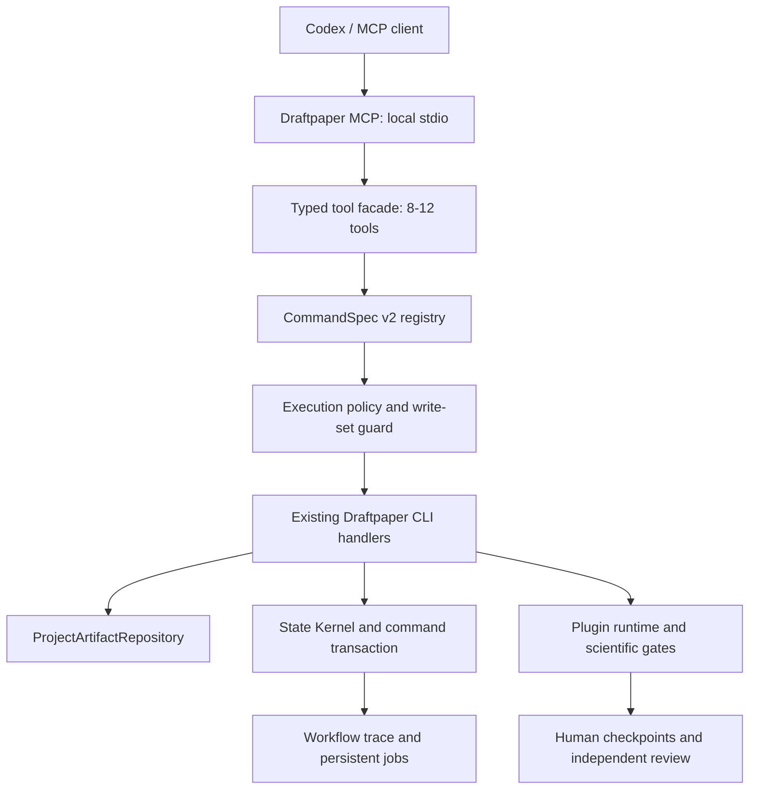

# Draftpaper-loop v0.25 最终优化方案：科研运行闭环、安全边界与薄型 MCP

日期：2026-07-13
当前基线：Draftpaper-loop v0.24.0，`main@9781773`
文档性质：v0.24.0 之后的实施依据，不覆盖历史审计和历史版本计划
替代范围：本文件替代旧 `MCP构建思路.txt` 中面向未来的架构建议；历史事实仍以仓库审计和提交记录为准

## 1. 最终判断

Draftpaper-loop v0.24.0 已经完成以下核心闭环：

- wheel 与源码均可发现 209 个正式插件和 545 个 fixture；
- CommandSpec、State Kernel、Project System of Record、显式 Doctor/Recovery 和 `_vN` 项目隔离已接入主流程；
- 插件充分性不再因为“缺方法所以不能生成方法”形成死锁，项目本地代码可以形成受限绑定；
- 图表、指标、正文、citation audit 和 promoted evidence snapshot 已进入同一证据版本；
- Results、Introduction、Data、Methods 和 Discussion 已采用 evidence packet -> Codex 自由写作 -> 校验 -> Scientific Editor -> 接受的正式链路；
- 引用核查保留参考文献，最终 citation audit 晚于最终正文；
- 单稿冻结、两位独立 reviewer、仲裁与用户定点 revision workspace 已实现；
- Linux/Windows、Python 3.10-3.12、wheel 安装和跨学科对抗回归已经通过。

因此，后续不应再次重做状态机、证据账本或另一套命令注册系统。下一阶段真正需要解决的是：

1. 将大量“可发现但仍停留在合同层”的科研插件提升为真实可执行能力；
2. 把插件、命令、外部连接器和 Agent 操作统一纳入安全与修改边界；
3. 自动诊断完整科研运行中的循环、重复执行、token 浪费和错误下一步；
4. 继续提高主图故事、段落证据选择、Data/Methods/Results 细节和引用角色精度；
5. 在不绕过 CLI 权威的前提下，提供一个小而稳定的 MCP 控制面。

## 2. 证据来源与解释规则

本方案依据：

- `docs/audits/2026-07-12-astronomy-v0230-full-run.md`；
- `docs/audits/2026-07-12-draftpaper-loop-architecture-audit.md`；
- `docs/audits/2026-07-13-v0240-release-readiness.md`；
- `docs/superpowers/plans/2026-07-13-draftpaper-loop-full-process-optimization.md`；
- 当前 v0.24.0 的 CommandSpec、Doctor、plugin runtime、evidence resolver、writing 和 release 实现；
- 旧本地文档 `MCP构建思路.txt`；
- `kunhua-he/huashiwangzu-v2@2c3e60b` 的 MCP、capability registry、tool job、release gate 和安全边界设计。

状态解释：

- **已解决**：当前代码、项目实跑和一般性回归均有证据；
- **部分解决**：正确性已有保护，但用户体验、性能或跨学科泛化仍可提高；
- **未解决**：当前代码仍可直接观察到缺失机制；
- **正常保留**：例如 reviewer 的 minor 建议，它是科研修订输入，不是框架故障。

## 3. 真实新项目运行问题复核

### 3.1 已经解决，不再列入后续架构待办

| 历史问题 | 当前状态 | 当前权威机制 |
| --- | --- | --- |
| 插件充分性与项目方法生成形成闭环 | 已解决 | project-local capability audit、project implementation contract、exhaustive rescue |
| 旧项目的 passport、figure metadata、sufficiency report 污染新运行 | 已解决 | `_vN` 项目隔离、System of Record、选择性资产导入 |
| 通用 `metrics.csv` 覆盖真实模型指标 | 已解决 | run-aware Result Evidence Resolver 与模型/量纲绑定 |
| identifier 对 identifier、混合量纲或空白图通过 | 已解决 | Semantic Figure Contract、像素与底层表检查、对抗回归 |
| Results/Review/Citation 使用不同 evidence snapshot | 已解决 | promoted snapshot、manifest hash、final citation snapshot |
| CLI 自身写入被误判为外部 drift | 已解决 | command transaction 与 passport refresh |
| deterministic fallback 进入正式稿 | 已解决 | free candidate + acceptance 合同，fallback 仅诊断可用 |
| bibliography 格式与 citation support 混为一个检查 | 已解决 | canonical reference registry、journal contract、reference proof |
| 用原稿 A/B 比较作为真实用户发布前提 | 已解决 | 单稿匿名冻结与两位独立 reviewer |
| 用户无法精准修改最终 LaTeX | 已解决 | paragraph ID、line anchor、preview、hash-check、rollback |

### 3.2 仍未完全解决或仍可明显优化

与天文实跑审计直接对应的剩余项为：

| 审计项 | v0.24.0 状态 | 本方案处理位置 |
| --- | --- | --- |
| ASTR-048 integrity 顶层 cohort 选择 | 部分解决：项目隔离和 evidence binding 已降低污染，但 integrity 仍保留固定 CSV/关键词路径 | R13、v0.24.5 |
| ASTR-053 主图缺少直接观测/现象证据 | 未完全解决：合同正确不等于故事最有说服力 | R6、Narrative Resolver v2 |
| ASTR-054 section packet token 成本偏高 | 部分解决：已有 hard budget 和 paragraph slice，尚缺缓存、delta 和严格 retrieval | R7、Paragraph Evidence Resolver v2 |
| ASTR-056 Data citation role 粒度不足 | 未完全解决：当前仍有 post-hoc intent heuristic | R8、Citation Role Contract v2 |

ASTR-001、004-006、012、016、018-047、049-052、055、057-059 所代表的阻塞性状态、证据、写作、引用和发布问题，已由 v0.23.1-v0.24.0 的实现与一般性回归覆盖，不再作为同名未完成事项重复开发。后续若 runtime audit 重新复现同类模式，应创建新的可复现 issue，而不是默认历史修复失效。

#### R1. 安装到 Codex 的 workflow skill 可能落后于仓库版本

当前仓库中的 `codex_skills/draftpaper-workflow/SKILL.md` 与本机 `~/.codex/skills/draftpaper-workflow/SKILL.md` SHA-256 不一致。安装版仍使用较旧的线性阶段清单，没有完整描述 capability rescue、result support、独立单稿审查和项目版本化。

同时，当前 `pyproject.toml` 将 `codex_skills*` 排除在 wheel package discovery 之外，普通 wheel 用户没有一个由包本身提供的 canonical skill 安装源。

影响：即使 CLI 状态机正确，Agent 仍可能依据旧 skill 建议错误顺序。

处理：

- 新增 `draftpaper install-skill` 和 `draftpaper skill-doctor`；
- 将 canonical skill 放入 wheel 可携带的 package resource，仓库 `codex_skills/` 作为生成镜像；
- wheel 或源码记录 skill 版本与 SHA-256；
- Doctor 比较仓库、安装目录和当前导入包中的 skill contract；
- skill 不再手写完整命令顺序，只要求调用 `status`、`verify-next-action` 和 `continue`。

#### R2. 209 个插件的覆盖面很广，但真实本地执行深度仍薄

当前静态 runtime 统计为：

- data connectors：50 个，其中 49 个为 `contract_only`；
- method templates：107 个，其中 102 个为 `contract_only`；
- review rules：52 个，现行 review runtime level 均为合同层；
- 51 条新 review rule 的 maturity 为 `foundation`，没有 `runnable` 或 `mature` 规则；
- 大部分 foundation review rule 仍采用“确认该风险是否有项目证据”的通用 evaluator。

这不是错误宣传，因为 Plugin Runtime Truth 不会把它们冒充 project evidence；但它意味着陌生课题仍频繁需要 Agent 生成 project-local 实现。

处理：不再追求继续增加插件数量，改为建设 20-30 个高频真实 runnable 能力，并为每个能力提供真实科学 fixture、失败 fixture、输出 schema 和 project-run attestation。

#### R3. 插件缺少统一的执行与副作用合同

当前只有约 12 个插件 manifest 带 `task_contract`，且字段主要服务 mock/external 说明。尚未统一声明：

- execution mode；
- CPU/GPU/network/resource class；
- timeout 和 retry policy；
- idempotency；
- side-effect level；
- approval policy；
- parallel safety；
- credential boundary；
- declared output schema。

影响：API、服务器、GPU 和本地脚本虽然能被分类，但还不能被统一、安全、可恢复地调度。

#### R4. 插件目录没有不可变 catalog snapshot

当前 capability contract 和单次 plugin event 有局部 hash，但尚无覆盖完整运行时插件目录的 `catalog_hash`。规划完成后，如果 manifest、template 或依赖声明变化，旧 sufficiency/binding plan 的失效仍依赖分散检查。

处理：生成 `plugin_catalog_snapshot.json`，其 hash 必须进入 capability contract、sufficiency report、binding plan、execution ledger、figure trace 和 review report。

#### R5. 段落证据选择仍存在“前 8 条”降级路径

`resolve_paragraph_evidence` 在 paragraph outline 没有明确 evidence ID 时，会回退到 section records 的前 8 条。该路径虽然受数字绑定和最终校验约束，但仍可能：

- 给段落提供相关性较弱的证据；
- 让 Codex 写出正确但泛化、缺少项目细节的内容；
- 重复向多个段落传输相同证据；
- 掩盖 outline 本身没有完成证据分配的问题。

处理：正式写作模式禁止“前 N 条”回退。段落必须由 claim、figure/table/formula、run、cohort 和 citation role 解析得到证据；找不到时返回 `outline_evidence_gap`，而不是填充通用上下文。

#### R6. 主图故事仍可能把必要诊断放在直接科学信号之前

天文全流程中的 ASTR-053 仍具有一般性：队列/样本诊断可能占用本应用于直接观测或直接现象展示的主图位置。当前 `_story_role` 和 narrative job 在缺少显式类型时仍使用关键词推断。

影响：图表可以全部通过合同，但整篇论文的说服力仍弱于一个由领域研究者设计的主图故事。

处理：研究计划显式声明 `story_role`，主图组至少覆盖：study boundary、direct scientific signal、primary comparison、mechanism/ablation、uncertainty/boundary。若某类不适用，必须在研究计划中说明，而不是由后续代码猜测。诊断图默认进入 supporting/appendix。

#### R7. 写作 token 已受硬预算保护，但仍不够经济

天文实跑可观测写作输入为 122,238 tokens，输出为 5,716 tokens。v0.24 已有 paragraph evidence slice 和 section hard budget，但仍缺少：

- 跨段落不可变证据缓存；
- 引用摘要和方法摘要的内容寻址复用；
- 基于 paragraph job 的 top-k evidence retrieval；
- 共享限制条件的 ID 引用；
- 重试时只发送变化部分的 delta packet。

处理目标：在不减少 evidence ID、数字绑定和 claim boundary 的前提下，将同类完整论文的写作输入降低至少 35%。

#### R8. Citation intent 仍部分依赖事后关键词推断

citation audit 已具备 passage、数字、否定、因果方向和 claim strength 检查，但 `method_tool_background`、`data_source_background`、`comparison_context` 等 intent 仍由章节和关键词推断。Data 中 dataset provenance、instrument definition、processing support 和普通 background 尚未成为完整的一等合同。

处理：citation role 应在文献 registry、section outline 和 paragraph job 中预先声明，audit 只验证角色是否被正确使用；后验推断仅作为旧项目兼容路径。

#### R9. 缺少端到端 Workflow Runtime Trace

transaction ledger 记录科学 exit code 和提交状态，token ledger 记录输入输出 token，但当前缺少统一的：

- run ID / command ID / parent command；
- 开始、结束和持续时间；
- retry/attempt；
- next-action 转移；
- command、scientific decision、transaction decision 三维状态；
- 循环和重复 stale 诊断；
- Agent 工具发现与失败热度。

结果是完整实跑中的新问题仍主要依靠人工整理审计报告。

#### R10. 长时间科研任务缺少通用持久 Job Controller

当前 CLI 可恢复项目状态，但没有统一的后台 `submit/status/cancel/notifications` 合同。文献抓取、公开代码检索、服务器数据准备、GPU 训练、完整图表运行和多 reviewer 调度仍依赖外层 Agent/终端会话。

处理：新增本地持久 job 状态、子进程隔离、timeout、heartbeat、idempotency key 和 restart recovery。科学 gate 失败不自动重试；只有网络、限流、超时和可证明幂等的基础设施错误可以重试。

#### R11. CommandSpec 尚未声明精确读写边界

现有 `CommandSpec` 已声明是否修改项目、阶段、handler、exit policy 和 protected/manual 属性，但没有：

- allowed read/write globs；
- forbidden paths；
- risk level；
- resource class；
- timeout；
- idempotency；
- output schema。

这使 CLI 本身有状态保护，但尚不能像严格工作树守卫一样自动判断某条命令是否写出了声明范围。

#### R12. AcademicForge 来源仍有 41 条待 source inspection placeholder

当前 340 条声明均进入索引，没有静默丢失；其中 299 条有详细分类，41 条仅有集合级 metadata。它们应继续保持 `requires_source_inspection`，不能进入正式插件充分性。后续应按科研需求逐批读取，而不是一次性转换所有来源。

#### R13. Integrity 顶层样本数检查仍未完全 run-aware

当前 `integrity_gate.py` 仍可从固定的 `results/tables/sample_composition.csv` 汇总 event/source totals，再通过句子关键词把正文数字推断为 main sample、validation subset 或其他角色。项目隔离、result inventory 和 Evidence Binding v2 已降低历史文件污染风险，但该检查本身尚未强制绑定当前 run、cohort、sample unit 和 evidence ID。

影响：同一项目内如果固定表格未被当前 run 明确拥有，或句子角色被启发式误判，顶层 integrity summary 仍可能选择错误 cohort。

处理：

- 当前 promoted evidence snapshot 和 Scientific Evidence Registry 是主来源；
- `sample_composition.csv` 只作为带 run/hash 绑定的 producer artifact；
- 无 run/evidence 绑定的旧表只能产生 advisory compatibility finding；
- integrity 的数字角色由 registry 字段决定，句子关键词只用于提示未绑定正文，不用于选择科学真值。

### 3.3 不应误判为框架故障的事项

- 两位 reviewer 留下 minor 建议是正常科研修订输入，不能为了“全绿”自动删除；
- foundation 插件保持 advisory 是正确行为，问题是 runnable 深度不足，而不是 gate 不够强；
- 用户数据、远端服务器和凭证缺失时暂停是正确行为，不能用 mock 结果绕过；
- 陌生课题没有可比较原稿是正常场景，发布应继续使用单稿独立审查，而不是恢复 A/B parity。

## 4. 从 huashiwangzu-v2 MCP 借鉴什么

参考来源：`kunhua-he/huashiwangzu-v2@2c3e60b`。仓库未检测到 LICENSE，因此只进行 clean-room 设计借鉴，不复制源码。

### 4.1 值得借鉴

1. **工具组件统一接口**：每个领域提供 definitions、ownership 和 handler；Draftpaper 应由 CommandSpec 自动生成，而不是手写重复注册。
2. **manifest/runtime capability diff**：正式声明与真实运行能力必须持续对照。
3. **响应裁剪**：selector、max items、max bytes 和 truncation metadata，避免 MCP 输出占满上下文。
4. **后台任务机器语义**：区分 process completed、command success、scientific pass、clean success 和 debt。
5. **工具使用与 Agent 摩擦统计**：从真实调用频率、错误签名和重复路线决定下一轮优化。
6. **发布门分层**：lint、pytest、smoke、sandbox 和 release gate 各自保留状态，不把 skip 当 pass。
7. **安全与修改边界**：仓库路径、精确 patch、只读 SQL、dirty baseline、allowed prefixes 和高风险工具清单。

### 4.2 不应照搬

- 不引入 Vue/FastAPI/PostgreSQL 桌面平台；
- 不暴露 100 个 MCP 工具；
- 不复制 2000 行 server 和 if/elif 手工路由；
- 不读取数据库与 JWT secret 后生成 admin token；
- 不使用 `approval_policy=never` 和 `danger-full-access` 作为分发默认值；
- 不使用 daemon thread 作为可恢复科研任务的最终持久层；
- 不输出只有 JSON 字符串、没有 output schema 的 MCP 结果；
- 不提交带作者机器绝对路径的 `.mcp.json`。

### 4.3 对旧 MCP 构建思路的修正

旧方案提出“GBrain OperationSpec + huashiwangzu 工具模块 + Draftpaper gate”。该组合在 v0.24.0 已经过时：Draftpaper 已有统一 `CommandSpec`，再引入 OperationSpec 会制造第二套命令权威。

新的唯一合同是：

```text
CommandSpec v2
  -> CLI parser/handler
  -> execution policy and write boundary
  -> MCP tool projection
  -> Doctor/Recovery/Runtime Audit
```

MCP 是 CLI 的受控适配层，不是新的工作流引擎。

## 5. 最终目标架构



架构原则：

- CLI handler 是行为权威；
- ProjectArtifactRepository 是 artifact 路径和 schema 权威；
- CommandSpec v2 是命令、权限、读写范围和 MCP schema 权威；
- State Kernel 是状态与原子写入权威；
- Scientific Evidence Registry 是科学事实权威；
- MCP 不直接写 stage manifest、passport、LaTeX 或 plugin registry；
- 大型 artifact 通过 MCP resource 或 selector 读取，不整份塞入 tool response。

## 6. 安全与修改边界

这是本方案的 P0 主线，不是 MCP 完成后的附加功能。

### 6.1 路径边界

必须同时存在三层边界：

1. **仓库边界**：框架维护命令只能访问 Draftpaper checkout；
2. **项目边界**：论文命令只能访问当前 project root；
3. **阶段边界**：命令只能写入 CommandSpec 声明的 stage-owned 路径。

实现要求：

- 所有路径先 `resolve()`，再检查位于允许根目录；
- 拒绝 `..`、UNC/device path、符号链接或 Windows reparse point 越界；
- `_vN` 子项目运行时父项目保持只读；
- 外部输入只登记为 read-only source，不自动成为项目可写目录；
- 远程服务器路径只进入脱敏 manifest，不进入 MCP 返回和论文正文。

### 6.2 CommandSpec v2 写入合同

新增字段：

```text
risk_level
allowed_read_globs
allowed_write_globs
forbidden_globs
resource_class
timeout_seconds
idempotency
parallel_safe
confirmation_policy
input_schema
output_schema
```

命令执行前记录 baseline，执行后比较实际变化：

- 声明范围内的 managed writes：提交 transaction；
- baseline 已有的无关 dirty 文件：保留，不归因于本轮；
- 新增越界写入：命令状态为 `boundary_violation`，不得刷新为有效科学状态；
- protected artifact 变化：要求显式 human checkpoint 或新项目版本；
- 科学 decision failed 但报告写入合法：transaction 仍提交，scientific decision 保持 failed。

### 6.3 精确修改与哈希校验

框架代码或用户正文的 MCP 修改必须：

1. preview；
2. 指定 old text、paragraph ID/line anchor 或 artifact ID；
3. 校验 source SHA-256；
4. 唯一命中；
5. 原子写入；
6. 生成 diff；
7. 运行对应验证；
8. 由现有 revision/transaction 接受。

不得向 MCP 暴露任意 `write_file(path, content)`。

### 6.4 工具风险等级

| 等级 | 示例 | MCP 默认策略 |
| --- | --- | --- |
| `read` | status、doctor、artifact summary、review summary | 默认公开 |
| `write_project` | 生成普通计划或报告 | 只允许 CommandSpec 白名单与 write-set guard |
| `execute_science` | plugin/code execution、figure generation | 需要项目合同、资源限制和运行账本 |
| `network_external` | 文献抓取、GitHub 检索、API/server connector | 域名/connector 白名单，凭证由环境提供 |
| `human_checkpoint` | accept core evidence、claim downgrade、accept revision、plugin promote | MCP 只返回 checkpoint，不直接执行 |
| `destructive_admin` | 删除、reset、清理全局缓存、Git push | 不进入公共 MCP |

`execute_science` 不应像旧方案那样默认无条件开放。

### 6.5 SQL 与数据库

Draftpaper-loop 当前不需要通用 SQL MCP 工具，因此默认不提供 SQL。未来若引入本地索引数据库：

- 只允许单条 SELECT/WITH/EXPLAIN；
- 拒绝注释、多语句和写关键字；
- 数据库连接强制 read-only transaction；
- 项目内容查询返回字段白名单和行数上限。

### 6.6 凭证、隐私和网络

- MCP 只显示 credential env var 名，不返回值；
- 日志、异常和 artifact preview 统一做 path、token、email、server locator 脱敏；
- 网络访问必须归属已注册 connector 或 literature/GitHub rescue route；
- 下载只进入当前项目 cache，带来源、license、hash 和大小上限；
- 第三方代码保持只读候选，经过 license、privacy、overlap、fixture 和 human promotion 后才能进入正式插件；
- anonymous review bundle 继续排除身份、绝对路径、凭证和私有原始数据。

### 6.7 资源与进程边界

- 每个插件声明 CPU/GPU/network/resource class；
- 子进程设置 timeout、工作目录、环境变量白名单和输出大小；
- 终止时清理整个 process tree；
- GPU/server/API 任务默认不可并行，除非 manifest 明确 `parallel_safe=true`；
- retry 只适用于 retryable infrastructure failure，不适用于 scientific failure；
- MCP 服务重启后 job 必须可识别为 running、recoverable、orphaned 或 failed。

### 6.8 验证链

框架代码修改：

```text
lint -> focused pytest -> wheel smoke -> cross-platform CI -> release gate
```

科研项目修改：

```text
plugin/runtime validation
-> verify-methods
-> result validity/support
-> core evidence + human confirmation
-> Results discipline review
-> integrity
-> final citation and bibliography
-> two independent manuscript reviews
```

任何 skip、debt、advisory、scientific fail 和 process fail 必须保持不同机器字段，不能统一成 success。

## 7. 详细优化工作流

### 7.1 CommandSpec v2 与边界守卫

修改范围：

- `draftpaper_cli/command_registry.py`；
- `draftpaper_cli/cli.py`；
- `draftpaper_cli/command_transaction.py`；
- 新增 `draftpaper_cli/execution_policy.py`；
- 新增 `draftpaper_cli/write_set_guard.py`。

交付：

- 所有 public commands 有 risk、读写集、timeout 和 schema；
- parser、handler、CommandSpec 和 MCP projection 自动一致性检查；
- protected/manual command 无法被普通 MCP 调用；
- 官方命令结束后不会留下未归属写入。

### 7.2 Plugin Execution Contract v2

统一 manifest：

```json
{
  "execution_contract": {
    "execution_mode": "sync|job|mock_only",
    "resource_class": "local_cpu|local_gpu|network_api|remote_server|laboratory",
    "timeout_seconds": 300,
    "max_attempts": 1,
    "idempotency": "required|supported|none",
    "side_effect_level": "none|project_write|network|remote_write|irreversible",
    "approval_policy": "none|project_confirmation|human_only",
    "parallel_safe": false,
    "input_schema": {},
    "output_schema": {}
  }
}
```

新增：

- `validate-plugin-contract-diff`；
- `plugin_catalog_snapshot.json`；
- `plugin_contract_hash` 和全局 `catalog_hash`；
- manifest/template/callable/output/fixture/project-run 五层一致性检查；
- 运行等级只根据带 hash 的真实事件提升。

### 7.3 Runnable Plugin Depth Program

第一批不再扩数量，选择跨学科高复用能力：

- 表格读取、schema/profile、缺失值与异常值；
- train/group/source holdout；
- baseline、calibration、uncertainty、ablation；
- effect size、power、multiple testing；
- geospatial CRS/raster/vector 基础；
- astronomy FITS/WCS/time/units 基础；
- bioinformatics count matrix、normalization、replicate/batch QC；
- publication figure、caption/source-table binding。

每个 runnable 插件必须：

- 调用真实库或实现真实确定性科学算法；
- 有 minimal/failure/boundary fixture；
- 输出符合 schema 的项目 artifact；
- 有错误量纲、错误 cohort 或 leakage 对抗 fixture；
- 至少在一个非作者原始项目上 project-validated。

### 7.4 Review Rule Maturity Program

先把少量规则做深，而不是继续生成通用 `Confirm that...`：

- sample/cohort/unit/split consistency；
- train/test leakage；
- baseline and nested ablation；
- uncertainty/calibration；
- effect size/power/multiple testing；
- result-to-prose semantic consistency；
- domain-specific promoted rules。

规则晋级：

```text
foundation advisory
-> executable fixture
-> runnable with calibrated threshold source
-> project-validated
-> mature and blocking
```

没有 threshold source、适用边界和失败样本的规则不得成为 blocking。

### 7.5 Narrative 与 Paragraph Evidence Resolver v2

核心修改：

- 主图 story role 由 research plan 显式声明；
- 禁止 main figure 使用 keyword-only role 推断进入正式发布；
- direct scientific signal 是否必要由研究问题合同决定；
- supporting diagnostics 可被 Results/Discussion 引用，但不占用主图发现槽位；
- paragraph job 必须声明 evidence IDs 或可审计 retrieval query；
- 移除正式模式下的 first-eight fallback；
- 引入 claim/role/run/cohort/model/figure/formula 多字段检索；
- 共享 evidence 使用内容寻址缓存和 ID 引用；
- retry packet 只包含变化段落和变化证据。

### 7.6 Citation Role Contract v2

引用角色：

```text
dataset_provenance
instrument_or_product_definition
processing_method_support
method_or_tool_background
prior_result_comparison
mechanism_or_interpretation
general_background
```

写作前由 reference registry 和 paragraph outline 分配；citation audit 验证：

- 角色与章节是否合适；
- passage 是否支持该角色；
- 数字、对象、方向和强度是否一致；
- 所有 retained references 是否被合理使用；
- 修复优先收紧或改写 claim，不删除参考文献。

### 7.7 Workflow Trace 与 Runtime Audit

新增 `workflow_trace.jsonl`：

```text
run_id
command_id
parent_command_id
command
stage
attempt
started_at/completed_at/duration
input/output hashes
transaction_status
scientific_decision
next_action_before/after
token usage
failure_class
```

新增 `audit-workflow-runtime`，自动发现：

- A -> B -> A next-action 循环；
- 同一输入 hash 重复昂贵运行；
- managed command 后出现 drift；
- stale scope 过宽；
- recommendation 不满足自身 precondition；
- oversized packet；
- plugin discovery/rescue 反复失败；
- skill/CLI 版本不一致。

只记录结构、hash、状态和计量；默认不复制论文正文或用户数据。

### 7.8 Persistent Scientific Job Controller

命令：

```text
submit-job
job-status
job-cancel
job-notifications
recover-jobs
```

第一阶段支持：literature fetch、plugin rescue、method execution、figure generation、full regression 和 independent review orchestration。

实现使用本地 SQLite 或受锁保护的 append-only state；不得仅依赖 MCP 进程内 daemon thread。

### 7.9 Draftpaper MCP v1

推荐工具面：

```text
draftpaper_project_status
draftpaper_doctor
draftpaper_next_action
draftpaper_plan_command
draftpaper_execute_command
draftpaper_job_submit
draftpaper_job_status
draftpaper_artifact_get
draftpaper_review_summary
draftpaper_runtime_audit
```

实现要求：

- 使用 FastMCP/Pydantic typed input/output；
- local stdio 为首个也是默认 transport；
- `python -m draftpaper_cli.mcp.server` 为可移植入口；
- 新增 `[mcp]` optional dependency；
- `draftpaper mcp-install` 生成当前机器配置，不提交绝对 cwd；
- `draftpaper mcp-doctor` 校验依赖、入口、skill hash、工具 schema 和安全策略；
- 工具由 CommandSpec v2 自动投影；
- artifact 大内容使用 resource URI 或 selector/max_bytes；
- MCP 不提供 arbitrary shell、SQL、Git push、raw file write 或 human checkpoint acceptance。

## 8. 版本实施顺序

### v0.24.1：Audit Closure and Skill Sync

- 把 ASTR-048、053、054、056 和本文件 R1-R13 建立机器可读 issue ledger；
- 新增 skill hash/version 与 `skill-doctor`；
- 明确历史已解决问题不再进入待办；
- 为 token、direct signal 和 citation role 建立回归基线。

### v0.24.2：CommandSpec v2 and Security Boundary

- 增加 risk/read/write/resource/timeout/idempotency/schema 字段；
- 实现 repo/project/stage write-set guard；
- 实现 symlink/reparse、parent-project 和 secret-redaction 对抗测试；
- 建立高风险命令清单和 MCP exposure policy。

### v0.24.3：Plugin Execution Contract and Catalog Snapshot

- 统一 209 个 manifest 的 execution contract 默认值；
- 新增 plugin catalog hash 和 contract diff；
- 将 catalog hash 贯穿 sufficiency、binding、execution、figure 和 review；
- 旧插件通过 schema adapter 兼容，不伪造更高运行等级。

### v0.24.4：Runnable Plugins and Review Rules

- 完成第一批 20-30 个真实 runnable data/method 插件；
- 至少 8-12 条跨学科 review rules 达到 runnable；
- foundation 规则继续 advisory；
- 使用 held-out 项目验证阈值和失败样本。

### v0.24.5：Narrative, Evidence and Citation Efficiency

- 显式 story role 与 direct-signal 合同；
- 移除正式写作 first-eight fallback；
- paragraph retrieval、内容寻址缓存和 delta packet；
- Citation Role Contract v2；
- integrity count resolution 改为 promoted-snapshot/run-aware；
- 写作输入 token 至少降低 35%，不减少 evidence coverage。

### v0.24.6：Workflow Trace and Persistent Jobs

- 统一 run/command trace；
- 自动循环、重复运行和 stale 诊断；
- 实现持久 job、timeout、heartbeat、orphan/recovery 和通知；
- process success 与 scientific success 分离。

### v0.24.7：Draftpaper MCP v1

- 发布 8-12 个 typed MCP tools；
- CommandSpec 自动投影；
- portable install/doctor；
- selector/max_items/max_bytes；
- 安全策略和 Windows/Linux stdio 集成测试。

### v0.25.0：Held-out Full Research Release

- 从普通 wheel + MCP optional install 开始；
- 至少运行 astronomy+ML、Euclid/geography+ML 和一个实现阶段未使用的 held-out 学科；
- held-out 项目没有原稿，不允许为测试项目硬编码方法、阈值或 story role；
- 从 idea -> literature -> plan -> plugin audit/rescue -> data/method -> figures -> human core evidence -> manuscript -> final citation -> two independent reviews 完整闭环；
- 所有 critical/major 问题为 0，minor 进入 revision queue。

## 9. 最终验收标准

### 9.1 安全

- 路径逃逸、symlink/reparse、UNC/device path 和父项目写入全部被拒绝；
- 每条 mutating command 的实际写入均位于 allowed write set；
- pre-existing dirty 文件不被覆盖或归入本轮；
- MCP 无 arbitrary shell、raw write、SQL、Git push 和直接 human acceptance；
- 凭证值、私有绝对路径和身份信息不出现在 MCP 返回或公开报告；
- protected action 只能通过显式 human checkpoint 完成。

### 9.2 插件

- 209 个插件均有合法 execution contract 或明确兼容默认值；
- manifest/template/runtime/output 漂移能被 contract diff 发现；
- capability planning 和 execution 使用同一个 catalog hash；
- contract-only/fixture-only 仍不能支撑主图；
- runnable 插件执行真实科学逻辑并产生声明输出；
- blocking review rule 必须有 threshold source、适用边界和失败 fixture。

### 9.3 图表与写作

- 主图组覆盖研究计划声明的故事角色；
- supporting diagnostics 不能替代 direct scientific signal；
- paragraph packet 没有 first-N fallback；
- 所有数字保持 run/cohort/unit/split/model/dimension 绑定；
- integrity summary 不得从无 current-run hash 的固定 CSV 选择顶层 cohort；
- Data/Methods/Results 细节不因 token 优化丢失；
- 相同实跑的输入 token 相对天文 v0.23 基线降低至少 35%。

### 9.4 引用与审稿

- citation role 在写作前声明，post-hoc heuristic 仅用于兼容；
- retained references 保持全覆盖，不通过删引用达成全绿；
- final citation audit 晚于最终正文和 assembly；
- 两位 reviewer 读取同一冻结匿名稿，不读取原稿或对方报告；
- unresolved critical/major 为 0；minor 保持可追踪。

### 9.5 Runtime 与 MCP

- 每次命令都有 run ID、command ID、duration 和三维结果状态；
- runtime audit 能复现并识别人工审计中的循环类型；
- job 在 MCP/终端重启后可恢复或准确标记 orphaned；
- `.mcp.json` 不含作者机器绝对路径；
- source checkout 和 wheel 安装都能启动相同工具集；
- Linux/Windows Python 3.10-3.12 通过 MCP stdio smoke；
- 仓库 skill 与安装 skill hash 不一致时 Doctor 明确失败并给出修复命令。

## 10. 优先级结论

执行顺序不能从“先做 MCP server”开始。正确顺序是：

```text
安全与 CommandSpec v2
-> Plugin Execution Contract
-> runnable plugin/review depth
-> narrative/evidence/citation efficiency
-> workflow trace and durable jobs
-> thin MCP projection
-> held-out full release
```

MCP 只会放大现有能力。如果先暴露 MCP，再补写入边界和插件合同，就会把当前局部风险变成 Agent 可远程连续触发的风险。相反，先把 CommandSpec、路径、执行合同和事务语义做扎实，MCP 会成为一个很薄、很稳定的调用入口，而不会成为 Draftpaper-loop 的第二套工作流。
