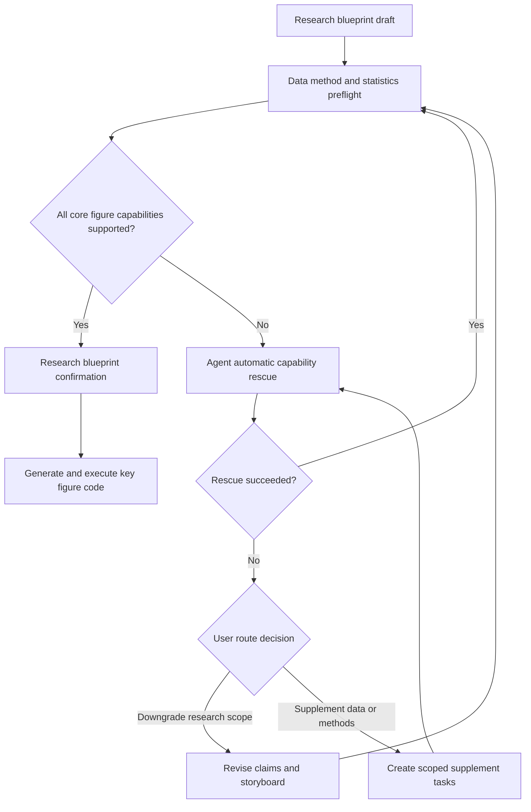

# Draftpaper-loop 项目工作区、统计验证与图表工作流优化方案

日期：2026-07-14
目标版本：v0.25.1-v0.26.0
状态：已完成并通过验收（2026-07-14）

## 1. 背景与问题判断

Euclid 项目的完整流程暴露出五类需要从框架层修复的问题：

1. 论文项目和流程产物跟随 idea 或数据源散落在外部目录，部分 JSON、临时目录和审查产物游离于正式论文项目之外。
2. 统计验证规则较薄，尚不能按学科、任务类型和科学问题充分覆盖分类、拟合、分组验证、不确定性和稳健性标准。
3. 图组标题与 caption 缺少结构化合同，首句不能稳定概括整组图的核心发现，子图说明也缺少统一边界。
4. 当前图表规划仍可能为了达到数量要求追加通用统计图；同时，流程没有在执行前向用户清楚展示并确认中文版 research plan，而是直接进入含义不够透明的 core evidence 确认。
5. 数据或方法不足时，关键图表代码生成前的补充数据、补充方法或研究方案降维 loop 没有形成清晰的用户流程。

本次优化不应只修复 Euclid 项目，而应建立适用于所有学科和交叉学科项目的统一工作区、统计合同、图表合同和科研决策链。

## 2. 总体设计原则

### 2.1 论文项目与大型数据分离

论文项目是工作流控制面，统一存放在 Draftpaper-loop 配置的 projects 根目录中。大型原始数据是数据面，应保持原位并通过只读 locator、数据合同和可复验指纹接入。

当前机器的默认项目根目录为：

```text
C:\Draftpaper_commercial\projects
```

推荐结构：

```text
C:\Draftpaper_commercial\projects\<short-slug>_<project-id>\
C:\euclidQ1\Euclid_DESI_dataset_cutout\...  # 外部原始数据，只读
```

默认不应把论文项目建立在数据集目录下。只有计算集群、数据治理或同盘性能明确要求工作区靠近数据时，才允许配置外部 scratch root；项目状态、最终图表、论文和审查报告仍应归档回中央项目目录。

### 2.2 证据优先但不以检查代替科研设计

质量 gate 只能验证研究设计是否被真实执行，不能通过增加更多检查来弥补空洞的 research plan、无意义的图表或不足的统计分析。数据、方法、统计验证和主图应在计划阶段形成同一个研究合同。

### 2.3 正常流程只保留三个集中人工确认点

1. 研究蓝图与可行性确认。
2. 关键结果与论断支撑确认。
3. 最终论文确认。

外部凭证缺失、自动补数据失败或方法无法获取属于条件式决策，不应变成每个项目都必须经过的分散 checkpoint。

### 2.4 人工确认后的研究蓝图与可行性结论是关键图表的唯一权威合同

研究蓝图与可行性确认不是一般性的流程提示，而是关键图表生成的科学授权边界。用户确认后的 blueprint snapshot 与 feasibility snapshot 必须共同成为后续数据补充、方法实现、分析代码、主图 panel、统计检验和结果解释所读取的唯一权威合同。只确认研究问题但未确认其数据、方法和统计可行性，或者只确认可行性但未确认图表故事板，都不能授权关键图表生成。

Agent 可以在不改变科学语义的前提下补齐代码、依赖、插件和运行实现，但不能在确认后自行：

- 更换研究问题或 claim。
- 改用不同的数据角色、样本单位或 cohort。
- 用近似方法替代已确认方法。
- 改变验证设计、统计量或阈值来源。
- 删除、增加、合并或拆分主图及其 panel。
- 生成相似图、降级图或通用统计图替代失败的合同图。

如果确认后的蓝图或可行性判断存在科学设计错误，应把问题、影响和建议修改位置展示给用户，由用户纠错或确认修改。系统生成新的 plan version、feasibility version 和对应 hash 后，必须重新经过研究蓝图与可行性确认，才能继续生成关键图表。

## 3. ProjectWorkspacePolicy

### 3.1 默认项目根目录

将 `create-project --root` 从必填参数改为可选参数，并按以下优先级解析 projects root：

1. CLI 显式 `--projects-root`。
2. 环境变量 `DRAFTPAPER_PROJECTS_ROOT`。
3. 用户配置 `%APPDATA%\DraftpaperLoop\config.toml`。
4. 当前安装或仓库配置的 `projects` 目录。

当前用户配置应指向 `C:\Draftpaper_commercial\projects`。公开代码不得硬编码该机器路径。

在默认根目录之外创建论文项目时，要求显式使用 `--allow-external-project-root`，并在项目 passport 中记录原因。

### 3.2 项目命名和路径预算

项目目录不得直接使用完整论文标题。推荐格式：

```text
<short-topic-slug>_<8-character-project-id>
```

约束如下：

- slug 最长 48 字符。
- 完整项目目录名建议不超过 64 字符。
- 项目根路径建议不超过 100 字符。
- 普通产物完整路径不得超过 200 字符。
- LaTeX、BibTeX 和第三方命令使用的路径建议不超过 180 字符。
- 完整标题只保存在 project metadata、research plan 和论文 metadata 中。

增加 `path-budget-check`，在项目创建、版本化、代码生成和 LaTeX 组装前运行。超限时缩短 slug、run ID 和产物名，不依赖 Windows LongPathsEnabled 作为唯一保障。

### 3.3 产物所有权边界

增加 `ArtifactOwnershipGuard`：

- 所有流程产物必须位于当前论文项目根目录内。
- 临时文件统一写入 `<project>\.draftpaper\tmp`。
- 命令日志统一写入 `<project>\.draftpaper\logs`。
- stdout 捕获和中间 JSON 不得写入项目父目录。
- 只有显式 `export` 命令可以向项目外写文件。
- 写入前解析绝对路径并验证其仍位于允许前缀内。

对历史项目增加只读诊断命令：

```text
draftpaper doctor-project-layout
draftpaper adopt-orphan-artifacts --dry-run
```

`adopt-orphan-artifacts` 必须根据 project ID、stage、artifact hash 和来源记录生成迁入计划，不能盲目移动或覆盖文件。

### 3.4 外部大型数据合同

在项目内保存：

```text
data/data_source_contract.json
data/external_data_locators.private.json
data/data_inventory.json
data/data_fingerprint_manifest.json
```

其中：

- `data_source_contract.json` 保存逻辑 source ID、数据角色、访问模式、版本和用途。
- `external_data_locators.private.json` 保存本机绝对路径，默认不进入 Git。
- `data_inventory.json` 保存可用于研究的表、图像、标签、特征和样本单位。
- `data_fingerprint_manifest.json` 保存可复验指纹；核心派生表使用完整 hash，大型原始集合可使用分层清单或 Merkle/chunk fingerprint。

默认复制策略为 `manifest_only`。只有明确选中的小型派生数据、最终分析表和可公开样本进入项目目录。

## 4. StatisticalValidationContract

### 4.1 新增统计验证合同

在 research plan 阶段生成：

```text
research_plan/statistical_validation_contract.json
research_plan/statistical_validation_contract.md
```

合同必须记录：

- 科研任务类型：分类、回归、拟合、聚类、异常检测、时序、空间、生存分析或其他任务。
- 样本单位、cohort、独立性结构、重复测量、分组变量和数据划分。
- 主要 estimand、主要指标、次要指标和指标量纲。
- 基线模型、消融实验、敏感性分析和负对照要求。
- 不确定性方法：置信区间、bootstrap、重复分组划分、后验区间或其他方法。
- 缺失数据、类别不平衡、多重比较、校准、残差、收敛和模型诊断要求。
- 潜在数据泄漏、标签泄漏、空间泄漏、时间泄漏和分组泄漏。
- 学科附加标准及每项阈值的来源。

### 4.2 阈值来源和阻断规则

不得为所有项目设置统一的 F1、R2、p 值或拟合精度阈值。阈值来源优先级为：

```text
用户或目标期刊明确要求
> 有引用的领域规范或研究文献
> 已验证的学科插件约定
> 上下文性 advisory
```

只有来源明确、适用范围匹配且证据字段齐全的阈值才可阻断。其余规则用于收紧 claim、补充分析或提示人工复核。

### 4.3 统计规则覆盖报告

新增：

```text
research_plan/review_rule_coverage_report.json
research_plan/review_rule_coverage_report.html
```

报告按任务和学科检查必要规则族是否存在。缺少规则时，依次搜索：

1. 当前学科插件。
2. shared statistics review rules。
3. 项目本地已验证代码。
4. AcademicForge 能力来源。
5. GitHub 论文代码库和公开方法实现。

找不到规则不能静默视为通过。系统应记录缺口，并将其标为 advisory、需要补强或需要用户确认。

### 4.4 Euclid 类任务应自动覆盖的规则族

对 astronomy + machine learning + scientific image representation 项目，合同至少应考虑：

- group-aware 或 tile-held-out 数据划分。
- 分组泄漏和重复对象泄漏。
- 类别不平衡与类别级 precision、recall、F1 和 support。
- 判别性能、校准和不确定性。
- baseline、ablation 和 incremental-value 分析。
- 红移、亮度、颜色、观测条件等混杂因素。
- 图像缺失、样本选择和 cohort 边界。
- anomaly candidate 的稳定性和独立确认边界。

这些规则由任务和学科组合动态选择，不能写成只针对 Euclid 项目的特例。

## 5. FigureUtilityContract 与 FigureCaptionContract

### 5.1 已确认蓝图的严格执行绑定

关键图表生成器只能读取 `confirmed_research_blueprint_snapshot.json` 中的 figure storyboard、claim contract、data/method requirements 和 statistical validation contract，以及 `confirmed_research_feasibility_snapshot.json` 中已确认的数据可用性、方法可执行性、统计可识别性、能力覆盖和限制条件。未进入这两份确认快照的草案字段、通用 fallback 和学科默认图组不得进入主图代码生成。

每张主图和每个 panel 的执行记录必须包含：

```text
confirmed_plan_hash
confirmed_feasibility_hash
claim_id
storyboard_id
panel_contract_id
data_requirement_ids
method_requirement_ids
statistical_validation_ids
```

代码生成前和图表生成后都执行逐项 alignment check。只要研究问题、变量角色、样本单位、方法输出、panel 结构、统计设计或可行性前提与确认快照不一致，该图就不能执行或进入核心结果确认，也不能由 Agent 自动寻找近似图替代。

如果执行结果暴露出蓝图本身有误，系统应生成面向人工纠错的差异报告，精确指出受影响的 claim、figure、panel、数据角色、方法步骤和统计检验。用户修正并重新确认前，旧图表可以作为诊断产物保留，但不能成为论文证据。

### 5.2 禁止按数量自动补主图

保留 5-6 个主图组作为完整论文的目标合同，但数量要求不能由通用 fallback 图满足。

每个主图必须具备：

```text
claim_id
research_question
unique_evidence_contribution
required_data_roles
required_method_outputs
statistical_validation_ids
expected_finding
claim_boundary
why_not_table
```

以下图表不得自动进入主文：

- 只为满足数量要求生成的直方图、普通相关图或通用 metric summary。
- 与已有主图提供相同科学证据的重复图。
- 不能改变研究判断、claim 强度或可靠性评估的装饰性图。
- 没有明确数据角色和方法输出的图。

可靠性验证必需但不承担主 claim 的诊断图进入附录，并在 Results 或 Discussion 中引用。

如果只能规划出少于目标数量的有意义主图，流程应要求调整研究范围、稿件类型或研究问题，而不是自动补图。

### 5.3 图组 caption 数据结构

新增 `FigureCaptionContract`：

```json
{
  "figure_id": "fig_03",
  "headline": "Fixed image representations retain morphology-related signal under tile-held-out validation.",
  "panels": [
    {"label": "a", "description": "..."},
    {"label": "b", "description": "..."}
  ],
  "statistics": "...",
  "claim_boundary": "..."
}
```

caption 规则：

- 第一完整句概括整组图的核心内容或核心结果。
- 第一完整句必须是完整句，不能是逗号或分号串联的短语列表。
- 第一完整句不得开始逐项解释 `(a)`、`(b)`。
- 后续内容按顺序解释每个 panel 的样本、方法、编码、颜色、误差条和统计量。
- 最后说明必要的统计定义、cohort、估计量或 claim boundary。
- headline 的结论强度不能超过已验证 evidence。

文件名统一采用 `fig_01.png`、`fig_02.pdf` 等短名称，科学标题只进入 metadata 和 caption。

### 5.4 Caption gate

新增自动检查：

- headline 是否为完整句。
- headline 是否过度使用逗号短句或 panel 枚举。
- 所有声明的 panel 是否得到解释。
- 样本量、单位、误差条和估计量是否定义。
- caption 是否出现内部路径、脚本名或文件对象。
- caption claim 是否绑定到 evidence ID。

## 6. 研究蓝图与可行性统一确认点

### 6.1 确认前必须展示的内容

`generate-plan` 产生草案后，先执行不生成关键图表代码的能力预检，再向用户展示统一 review packet：

```text
research_plan/research_plan.zh-CN.md
research_plan/claim_contract.json
research_plan/figure_storyboard.json
research_plan/statistical_validation_contract.md
research_plan/plugin_sufficiency_preview.json
research_plan/pre_execution_support_report.html
```

中文版 research plan 是用户确认的主文档，必须完整、流畅地表达研究问题、数据、方法、统计验证、图表故事板、风险和 claim boundary。不能只是翻译标题，也不能大面积混用中英文模板句。

### 6.2 明确的确认语义

新增建议命令：

```text
draftpaper review-research-plan
draftpaper confirm-research-plan --plan-hash <hash>
```

用户确认的是：

- 研究问题和论断边界是否正确。
- 数据与方法计划是否符合真实科研意图。
- 主图是否构成完整且必要的科学故事。
- 统计验证是否充分。
- 当前数据和方法是否足以进入执行阶段。

未确认当前 plan hash 时，`status` 和 `continue` 必须停止在 `awaiting_research_plan_confirmation`，不得生成关键图表代码。

### 6.3 确认快照与重新打开机制

确认成功后生成：

```text
research_plan/confirmed_research_blueprint_snapshot.json
research_plan/confirmed_research_feasibility_snapshot.json
research_plan/research_plan_confirmation.json
```

确认快照应冻结以下内容及其 hash：

- 中英文 research plan 当前版本。
- claim contract。
- figure storyboard 与 panel contract。
- data/method requirement IDs。
- statistical validation contract。
- capability sufficiency 与仍被接受的限制。
- 可行性结论所依据的数据清单、方法绑定、统计可识别条件和未解决风险。

后续变更分为两类：

- 实现修复：修复代码错误、依赖、运行环境、路径或性能，但不改变输入输出和科学语义，可以继续执行并保留当前确认。
- 科学合同变更：改变 claim、cohort、样本单位、数据角色、方法、验证设计、统计标准、主图或 panel，必须执行 `reopen-research-plan --reason ...`，生成新版本并重新人工确认。

重新确认前，旧快照仍保留用于审计，但不得继续作为新图表的 active contract。

## 7. PreExecutionSupportLoop

### 7.1 前置能力循环

关键图表代码生成前执行：



Agent 自动补强顺序：

1. 项目已有数据、方法代码和历史运行产物。
2. 已安装学科插件。
3. project-local 受限绑定。
4. AcademicForge 能力来源。
5. GitHub 论文代码库和公开方法实现。
6. 外部数据连接器、API、服务器或用户提供的数据。

只有自动补强和公开检索都失败后，才提示用户缺少生成目标图表的必要条件。

自动补强只能满足已确认或待确认蓝图声明的能力需求，不能借补强之名改写科学设计。若找到的公开方法与蓝图中的方法不一致，系统应报告差异并返回蓝图修订，而不是静默绑定新方法。

确认后发生执行失败时，Agent 应先诊断并修复实现层问题。只有确认原合同确实无法执行或科学设计需要变化时，才重新打开 research plan 交由用户纠错；不得生成替代主图继续推进。

### 7.2 两条路线

研究方案降维路线：

- 修改 claim、figure storyboard、statistical contract 和方法范围。
- 重新生成并展示中文版 research plan。
- 此时结果尚未生成，因此不涉及重跑结果。

数据/方法补强路线：

- 生成结构化 data supplement tasks 和 method implementation tasks。
- 补充数据、方法或插件后重新进行 capability preflight。
- 满足研究蓝图后再进入代码生成。

### 7.3 与后置 ResultSupportLoop 的区别

PreExecutionSupportLoop 判断“计划是否可执行”。

结果生成后，现有 ResultSupportLoop 判断“实际结果是否足以支撑原 claim”：

- `apply-result-downgrade` 冻结当前图表和指标，只修改 claim 与正文，不重跑结果。
- `prepare-result-rescue` 补数据或方法，并重跑数据、方法、图表和证据链。

两类 loop 必须分开建模，不能把执行前的能力不足和执行后的结果不足混为一谈。

## 8. 三个人工确认点

### 8.1 研究蓝图与可行性确认

位于关键图表代码生成前。向用户展示中文版 research plan、图表故事板、统计合同、能力覆盖和未解决风险。

### 8.2 关键结果与论断支撑确认

将面向用户的 `core evidence` 改称“关键结果与论断支撑确认”。内部 schema 可以继续保留 core evidence 名称。

确认页面必须解释：

- 每张主图回答哪个研究问题。
- 数据 cohort、样本单位和方法运行是什么。
- 主要统计结果和不确定性是什么。
- 自动验证和学科规则发现了什么。
- 当前图表最多支持多强的 claim。
- 用户确认后哪些 evidence hash 会被冻结。

用户确认的不是“PNG 存在”或“图片看起来正常”，而是当前图表、指标、样本边界和统计验证足以作为论文核心证据。

### 8.3 最终论文确认

向用户集中展示：

- 最终 `main.pdf`。
- citation audit。
- 两位独立盲评者报告。
- 未解决的 minor findings、限制和发布建议。

中间阶段的语义错误、caption 错误和 Results 表述错误应优先自动修复，不应额外制造普通人工确认点。

## 9. 目标流程

```text
create-project
-> search-literature
-> resolve-journal-template
-> generate research blueprint draft
-> statistical and capability preflight
-> automatic data/method/plugin rescue
-> human research blueprint confirmation
-> freeze confirmed research blueprint and feasibility snapshots
-> data integration and method execution strictly against confirmed contracts
-> semantic main figures and supporting diagnostics strictly against confirmed storyboard
-> confirmed-plan alignment check
-> result validity and result support
-> human key-result confirmation
-> Results writing
-> post-Results discipline review and semantic repair
-> Introduction
-> Data
-> Methods
-> Discussion
-> assemble and compile LaTeX
-> integrity gate
-> final citation audit
-> two independent blind reviews
-> final manuscript confirmation
```

## 10. 推荐实施版本

### v0.25.1：Project Workspace and Path Policy

- 默认 projects root 配置。
- 48 字符 slug 和路径预算。
- ArtifactOwnershipGuard。
- 外部大型数据 locator 和 private/public 合同。
- orphan artifact 只读诊断与迁入计划。

### v0.25.2：Research Blueprint Confirmation

- 中文 research plan 作为用户主确认文档。
- plan hash 和显式确认记录。
- confirmed research blueprint/feasibility snapshots 与双 hash 严格执行锁。
- 科学合同变更的显式 reopen 和重新确认机制。
- capability preview 与统一 review packet。
- 未确认计划前禁止生成关键图表代码。

### v0.25.3：Statistical Validation Architecture

- StatisticalValidationContract。
- 任务型与复合学科统计规则选择。
- 阈值来源和 blocking policy。
- review-rule coverage report 与缺口救援。

### v0.25.4：Figure Utility and Caption Contracts

- 移除按数量追加通用主图的 fallback。
- 主图 unique evidence contribution gate。
- supporting/appendix figure 归属。
- 结构化 FigureCaptionContract 和 caption gate。

### v0.25.5：Pre-execution Support Loop

- 数据、方法和统计能力预检。
- 自动 project-local/plugin/AcademicForge/GitHub rescue。
- 前置研究方案降维与数据/方法补强路线。
- 与后置 ResultSupportLoop 的状态和 stale propagation 对接。

### v0.26.0：Full Regression

- Euclid scientific-image + astronomy + ML。
- astronomy + time-series/ML。
- geography + ML。
- bioinformatics/medicine。
- 长路径、外部大数据、无可用插件和低主图数量场景。

回归不得通过项目名、固定路径或 Euclid 专用字段进行过拟合。

## 11. 验收标准

1. 从任意位置读取 idea 和数据时，新论文项目默认创建在配置的 projects 根目录。
2. 大型原始数据保持原位且只读，不因创建论文项目被整体复制。
3. 除显式 export 外，流程不在论文项目外写入 JSON、日志、临时文件、图表或审查报告。
4. 项目 slug、文件名和路径满足预算，LaTeX/BibTeX 可在 Windows 下稳定读取。
5. 用户未确认当前中文版 research plan hash 前，关键图表代码不能生成。
6. 每个主图及其 panel 都携带 confirmed plan hash 与 confirmed feasibility hash，并严格对应已确认的 claim、storyboard、数据角色、方法输出、统计验证和可行性前提。
7. 不再通过通用直方图、相关图或 metric summary 自动凑足主图数量。
8. 图组 caption 第一完整句概括全图，后续逐一解释所有 panel，并定义必要统计量和边界。
9. 统计验证按任务和复合学科选择，缺失规则不会被静默视为通过。
10. 数据或方法不足时，在关键图表代码生成前进入自动补强及双路线决策。
11. 实际结果不足时，能够区分冻结结果后的 claim 降维与补数据/方法后的完整重跑。
12. “关键结果与论断支撑确认”页面能让非框架开发者理解自己确认的科学内容和后果。
13. Results 完成后，学科 review rules 审查正文是否准确解释图表和统计结果，并优先进入语义修复。
14. 最终项目内部包含 `main.pdf`、citation audit、两位独立审稿报告和完整 evidence lineage。
15. Agent 不得在确认后静默更换方法、数据角色、主图、panel 或可行性前提；任何科学合同变化都会重新打开 research plan 与 feasibility review，并等待人工纠错和确认。

## 12. 对现有 Euclid 项目的处理原则

现有 `C:\euclidQ1\draftpaper_v0240_regression` 不应作为未来项目布局模板，也不应直接修改其历史状态文件。

如果需要整理历史资产，应先运行 orphan/layout 检查，再通过 project-versioning 和 allowlisted import 创建中央 projects 根目录下的新版本项目。只导入经过 hash 验证的代码、数据摘要、图表、表格、参考文献和论文资产；旧 passport、stage manifests、sufficiency reports、core-evidence 状态和临时输出不得直接激活。

本方案的重点是修复未来所有论文项目的默认工作流。历史项目整理只能作为显式、可审计的独立操作，不能继续让数据源位置决定论文项目位置。但是可以在优化过程中修改并完善现有Projects里面 Euclid 项目的内容。
