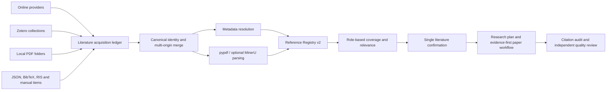

# Draftpaper-loop 天文学/深度学习插件与多源文献系统优化方案

日期：2026-07-31  
状态：从综合方案拆出的公开核心方案；不包含 `Draftpaper_review` 付费返修实现  
代码审计基线：本地 `main`，`pyproject.toml` 版本 `0.33.1`  
适用范围：Draftpaper-loop 公开核心、新论文生成流程和全部学科模块  
明确排除：已有投稿稿件与外部审稿意见返修，该能力由私有付费模块 `Draftpaper_review` 承担

## 一、拆分后的范围

本方案保留原综合方案中与 Draftpaper-loop 通用科研工作流直接相关的内容：

- 天文学方向插件；
- 深度学习/机器学习方向插件；
- 跨学科在线文献检索增强；
- Zotero、本地 PDF 和结构化文献导入；
- MinerU 可选 PDF 解析；
- Reference Registry v2 和 HTML 来源展示；
- citation evidence、文献覆盖和学科科研证据合同；
- 新论文流程中的 Results 学科审查、两位独立盲评者和 final quality gate。

本方案删除：

- 已投稿稿件导入；
- 外部审稿意见解析；
- reviewer issue matrix；
- response-to-reviewer；
- clean/marked 返修稿生成；
- 审稿返修提交包；
- 付费许可证和商业分发实现。

需要强调：公开核心仍然保留“对 Draftpaper-loop 新生成论文进行学科审查和双盲质量检查”，只是不会提供“替已有论文执行外部审稿返修”的完整产品。

## 二、总体结论

### 2.1 当前最优先解决的问题

其它学科检索不到参考文献的主要原因不是 PDF 读取能力，而是：

1. 当前在线 provider 主要是 Semantic Scholar、arXiv、Crossref 和可选 SerpAPI；
2. 缺少 PubMed/Europe PMC、NASA ADS、DBLP、OpenAlex 等学科入口；
3. 查询扩展主要依赖英文启发式关键词；
4. 只看总文献数，没有按 claim/data/method/baseline role 检查覆盖；
5. Zotero、JSON 和在线检索仍是互斥或弱聚合入口；
6. 本地 PDF 文件夹没有正式导入合同。

因此实施优先级为：

1. 多来源 reference ledger 与本地 PDF 导入；
2. 学科化 Provider Router；
3. MinerU 可选解析；
4. 天文学/深度学习插件加固。

### 2.2 MinerU 的准确定位

Draftpaper-loop 可以使用 MinerU，但它是**文档解析器**，不是文献搜索引擎。它适合：

- 扫描 PDF、复杂多栏论文、公式和表格；
- 生成 Markdown、`content_list_v2.json` 和页/区块定位；
- 从用户已有 PDF 中读取正文和参考文献列表；
- 为 citation evidence 提供比前五页 quick-read 更可靠的 passage locator。

它不能独立发现用户本地库和在线数据库中都不存在的论文。文献召回仍由 provider router 和 query/citation graph 负责。

## 三、当前实现审计

| 能力 | 当前状态 | 拆分后需要优化 |
|---|---|---|
| 在线检索 | Semantic Scholar、arXiv、Crossref、SerpAPI | 增加 OpenAlex 和学科 provider |
| 查询计划 | idea/data/method/journal 多上下文 | 学科词表、多语种同义词、种子论文 citation graph |
| Zotero | collection 导入并保留 origin | attachment、本地 PDF 与在线源统一聚合 |
| 本地文献 | JSON 和单条 custom reference | 文件夹扫描、PDF/BibTeX/RIS、增量 hash |
| PDF 解析 | pypdf 前 5 页 quick-read | 全文质量评分和 MinerU fallback |
| 去重 | DOI 或规范化标题 | multi-origin、字段级 provenance、版本关系 |
| HTML | 已展示 Source/Origin/Zotero | online/Zotero/local 分类、筛选、计数和多来源徽标 |
| 天文学 | FITS/WCS、time、unit、sky overlap 基础规则 | 样本流、层级标签、cutout QC、物理量修正、group split |
| 机器学习 | baseline、split、few-label、embedding 模板 | 监督预算、预处理、类级指标、可比性、吞吐率和长任务复用 |

## 四、从论文实跑中应保留到公开核心的科学问题

这些问题虽然在返修中被发现，但不仅服务于返修，应在新论文生成阶段提前阻止：

| ID | 通用问题 | 核心优化 |
|---|---|---|
| SCI-01 | 层级问题中“未被询问”被误当负类 | hierarchical label applicability contract |
| SCI-02 | few-label 实验隐藏使用额外 validation 标签 | total supervision budget gate |
| SCI-03 | source split 仍共享 tile/field/patient/site | multi-level group leakage gate |
| SCI-04 | 数据产品尺寸和模型输入尺寸混写 | preprocessing fingerprint |
| SCI-05 | macro 指标掩盖少数类几乎失效 | per-class metrics + proper baselines |
| SCI-06 | 不同任务、标签、split、metric 外部数值被比较 | external benchmark comparability |
| SCI-07 | UMAP/t-SNE 被写成物理可恢复性证据 | projection descriptive-only boundary |
| SCI-08 | anomaly 展示样本被写成 prevalence | anomaly inspection contract |
| SCI-09 | 不同硬件/阶段日志被外推成端到端吞吐率 | throughput evidence contract |
| SCI-10 | 软件许可证被外推覆盖目录、模型或巡天图像 | software/model/data license matrix |
| SCI-11 | 星表对象、cutout、embedding 行和分析 cohort 数量混用 | catalog sample flow audit |
| SCI-12 | absolute magnitude 等物理量缺少关键修正 | physical quantity correction completeness |

## 五、目标架构



权威关系：

- `reference_registry.json` 是元数据与来源事实源；
- `library.bib`、摘要、HTML 和 citation evidence 为派生产物；
- 文献发现、读取、元数据核验、正文引用和 claim 支撑分别记录状态；
- 学科插件绑定同一个 claim/cohort/run/evidence 系统。

## 六、天文学方向插件包

### 6.1 新增数据与审查插件

| 插件 ID | 类型 | 解决的问题 | 输出 |
|---|---|---|---|
| `astronomy.catalog_sample_flow_audit` | data/review | 星表、cutout、embedding、unique object 和 cohort 计数混用 | sample-flow JSON/表格 |
| `astronomy.object_identity_crossmatch` | data/method | 重复 ID、join 丢失、跨目录匹配不可追溯 | match/dedup manifest |
| `astronomy.sky_tile_group_split_gate` | review | source split 仍共享 tile/field/visit | overlap 与 leakage report |
| `astronomy.cutout_quality_manifest` | data/method | 空白、低动态范围、NaN 和截断 cutout | QC flags 和排除原因 |
| `astronomy.catalog_field_semantics` | review | 目录列被直接解释成独立真值 | 字段定义、单位、上游版本和边界 |
| `astronomy.data_product_license_gate` | review | 作者 LICENSE 被错误延伸至巡天数据 | software/model/catalog/image matrix |

### 6.2 物理量修正合同

新增 `astronomy.photometric_quantity_correction_contract`，至少记录：

- apparent/absolute magnitude；
- Galactic extinction；
- K correction；
- evolution correction；
- cosmology、bandpass、rest/observer frame；
- redshift source 与质量；
- 缺失修正时允许的最大 claim strength。

未满足完整修正时可保留条件描述，但不得写成完整物理量分布或与文献观测区间的无条件一致性。

### 6.3 层级天文标签

新增复合插件 `astronomy_ml.hierarchical_morphology_label_contract`：

- 父问题资格和 child applicability mask；
- 正负 answer 列和阈值；
- NaN、未进入分支和中间类语义；
- vote fraction、model probability、catalog class 与人工真值分离；
- 正负类计数、排除原因、object-ID hash；
- 无独立人工测试集时禁止“真实形态验证”论断。

### 6.4 天文 fixture

必须覆盖：

1. child question 未适用；
2. source 跨 tile/visit；
3. 重复 embedding object ID；
4. 空白/NaN/低动态范围 cutout；
5. 缺 extinction/K/evolution correction；
6. catalogue/cutout/embedding/unique cohort 数不同。

## 七、深度学习方向插件包

### 7.1 优先 review rules

| 插件 ID | 硬性检查 |
|---|---|
| `machine_learning.image_preprocessing_fingerprint` | dtype、NaN、clip、scale、resize、channel、normalization、代码 hash |
| `machine_learning.total_supervision_budget_gate` | train+validation 总标签量、outer test 隔离、selection labels |
| `machine_learning.grouped_split_leakage_gate` | object/source/tile/patient/site 交集和 split hash |
| `machine_learning.class_imbalance_evidence_gate` | counts、majority/random baseline、per-class recall、confusion matrix |
| `machine_learning.backbone_state_contract` | checkpoint、frozen/trainable blocks、head、optimizer、selection policy |
| `machine_learning.external_benchmark_comparability` | task/sample/label/split/backbone/head/metric/implementation matrix |
| `machine_learning.projection_inference_boundary` | UMAP/t-SNE 输入、scaling、metric、seed、参数与 descriptive-only |
| `machine_learning.anomaly_inspection_contract` | selection IDs、rater/QC、illustrative/prevalence 边界 |
| `machine_learning.throughput_evidence_contract` | stage、hardware、batch、samples、wall time、retry、measured/estimated |
| `machine_learning.long_run_artifact_reuse` | input/config/output hash 和 reuse eligibility |

### 7.2 few-label 与 representation 模板升级

将现有 plan-only/foundation 模板逐步升级为 fixture-runnable：

- outer development/test；
- fraction 总预算和 train/validation 数；
- seed 与 checkpoint selection；
- dummy/majority/random baseline；
- macro-F1、balanced accuracy、per-class precision/recall；
- preprocessing/checkpoint/object-ID hashes；
- raw embedding 与 standardized downstream matrix 区分；
- projection 只作描述，预测与回归必须使用 held-out evidence。

### 7.3 外部基准可比性

输出固定三类：

- `matched_numeric_baseline`：可进入同一数值表；
- `partial_context_only`：只用于背景和讨论；
- `not_comparable`：禁止性能排名，并列出不一致合同。

## 八、跨学科 Provider Router

### 8.1 Provider manifest

每个 provider 声明：

- disciplines 和 query syntax；
- identifier 类型；
- API key、rate limit、timeout、retry 和 cache；
- metadata、abstract、references、cited-by 和 OA 能力；
- 使用条款、隐私和自动访问边界；
- failure/degraded 状态。

### 8.2 推荐组合

| 学科 | 首选 | 补充 |
|---|---|---|
| 通用 | OpenAlex、Crossref、Semantic Scholar | OpenCitations、OpenAIRE |
| 天文/天体物理 | NASA ADS/SciX、arXiv astro-ph | OpenAlex、Crossref |
| 医学/生命科学 | PubMed E-utilities、Europe PMC | Crossref、OpenAlex |
| 计算机/深度学习 | DBLP、Semantic Scholar、arXiv | OpenAlex、Crossref |
| 农业/生态/环境 | OpenAlex、Crossref、Europe PMC/Agricola 覆盖 | Semantic Scholar |
| 中文/受限库 | Zotero、本地 PDF/BibTeX/RIS | DOI 经 Crossref/OpenAlex 核验 |

不通过未经许可的网页抓取规避 CNKI、万方或商业数据库限制。

### 8.3 查询扩展

每个 research question 建立：

- 中英文术语、缩写和全称；
- 学科受控词；
- 数据集/仪器/任务；
- 方法和 metric；
- foundational/recent/baseline role；
- 排除词。

执行顺序：宽查询、data/method pairwise、single fallback、seed references/cited-by、缺失 role 定向救援。

### 8.4 覆盖标准

不使用统一“至少 20 篇”。按 role 判断：

- primary claim；
- data provenance；
- method provenance；
- statistical/evaluation standard；
- nearest baseline；
- limitations 与边界；
- foundational、recent 和 source diversity。

无结果时必须报告 provider/query/gap，不生成虚构文献。

## 九、本地参考文献文件夹导入

### 9.1 命令合同

```powershell
python -m draftpaper_cli.cli add-literature-source `
  --project <project> `
  --type local-folder `
  --path <folder> `
  --context all `
  --recursive

python -m draftpaper_cli.cli collect-literature --project <project>
python -m draftpaper_cli.cli reconcile-literature --project <project>
python -m draftpaper_cli.cli review-literature-coverage --project <project>
```

旧 `search-literature` 保持兼容并转发到聚合器。Zotero、JSON、本地目录和在线检索不再互斥。

### 9.2 支持范围

- PDF；
- sidecar `.bib`、`.ris`、`.enw`、`.json`；
- 默认外部只读 locator；
- 可选 `--copy-attachments`；
- SHA-256、size、mtime、MIME、pages、parser version；
- hash 增量更新；
- 公共报告只显示 logical locator。

### 9.3 元数据解析

1. sidecar；
2. PDF embedded metadata；
3. 首页 DOI/arXiv/PMID/title/author；
4. 联网允许时做 provider 核验；
5. 无法解析则保留 `metadata_incomplete`，不丢弃。

### 9.4 与 Zotero 相同的保留规则

```json
{
  "selection_policy": "user_curated_preserve",
  "retention_scope": "reference_registry_and_analysis_pool",
  "automatic_citation": false
}
```

“完整保留”表示 registry、分析池和 HTML 永久可见，不表示全部自动引用。用户可设置 `retain_only`、`use_for_context`、`use_for_direct_claim`、`exclude_from_current_project`。

## 十、MinerU 可选适配器

### 10.1 集成方式

不把 MinerU 和模型打入核心 wheel。新增 adapter：

- 本地 CLI；
- 用户明确配置的本地/私有 FastAPI；
- pypdf fast path；
- 扫描/乱码/多栏/低文本产出时 MinerU fallback。

```text
MIME/hash
  -> pypdf
  -> extraction quality
  -> optional MinerU
  -> content_list_v2 adapter
  -> metadata/reference resolver
  -> page/block citation evidence
```

### 10.2 输出使用

- Markdown 供人工查看；
- `content_list_v2.json` 为优先适配输入；
- `content_list.json` 兼容旧版；
- `middle.json` 仅高级定位；
- layout/span PDF 仅解析 QA。

PDF bibliography 的 `ref_text` 只成为 discovery candidate，必须完成 identity/metadata 核验后才进入正式 registry。

### 10.3 安全与许可证

- 默认本地处理，不上传用户 PDF；
- 远程 API 需要数据外发授权；
- argv 调用，不拼 shell；
- 输入 root/output staging 限制；
- 文件、页数、并发、timeout、磁盘预算；
- persistent job 和 parser receipt；
- MinerU 未安装或失败时降级 metadata-only；
- `third_party/registry.json` 登记 MinerU 和许可证快照；
- 不复制 MinerU 源码；
- 在线服务遵守显著标识义务；
- 发布前重新核验许可证。

## 十一、Reference Registry v2

### 11.1 多来源结构

```json
{
  "work_id": "doi:10.xxxx/example",
  "canonical_metadata": {},
  "field_provenance": {},
  "source_records": [
    {"source_type": "online_search", "provider": "openalex"},
    {"source_type": "zotero", "collection": "Astronomy"},
    {"source_type": "local_import", "file_id": "sha256:..."}
  ],
  "document_parses": [],
  "selection": {},
  "citation_roles": [],
  "evidence_passages": []
}
```

### 11.2 去重

1. DOI；
2. PMID/PMCID/arXiv/ADS bibcode；
3. title + first author + year；
4. PDF content hash；
5. 模糊匹配只创建 candidate，不自动合并。

合并不丢弃 Zotero key、本地 hash、query provenance 或用户确认。

## 十二、HTML 文献索引

`literature_summaries/index.html` 增加：

- online/Zotero/local/manual/parent-lineage 计数；
- 来源筛选和多来源徽标；
- provider、collection 和 logical local library；
- metadata/PDF parse/parser version；
- retained/current-use/cited/audited；
- DOI/PMID/arXiv/ADS；
- query/citation-graph provenance；
- 字段级 metadata 来源和 evidence locator。

固定来源类别：

```text
online_search
zotero
local_import
manual
parent_lineage
```

## 十三、统一文献确认点

在 `generate-plan` 前提供一个综合包：

```text
references/literature_coverage.zh-CN.md
references/literature_coverage.json
references/literature_summaries/index.html
references/unresolved_reference_tasks.json
```

一次展示 provider 成败、来源计数、去重结果、role coverage、解析状态、保留但不建议引用的条目和 unresolved gaps。确认 hash 绑定 source manifests 与 registry。

## 十四、公开核心与 Draftpaper_review 的接口

公开核心只提供通用、非商业化的版本化接口：

- read-only project artifact resolver；
- reference/citation service；
- discipline plugin registry；
- evidence/run lookup；
- LaTeX/PDF validation；
- transaction/stale computation；
- extension manifest compatibility check。

公开核心不得包含：

- 外部 reviewer report parser；
- response-to-reviewer 生成器；
- clean/marked 返修编排；
- 付费 license validation；
- 私有模块 fixture 或等价实现。

## 十五、建议代码文件

### 15.1 文献系统

```text
draftpaper_cli/literature_sources/base.py
draftpaper_cli/literature_sources/registry.py
draftpaper_cli/literature_sources/online_provider.py
draftpaper_cli/literature_sources/zotero_source.py
draftpaper_cli/literature_sources/local_folder.py
draftpaper_cli/literature_sources/structured_file.py
draftpaper_cli/literature_provenance.py
draftpaper_cli/reference_identity.py
draftpaper_cli/literature_coverage.py
draftpaper_cli/document_parsers/base.py
draftpaper_cli/document_parsers/pypdf_adapter.py
draftpaper_cli/document_parsers/mineru_adapter.py
```

修改：`literature_search.py`、`zotero_adapter.py`、`references.py`、`bibliography.py`、`citation_audit.py`、`cli.py`、`command_registry.py`。

### 15.2 插件

```text
draftpaper_cli/discipline_modules/astronomy/data_connectors/...
draftpaper_cli/discipline_modules/astronomy/method_templates/...
draftpaper_cli/discipline_modules/astronomy/review_rules/...
draftpaper_cli/discipline_modules/machine_learning/method_templates/...
draftpaper_cli/discipline_modules/machine_learning/review_rules/...
draftpaper_cli/discipline_modules/composite/astronomy_machine_learning/...
```

每个插件遵守 `dpl.plugin_manifest.v2`，fixture 不能冒充真实科研结果。

## 十六、测试矩阵

### 16.1 文献

1. online + Zotero + local + JSON 同时导入；
2. 同 DOI 多来源合并且来源全保留；
3. 无 DOI duplicate candidate；
4. 本地文件 drift；
5. 扫描 PDF 触发 MinerU；
6. MinerU 未安装、超时、版本变化和 malformed output；
7. 绝对路径不进入 HTML/public bundle；
8. 用户精选文献超过 Top-N 仍保留；
9. PDF bibliography 不自动进入 BibTeX；
10. astronomy/medicine/computer/geography provider fixtures；
11. provider 全失败产生 gap report；
12. registry/BibTeX/HTML/citation audit 一致。

### 16.2 学科插件

- 父问题未适用；
- tile/source/group 泄漏；
- supervision budget 超额；
- 128×128 与 224×224 输入合同；
- extreme class imbalance；
- external benchmark mismatch；
- measured/estimated throughput；
- anomaly QC contamination；
- incomplete photometric corrections；
- license boundary。

### 16.3 跨学科组合

- Astronomy + Machine Learning + local PDF；
- Medicine + Machine Learning + PubMed/Europe PMC；
- Geography + Machine Learning + Zotero/local PDF；
- 完全离线，仅本地 PDF 与缓存元数据；
- 未安装 Draftpaper_review 时公开核心全流程正常。

## 十七、实施顺序

本节只规划公开核心后续迭代，不规划 `Draftpaper_review` 的付费返修版本。当前公开核心以 `v0.33.1` 为基线；此前已完成的多源文献、可选 MinerU 适配、天文学/机器学习审查合同和插件注册能力仍按本方案保留。后续版本应继续保持公开核心可独立安装，且不能通过新增公开命令复刻付费返修产品。

### M0：Schema 与回归基线

- source taxonomy；
- Reference Registry v2；
- 现有 Zotero/online/citation golden fixtures；
- extension boundary，不引入付费实现。

### M1：多来源与本地导入

- source registry；
- local folder manifest；
- user-curated preserve；
- HTML 来源分类；
- 后续维护版本建议从 `v0.33.1` 起编号。

### M2：Provider Router

- OpenAlex；
- PubMed/Europe PMC、DBLP、NASA ADS profiles；
- query expansion、snowballing、role coverage；
- 后续功能版本建议纳入 `v0.34.0`。

### M3：MinerU 可选后端

- CLI/API adapter；
- pypdf fallback；
- parser QA、receipt、license registry；
- 作为 `v0.34.0` 的可选安装档位继续维护。

### M4：天文学与深度学习插件

- 第一批：层级标签、监督预算、preprocessing、group split、sample flow、cutout QC；
- 第二批：external baseline、throughput、anomaly、physical corrections、license；
- 在 `v0.34.0` 之后按插件成熟度分批增强。

### M5：文档与发布

- README 多源文献入口；
- MinerU optional install profile；
- CLI reference/risk matrix；
- wheel、Windows、secret、third-party 和跨学科 CI。

## 十八、最终验收标准

### 18.1 文献

- online/Zotero/local 同时存在；
- user-curated 100% 保留；
- multi-origin 100% 可追溯；
- HTML 明确区分来源；
- 无绝对路径和凭证泄漏；
- 单一 provider 无结果不会导致全局失败；
- MinerU 不可用可降级；
- 引用必须有 metadata 和 evidence，不因本地存在而自动引用。

### 18.2 科学插件

- 层级标签、监督预算、group split、preprocessing 和 class imbalance 为 release hard checks；
- 天文数量、单位、修正、样本流和巡天分组有明确合同；
- UMAP/anomaly/throughput/external baseline 不产生超证据论断；
- plugin maturity 与真实执行状态一致。

### 18.3 产品边界

- 公开核心可独立安装和运行；
- 不包含 Draftpaper_review 私有源码和许可逻辑；
- 公开核心 schema/API 足以让合法安装的付费模块复用；
- 两者不建立重复 registry 或冲突事实源。

## 十九、不采用的方案

1. 不把 MinerU 当检索数据库；
2. 不把 MinerU 设为 core wheel 强依赖；
3. 不自动引用本地 PDF 的全部 bibliography；
4. 不让在线 rerun 覆盖 Zotero/local 用户精选条目；
5. 不爬取受限商业数据库规避许可；
6. 不把 Euclid/Galaxy Zoo 字段硬编码进通用核心；
7. 不把 Draftpaper_review 的商业实现、返修信件或 clean/marked 逻辑放回公开核心；
8. 不移除新论文流程原有的学科审查和双盲质量检查。

## 二十、外部技术依据

- [MinerU 官方仓库](https://github.com/opendatalab/MinerU)
- [MinerU 输出格式](https://github.com/opendatalab/MinerU/blob/master/docs/en/reference/output_files.md)
- [MinerU Open Source License](https://github.com/opendatalab/MinerU/blob/master/LICENSE.md)
- [OpenAlex Developers](https://developers.openalex.org/)
- [Crossref REST API](https://www.crossref.org/documentation/retrieve-metadata/rest-api/)
- [NCBI E-utilities](https://www.ncbi.nlm.nih.gov/home/develop/api/)
- [Europe PMC REST API](https://dev.europepmc.org/RestfulWebService)
- [NASA ADS API](https://github.com/adsabs/adsabs-dev-api)
- [DBLP Search API](https://dblp.org/faq/13501473.html)
