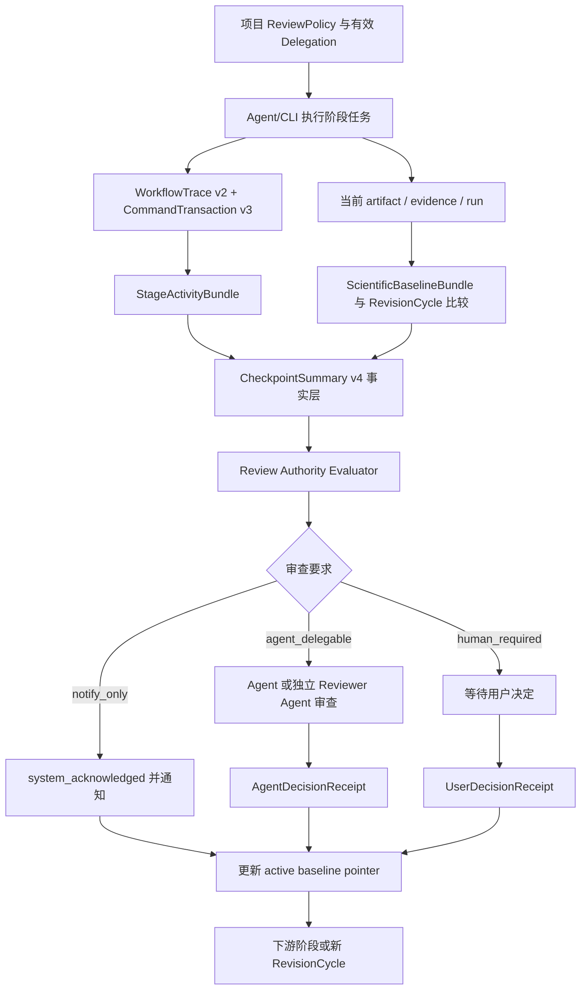

# Draftpaper-loop Agent 委托审查、阶段工作叙事与纵向漂移治理完整优化执行方案

## 1. 文档定位

- 日期：2026-08-11
- 当前代码基线：Draftpaper-loop v0.37.0，`main` 提交 `b0a209c`
- 建议目标版本：v0.37.1 完成观测与 shadow，v0.38.0 完成委托审查和 HTML v4，v0.38.1 完成纵向基线，v0.39.0 完成严格发布
- 适用范围：所有学科、所有新建论文项目、已有论文项目和多轮修订项目
- 方案性质：Draftpaper-loop 公共框架、状态合同、CLI、Agent Skill、HTML 和测试体系优化
- 不属于本方案：单篇论文内容修改、某个学科数字的特判、私有 Draftpaper_review 业务逻辑、云端账号或商业许可系统

本方案针对三类连续出现的真实使用问题：

1. 人工确认点数量和阻塞感过强，用户希望保留提醒与审查能力，同时允许 Agent 在明确授权下代为审查并继续；
2. `stage_summary.zh-CN.html` 虽然已经能列出完整产物，但仍不能清楚回答“本阶段 Agent 实际做了什么、为什么这样做、成功或失败在哪里”；
3. 同一个论文项目在持续修改和多轮返修中经常出现漂移，且前后版本可能形成数字、样本、方法、图表、论断或正文之间的不一致。

这三类问题不能分别用“少弹几个确认框”“多写一段 HTML 文案”和“再比较一次 hash”解决。它们共同缺少三项框架能力：

- **审查权限模型**：证据是否可确认、是否需要提醒、谁有权作出决定，目前被压缩成同一个布尔值；
- **Agent 活动事实源**：当前摘要主要从文件和报告推导，缺少对真实执行动作的结构化记录；
- **纵向科学基线**：当前 drift 主要比较 passport 快照和现有文件，缺少跨修订轮次不可变的科学事实基线与版本谱系。

---

## 2. 核心结论

### 2.1 人工确认点应改造成“分级审查点”

人工确认点不应全部删除，也不应继续全部阻塞用户。应把当前概念拆成三个正交维度：

1. `review_state`：证据是否健康，例如 `confirmable`、`blocked`、`stale`、`preview_only`；
2. `review_requirement`：本次属于通知、可委托 Agent，还是必须人工决定；
3. `decision_status`：尚未决定、Agent 已批准、用户已确认、拒绝或要求修订。

Agent 自动确认不能伪装成用户确认。状态和 ledger 必须分别记录：

- `agent_approved`：Agent 在有效 delegation 下完成审查；
- `user_confirmed`：用户本人明确确认；
- `system_acknowledged`：纯通知或确定性派生产物已由系统登记。

默认建议采用 `balanced` 模式：低风险审查点自动继续并提醒用户；有完整证据且无分支决策的科学审查点可由用户一次性授权 Agent 代审；路线选择、外部副作用和最终发布仍由用户确认。

### 2.2 HTML 必须从“产物目录”升级为“工作叙事”

当前 v3 HTML 的完整产物列表应保留，但不能再承担推断 Agent 行为的职责。框架必须先记录结构化活动，再生成叙事：

```text
Agent/CLI 实际动作
  -> workflow trace 与 transaction receipt
  -> stage activity bundle
  -> 事实约束的一段中文总结
  -> HTML、JSON 和 Agent payload 同源输出
```

HTML 第一屏必须回答：

- Agent 本阶段接收了什么目标；
- 读取和分析了哪些关键输入；
- 执行了哪些操作；
- 生成、修改、复用或跳过了哪些内容；
- 做出了哪些机器判断，哪些科学决定仍未作出；
- 哪些验证通过，哪些失败或重试；
- 与上一次该阶段相比发生了什么变化；
- 为什么当前可以自动继续、需要 Agent 审查或必须等待用户。

### 2.3 漂移治理必须从“单次快照”升级为“纵向基线与修订谱系”

`project_passport.yaml` 继续承担当前项目清单和运行状态职责，但不能再作为唯一长期基线。应新增不可变的 `ScientificBaselineBundle` 和 `RevisionCycle`：

- 每次用户确认或合法 Agent 批准后形成一个基线版本；
- 新一轮修改始终绑定父基线、变更意图和允许的 change class；
- 数据、cohort、split、方法、run、指标、图表、claims、参考文献和正文事实都有稳定 ID；
- 当前内容不仅与上一份 passport 比较，还与本轮起点基线和所有下游消费者比较；
- 旧基线不可覆盖，只能 supersede，并保留完整 lineage。

### 2.4 当前版本在新功能实现前仍保持原边界

当前 `draftpaper-workflow` Skill 明确禁止 Agent 替用户确认真实科研结果，`checkpoint_summary.py` 也要求 `requires_user_decision=true`。因此在本方案完成代码、schema、Skill、测试和发布前：

- 不能通过直接改 ledger 或伪造 `test_auto_confirmation=true` 实现自动确认；
- 不能把 Agent 的自然语言“看起来没问题”当作确认 receipt；
- 不能把匿名 showcase 的测试自动确认带入真实论文项目；
- 不能将本方案描述为已经上线的能力。

---

## 3. 当前实现审计与根因

### 3.1 人工确认为何过重

当前实现中：

- `draftpaper_cli/checkpoint_summary.py` 将 `confirmation_contract.requires_user_decision` 固定为 `true`；
- `resume`、`confirm-research-plan`、`confirm-final-manuscript` 等命令标记为 `protected_action` 和/或 `manual_only`；
- `CommandSpec.confirmation_policy` 实际主要区分 `none` 与 `human_only`；
- 真实项目没有合法的 Agent delegation、授权范围、到期时间、撤销和 receipt；
- `test_auto_confirmation` 只允许匿名 fixture 测试，不能服务真实项目。

因此，“证据已经确定性通过”和“用户必须亲自做科学选择”都落入同一阻塞路径。用户被迫对大量没有分支、没有外部副作用、没有证据变化的阶段重复确认。

### 3.2 HTML 为何仍说不清 Agent 做了什么

当前 `checkpoint_digest.py` 的通用叙述主要根据：

- 阶段目录中发现的产物；
- 文件分组和数量；
- payload 中的状态字段；
- 若干固定的阶段 purpose 模板。

例如通用叙述会表达“生成或更新了若干图表、代码和报告”，但它不知道：

- Agent 是新生成、修复、复用还是跳过；
- 为什么选择某一方法或没有执行某一步；
- 哪个命令失败后重试了几次；
- 读取了哪些上游证据后作出判断；
- 用户指令、Agent 判断和确定性 gate 分别贡献了什么；
- 同一文件是否被多个命令反复覆盖。

现有 `workflow_trace.jsonl` 记录 command、input hash、时间、状态和 output hash；`transaction_ledger.jsonl` 记录命令事务和科学退出状态。它们为改进提供了基础，但尚未记录足够的 artifact diff、活动类别、决策依据和用户可读摘要片段。

### 3.3 漂移为何反复出现并逐轮积累

当前 `stale_sync.py` 的基本流程是：

```text
passport baseline
  -> 收集当前文件
  -> byte / semantic / evidence hash 比较
  -> 按路径推断 artifact role
  -> 映射 change class 和 stale stages
  -> 刷新 passport baseline
```

这已经优于纯字节 hash，但仍存在以下结构性缺口：

1. **直接编辑绕过事务**：Agent、用户或外部编辑器直接修改 Markdown、TeX、JSON、Python、BibTeX 后，框架只知道“外部变化”，不知道变更意图和责任主体；
2. **基线被移动**：`sync-artifact-stale` 完成分类后刷新 passport，适合继续当前流程，但无法作为多轮修订的不可变历史基线；
3. **未知产物缺少稳定 owner**：无法识别 role 的文件被隔离为 `unresolved_artifact`，后续若反复出现仍需人工处理；
4. **跨文件一致性不足**：单个文件 hash 正确，不代表正文、表格、caption、审稿回复和摘要中的同一数字一致；
5. **事实注册表仍是 legacy**：`scientific_fact_ledger.py` 使用 `dpl.legacy_scientific_fact_ledger.v1`，并包含 event/source/token、AGN/XRB/TDE 等特定模式，不能作为全学科长期事实基线；
6. **修订轮次未成为一等实体**：当前 packet 和 transaction 能保护单次修订，但缺少 `revision_cycle_id`、parent baseline 和跨轮次一致性报告；
7. **运行时漂移与科学漂移混在用户体验中**：Skill、wheel、源码、状态 revision、报告时间戳和科学内容变化虽然部分已分离，但用户仍可能把所有警告理解为科研结果发生变化。

### 3.4 已完成能力应保留

本方案不推翻当前已完成的框架：

- `MetricEvidence`、`CountEvidence`、`AggregationContract` 和 `PrimaryMetricContract`；
- `RunEvidenceBundle` 的 candidate/active/superseded 生命周期；
- `FigureCodeTrace v2`；
- identity-first 比较；
- `checkpoint_summary.v3`、完整阶段产物、双重路径和同源 hash；
- stage scope resolver；
- byte/semantic/evidence 三层 artifact identity；
- canonical change class 与精确 stale propagation；
- workflow trace、transaction ledger、scoped transaction 和 runtime handshake；
- v1/v2 checkpoint 只读 legacy 兼容。

新的方案是在这些能力之上增加权限、活动和纵向基线三个层次。

---

## 4. 设计原则

1. **不冒充用户**：Agent 决定必须记录为 Agent 决定，不能写成用户确认；
2. **一次授权，多次受控代审**：用户可以在项目开始或某轮修订开始时一次授权，不需要每个低风险节点重复点击；
3. **证据健康与决定权限分离**：`confirmable` 不再隐含“必须用户点击”；
4. **确定性 gate 优先**：自动审查资格由结构化合同决定，模型置信度只能作为补充信号；
5. **生产与审查适当分离**：中高风险 Agent 代审应支持独立 reviewer Agent，不能默认由同一个生成者自我批准；
6. **无声超时不等于同意**：不能因为用户若干分钟未回应就自动确认；
7. **所有自动继续均可解释**：HTML 必须显示为何可自动继续、使用了哪份 delegation 和哪些验证；
8. **长期基线不可覆盖**：passport 可以刷新，scientific baseline 只能新增和 supersede；
9. **所有正文数字来自稳定事实 ID**：不能继续依赖正则从自由文本猜测核心事实；
10. **直接编辑必须进入 reconciliation**：框架外修改不能被静默接受，也不能一律重开全部上游；
11. **无证据不写叙事**：HTML 的每个动作和结论都能追溯到 activity event、transaction 或 artifact；
12. **跨学科核心保持中性**：学科专属实体、阈值和事实提取由插件 adapter 声明；
13. **本地优先和隐私不变**：不因自动审查增加默认联网、遥测或上传；
14. **最终发布仍保留作者责任**：自动审查不能取代最终稿、对外发布、许可证或外部副作用确认。

---

## 5. 目标架构



核心原则是：HTML 只展示已经写入结构化事实层的内容；authority evaluator 只消费经过验证的 summary 和 delegation；baseline promotion 只消费合法 decision receipt。

---

## 6. P0：分级审查与 Agent 委托确认

### 6.1 拆分三类状态

`checkpoint_summary.v4` 应包含：

| 字段 | 允许值 | 含义 |
|---|---|---|
| `review_state` | `confirmable` / `blocked` / `stale` / `preview_only` / `legacy_unqualified` | 证据和页面是否具备审查资格 |
| `review_requirement` | `notify_only` / `agent_delegable` / `human_required` | 谁需要采取动作 |
| `decision_status` | `not_required` / `pending` / `system_acknowledged` / `agent_approved` / `user_confirmed` / `rejected` / `refinement_required` | 当前决定是否满足 |
| `decision_actor_type` | `none` / `system` / `agent` / `user` | 决定主体 |
| `authority_source` | policy/delegation/explicit command 的 ID 与 hash | 决定权限来源 |

`review_state != confirmable` 时，无论 policy 如何都不能确认。`confirmable` 只说明机器证据完整，不说明谁已经批准。

### 6.2 三种项目体验模式

| 模式 | 行为 | 适用用户 |
|---|---|---|
| `manual` | 所有需要决定的 checkpoint 都等待用户 | 希望逐项审阅或高风险项目 |
| `balanced` | 纯通知自动继续；用户一次授权后，低风险和无分支科学 checkpoint 可由 Agent 代审；高风险仍人工 | 建议作为新项目默认 |
| `delegated` | 有效 delegation 范围内所有可委托 checkpoint 由 Agent 审查；只保留硬性人工边界 | 高频使用、已熟悉流程的用户 |

已有项目升级后默认保持 `manual`，避免行为突然改变。新项目首次启动时集中展示一次 policy 选择；用户也可以在项目或修订轮次级别设置并随时撤销。

### 6.3 审查风险分类

| 等级 | 典型情况 | 默认要求 |
|---|---|---|
| C0 通知型 | 派生 HTML 重建、格式检查、重复运行复用、无语义变化的报告 | `notify_only` |
| C1 确定性可委托 | 所有合同通过、无路线分支、无外部副作用、无科学身份变化 | `agent_delegable` |
| C2 科学冻结可委托 | 研究蓝图、核心证据或结果支撑已完整通过，但会冻结科学基线 | 明确 delegation + 独立 Agent 审查，或人工 |
| C3 必须人工 | 互斥路线、claim 收窄/扩张、补数据与停止路线、许可证接受、第三方代码下载/执行、作者身份、最终发布 | `human_required` |

建议 checkpoint 映射：

| Checkpoint | 无分支且全部通过 | 存在分支、外部副作用或科学冲突 |
|---|---|---|
| 文献覆盖与数据清单 | C1 | C2/C3 |
| 初始研究蓝图 | C2 | C3 |
| 数据与方法可行性 | C1 | C2/C3 |
| Result Support | C2 | C3，尤其是补数据与收窄论断二选一 |
| Core Evidence | C2 | C3 |
| 插件候选检查 | C1，仅 metadata/static inspection | C3，下载、许可证、执行或 promotion |
| 纯文字/格式补全 | C1 | 新科学内容为 C2/C3 |
| 最终稿与 release hash | C3 | C3 |

### 6.4 Delegation 合同

新增 `dpl.review_delegation.v1`，至少包含：

- `delegation_id`；
- `project_id`；
- `revision_cycle_id`，可为空表示项目级；
- `granted_by=user`；
- `allowed_checkpoint_types`；
- `maximum_risk_class`；
- `allowed_change_classes`；
- `allow_scientific_freeze`；
- `require_independent_agent`；
- `forbid_external_side_effects=true`；
- `forbid_unresolved_items=true`；
- `expires_at` 或最大 checkpoint 次数；
- `runtime_fingerprint`；
- `policy_sha256`；
- `revoked_at` 与撤销原因；
- `created_at`。

Delegation 必须由一次显式用户命令生成，不能由 Agent 自己扩大范围。用户可以只授权特定阶段，例如“数据和方法通过时自动继续，但研究蓝图、结果路线和最终稿仍由我确认”。

### 6.5 Agent 自动审查资格算法

authority evaluator 必须按固定顺序检查：

1. checkpoint schema 为当前版本，且所有 companion 文件存在；
2. `review_state=confirmable`；
3. summary hash、artifact manifest hash、evidence snapshot、run bundle 和 runtime fingerprint 当前；
4. 无 blocking、stale、identity missing、unclassified drift 或 unresolved scientific issue；
5. checkpoint 风险等级不高于 delegation 上限；
6. change class 位于允许集合；
7. 无网络上传、第三方代码执行、许可证接受、公开发布或不可逆外部动作；
8. 不存在互斥科学路线，或 delegation 已明确指定确定性偏好且该偏好仍合法；
9. 若属于 C2，producer 与 reviewer Agent 身份满足 policy 要求；
10. delegation 未过期、未撤销，且 policy/runtime/summary hash 全部一致。

任何一项失败都必须降级为 `human_required` 或 `blocked`，不能“尽量自动”。Agent 的自然语言信心分数不能覆盖上述硬门禁。

### 6.6 决定 receipt

新增 `dpl.review_decision_receipt.v2`：

```yaml
schema_version: dpl.review_decision_receipt.v2
checkpoint_id: example
checkpoint_hash: sha256
summary_sha256: sha256
decision: approve
decision_status: agent_approved
actor_type: agent
actor_id: reviewer-agent-id
producer_actor_id: producer-agent-id
authority_source:
  delegation_id: delegation-id
  delegation_sha256: sha256
risk_class: C1
eligibility_checks: []
evidence_snapshot_id: snapshot-id
baseline_id: baseline-id
runtime_fingerprint: runtime-id
created_at: timestamp
```

旧字段 `human_confirmation_status` 不能直接承载 Agent 决定。需要新增中性字段 `review_decision_status`，并在真正用户确认时继续保留 `user_confirmed` 的可辨识记录。

### 6.7 建议 CLI

```powershell
draftpaper configure-review-policy --project <project> --mode balanced
draftpaper grant-agent-review --project <project> --scope data,methods,core_evidence --max-risk C2 --require-independent-agent
draftpaper review-policy-status --project <project>
draftpaper review-checkpoint --project <project> --checkpoint-hash <hash> --actor agent --delegation-hash <hash>
draftpaper revoke-agent-review --project <project> --reason "return to manual review"
```

现有 `resume`、`confirm-research-plan` 和其他确认命令在迁移期作为用户确认兼容入口；它们不能静默改成 Agent 命令。

### 6.8 用户界面

每个 HTML 顶部明确显示：

- `仅提醒，已自动继续`；
- `可由 Agent 审查，等待有效 delegation`；
- `Agent 已按授权审查并继续`；
- `必须由用户确认`；
- `存在阻断，任何主体都不能确认`。

Agent 自动审查后仍向用户发出一次非阻塞通知，包含摘要路径、决定主体、delegation、关键理由和撤销/重开入口。

---

## 7. P0：Stage Activity Bundle 与 HTML 工作叙事

### 7.1 复用现有事实源

不新建第二套命令真相。应升级并组合：

- `workflow_trace.jsonl`：负责命令、actor、输入、时间、重试、状态和下一步；
- `transaction_ledger.jsonl`：负责事务提交、回滚、科学退出状态和写集；
- artifact identity：负责 before/after byte、semantic 和 evidence hash；
- stage manifest：负责阶段 owner 和正式输入输出；
- 新增的 `StageActivityBundle`：只作为 checkpoint 范围内的派生汇总。

### 7.2 WorkflowTrace v2

将 `dpl.workflow_trace.v1` 升级为 v2，新增：

- `actor_type`、`actor_id`、`agent_session_id`；
- `stage`、`intent_id`、`parent_intent_id`；
- `action_kind`：read/analyze/generate/modify/reuse/validate/retry/skip/decide/rollback；
- `input_artifact_refs`；
- `output_artifact_refs`；
- `artifact_change_summary`；
- `validation_result_refs`；
- `decision_refs`；
- `reason_codes`；
- `retry_of` 与 `attempt`；
- `user_visible_summary_fragment_zh`，只能描述已经绑定的结构化事实。

### 7.3 CommandTransaction v3

每个 mutating command 完成后，receipt 增加：

- 声明写集和实际写集；
- created/modified/deleted/reused/skipped 文件；
- before/after semantic identity；
- 哪些产物是 canonical，哪些是 derived；
- 哪些验证由本命令执行；
- 是否改变科学 baseline；
- rollback 是否完整；
- 是否需要重新打开上游。

### 7.4 Agent 直接编辑的统一入口

Agent 不应继续用任意文件补丁直接修改论文项目后再让 drift 系统猜测。新增受管入口：

```powershell
draftpaper begin-managed-change --project <project> --intent <file-or-text> --change-class <class>
draftpaper apply-managed-change --project <project> --packet-id <id> --packet-hash <hash>
```

框架生成 scoped workspace、before hash、允许写集和 preview；Agent 完成修改后由同一 transaction 提交。若用户或外部编辑器直接修改文件，则进入 external-edit reconciliation，不会被描述成受管 Agent 工作。

受管 packet 本身必须是不可变预览证据：`apply-managed-change` 只能读取并验证原 packet，不能把 `status`、`receipt_id` 或应用时间回写到 packet，否则会破坏原始 `packet_sha256` 和父版本定位。应用前先校验本 packet 的全部目标，任何一个目标 stale 都不得先写入其他目标，避免半提交；应用成功后单独写 `dpl.managed_change_receipt.v1` 文件并追加 ledger，重复使用同一 `packet_id + packet_hash` 必须拒绝。receipt 记录实际写集、应用后的 artifact identity 和原 packet 相对路径。

### 7.5 StageActivityBundle

新增 `dpl.stage_activity_bundle.v1`，按 checkpoint 的 start/end transaction 边界汇总：

- 阶段目标；
- 已读取的关键输入；
- 实际执行步骤；
- 新建、修改、复用、跳过和失败内容；
- 重试与恢复；
- 机器判断与尚未作出的科学决定；
- 验证、警告和阻断；
- 本轮与上轮该阶段的变化；
- 下游影响；
- 每项活动对应的 command/transaction/artifact refs。

bundle 中每个活动都必须有稳定 `activity_id` 和至少一个证据引用。没有 receipt 的行为只能显示为“检测到外部修改”，不能写成 Agent 已完成的工作。

### 7.6 叙事生成管线

采用“确定性事实 + 可选自然语言 + 反向核验”三层：

1. **事实层**：从 StageActivityBundle、artifact diff、validation 和 decision receipt 生成结构化句子；
2. **叙事层**：Agent 将事实压缩成一段 180--320 字中文摘要，不新增数字、路径或结论；
3. **核验层**：逐句检查 activity/artifact refs、数字、动作时态、成功/失败状态和主体身份；失败时回退到确定性模板。

不得让 Agent 直接浏览目录后自由编写总结，因为这会重复产生幻觉和遗漏。

### 7.7 HTML v4 信息架构

第一屏：

1. 当前阶段、证据健康状态和审查要求；
2. 一段“本阶段 Agent 做了什么”的中文总结；
3. Agent/用户/系统各自承担的角色；
4. 关键结果、失败和未解决数量；
5. 是否已经自动继续，以及依据的 policy/delegation。

主体区域：

1. **Agent 工作步骤**：按 analyze、generate、validate、repair、decision 分组；
2. **本阶段完整成果**：保留 v3 的图表、表格、代码、报告和运行证据；
3. **相对上一轮的变化**：区分当前事务 diff 与相对 scientific baseline 的 diff；
4. **关键科学事实**：展示 fact ID、值、单位、cohort、run 和证据来源；
5. **验证与一致性**：展示通过、警告、阻断和重试；
6. **未完成和跳过内容**：说明为什么跳过以及是否影响下游；
7. **审查决定**：显示 notify/Agent/user、决定主体和 receipt；
8. **完整技术附件**：hash、路径、manifest 和 machine payload。

默认页面简洁，技术细节放在 `<details>` 中；不能为了完整性把所有 JSON 原样铺在第一屏。

### 7.8 HTML 质量门

每个页面必须满足：

- activity coverage：所有 committed command 均被归纳或明确标记为技术噪音；
- artifact coverage：所有 stage-owned canonical 产物均可找到；
- narrative support：摘要中的每个动作和数字都有 refs；
- actor accuracy：用户、Agent 和系统动作不能混写；
- temporal accuracy：计划、执行、完成、失败和待办时态正确；
- decision accuracy：没有选择的路线不能写成已选择；
- no path-as-summary：路径只能作为证据链接，不能替代内容总结；
- readability：30 秒内可理解核心工作，详细附件仍完整保留。

---

## 8. P0：纵向漂移治理与多轮一致性

### 8.1 新增 ScientificBaselineBundle

新增 `dpl.scientific_baseline_bundle.v1`，每次合法审查决定后创建，不覆盖旧版本。至少包含：

- `baseline_id`；
- `parent_baseline_id`；
- `project_id`；
- `revision_cycle_id`；
- `plan_hash`；
- `claim_contract_hash`；
- `data_contract_hash`；
- `cohort_and_split_identity`；
- `method_contract_hash`；
- `active_run_bundle_id`；
- `evidence_snapshot_id`；
- `figure_trace_set_hash`；
- `canonical_fact_registry_id`；
- `reference_work_set_hash`；
- `manuscript_snapshot_id`；
- `decision_receipt_id`；
- `runtime_fingerprint`；
- `created_at` 和 supersede 关系。

active pointer 只指向当前基线，旧 baseline 文件永久保留。

### 8.2 CanonicalFactRegistry v2

替换 `dpl.legacy_scientific_fact_ledger.v1` 的核心职责。每个事实记录：

- `fact_id`；
- `fact_type`：count/metric/parameter/method/data_source/claim/boundary/reference 等；
- `value`、`unit`、`uncertainty`；
- `entity_type`、`cohort_id`、`run_id`、`validation_design_id`；
- `source_evidence_ids`；
- `valid_from_baseline`、`superseded_by`；
- `allowed_consumers`；
- `must_preserve`；
- `discipline_adapter_id`；
- `status`：active/superseded/conditional/withdrawn。

核心框架不得再硬编码 AGN、XRB、TDE、event、source 等词汇。天文、医学、地理、机器学习等插件通过 adapter 把本学科实体映射到通用 fact contract。

### 8.3 RevisionCycle 成为一等实体

新增 `dpl.revision_cycle.v1`：

- `revision_cycle_id`；
- `parent_baseline_id`；
- `reason`：author_update、review_round、data_refresh、method_repair、release_correction 等；
- `requested_changes`；
- `allowed_change_classes`；
- `protected_facts`；
- `expected_artifacts`；
- `started_by`；
- `started_at`；
- `status`；
- `candidate_baseline_id`；
- `closed_by_decision_receipt`。

多轮返修时，每一轮从上一轮已接受 baseline 开始。新一轮可以修改声明范围内的事实，但不能静默改写受保护事实。

### 8.4 漂移分类升级

将 drift 分类固定为：

| 类型 | 例子 | 默认处理 |
|---|---|---|
| `byte_only` | 换行、排序、时间戳 | 忽略科学 stale，记录技术变化 |
| `presentation_only` | HTML 样式、图中文字位置 | 重建派生产物 |
| `metadata_only` | 作者 metadata、BibTeX 非工作身份字段 | 精确更新消费者 |
| `prose_only` | 不改变事实和论断的文字修订 | 写作下游 stale |
| `citation_change` | 引用集合或位置变化 | citation audit 和下游 |
| `claim_boundary_change` | 收窄/扩张论断 | Results/Discussion/review |
| `metric_or_count_change` | 同身份数值变化 | 科学 reopen 或冲突 |
| `run_change` | run/config/checkpoint 变化 | 方法及结果链重开 |
| `cohort_or_split_change` | 样本或划分变化 | 数据、方法及结果链重开 |
| `method_change` | 预处理、模型、统计合同变化 | 方法及结果链重开 |
| `data_change` | 数据源或筛选变化 | 数据起点重开 |
| `unclassified` | 无 owner/schema 的变化 | 隔离并要求 reconciliation |

同一 fact ID 在同一 baseline 中出现不同值属于 `conflict`；不同 identity 的值属于 `non_comparable`，不能误报为冲突。

### 8.5 Passport 不再覆盖长期基线

修改 `sync-artifact-stale`：

1. detect 阶段只读；
2. sync 阶段写入 `DriftReconciliationPacket` 和 stale projection；
3. passport 可以刷新为当前 inventory，但必须记录 `compared_against_baseline_id`；
4. scientific baseline 只有在受管 transaction 和合法 review decision 后才能 promotion；
5. 未处理的外部修改不能通过刷新 passport 消失；
6. 每次 baseline promotion 都保留 parent、delta 和 receipt。

### 8.6 外部修改 reconciliation

新增 `dpl.drift_reconciliation.v2`，替代当前字段过薄的 v1。每项变化记录：

- path、owner stage、artifact role；
- writer identity：CLI、Agent、user、external、unknown；
- before/after byte/semantic/evidence identity；
- proposed change class；
- affected facts、claims、figures 和 stages；
- expected/unexpected；
- can_rebuild；
- recommended route；
- requires_agent_review / requires_human_confirmation；
- resolution receipt。

允许三条恢复路线：

1. `adopt_as_expected_change`：与 revision cycle 声明一致；
2. `rebuild_derived_artifacts`：canonical 未变，仅派生文件漂移；
3. `reopen_scientific_stage`：数据、方法、run、cohort、metric、claim 等科学语义变化。

### 8.7 纵向一致性审计

新增 `audit-longitudinal-consistency`，至少检查：

- 当前 facts 与 parent baseline 的变化是否在 revision contract 内；
- Data、Methods、Results、Discussion、caption、table 和 abstract 中同一 fact ID 是否一致；
- 样本数、cohort、split、run、模型和指标是否使用相同 identity；
- 图表和正文是否绑定 active run bundle；
- 参考文献 work set、citation evidence 和正文引用是否一致；
- 当前 checkpoint、activity bundle、baseline 和 manuscript snapshot 是否来自同一 revision cycle；
- 已 supersede 的事实是否仍被正文或图表消费；
- 本轮修订是否意外撤销上一轮已经确认的修改。

输出：

```text
review/consistency/<revision_cycle_id>/
├── longitudinal_consistency_report.json
├── longitudinal_consistency_report.zh-CN.html
├── fact_change_matrix.csv
├── cross_artifact_conflicts.csv
└── recovery_plan.json
```

### 8.8 降低误报

- JSON/YAML 使用 schema-aware canonicalization；
- 报告时间戳、绝对路径、机器环境和排序不进入 scientific hash；
- LaTeX 区分空白/格式、引用、事实、claim 和公式变化；
- 图像区分像素、caption、figure metadata 和 source evidence fingerprint；
- BibTeX 区分 metadata、citation key 和 canonical work set；
- 未知 artifact 不默认升级为 research-plan change，而是隔离并要求 owner adapter；
- 重复生成相同 semantic/evidence identity 不产生 stale；
- runtime/Skill/wheel mismatch 单独显示，不冒充科学 drift。

---

## 9. Schema 与产物清单

建议新增：

```text
draftpaper_cli/resources/schemas/
├── review_policy_v1.json
├── review_delegation_v1.json
├── review_decision_receipt_v2.json
├── stage_activity_bundle_v1.json
├── checkpoint_summary_v4.json
├── scientific_baseline_bundle_v1.json
├── canonical_fact_registry_v2.json
├── revision_cycle_v1.json
├── longitudinal_consistency_report_v1.json
└── drift_reconciliation_v2.json
```

项目产物：

```text
.draftpaper/
├── review_policy.json
├── review_delegations/
├── active_scientific_baseline.json
└── runtime_lock.json

review/
├── checkpoints/<checkpoint_id>/
│   ├── stage_summary.zh-CN.html
│   ├── stage_summary.json
│   ├── stage_activity_bundle.json
│   ├── artifact_manifest.json
│   ├── confirmation_request.json
│   ├── review_decision_receipt.json
│   └── unresolved_issues.json
├── consistency/<revision_cycle_id>/
└── drift/<reconciliation_id>/

lineage/
├── scientific_baselines/<baseline_id>.json
├── revision_cycles/<revision_cycle_id>.json
└── canonical_fact_registry/<registry_id>.json
```

所有 active pointer 都是可重建的小文件；不可变 baseline、decision receipt 和 lineage 不允许原地覆盖。

---

## 10. CLI 与状态机调整

### 10.1 新增命令

```text
configure-review-policy
grant-agent-review
review-policy-status
revoke-agent-review
evaluate-checkpoint-authority
review-checkpoint
show-stage-activity
begin-managed-change
apply-managed-change
begin-revision-cycle
audit-longitudinal-consistency
reconcile-project-drift
show-scientific-baseline
```

### 10.2 `continue` 与 `run-pipeline`

遇到 checkpoint 时：

1. 生成 activity bundle、drift report 和 checkpoint v4；
2. 运行 authority evaluator；
3. `notify_only`：记录 system acknowledgment，继续并通知；
4. `agent_delegable`：存在有效 delegation 时执行 Agent review；否则等待用户；
5. `human_required`：停止并给出 HTML、原因和唯一命令；
6. `blocked/stale`：停止并给出恢复路线，不允许任何确认。

### 10.3 Agent Skill 更新

当前 Skill 中“Never confirm ... on the user's behalf”应升级为：

- Agent 永远不能伪装成用户确认；
- Agent 只有在有效 delegation、当前 summary hash 和 eligibility checks 全部通过时，才能写入 `agent_approved` receipt；
- C3 checkpoint 永远由用户决定；
- 没有 delegation 时保持现有人工流程；
- 自动审查后必须向用户展示摘要和 receipt；
- Agent 不直接编辑 project state、passport、baseline、ledger 或 stage manifest。

源码、wheel、Codex、Claude 和 payload 中的 Skill/contract 副本必须同版本发布。

---

## 11. 代码改造范围

### 11.1 新模块

```text
draftpaper_cli/review_policy.py
draftpaper_cli/checkpoint_authority.py
draftpaper_cli/stage_activity.py
draftpaper_cli/managed_change.py
draftpaper_cli/scientific_baseline.py
draftpaper_cli/canonical_fact_registry.py
draftpaper_cli/revision_cycle.py
draftpaper_cli/longitudinal_consistency.py
```

### 11.2 重点修改

- `checkpoint_summary.py`：v4 字段、review requirement、decision status、activity/baseline refs；
- `checkpoint_digest.py`：不再从产物数量推断 Agent 工作，改为消费 activity bundle；
- `checkpoint_html.py`：新增工作步骤、审查主体、自动继续原因、纵向差异和 consistency 区块；
- `workflow_trace.py`：升级 v2；
- `command_transaction.py`：升级 v3 并记录 artifact change set；
- `command_registry.py`：confirmation policy 扩展为 notify/delegable/human-only；
- `orchestrator.py`：接入 authority evaluator 和自动继续；
- `stale_sync.py`：输出 drift reconciliation v2，不覆盖长期 baseline；
- `artifact_identity.py`：增加 LaTeX、figure、fact registry 的语义策略；
- `evidence_snapshot.py`：绑定 baseline 和 revision cycle；
- `scientific_fact_ledger.py`：降级为 legacy reader/migration adapter，不再承担新项目事实真相；
- `passport.py`：记录 active baseline ID 和 inventory comparison，不存储全部纵向事实；
- `runtime_handshake.py`：把 review policy、Skill 和 schema identity 纳入握手；
- `release_contract.py`：登记新 schema、命令和 Skill hash。

### 11.3 文档

- 中英文 README：解释三种 review mode 和 Agent 不冒充用户；
- `docs/human_checkpoints*.md`：升级为分级审查点；
- 新增 `docs/review_policy*.md`；
- 新增 `docs/longitudinal_drift*.md`；
- 更新 CLI reference、command risk matrix 和 migration guide；
- README 最近更新只在功能实现和发布后写入正式版本号。

---

## 12. 实施里程碑

### M0：v0.37.1 观测、基线与 Shadow

目标：不改变现有人工确认行为，先获得可靠数据。

1. 实现 WorkflowTrace v2 和 CommandTransaction v3；
2. 生成 StageActivityBundle，但 HTML 仍以 v3 为正式页面；
3. 生成 review authority shadow report，不执行自动确认；
4. 新增 ScientificBaselineBundle 和 RevisionCycle 只读生成；
5. 对现有项目运行 migration audit，不改写旧 ledger；
6. 统计当前 checkpoint 数量、可委托比例、summary coverage 和 drift 误报类型。

验收：至少覆盖五个学科 fixture、六类 checkpoint、三种 revision cycle；shadow 不改变任何现有决定。

### M1：v0.38.0 HTML v4 与分级提醒

目标：先解决“HTML 说不清”和“通知也阻塞”的问题。

1. 发布 checkpoint summary v4；
2. HTML 第一屏显示 Agent 工作叙事和 review requirement；
3. C0 `notify_only` 自动继续，但记录 system acknowledgment；
4. C1/C2 仍只生成 Agent eligibility report，不自动执行；
5. v3 页面只读兼容，不原地升级 hash；
6. Agent payload 同步活动、路径和决定状态。

验收：用户只看 HTML 能正确回答阶段目标、实际操作、关键产物、失败、变化和下一步。

### M2：v0.38.0 Agent Delegation

目标：正式提供用户要求的 Agent 自动确认能力。

1. 实现三种 review mode；
2. 实现 project/revision-scoped delegation；
3. 实现 authority evaluator；
4. 实现 AgentDecisionReceipt；
5. C1 默认可委托，C2 需要明确授权和可选独立 reviewer Agent；
6. C3 永远人工；
7. revoke 后立即停止后续 Agent 审查。

上线前必须先经过 shadow：误判为可自动确认的高风险案例为 0，过期/撤销/hash 不匹配 delegation 全部拒绝。

### M3：v0.38.1 纵向漂移与多轮一致性

目标：让同一项目持续修订时前后一致。

1. CanonicalFactRegistry v2；
2. 不可变 scientific baseline lineage；
3. RevisionCycle；
4. drift reconciliation v2；
5. managed Agent edit；
6. cross-artifact fact audit；
7. 多轮修订 consistency HTML；
8. legacy fact ledger 只读迁移。

验收：连续十轮受管修订不产生意外漂移；故意修改样本数、run、metric 或 claim 时能定位到精确事实和消费者。

### M4：v0.39.0 全量严格发布

1. `balanced` 成为新项目默认；已有项目保持 manual 直到 opt-in；
2. Agent Skill、CLI、schema、README、wheel 和 release manifest 全部同步；
3. Windows/Linux/macOS 和 Python 支持矩阵通过；
4. source/editable/wheel 行为一致；
5. 全量测试、对抗测试和匿名 HTML showcase 通过；
6. 发布迁移、回滚和 Definition of Done 报告；
7. 正式 tag/release 后才在 README 宣称能力已发布。

---

## 13. 测试计划

### 13.1 委托与权限测试

- 无 delegation 时 Agent 不能确认；
- Agent 不能把 actor 写成 user；
- 过期、撤销、错误项目、错误 revision cycle 的 delegation 拒绝；
- summary/evidence/runtime hash 变化后旧 delegation decision 拒绝；
- C3 checkpoint 始终需要用户；
- blocking、stale、preview、legacy 页面任何 policy 下都不能确认；
- producer/reviewer 冲突按 policy 阻断；
- 自动审查后可追溯到唯一 receipt；
- revoke 对后续 checkpoint 立即生效；
- 不允许超时自动同意。

### 13.2 Stage narrative 测试

- command success、failure、retry、reuse、skip、rollback 都能正确总结；
- 摘要中的每个动作和数字都有 activity/artifact refs；
- 未执行的任务不能写成已完成；
- 外部修改不能写成 Agent 修改；
- 完整产物与本轮事务变化继续分开；
- 大量产物时第一屏仍简洁，完整信息可展开；
- 中文、路径、长 hash、表格在桌面和移动端不溢出；
- JSON、HTML、Agent payload 的 review/decision/activity/baseline 字段一致。

### 13.3 漂移与纵向一致性测试

- 仅时间戳、排序和格式变化不触发科学 stale；
- 同一 fact ID 同 identity 不同值产生 conflict；
- 不同 identity 产生 non-comparable；
- 外部直接编辑形成 reconciliation packet，不静默刷新 baseline；
- 受管修改与 revision contract 一致时标记 expected；
- 超出 revision scope 时阻断 baseline promotion；
- superseded fact 不得被新正文消费；
- 十轮修订后 baseline parent chain 完整；
- rollback 恢复 active pointer 和消费者；
- managed-change 在任一目标 stale 时不产生部分写入；成功应用不改变原 packet 字节和 hash，重复应用被拒绝且 receipt 可独立核验；
- 学科 adapter 缺失时核心不猜测字段语义；
- 天文、医学、地理、机器学习、物理 fixture 均通过同一通用合同。

### 13.4 对抗测试

- Agent 自己生成 delegation；
- 修改 delegation 文件后继续使用旧 hash；
- 把 fixture 标志注入真实项目；
- 同一 Agent 在要求独立审查时自批；
- 删除失败 activity event 后伪装成功；
- 用新的 summary 指向旧 decision receipt；
- 只改表格不改正文，制造数字冲突；
- 通过刷新 passport 隐藏历史漂移；
- 用 absolute path、cache 或旧 checkpoint 冒充当前产物；
- 将 external code promotion 包装成 C1 通知型动作。

### 13.5 发布验证

- Ruff、compileall、Pyright 目标范围；
- 全量 pytest；
- schema registry；
- 228+ command contracts 更新后的精确命令数；
- README capability truth；
- source/wheel/Skill/contract/release manifest parity；
- 隔离 wheel 安装和五领域 release regression；
- Playwright 桌面/移动 HTML 截图与无横向溢出检查。

---

## 14. 量化验收指标

| 指标 | 目标 |
|---|---|
| 低风险 checkpoint 人工阻塞减少 | 相比 v0.37.0 至少减少 60% |
| 高风险 checkpoint 错误自动确认 | 0 |
| Agent 决定冒充 user confirmation | 0 |
| HTML activity coverage | committed command 覆盖率 100% |
| HTML canonical artifact coverage | 100% |
| 摘要事实支撑率 | 100% 句子有 refs 或使用验证过的确定性模板 |
| 用户 30 秒理解测试 | 至少 90% 能回答做了什么、结果、问题和下一步 |
| 无语义重复运行的 stale | 0 |
| 已知 artifact 的 unclassified drift | 0 |
| 多轮修订 protected fact 意外变化 | 0 |
| 漂移误报率 | 冻结 fixture 中低于 2% |
| baseline lineage 丢失或覆盖 | 0 |
| v3/legacy 项目破坏性迁移 | 0 |

指标不能靠关闭检查或缩小 fixture 达成。

---

## 15. 迁移、上线与回滚

### 15.1 迁移

- v1/v2 checkpoint：只读 legacy；
- v3 checkpoint：继续按原人工流程消费，不重写 hash；
- 新建 v4 checkpoint：使用 activity、review policy 和 baseline；
- 旧 project passport：首次运行只生成 migration audit 和 baseline candidate；
- legacy scientific fact ledger：只读导入候选，缺 identity 的事实不得自动成为 active；
- 已有项目 review mode 默认为 manual。

### 15.2 上线顺序

1. activity/baseline shadow；
2. HTML v4；
3. notify-only 自动继续；
4. C1 Agent delegation；
5. C2 独立 Agent delegation；
6. longitudinal consistency strict gate；
7. balanced 新项目默认；
8. 正式 release。

### 15.3 回滚

- feature flag 关闭 Agent delegation，立即回到 manual；
- authority evaluator 可回退到 report-only，但不能绕过 C3；
- HTML 可回退到 v3 renderer，v4 JSON 和 receipt 保留；
- active baseline pointer 可回退到上一合法 baseline，不删除新 lineage；
- drift v2 失败时回到只读 detect，不允许刷新 scientific baseline；
- 不回滚到“Agent 直接编辑项目状态”或“无摘要确认”。

---

## 16. 明确边界

- Agent 自动审查是项目内工作流授权，不是法律意义上的作者签字；
- 不自动提交期刊、GitHub、Zenodo、邮件或任何外部平台；
- 不自动接受许可证、付费、数据条款或第三方代码执行；
- 不自动选择互斥科学路线；
- 不将模型 confidence 当作科研有效性证明；
- 不将 fixture、mock、preview 或匿名 showcase 当作论文证据；
- 不把私有 Draftpaper_review 的审稿回复业务逻辑并入公共 Core；
- 不用遥测或云端账号记录本地用户行为；
- 不允许 Agent 修改 delegation、decision receipt、baseline、passport 或 ledger 来绕过 CLI；
- 不以减少人工点击为理由降低证据完整性门槛。

---

## 17. Definition of Done

只有同时满足以下条件，本方案才算完成：

1. 用户可选择 manual、balanced、delegated 三种模式；
2. 用户一次授权后，C1/C2 合法 checkpoint 可由 Agent 审查并继续；
3. Agent 决定明确记录为 `agent_approved`，从不伪装 `user_confirmed`；
4. C3、blocked、stale、preview、legacy 和身份缺失状态无法自动确认；
5. HTML 第一段能基于 activity facts 说明 Agent 做了什么，而不是只列文件；
6. HTML 展示成功、失败、重试、跳过、复用、未解决和决定主体；
7. 每个叙述句可追溯到 activity、transaction、artifact 或 fact；
8. 每轮修订有 parent baseline、revision cycle 和 immutable lineage；
9. 核心科学事实使用通用 CanonicalFactRegistry，不依赖学科硬编码；
10. 直接编辑进入 reconciliation，不能通过刷新 passport 隐藏；
11. 相同 identity 的跨正文、表格、图表和 caption 冲突会被阻断；
12. 无语义变化不会产生科学 stale；
13. 新旧项目迁移和回滚可审计且不改写旧 hash；
14. Skill、CLI、schema、wheel、README 和 release manifest 同步；
15. 全量、对抗、跨学科、跨平台和隔离 wheel 测试通过；
16. 正式 tag/release 后才把能力写成“当前已发布”。

---

## 18. 最终执行顺序

```text
冻结当前 v0.37.0 行为与真实失败模式
  -> WorkflowTrace v2 / CommandTransaction v3
  -> StageActivityBundle shadow
  -> ScientificBaselineBundle / RevisionCycle shadow
  -> CheckpointSummary v4 与 HTML 工作叙事
  -> ReviewPolicy / Delegation / Authority Evaluator
  -> notify-only 自动继续
  -> C1 Agent 审查
  -> C2 独立 Agent 审查
  -> CanonicalFactRegistry v2
  -> DriftReconciliation v2 与纵向一致性
  -> 旧项目 migration audit
  -> Skill、CLI、schema、文档和 wheel parity
  -> 全量与对抗测试
  -> 跨平台发布候选验证
  -> v0.39.0 正式发布
```

最终交付物：

1. 分级 review policy 与 Agent delegation；
2. 不冒充用户的 decision receipt；
3. 基于真实活动的阶段中文工作叙事；
4. Checkpoint summary/HTML v4；
5. 不可变 scientific baseline 与 revision lineage；
6. 全学科 CanonicalFactRegistry v2；
7. DriftReconciliation v2 和 longitudinal consistency report；
8. 受管 Agent 修改入口；
9. 中英文文档、Skill 和 CLI；
10. 完整测试、迁移、回滚和 Definition of Done 报告。

该方案的最终目标不是简单减少确认次数，而是让用户只在真正需要作者判断的地方介入；其余阶段由 Agent 在明确授权、完整证据、可追溯活动和稳定纵向基线约束下完成审查与继续。
