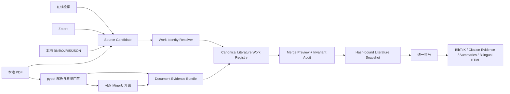

# Draftpaper-loop 多源文献合并、评分保全与本地 PDF 解析绑定优化方案

> 日期：2026-08-18
>
> 适用范围：Draftpaper-loop Core 的参考文献检索、Zotero、本地结构化文献、本地 PDF、全文解析、文献摘要、引用权重，以及面向国内外用户的中英文双语 HTML 索引
>
> 案例来源：`ep-wxt-agn-xrb-source-population-genera_a6fbde7c` 与 `EuclidxDESI` 两个项目，以及会话 `019f3d18-6db8-7320-99bc-6d898d19ccd3`
>
> 方案性质：框架级优化方案，不是该论文项目的临时修复脚本
>
> 当前基线：Draftpaper-loop v0.39.0

> 真实样本验证入口：`C:\Draftpaper_commercial\projects\EuclidxDESI\references\literature_summaries\index.html`。该文件只作为只读结构回归输入，所有 migration/apply 和 HTML 重建必须在隔离临时副本中执行。

## 当前执行记录（2026-08-18）

本方案的第一轮 Core 实现已经按 M0-M3 的依赖顺序接入工作树：

- `normalize_reference_item()` 已改为无损保留扩展字段，并为记录补齐 canonical `work_id`、评分状态/来源和 parser/binding 扩展字段；
- 默认写出路线已改为 augment-first，新增来源不会静默删除已有文献、评分或摘要；新增 `literature_work_registry.json`、snapshot、merge preview/receipt 和完整性审计；
- 本地 PDF reconciliation 会进入 pypdf/可选 MinerU 路由，解析 receipt、evidence passages、`work_id` 绑定和 registry 同步；
- Core 文献 index/detail HTML 已切换为同一份离线 `中文 | English` renderer；
- `EuclidxDESI` 真实索引已在隔离副本完成回归：当前输入快照为 26 条 active 行，其中 21 条历史策展记录的三类主评分为零且无可复现评分 provenance，5 条外部候选仍有非零评分；Core 页面将前者显示为 `legacy zero ambiguous`。索引行的 parser 状态为 14 `quick_read`、5 `pdf_available_unreadable`、7 `not_parsed`；16 个不匹配 fulltext 被报告为 orphan，重复重建不增加文献行。
- Core HTML renderer 已修正索引表的字段绑定：`GitHub/Zenodo code sources` 列现在读取同一项目的 metadata-only code-source manifest，没有代码来源时明确显示 `none`，不会再把上下文或排序字段错位显示到该列；详情页同步展示相同字段。
- 已补齐历史索引的本地-only `migrate-literature-index` preview/apply/rollback、孤儿全文 quarantine rollback、单文件失败不阻塞整批的 `parse-literature-source-documents`，以及 JSON/HTML/registry 写入失败后的合并事务恢复测试；旧 HTML 表格的无标题序号列也纳入通用解析器，不再造成 parser 状态错位。

本轮验证结果：真实 `EuclidxDESI` 回归测试 `tests/test_real_euclidxdesi_literature_regression.py` 已通过 `6 passed`（包含该真实样本和相关迁移/HTML 回归）；全量 pytest 已通过 `1217 passed, 2 skipped, 40 warnings, 26 subtests passed`。Ruff、`compileall`、风险矩阵生成和 `draftpaper_cli-0.39.0-py3-none-any.whl` 构建均通过，wheel 已在独立 venv 中完成导入与 252 条命令注册检查。真实项目目录仅作为只读输入，测试中的 apply、quarantine、rollback 和重建均在临时副本完成。

这些结果是框架回归证据，不代表 `EuclidxDESI` 的科学结论已经被重新计算。当前已补齐本地-only migration preview/apply/rollback、孤儿 quarantine rollback、批量 PDF 缓存和事务故障回滚测试；评分统一重算仍须使用显式评分合同、preview/hash/授权路径，并在发布门禁中与匿名跨学科 fixture 一起验证。

### 最终快照一致性实现与发布验证（2026-08-18）

在第一轮测试发现“解析绑定后只刷新 HTML、没有统一刷新全部派生产物”的缺口后，已完成框架级修复：

- `draftpaper_cli.references._write_reference_projection_bundle()` 现在是 JSON、BibTeX、citation evidence、摘要和双语 HTML 的共同输出路径；每条 `literature_items.json` 记录、BibTeX 注释、Markdown/HTML 摘要、索引页、详情页和 registry 均写入同一个 `snapshot_hash`；citation CSV 保持原列顺序，并由 `citation_evidence_snapshot.json` 绑定其文件 hash；
- 新增 `references/literature_output_manifest.json`，记录派生产物相对路径、SHA-256、HTML 详情页集合和来源注册表 hash；`audit_literature_integrity()` 会检测缺失、改写、快照不一致和 manifest hash 漂移，并返回 `review_required`；
- `bind_document_parse()`、MinerU/pypdf 刷新路径、`rebuild_literature_index()` 和历史 migration 统一调用完整 projection refresh，不再只重建页面；文献笔记对未评估分数显示状态，不再把缺失值写成 `0`；
- 新增 `literature_output_manifest_v1.json` 与 `citation_evidence_snapshot_v1.json` schema，并登记到 schema registry；Ruff 配置明确排除不属于发布源码的 `.tmp` 和 `archived_derived_packages`，因此 `ruff check .` 不再被历史归档代码污染；
- 新增 `tests/test_literature_snapshot_output_binding.py`，覆盖统一绑定、派生文件漂移审计、解析绑定后完整重建和重复 rebuild 稳定性；新增 `tests/test_real_epwxt_literature_regression.py`，在隔离副本核验 EP/WXT 的 22/22 work ID、10/10 parse binding 和评分保全。

最终验证记录：`.uv-venv` 中全量 pytest 为 `1221 passed, 2 skipped, 40 warnings, 26 subtests passed`；`ruff check .` 和 `compileall` 通过；`schema_registry_report` 与 packaged resource schema 检查通过；最终 wheel 为 `C:\Draftpaper_commercial\dist\draftpaper_cli-0.39.0-py3-none-any.whl`，大小 `2,681,542` bytes，SHA-256 为 `sha256:1a91d2942f366abe16c76d0e0839884923edaff134233c09d7dfdf02c0ff53e3`，已在独立 Python 3.11 环境安装，确认版本 `0.39.0`、新增 schema 可读取、CLI 注册命令数 `252`。40 条 warning 均为 Pillow `Image.getdata` 弃用提示，不影响测试通过。

## 一、核心结论

当前问题不只是 `index.html` 少显示了三列，而是参考文献管线存在五个相互叠加的框架缺陷：

1. **多源导入采用整份重写，缺少增量合并事务。** `search_literature_for_project()` 只组合本次调用取得的来源，随后由 `write_reference_outputs()` 重写 `literature_items.json`、BibTeX、摘要和 HTML。只增加本地 PDF 时，既有在线文献并没有被稳定地作为当前快照基线参与合并。
2. **标准化函数是有损变换。** `normalize_reference_item()` 没有保留顶层 `work_id`、`citation_weight`、`relevance_score`、`journal_score`、评分依据和部分派生状态。被判定为用户策展或本地导入的记录随后只执行 `setdefault(..., 0)`，因此旧评分可能被归零或消失。
3. **本地 PDF 注册、全文解析和文献绑定没有形成一个闭环。** 本地文件夹导入主要执行快速元数据和 pypdf 摘录；完整的 `parse_literature_document()` 是另一条命令。即使解析收据成功绑定，后续再次标准化或重建文献快照仍可能丢掉顶层 `work_id`。
4. **HTML 把“缺失或未评估”伪装成数值 0。** 当前渲染使用 `item.get(..., 0)`，用户无法判断 0 是真实评分、尚未查询、尚未计算，还是上游字段已经丢失。
5. **HTML 没有 Core 级双语合同。** 项目内中文重建页面或单个项目定制模板不能覆盖海外用户，也无法保证不同学科、不同来源和不同项目生成一致的中文/英文切换体验。

因此，正确修复方向是建立以下完整闭环：

```text
多源文献输入
  -> 稳定 work identity
  -> 字段级、来源可追溯的增量合并
  -> 本地 PDF 解析与证据绑定
  -> 同一评分合同下的统一评分
  -> 完整性门禁
  -> 从同一快照生成 BibTeX、摘要和中英文双语 HTML
```

不能只给 HTML 补默认值，也不能继续依赖项目内手写的重建脚本。

## 二、案例审计结果

### 2.1 当前项目的可核验状态

| 检查项 | 当前结果 | 说明 |
|---|---:|---|
| `literature_items.json` 文献数 | 22 | 12 篇既有基线文献，10 篇本地 PDF 文献 |
| 当前含三类评分的文献 | 22/22 | 由项目内 `rebuild_literature_summaries_20260818.py` 临时恢复，不代表 Core 已修复 |
| 本地 PDF 解析收据 | 10 | 均记录为 pypdf 解析 |
| 解析收据内部含 `work_id` | 10/10 | 说明解析阶段能够解析文献身份 |
| 文献记录顶层含 `work_id` | 0/22 | 说明绑定结果未能跨后续重建稳定保留 |
| 项目内保护基线 | 12 | 重建报告显式记录 `protected_baseline_count=12` |
| 本地全文文献 | 10 | 重建报告显式记录 `full_text_count=10` |

当前项目已经通过项目专用脚本把评分和摘要恢复出来，但仍存在“解析收据有 `work_id`，canonical 文献记录没有 `work_id`”的不一致。下一次调用 Core 的标准化、搜索或 HTML 重建路径，问题仍可能复发。

### 2.2 框架代码中的直接原因

| 模块 | 当前行为 | 风险 |
|---|---|---|
| `draftpaper_cli/references.py::normalize_reference_item` | 只挑选固定字段生成新字典 | 未列出的 `work_id`、评分和评分证据被丢弃 |
| `select_references_by_context` | 对用户策展记录使用 `setdefault(score, 0)` | 被标准化删除的评分被静默改为 0 |
| `search_literature_for_project` | 不默认加载当前 `literature_items.json` 作为基线 | 单独导入本地来源时可能替换既有检索结果 |
| `write_reference_outputs` | 重写全部文献产物 | 缺少 preview、差异报告、原子提交和回滚 |
| `collect_local_folder_source` | 快速读取本地 PDF 元数据和摘录 | 不等于完整全文解析、证据 passage 生成与绑定 |
| `bind_document_parse` | 成功时回写顶层 `work_id` | 后续标准化会再次删除该字段 |
| `write_literature_html_summaries` | 缺失评分显示为 0，并先删除旧 HTML | 数据缺失被掩盖；渲染失败时可能留下不完整页面 |

### 2.3 当前测试的盲区

现有测试验证了：

- 在线、Zotero、结构化文件和本地来源可以在同一次调用中出现；
- 本地 PDF 可以复制到项目目录；
- pypdf/MinerU 解析可以生成收据并绑定一次；
- HTML 可以显示来源和 parser route。

但尚未覆盖最关键的跨轮次场景：

- 先完成在线检索并生成评分，再单独添加本地 PDF；
- 同一篇文献先在线检索、后上传 PDF，是否仍为同一个 `work_id`；
- 解析绑定后再次运行标准化，`work_id` 和 parse receipt 是否仍存在；
- provider 离线时，本地导入是否会删除既有在线文献；
- 缺失评分是否显示为“未评估”，而不是 0；
- 合并失败时，旧快照、BibTeX 和 HTML 是否保持一致。

### 2.4 `EuclidxDESI` 第二案例审计

`C:\Draftpaper_commercial\projects\EuclidxDESI\references\literature_summaries\index.html` 复现了同一框架缺陷，并补充暴露了孤儿全文产物问题：

| 检查项 | 当前结果 | 风险解释 |
|---|---:|---|
| active 文献数 | 26 | 当前索引实际展示的全部文献集合；其中 21 条为历史策展记录，5 条为外部候选 |
| Citation weight 为 0 | 21/26 | 21 条历史记录没有可复现评分 provenance，不能直接解释为科学零分 |
| Relevance 为 0 | 21/26 | 21 条历史记录的评分上下文不可复原，需标记 ambiguous 或显式重算 |
| Journal authority 为 0 | 21/26 | 21 条历史记录的期刊评分合同不可复原，不能把 0 当作权威性结论 |
| 顶层 `work_id` 缺失 | 0/26（当前 JSON 快照） | 迁移仍需验证 index、详情页、parse receipt 和 registry 的身份一致性 |
| 正式 `document_parses` | 0/26 | 当前没有 active 文献进入 parser-neutral 正式解析收据 |
| `quick_read` | 14 | 只能说明存在快速摘录，不等于全文证据已绑定 |
| `pdf_available_unreadable` | 5 | 需要进入可重试 parser 路线，而不是长期停留在模糊状态 |
| 无阅读状态 | 2 | 状态合同不完整 |
| `references/fulltext` 文件 | 10 | 文件存在不代表属于 active 文献 |
| 与 active DOI 匹配的 fulltext | 0/16 | 16 个文件均为生态学主题 metadata，与当前 Euclid/DESI 文献集合不匹配 |

#### 2.4.1 真实索引文件作为结构回归样本

本项目的现有索引文件必须作为真实结构回归输入保留并纳入验证：

`C:\Draftpaper_commercial\projects\EuclidxDESI\references\literature_summaries\index.html`

它不是本轮直接修改的目标，也不能被当作已经修复的结果；它是用于验证 Core renderer、迁移器和完整性审计的只读样本。测试 harness 应在临时目录中复制该索引及其相对详情页，记录原始文件 SHA-256、采集时间和项目相对路径，然后对临时副本执行 preview/apply 验证。不得直接改写该真实项目的 `project.json`、stage manifest、ledger 或人工确认状态。

该样本至少要验证以下事实：

1. 从 `index.html` 能恢复 26 个 active 文献行及其来源、parser、阅读状态、评分列和详情页链接；
2. 旧页面中的三类 `0` 被迁移器识别为 `legacy_zero_ambiguous`，而不是直接解释为真实评分；
3. 26 个 canonical work 均能获得稳定 `work_id`，且详情页与索引页使用同一 snapshot；
4. `quick_read`、`pdf_available_unreadable` 和空阅读状态被转换为明确的 parser/binding 状态，不能被误报为全文证据已完成；
5. `references/fulltext` 中 16 个与当前 active DOI 不匹配的文件被列入 orphan preview，并在 apply 后进入 quarantine；
6. 中文和英文 HTML 的文献集合、评分状态、阅读状态、orphan 数量、snapshot hash 和完整性结论逐项一致；
7. 重复执行 migration、rebuild 和 render 具有幂等性，不能新增重复文献行，也不能重新把孤儿全文放回 active context。

回归输出至少包括原始样本清单、DOM/字段抽取报告、migration preview、完整性报告、orphan quarantine receipt、双语 hash/数值 parity 报告和最终渲染页面。这样既能复现用户看到的 `index.html` 问题，也能证明修复属于 Draftpaper-loop Core，而不是对某个页面的手工补丁。

这说明 Core 除了保护评分和 work identity，还必须验证全文产物的可达性：

```text
active snapshot
  -> canonical work_id
  -> document evidence bundle
  -> normalized document / passages / summary
```

任何无法从 active snapshot 沿上述链路到达的 `fulltext`、parse cache 或 summary 都是 orphan artifact。它们可以保留在 quarantine/archive 中用于审计，但不得进入当前文献摘要、Agent context、引用核查或“已完成全文阅读”统计。

## 三、优化目标与非目标

### 3.1 必须实现的目标

1. 在线检索、Zotero、本地结构化文件和本地 PDF 可以在不同时间加入项目，任何新增来源都不得静默删除已有文献或已有有效评分。
2. 同一篇文献的多个来源必须绑定到同一个稳定 `work_id`，来源作为 provenance 追加，不应生成相互独立的重复文献行。
3. 本地 PDF 必须进入可观察的解析状态机，并在解析成功后绑定到 canonical 文献记录。
4. `Citation weight`、`Relevance` 和 `Journal authority` 必须具有值、状态、计算合同和来源，缺失不能再用 0 代替。
5. 文献 JSON、BibTeX、摘要页、索引 HTML、citation evidence 和 code-source linkage 必须来自同一个 hash 绑定快照。
6. 所有合并必须先生成 preview 和完整性报告，再原子应用；失败时不得留下半套文献产物。
7. 历史项目能够在不重新联网、不重新下载 PDF 的情况下迁移和修复身份绑定。
8. 所有后续 Draftpaper-loop 项目都使用同一套 Core 双语 HTML renderer，中文和英文视图共享完全相同的文献集合、数值、hash 和确认状态。

### 3.2 本方案不做的事情

- 不把 MinerU 设为核心 wheel 的强制依赖；pypdf 仍是默认解析器，MinerU 只在质量触发或用户明确选择时使用。
- 不因为本地 PDF 被上传就自动把该文献加入正文引用；是否引用仍由研究蓝图、章节用途和引用核查决定。
- 不把外部引用次数、期刊分区或项目内综合分数当作科学真实性证明。
- 不在导入本地 PDF 时自动重新执行所有在线检索。
- 不把项目专用人工评分直接伪装成 Core 算法评分；迁移后应标记为 `legacy_preserved` 或 `human_reviewed`。
- 不在 Core HTML 中写入 EP/WXT、天文学或任何单一学科的固定文案；学科插件只能通过受控的 i18n 扩展合同增加字段和翻译。

### 3.3 MinerU 与 pypdf + Agent 的职责边界

MinerU、pypdf 和 Agent 解决的是三个不同层面的问题：

| 能力层 | pypdf | MinerU | Agent |
|---|---|---|---|
| PDF 文字层读取 | 擅长，速度快，直接读取已有字符 | 支持，并可结合版面/VLM/OCR 路线 | 不负责底层 PDF 解码 |
| 双栏和复杂阅读顺序 | 能提取字符，但顺序可能混乱 | 基于布局块恢复更接近人类阅读顺序 | 可以判断文本是否语义混乱，但不能可靠恢复已经错序或遗漏的原始块 |
| 扫描件和图片文字 | 不提供 OCR，无法读取纯图片文字 | 可检测扫描/乱码 PDF 并使用 OCR | 只有拿到图片或 OCR 结果后才能理解 |
| 表格 | 常得到绝对定位的碎片文本 | 可输出表格结构和 HTML，并保留表格、标题和脚注关系 | 可解释表格含义，但不应凭碎片文本猜测行列 |
| 公式 | 通常只能得到不稳定字符序列 | 可识别公式并输出 LaTeX | 可解释公式含义，但前提是公式被正确恢复 |
| 图片、图注和版面定位 | 可提取部分图片对象，但不提供统一科学文档结构 | 可输出图片/图表块、caption、page index 和 bbox | 可分析图注和图像内容，但需要结构化输入或原页图像 |
| 科学理解与证据判断 | 不负责 | 不负责 | 负责问题、数据、方法、结果、局限和论文用途的理解与核查 |

MinerU 相对“pypdf 抽取文本后直接交给 Agent”的主要收益是：

1. 减少双栏错序、页眉页脚混入正文和段落断裂；
2. 让表格、公式、图像、图注和脚注成为可区分的结构化对象；
3. 为扫描件或图片型论文补充 OCR；
4. 提供页码、bbox、block type 和可视化调试结果，便于建立更可靠的 evidence locator；
5. 让 Agent 接收经过筛选的结构化 passage，而不是一整份顺序混乱的纯文本，通常能提高理解稳定性，并可能降低无效上下文 token。

MinerU 的限制同样必须写入产品边界：

- OCR、公式、表格和 VLM 输出仍可能识别错误，不能把解析结果视为原文真值；
- 本地部署更重，解析延迟和 GPU/CPU 成本高于 pypdf；远程接口还涉及额度、隐私和服务可用性；
- 对文字层干净的普通论文，pypdf 往往更快、更确定，也不会引入 OCR 字符误识别；
- MinerU 只改善“文档恢复”，不能替代 Agent 的科学归纳、引用适用性判断和原文证据核查。

因此 Core 应采用三级路由，而不是固定只用一个 parser：

```text
P0：pypdf 原生文字抽取
  -> 版面/字符/表格/公式/扫描质量检查
  -> 质量通过：生成 passage，交给 Agent 理解
  -> 质量不足：进入 MinerU

P1：MinerU pipeline/hybrid/VLM 路线
  -> 结构化 blocks、表格、公式、图片、OCR、页码与 bbox
  -> 与 pypdf 结果和原页抽样核对
  -> 生成 passage，交给 Agent 理解

P2：Agent 科学理解
  -> 研究问题、数据、方法、结果、局限、可引用论断和项目用途
```

解析路由依据应记录为 `parser_decision_receipt`，包括触发原因、输入 hash、parser/version、质量前后对比和是否需要人工抽查。该设计依据来自 [MinerU 官方功能说明](https://opendatalab.github.io/MinerU/)、[MinerU 结构化输出格式](https://opendatalab.github.io/MinerU/reference/output_files/) 和 [pypdf 官方文本抽取限制](https://pypdf.readthedocs.io/en/stable/user/extract-text.html)，并应在实现时通过 Draftpaper-loop 自有跨学科 fixture 验证，而不是直接把官方能力声明当作本项目质量结论。

## 四、目标架构



### 4.1 单一权威数据源

新增 `references/literature_work_registry.json` 作为 canonical 文献注册表，以 `work_id` 为主键。现有 `literature_items.json` 在兼容期内保留，但降级为由 registry 投影生成的兼容视图，禁止其他模块直接写入。

建议产物结构：

```text
references/
├── literature_work_registry.json          # canonical，唯一可写文献注册表
├── literature_snapshot.json               # 当前选择、评分和输出 hash
├── literature_items.json                  # 兼容视图，只由 projector 生成
├── literature_source_registry.json        # 来源注册表
├── literature_merge_preview.json          # 待应用合并包
├── literature_merge_receipt.json          # 已应用事务收据
├── literature_integrity_report.json       # 完整性审计
├── literature_score_contract.json         # 评分合同和上下文 hash
├── unresolved_work_identities.json        # 身份冲突或低置信候选
├── unresolved_document_bindings.json      # 未能绑定的解析结果
├── orphan_literature_artifacts.json        # 不可从 active snapshot 到达的历史/跨项目产物
├── document_parses/<document_id>/...      # normalized document 与 passages
├── quarantine/orphan_fulltext/...          # 经 preview/apply 隔离的孤儿全文产物
└── literature_summaries/                   # 从 snapshot 派生，不是数据源
```

`literature_items.json` 必须记录其 `source_registry_hash` 和 `snapshot_hash`。如果与 canonical registry 不一致，所有下游写作和引用命令应停止，而不是继续使用过期视图。

## 五、核心数据合同

### 5.1 `LiteratureWorkRecord v3`

每篇文献至少包含：

```json
{
  "schema_version": "dpl.literature_work_record.v3",
  "work_id": "doi:10.xxxx/example",
  "identity": {
    "status": "verified",
    "confidence": 1.0,
    "primary_identifier": "doi:10.xxxx/example",
    "aliases": ["arxiv:2401.00001"]
  },
  "metadata": {},
  "field_provenance": {},
  "source_records": [],
  "document_evidence": [],
  "score_bundle": {},
  "selection": {},
  "user_locks": {},
  "code_source_ids": []
}
```

### 5.2 `LiteratureScoreBundle v2`

三类分数不得再只是无上下文的浮点数：

```json
{
  "schema_version": "dpl.literature_score_bundle.v2",
  "policy_id": "dpl.reference_ranking.v2",
  "context_hash": "sha256:...",
  "citation_weight": {"value": 0.72, "status": "computed"},
  "relevance": {"value": 0.88, "status": "computed"},
  "journal_authority": {"value": 0.90, "status": "computed"},
  "citation_authority": {"value": null, "status": "not_queried"},
  "computed_at": "...",
  "input_hashes": {}
}
```

允许的状态至少包括：

- `computed`：由当前评分合同计算；
- `preserved`：上下文未变化，沿用上一个有效快照；
- `human_reviewed`：由用户或审查者明确确认；
- `legacy_preserved`：从旧项目迁移，算法和上下文不完全可复原；
- `stale`：研究问题、查询合同或元数据已经变化；
- `not_evaluated`：尚未计算；
- `not_queried`：外部引用量等数据未请求；
- `unavailable`：上游服务或元数据不可用。

`null + status` 与真实数值 0 必须严格区分。

### 5.3 `DocumentEvidenceBundle v2`

每份 PDF 解析结果必须包含：

- `document_id` 和输入 SHA-256；
- `work_id`；
- identity status、confidence 和 reason；
- parser、route、version 和 quality report；
- normalized document 路径和 hash；
- evidence passages 路径、数量和 hash；
- parse status、binding status 和 summary status；
- 本地/远程处理、隐私授权和费用 receipt；
- supersedes/retry 关系。

解析成功但没有绑定到 canonical `work_id` 的记录只能进入 `unresolved_document_bindings.json`，不能显示为“全文已完成”。

## 六、字段级合并规则

| 字段类型 | 合并规则 |
|---|---|
| `work_id` | 优先 DOI、PMID/PMCID、arXiv、bibcode、OpenAlex；无标识符时使用标题、第一作者、年份的保守候选，不允许低置信自动合并 |
| 标题、作者、年份、期刊 | 用户确认修正优先；其次为权威 provider；再其次为本地 sidecar；PDF 文本猜测不得覆盖更高等级字段 |
| `source_records` | 按 source ID、provider、locator 去重后追加，绝不覆盖 |
| 本地附件 | 按文件 SHA-256 去重；同一 work 可关联多个版本或副本 |
| `document_evidence` | 按 document ID 和 parse fingerprint 合并；新解析不能删除旧收据 |
| evidence passages | 按 passage ID 合并；parser 或上下文变化时生成新版本并保留 supersedes 关系 |
| 三类评分 | incoming 缺失值不得覆盖已有有效值；上下文 hash 相同则保留，变化则标记 stale 并对完整快照统一重算 |
| `deep_summary` | 有全文证据的摘要优先于题录摘要；替换必须绑定新的 evidence hash |
| 用户保留和引用用途 | 单调保留；删除或取消引用必须是显式操作 |
| GitHub/Zenodo 线索 | 绑定同一 `work_id` 后追加，不得因 PDF 导入丢失 |
| 文献删除 | 默认禁止；只允许带 preview、原因和 hash 的显式 remove transaction |

### 6.1 同一文献的在线记录与本地 PDF

如果本地 PDF 的 DOI/arXiv ID 与现有在线记录一致：

1. 保留在线题录的 title、authors、venue、citation metadata 和原评分；
2. 把本地文件作为新的 source record 与 document evidence 附加到同一 `work_id`；
3. 用全文证据升级摘要、role evidence 和 evidence readiness；
4. 只有评分上下文或可用于评分的权威元数据发生变化时才重算评分；
5. HTML 只显示一篇文献，并同时标记 `online_search` 和 `local_pdf`。

### 6.2 只有本地 PDF、没有在线记录

系统应先提取 DOI/arXiv/标题作者信息并建立新 work。身份足够可靠后：

- 使用与在线文献相同的 relevance 和 journal authority 规则；
- 外部 citation count 未查询时记录 `not_queried`，不能写成真实 0；
- 生成全文 evidence passages 和结构化摘要；
- 若身份或期刊信息不足，则保留文献并标记 `identity_review_required` 或 `metadata_incomplete`，不自动进入正文引用。

## 七、增量合并事务

### 7.1 默认模式

所有来源同步默认使用 `augment`，不再默认执行 replace：

```text
当前 canonical snapshot
  + 本次在线候选
  + 本次 Zotero 候选
  + 本次本地结构化记录
  + 本次本地 PDF
  = merge candidate snapshot
```

只有用户明确请求“重建全部文献库”时才能使用 `replace`，并且必须经过人工确认。Agent delegation 不得自动批准删除既有 work 的 replace 操作。

### 7.2 事务步骤

1. 读取并验证当前 snapshot、registry 和 source registry hash；
2. 收集本次新增或变化的 source records；
3. 为每条候选生成或解析 `work_id`；
4. 运行字段级三方合并：旧 canonical、当前 source、incoming candidate；
5. 对本地 PDF 执行解析和绑定状态机；
6. 生成完整快照的 score plan；
7. 计算 added、enriched、unchanged、stale、conflict、removed 六类差异；
8. 运行 no-loss invariant audit；
9. 生成 `literature_merge_preview.json` 和中文 HTML 摘要；
10. C1 无冲突增量合并可由有效 Agent delegation 审查；身份冲突、删除和 replace 仍由人工处理；
11. 使用 packet hash 原子写入 registry、snapshot 和派生产物；
12. 记录 receipt、旧 snapshot hash、写集和回滚材料。

### 7.3 发布阻断不变量

以下任一条件出现时必须拒绝 apply：

- 未经显式删除，旧 snapshot 的 `work_id` 数量减少；
- 有效评分从数值变为 missing、null 或 0，且没有合法 stale/recompute receipt；
- 已绑定的 document parse 在新 snapshot 中变为未绑定；
- 同一 DOI 被拆成多个 canonical work；
- 一个 document ID 同时绑定多个互斥 work；
- `literature_items.json`、BibTeX、HTML 和 citation evidence 的 snapshot hash 不一致；
- provider 失败导致既有 provider 文献被删除；
- `fulltext`、parse cache、summary 或 code lead 无法绑定 active `work_id`，却被计入当前阅读或证据统计；
- HTML 生成失败但 canonical snapshot 已被替换；
- incoming 数据试图覆盖用户锁定的题录字段。

## 八、本地 PDF 自动解析与绑定流程

### 8.1 状态机

```text
registered
  -> metadata_extracted
  -> identity_resolved | identity_review_required
  -> parsed_pypdf
  -> quality_passed | mineru_upgrade_recommended
  -> parsed_mineru（可选）
  -> evidence_passages_ready
  -> bound_to_work
  -> summarized
  -> score_ready
```

每个状态都必须有 receipt。`registered` 或 `quick_read` 不能在 HTML 中显示为 `full_read`。

### 8.2 默认解析策略

1. 本地 PDF 导入后先使用 pypdf 完成全文页级解析；
2. 运行双栏、空页率、字符密度、乱码、表格/图注结构等质量检查；
3. 只有质量不达标或用户明确要求时才调用 MinerU；
4. 自建 MinerU 仍只提供 endpoint 接口，不随 Draftpaper-loop 部署；
5. 解析结果按文件 hash 缓存，重复同步不得重复解析；
6. 大型本地库采用可恢复批处理，逐篇记录状态，不允许一篇失败使整批既有文献消失；
7. 原始全文不直接全部送入 LLM，只发送受预算约束的 evidence passages。

### 8.3 绑定要求

- 解析前可使用 DOI/arXiv/PMID 等明确标识符绑定；
- 标题模糊匹配只能产生 candidate，低置信时进入集中人工确认包；
- 成功绑定后必须同时更新 canonical work 和 document evidence index；
- 后续任何 normalization、merge、render 和 bibliography build 都必须保留该绑定；
- 对 identity 未决的 PDF 可以完成解析缓存，但不能自动生成正文引用。

### 8.4 全文产物可达性与隔离

`audit-literature-integrity` 必须从 active snapshot 出发遍历全部 document/fulltext 产物。每个产物只能处于以下状态之一：

- `active_bound`：绑定当前 active work，可进入摘要与 Agent context；
- `historical_bound`：绑定历史 snapshot，只用于审计；
- `unresolved`：正在等待身份确认；
- `orphan_quarantined`：无法匹配任何当前或历史 work，禁止消费；
- `foreign_project_suspected`：主题、DOI 和 provenance 均与当前项目不符，需要隔离调查。

隔离操作必须先 preview，不能直接删除原文件。`EuclidxDESI` 中当前 16 个无法匹配 active DOI 的生态学 metadata 文件应成为该规则的回归样本：优化后它们不能出现在 Euclid/DESI 文献数量、全文阅读数量、摘要或引用证据中。

## 九、统一评分机制

### 9.1 评分保全原则

1. normalization 必须是 schema-aware round trip，未知但合法的扩展字段不能被丢弃；
2. incoming 记录没有评分时，保留旧评分，不得 `setdefault(..., 0)`；
3. 研究 idea、query contract、目标期刊、评分策略或关键元数据变化时，将旧评分标记为 stale；
4. 一旦需要重算，应对同一 snapshot 中所有参与排序的文献使用同一个评分合同，不能只重算新加入的本地文献；
5. 本地全文可以提升 evidence readiness 和 role evidence，但不能因为文本更长就天然获得更高 relevance；relevance 应使用一致的题录/摘要特征合同；
6. 人工评分必须保留 reviewer、时间、理由和适用范围。

### 9.2 兼容策略

v0.39.1 不立即改变现有 Citation weight 公式，只先完成字段保全、状态化和 no-loss gate。新的评分公式必须通过跨学科冻结 fixture 校准后再作为 `dpl.reference_ranking.v2` 启用。

对于旧项目：

- 能恢复计算上下文的评分标记为 `preserved`；
- 只能确认数值、不能恢复公式的评分标记为 `legacy_preserved`；
- 外部 citation count 未查询时使用 `null/not_queried`，而不是 `0/computed`；
- HTML 应明确提示“未查询不等于质量为零”。

## 十、中英文双语 HTML 索引 v2（全项目通用）

新的 `literature_summaries/index.html` 不是当前 EP/WXT 项目的专用页面，而是 Draftpaper-loop Core 的通用参考文献审查界面。所有学科、项目类型和来源组合都必须通过同一个 renderer 生成，项目代码不得复制模板后自行维护另一套 HTML。

### 10.1 通用性边界

Core template 只使用跨学科概念：文献身份、来源、解析、绑定、评分、证据、用途、冲突和完整性。天文学、医学、社会科学、工程等学科特有内容由结构化 plugin fields 提供；字段必须同时声明 `label_zh_CN`、`label_en` 和 fallback，不能把学科文案硬编码进模板。

当前两个项目只作为匿名结构 fixture 验证以下通用场景：

- 已有在线/策展文献后再加入本地 PDF；
- 同 work 多来源增强；
- 解析成功但身份绑定可能在重建中丢失；
- 评分缺失不能伪装成 0；
- 全部评分被归零但题录仍存在；
- 与 active works 无关的 fulltext 孤儿产物不能进入当前证据链。

正式测试不得依赖 EP/WXT、Euclid/DESI 名称、天文术语、固定数量或项目人工摘要文本。真实项目只负责复现和验收，Core 测试使用去标识化的 source/score/binding/orphan 结构。

### 10.2 语言切换交互

沿用 Draftpaper-loop 既有支持页面的交互习惯，在页首固定位置提供清晰的 `中文 | English` 分段切换。实现要求：

1. 单个离线 HTML 同时包含 `zh-CN` 和 `en` 翻译字典，不依赖 CDN、翻译 API 或本地服务器；
2. 首次打开优先使用项目 `ui_locale`，未设置时读取浏览器语言，仍未匹配时回退英文；
3. 用户选择保存在 `localStorage`，也支持 `?lang=zh-CN` 和 `?lang=en` 形成可分享链接；
4. 切换时同步更新 `<html lang>`、页面标题、ARIA 标签、按钮、筛选器、状态、帮助文本和打印标题；
5. 切换语言不得重新读取或改写 canonical JSON，不得改变 work 排序、评分、确认状态或 snapshot hash；
6. JavaScript 被禁用时仍显示完整的默认语言页面，并提供可访问的语言回退说明；
7. `index.html` 与每篇文献详情页使用相同语言状态和同一套 i18n catalog。

### 10.3 双语内容合同

界面固定文案由 Core locale catalog 管理；文献科学摘要采用 evidence-bound localized content：

```json
{
  "localized_summary": {
    "zh-CN": {
      "text": "...",
      "status": "generated_and_verified",
      "evidence_hash": "sha256:..."
    },
    "en": {
      "text": "...",
      "status": "generated_and_verified",
      "evidence_hash": "sha256:..."
    }
  }
}
```

两种语言必须绑定相同 evidence passage 集合。翻译版本不是新的科学证据，不得拥有不同数字、页码或论断边界。若某种语言尚未生成，页面应显示原文和 `Translation pending / 翻译待生成`，不能静默调用在线翻译，也不能显示空白卡片。

以下值不翻译，只本地化显示格式：

- DOI、arXiv ID、BibTeX key、`work_id` 和 hash；
- 数值评分及 policy ID；
- 文件名、parser route 和代码来源 URL；
- 原始论文标题，除非 metadata 明确提供官方译名。

### 10.4 首屏阶段摘要

首屏使用同源的中英文段落分别说明本轮：

- 保留了多少既有文献；
- 新增了多少本地 PDF；
- 多少篇完成解析、绑定和摘要；
- 多少篇发生字段增强；
- 是否存在身份冲突、评分 stale 或未解析文件；
- 本轮删除数量及其授权状态；
- 当前 snapshot hash 和 integrity status。
- orphan、unresolved 和 suspected foreign artifact 数量及隔离状态。

中文和英文摘要必须由同一个结构化统计对象渲染，禁止分别手写后产生数字不一致。

### 10.5 每篇文献的核心字段

- 原始 title、citation key 和 canonical `work_id`；
- 来源徽标：Online、Zotero、Local PDF、Local structured、Project curated，可多选并双语显示；
- merge state：added、enriched、unchanged、conflict、removed；
- parser、route、quality 与 binding 状态；
- Citation weight、Relevance、Journal authority 的值、状态和 policy ID；
- citation authority 是否 queried；
- 摘要依据：bibliography、abstract、full-text passages；
- 研究问题、数据、方法、结果、局限、本文用途和证据边界的双语视图；
- GitHub/Zenodo code source 数量；
- 详细 provenance、parse receipt 和 evidence passage 的项目相对链接。

### 10.6 双语状态语义

| 数据状态 | 中文显示 | English display |
|---|---|---|
| 真实评分为 0 | `0.000（已计算）` | `0.000 (computed)` |
| 尚未评分 | `未评估` | `Not evaluated` |
| 外部引用次数未查询 | `未查询` | `Not queried` |
| 评分上下文已变化 | `已过期，等待重算` | `Stale, recomputation required` |
| parser 完成但未绑定 | `解析完成，身份待确认` | `Parsed, identity review required` |
| 绑定和摘要均完成 | `全文证据已绑定` | `Full-text evidence bound` |
| 解析失败 | `解析失败，可重试` | `Parse failed, retry available` |
| 完整性门禁失败 | `不可确认` | `Confirmation blocked` |

索引顶部必须在完整性审计失败时显示双语阻断提示，不能继续提供文献确认 hash。

### 10.7 搜索、筛选与可访问性

- 搜索同时索引原始标题、作者、DOI、中文摘要和英文摘要；
- 来源、parser、binding、score status、merge state 和学科字段均可组合筛选；
- 表格在窄屏切换为分组行，不截断最长 DOI、work ID 或状态词；
- 键盘可完成语言切换、筛选、展开详情和返回索引；
- 颜色不是唯一状态信号，所有徽标同时包含文字；
- 使用系统字体栈覆盖中文、拉丁字符和科学符号，核心 wheel 不引入在线字体；
- 日期和数字通过 `Intl` 本地化，但原始机器值保持一致；
- 当前语言的打印和导出版本必须包含 snapshot hash、生成时间和 integrity status。

### 10.8 i18n 实现合同

建议复用 `docs/support/index.html` 已采用的 `data-i18n`、浏览器语言检测和 `localStorage` 思路，但将其升级为 Core 资源：

```text
draftpaper_cli/resources/html/literature/
├── index.template.html
├── detail.template.html
├── literature.css
├── literature.js
└── locales/
    ├── zh-CN.json
    └── en.json
```

所有 i18n key 必须由测试检查双语齐全。插件扩展使用 namespaced key，例如 `discipline.astronomy.observation_window`，缺少英文或中文时发布合同失败，而不是把 key 原样显示给用户。

### 10.9 原子渲染

HTML 应先生成到候选目录，校验两种语言的 key coverage、页面链接、work 数量、数值一致性、ARIA、snapshot hash 和静态资源完整性后再原子替换。禁止先删除现有 `*.html` 再逐页生成。

## 十一、CLI 与人工确认设计

### 11.1 建议命令

| 命令 | 作用 | 风险级别 |
|---|---|---|
| `audit-literature-integrity` | 只读检查 work ID、评分、来源、parse binding 和派生 hash | read |
| `sync-literature-sources` | 收集新增来源并生成 merge preview，不直接替换 canonical snapshot | write_project |
| `apply-literature-sync --packet-hash` | 应用已审查的增量合并事务 | human_checkpoint/C1 delegated |
| `repair-literature-identities --preview` | 为当前项目生成身份恢复建议 | read/write preview |
| `migrate-literature-index [--apply]` | 从旧 `index.html` 生成本地迁移 preview，并在 hash 校验后应用；保留 rollback archive | preview/apply checkpoint |
| `rollback-literature-migration` | 在当前 snapshot 未漂移时恢复迁移前 references 快照 | human-only write |
| `rebuild-literature-index` | 仅从当前 snapshot 重建派生 HTML，不改变 canonical 数据 | write_project |
| `parse-literature-source-documents` | 批量处理已注册本地 PDF；每篇独立 receipt、失败隔离、重复运行命中 hash cache | write_project |
| `rollback-orphan-literature` | 在逐文件 SHA-256 校验后恢复一次孤儿隔离事务 | human-only write |

现有 `add-literature-source` 继续只负责注册来源，但返回结果必须明确写出下一步 `sync-literature-sources`，不能让用户误以为注册已经等于解析完成。

### 11.2 确认边界

- 纯新增、无冲突、无删除、评分合同未变化的同步属于 C1，可由有效的 hash-bound Agent delegation 审查；
- DOI/标题身份冲突、两个 work 合并、用户锁字段变化、文献删除、replace 和评分政策切换必须由人工确认；
- 文献确认点的中文 HTML 必须列出 preserved、added、enriched、unresolved 和 removed 数量；
- Agent 只能写 `agent_approved`，不能冒充 `user_confirmed`。

## 十二、历史项目迁移

### 12.1 迁移原则

迁移默认只使用本地已有数据，不重新联网、不重复下载、不重新解析已经有有效 receipt 的 PDF。

迁移步骤：

1. 保存当前 `literature_items.json`、BibTeX、summary 和 parse 目录的不可变快照；
2. 从 DOI、arXiv、PMID、bibcode、OpenAlex 和标题作者年份恢复 `work_id`；
3. 如果顶层缺少 `work_id`，尝试从已绑定 parse receipt 恢复；
4. 合并重复来源和附件，但不自动合并低置信 title-only 候选；
5. 把旧评分写入 ScoreBundle，并标注 `preserved` 或 `legacy_preserved`；
6. 生成迁移 preview、冲突清单和 before/after hash；
7. 人工或授权 Agent 审查后原子应用；
8. 重建兼容视图、BibTeX 和 HTML；
9. 运行完整性审计并保留 rollback receipt。

### 12.2 当前案例的迁移验收

针对本案例至少要求：

- 22 篇文献全部具有顶层 canonical `work_id`；
- 12 篇既有基线文献不减少，原有评分不丢失；
- 10 篇本地 PDF 的 parse receipt、normalized document 和 evidence passages 全部绑定；
- 同一 DOI 的在线记录和本地 PDF 不重复成两行；
- 未查询 citation count 的状态显示为 `not_queried`，不解释为低质量；
- 项目内临时 rebuild 脚本保留为历史记录，但不再作为 canonical 生成入口。

### 12.3 `EuclidxDESI` 的迁移验收

- 26 篇 active 文献全部建立顶层 canonical `work_id`，并检查 index/详情页/registry 的身份一致性；
- 原来的 21 条历史策展记录的三类 0 分先被识别为 `legacy_zero_ambiguous`，不能直接当作真实计算结果；5 条外部候选沿用其可追溯评分上下文；
- 使用同一当前评分合同对具备元数据的完整 active snapshot 统一评分，无法评分的项目明确标记 `not_evaluated` 或 `metadata_incomplete`；
- 14 个 `quick_read`、5 个 `pdf_available_unreadable` 和 7 个 `not_parsed` 全部迁移到明确的 parser/binding 状态机；
- 不得把 `quick_read` 计为全文证据已绑定；
- 16 个无法匹配 active DOI 的生态学 fulltext 文件进入 orphan preview，并在应用后隔离；
- 隔离前后保留文件 hash、原路径、发现原因和 rollback receipt；
- 双语 HTML 中 active work 数、评分数值、parser 状态和 orphan 数在中文/英文视图完全一致。

## 十三、测试与质量门禁

### 13.1 必须新增的回归测试

1. **在线后本地增量测试**：先生成在线文献和三类评分，再加入一个不同 DOI 的本地 PDF；旧文献和旧评分逐字段不变。
2. **同 work 增强测试**：在线记录和本地 PDF 使用相同 DOI；最终只有一个 work，来源为 online + local，评分保留，parse 已绑定。
3. **离线保护测试**：provider 返回错误时导入本地 PDF；既有在线文献不能消失。
4. **重复重建测试**：parse bind 后再次 normalize、sync、render；顶层 `work_id`、document receipt 和 evidence passages 仍存在。
5. **缺失非零测试**：评分不存在时 HTML 显示“未评估”，JSON 为 `null/not_evaluated`。
6. **评分上下文测试**：相同 context hash 保留评分；idea/query contract 改变后标记 stale，并统一重算。
7. **冲突测试**：同 DOI 不同标题、同 PDF 候选多个 work、用户锁字段冲突都必须进入 review queue。
8. **解析失败测试**：某个 PDF 解析失败时，其余文献和旧 snapshot 不受影响。
9. **事务回滚测试**：在 JSON、BibTeX、HTML 写入阶段分别注入故障，确保全部回滚。
10. **原子渲染测试**：页面生成失败时旧 HTML 仍完整可用。
11. **兼容消费者测试**：research plan、citation audit、paper narrative、code-source enrichment 读取 derived `literature_items.json` 时行为一致。
12. **案例匿名 fixture**：冻结“12 篇基线 + 10 篇本地 PDF”的结构性 fixture，验证 22 个 work、10 个 binding 和零评分丢失；真实 `EuclidxDESI` 另以输入 manifest 动态记录 active/orphan 数量。
13. **全零评分迁移 fixture**：冻结一组全部评分为 0 且缺少 work ID 的记录，确认 ambiguous zero 不会继续伪装成已计算结果。
14. **孤儿全文 fixture**：active works 与 fulltext DOI 完全不重合，确认全部孤儿产物被报告、隔离且不进入 Agent context。
15. **双语数值一致性测试**：中文/英文视图的 work 数、分数、hash、parser 和 binding 状态逐项相同。
16. **双语 key coverage 测试**：Core 与插件 i18n key 在 `zh-CN` 和 `en` 中均完整，不显示裸 key。
17. **语言切换离线测试**：无网络环境下切换、刷新、深链接、详情页返回和打印均保持当前语言。
18. **跨学科 HTML fixture**：至少覆盖天文、医学、社会科学、工程和计算机科学，不出现项目专用字段泄漏。

### 13.2 属性不变量测试

对随机生成的多源文献集合验证：

- merge 具有幂等性；
- source record 合并满足交换性；
- 增量 augment 不减少 canonical work；
- 缺失 incoming 字段不能覆盖已有非空字段；
- render 不改变 canonical registry；
- parse retry 不重复 document evidence；
- orphan artifact 永远不能成为 active evidence consumer；
- 同一 snapshot hash 始终生成同一 derived output hash。

### 13.3 发布验证

- 全量 pytest；
- Ruff、compileall 和 schema registry；
- source checkout 与隔离 wheel 行为一致；
- Windows、Linux 和 macOS control-plane smoke；
- pypdf-only 安装档位；
- MinerU official-agent mock、custom endpoint mock 和未安装 MinerU 的降级路径；
- 中英文 README、CLI reference、风险矩阵与双语 HTML locale catalog 同步；
- 静态检查中文/英文页面的结构、数值、hash、ARIA 和翻译 key parity；
- 现有跨学科八主题文献 fixture 加入增量本地 PDF 场景。

### 13.4 真实 `EuclidxDESI` 索引验证

发布前必须使用以下真实索引文件进行一次只读结构回归和一次临时副本迁移回归：

`C:\Draftpaper_commercial\projects\EuclidxDESI\references\literature_summaries\index.html`

验证顺序固定为：

1. 对原始 `index.html`、当前 26 个详情页和 `references/fulltext` 建立输入 manifest 与 SHA-256；若项目更新，数量以该 manifest 为准；
2. 解析索引表，检查当前 manifest 记录的 active 文献题录、来源、阅读状态、评分列和详情链接是否可追踪；
3. 在隔离临时副本中运行 `audit-literature-integrity --preview` 和历史项目 migration preview；
4. 检查当前 manifest 对应的 `work_id`、`legacy_zero_ambiguous` 评分状态、14/5/7 阅读状态迁移和 16 个 orphan fulltext 的原因链；
5. 运行 apply 后生成 Core 双语 `index.html` 与详情页，离线切换 `中文 | English`，比较两种语言的集合、数值、状态、hash 和 orphan 统计；
6. 再次运行同一迁移和渲染，确认输出 hash 稳定、文献行数不增加、孤儿不回流、旧输入不被覆盖；
7. 将结果写入测试产物目录，包含 `source_manifest.json`、`migration_preview.json`、`integrity_report.json`、`orphan_quarantine_receipt.json` 和 `bilingual_parity.json`。

这一步是 M3/M4 发布门禁的一部分。若该真实索引仍出现评分消失、顶层身份缺失、解析状态混淆、孤儿全文进入摘要或中英文数值不一致，不能宣称全学科文献质量发布完成。测试只读真实项目，所有 apply 行为必须作用于临时副本或匿名 fixture。

自动化入口为 `tests/test_real_euclidxdesi_literature_regression.py`。默认读取上述 Windows 路径；在其他机器上通过 `DPL_EUCLIDXDESI_PROJECT` 指向等价项目。测试会先复制索引、详情页、`literature_items.json`、`code_sources.json` 和全文 JSON 到隔离项目，再执行迁移、审计、孤儿隔离与回滚、双语重建和二次重建。它不修改真实项目，也不把当前 26/21/14/5/7/16 这些数字硬编码为永久真值：每次以输入 manifest 的实际计数为准，同时检查当前样本的字段对齐、work ID 唯一性、摘要页数量、语言切换标记和源文件 hash 不变。

## 十四、分阶段实施路线

### M0：v0.39.1 紧急止损

目标：先阻止现有项目继续丢评分、丢 work ID 或被本地来源整份替换。

实施内容：

- `normalize_reference_item()` round-trip 保留 `work_id`、评分、评分 provenance、document parses、deep summary 和 code-source linkage；
- `search_literature_for_project()` 默认读取当前 snapshot 作为 augment 基线；
- incoming 缺失评分不再写 0；
- HTML 将 missing 显示为未评估；
- 增加 no-loss audit 和跨轮次回归测试；
- 修复不改变现有评分公式。

完成标准：

- 在线检索后新增本地 PDF，旧文献数与旧评分保持不变；
- parse bind 后再次生成 summaries，顶层 `work_id` 不丢失；
- 现有测试和新增最小回归全部通过。

### M1：v0.40.0 Canonical Registry 与事务式合并

目标：建立单一权威文献注册表和字段级 merge engine。

实施内容：

- 增加 LiteratureWorkRecord、ScoreBundle、MergePacket 和 Snapshot schema；
- 建立 `literature_work_registry.json`；
- 实现 preview/apply/rollback；
- 实现 identity alias、字段 provenance、用户锁和冲突队列；
- 将 `literature_items.json` 改为 hash-bound derived projection；
- 下游消费者统一通过 literature repository API 读取。

完成标准：

- augment、重复同步和 provider 失败均不造成已有文献丢失；
- 所有派生产物绑定同一 snapshot hash；
- 故障注入回滚通过。

### M2：v0.40.1 本地 PDF 自动解析与稳定绑定

目标：让注册的本地 PDF 真正进入解析、证据和摘要流程。

实施内容：

- 实现批量 pypdf 解析任务；
- 接入质量触发的 MinerU 可选升级；
- identity resolution、parse receipt、passage 和 canonical work 原子绑定；
- 增加进度、重试、缓存、失败隔离和 unresolved packet；
- 同 DOI 的在线记录与 PDF 自动合并为一个 work。

完成标准：

- 小型本地 PDF 文件夹同步后，所有可识别 PDF 均达到 `bound_to_work`；
- 未识别文献集中进入一个人工确认包；
- 重复运行不重复解析、不重复文献行。

### M3：v0.41.0 HTML v2、迁移与全学科发布

目标：完成面向国内外用户的双语索引、历史项目迁移和发布质量闭环。

实施内容：

- 发布 Core 级 `中文 | English` 离线切换 HTML v2；
- 增加 source、score status、parse/bind、merge state 和 integrity 过滤；
- 增加 orphan/fulltext reachability 审计与 quarantine preview；
- 提供历史项目 preview/apply migration；
- 将 EP/WXT 与 EuclidxDESI 两个案例抽象成匿名回归 fixture；
- 完成 wheel、跨平台、跨学科与 Definition of Done 审计；
- 在 README 最近更新中准确说明多源文献增量合并能力。

完成标准：

- EP/WXT 案例达到 22/22 顶层 work ID、10/10 本地全文绑定、0 个有效评分丢失；
- EuclidxDESI 案例按输入 manifest 达到 26/26 顶层 work ID、21 条历史零分语义修复、16/16 孤儿 fulltext 隔离；
- HTML 中英文视图均能说明本轮保留、新增、增强、失败、孤儿和待确认内容，且数值与 hash 完全一致；
- 全部发布门禁通过。

## 十五、建议文件改动范围

### 15.1 现有模块

- `draftpaper_cli/references.py`
- `draftpaper_cli/literature_search.py`
- `draftpaper_cli/literature_sources.py`
- `draftpaper_cli/document_identity.py`
- `draftpaper_cli/document_parse_binding.py`
- `draftpaper_cli/mineru_adapter.py`
- `draftpaper_cli/literature_benchmark.py`
- `draftpaper_cli/literature_code_enrichment.py`
- `draftpaper_cli/bibliography.py`
- `draftpaper_cli/reference_usage.py`
- `draftpaper_cli/research_plan.py`
- `draftpaper_cli/command_registry.py`
- `draftpaper_cli/cli.py`
- `draftpaper_cli/stale_sync.py`
- `draftpaper_cli/passport.py`
- `draftpaper_cli/release_contract.py`

### 15.2 建议新增模块

- `draftpaper_cli/literature_repository.py`
- `draftpaper_cli/literature_identity.py`
- `draftpaper_cli/literature_merge.py`
- `draftpaper_cli/literature_scoring.py`
- `draftpaper_cli/literature_integrity.py`
- `draftpaper_cli/literature_projection.py`
- `draftpaper_cli/literature_html.py`
- `draftpaper_cli/literature_i18n.py`
- `draftpaper_cli/literature_orphan_audit.py`
- `draftpaper_cli/literature_migration.py`

### 15.3 建议新增 schema

- `literature_work_record_v3.json`
- `literature_score_bundle_v2.json`
- `literature_merge_packet_v1.json`
- `literature_merge_receipt_v1.json`
- `literature_snapshot_v2.json`
- `document_evidence_bundle_v2.json`
- `literature_integrity_report_v1.json`
- `localized_evidence_summary_v1.json`
- `orphan_literature_artifact_report_v1.json`

### 15.4 建议新增 HTML 资源

- `draftpaper_cli/resources/html/literature/index.template.html`
- `draftpaper_cli/resources/html/literature/detail.template.html`
- `draftpaper_cli/resources/html/literature/literature.css`
- `draftpaper_cli/resources/html/literature/literature.js`
- `draftpaper_cli/resources/html/literature/locales/zh-CN.json`
- `draftpaper_cli/resources/html/literature/locales/en.json`

### 15.5 测试文件

- 扩展 `tests/test_multisource_literature.py`
- 扩展 `tests/test_v034_literature_quality.py`
- 新增 `tests/test_literature_merge_invariants.py`
- 新增 `tests/test_local_pdf_binding_pipeline.py`
- 新增 `tests/test_literature_migration.py`
- 新增 `tests/test_literature_html_i18n.py`
- 新增 `tests/test_literature_orphan_artifacts.py`
- 新增 `tests/test_real_euclidxdesi_literature_regression.py`，作为真实索引的隔离副本回归入口
- 新增两个真实问题抽象出的匿名案例 fixture 与 wheel 回归

## 十六、主要风险与控制

| 风险 | 控制措施 |
|---|---|
| Canonical registry 与旧 `literature_items.json` 形成双重真值 | 明确 registry 唯一可写；旧文件只由 projector 生成并带 snapshot hash |
| DOI/arXiv 和正式期刊版本被错误合并 | 使用 alias relationship 和人工冲突队列，不仅依赖标题相似度 |
| 全库统一重算导致排序漂移 | 评分策略版本化；M0 只保全不换公式；新策略先 shadow 对比 |
| 大量本地 PDF 解析耗时过长 | hash cache、批处理、可恢复任务、pypdf 默认、MinerU 按质量升级 |
| MinerU OCR/VLM 产生识别错误 | 保存原页 locator、parser/version 和质量对比；关键数字、表格和公式要求回页核验 |
| 本地全文泄露 | 默认本地处理；远程 MinerU 继续受文档类别和项目授权控制 |
| 历史或跨项目 fulltext 污染当前上下文 | active-work reachability audit、orphan quarantine、禁止目录存在即视为证据 |
| 历史项目迁移误改人工摘要 | 用户锁、before/after diff、preview、hash apply 和 rollback |
| HTML 成功但数据未完整 | integrity gate 先于渲染；HTML 展示 snapshot hash 与审计状态 |
| 中文与英文页面数字或状态漂移 | 单一结构化数据源、共享 DOM、i18n key parity 和逐字段双语一致性测试 |
| 学科插件把项目文案写死在模板中 | Core template 只接受 namespaced localized fields，缺少双语 key 时拒绝发布 |

## 十七、最终 Definition of Done

只有同时满足以下条件，才能认为该问题已从 Draftpaper-loop 框架层解决：

1. 在已有在线文献项目中添加本地 PDF，不会删除任何既有 work、来源、评分、摘要、代码线索或引用用途；
2. 同一文献的在线记录、Zotero 条目和本地 PDF 合并为一个 canonical `work_id`；
3. 每个本地 PDF 都有明确的 registered、parsed、bound、summarized 状态或可操作失败原因；
4. parse bind 后重复运行 search、normalize、render 和 bibliography build，绑定仍然存在；
5. 三类评分都有值和状态，缺失不再显示为 0；
6. provider 离线、单篇解析失败或 HTML 生成失败都不会破坏旧 snapshot；
7. JSON、BibTeX、citation evidence、summary 和 HTML 绑定同一 snapshot hash；
8. 历史项目能够通过 preview/apply 迁移，不需要项目内手写修复脚本；
9. EP/WXT 结构回归达到 22/22 work ID、10/10 parse binding、0 个评分丢失；
10. EuclidxDESI 结构回归按输入 manifest 达到 26/26 work ID、21 条历史 ambiguous zero 状态修复、16/16 orphan fulltext 隔离；
11. 只有 active snapshot 可达的全文产物才能进入摘要、Agent context 和引用核查；
12. `index.html` 与每篇详情页均支持离线 `中文 | English` 切换；
13. 中文和英文视图的 work 集合、分数、parser/binding 状态、snapshot hash 和确认状态完全一致；
14. 至少五类学科 fixture 证明 HTML renderer 不含项目或学科硬编码；
15. pypdf 简单文档、MinerU 复杂版面升级、解析失败回退和人工核验路线均通过测试；
16. 使用 `C:\Draftpaper_commercial\projects\EuclidxDESI\references\literature_summaries\index.html` 完成真实结构回归，当前输入 manifest 的 26/26 work、21 条历史评分状态、14/5/7 parser 状态和 16 个 orphan fulltext 的迁移结果均可审计；项目更新后不得沿用旧数量；
17. 全量测试、wheel、跨平台、schema、命令合同和发布审计全部通过。

## 十八、执行优先级

建议按以下顺序实施：

1. 先完成 v0.39.1 的有损 normalization 修复和增量基线保护；
2. 立即补上跨轮次回归，防止修复再次漂移；
3. 再建立 canonical registry 和 merge transaction；
4. 接通本地 PDF 的自动解析、绑定与摘要状态机；
5. 最后迁移 HTML、历史项目和下游消费者。

最关键的第一原则是：**新增一种文献来源只能增强当前文献快照，不能在没有显式删除事务的情况下使已有证据、评分或身份信息变少。**
