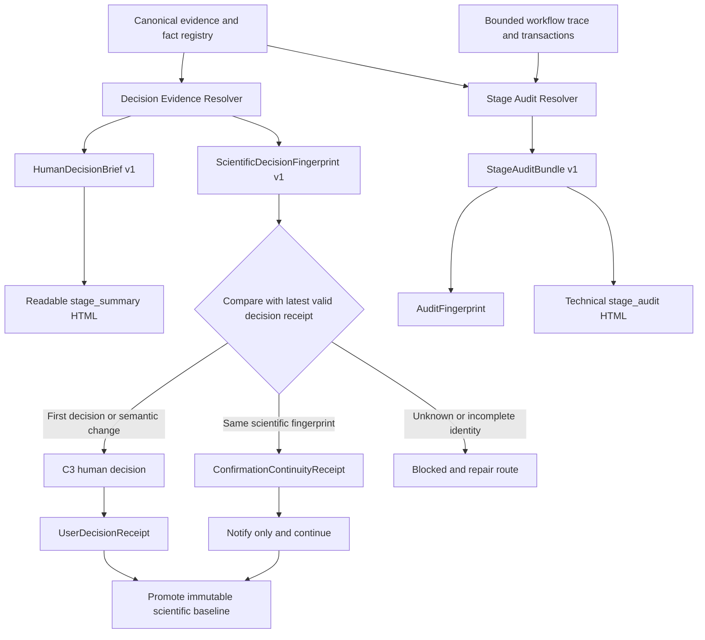

# Draftpaper-loop 核心证据可读确认、语义重确认与迭代稳定性完整优化执行方案

## 1. 文档定位

- 当前基线：Draftpaper-loop v0.40.0
- 方案日期：2026-08-23
- 问题来源：Codex 任务 `019f3d18-6db8-7320-99bc-6d898d19ccd3`、该任务中的多轮论文修改记录，以及两份核心证据确认 HTML 的对照审计
- 优化对象：Draftpaper-loop 公共 checkpoint、核心证据、StageActivity、artifact scope、科学指纹、确认 receipt、Agent payload、HTML、Skill 和测试合同
- 适用范围：全部学科、全部论文项目、首次写作和多轮返修
- 方案性质：可执行的框架优化方案，本文件不修改目标论文、现有 checkpoint、证据快照、项目状态或任何科学结果

本方案只把真实项目当作失败样本和只读验收样本。正式实现不得在核心代码、schema、模板或测试 fixture 中写入该论文的路径、对象类型、样本数、模型名、图号、学科阈值或科学结论。

---

## 2. 核心结论

当前最严重的问题不是“HTML 样式不够好”，而是 Draftpaper-loop 把三种用途不同的对象压缩进了同一个 `stage_summary.zh-CN.html` 和同一个 hash：

1. 用户需要理解并决定的科学事实与论断边界；
2. Agent 和开发者需要追溯的完整命令、文件、hash 与事务审计；
3. 会频繁重建的 HTML、报告、manifest、引用映射和 PDF 等派生产物。

这会同时造成两个后果：

- 页面为了“审计完整”而变得不可阅读，用户无法知道自己到底在确认什么；
- 派生文件发生变化时，科学确认也被一起判为失效，导致同一科学内容反复触发 C3。

目标架构必须改成：

```text
同一份 canonical evidence
    -> HumanDecisionBrief：用户真正需要理解和确认的内容
    -> StageAuditBundle：完整技术审计和全部产物
    -> ScientificDecisionFingerprint：决定是否需要重新进行科学确认
    -> Audit/Presentation Fingerprint：记录技术包和页面变化，但不冒充科学变化
```

最终必须满足：

- `stage_summary.zh-CN.html` 是默认打开的中文可读确认页，不再是完整审计清单；
- 完整审计内容移入同目录下的 `stage_audit.zh-CN.html` 和机器 JSON；
- 两种页面来自同一份结构化事实包，并与同一个科学决定绑定；
- 第一次确认或科学含义真实变化时才触发 C3；
- 重新编译 PDF、重排 JSON、更新绝对路径、重建派生报告或刷新引用映射，不得重新触发核心证据 C3；
- 若科学决定指纹不变，框架写入确认连续性 receipt 并自动沿用原确认，不要求用户重复输入新 hash；
- 若科学含义变化，页面必须先展示可读的 before/after 语义差异，再请求新的精确确认；
- 任何无法分类的变化都只能进入 `blocked`，不能被当作无变化自动沿用确认。

---

## 3. 对话与页面审计结果

### 3.1 重复确认已经成为框架级问题

对目标任务的本地 JSONL 记录进行只读统计后，共发现 20 次用户输入“确认核心证据 <hash>”。其中 15 次集中在 2026-08-20 至 2026-08-22 三天内。2026-08-22 当天连续出现的确认 hash 包括：

- `a5f21b5f1b78`
- `0be242eb6aba`
- `210e0711687a`

其中至少一次明确发生在模型、样本、split、主指标、六张主图和论断边界均未变化，仅 Results manifest 或派生证据绑定被重新生成之后。

这说明当前确认系统主要绑定的是“本次技术包”，而不是“用户已经接受的科学决定”。用户随后提出“为什么一直停留在 C3”“C3 到底确认什么”，属于合理反馈，不应被解释为用户不愿审阅。

### 3.2 两份 HTML 的实际差异

对以下页面使用 1440 x 900 浏览器视口进行了只读 DOM 检查：

- 原页面：`C:\D\epwxt_exact_838f\review\checkpoints\core_evidence-cfbfb7153d3a\stage_summary.zh-CN.html`
- Agent 后补可读版：`C:\Users\97549\Documents\Codex\2026-06-02\files-mentioned-by-the-user-a7ce2cd6b5935518e167cb0079b78882\core_evidence_confirmation_brief_20260822.html`

| 指标 | 原确认页 | Agent 后补可读版 |
|---|---:|---:|
| 文件大小 | 1,262,662 bytes | 12,183 bytes |
| 可见文本 | 676,745 字符 | 3,251 字符 |
| 页面高度 | 282,187 px | 3,934 px |
| 表格 | 168 | 4 |
| 表格行 | 1,243 | 20 |
| 图像 | 61 | 0 |
| 链接 | 1,062 | 0 |
| 标题层级 | 13 个 | 11 个 |

原页面首屏主要展示：

- 306 条历史活动的汇总；
- 211 次命令、69 次验证、2 次回滚；
- 121 张图、183 张表、97 个代码文件和大量报告；
- manifest、路径和 hash。

这些内容具备审计价值，但不能帮助用户迅速判断样本、验证设计、主结果、图表解释和论断边界是否可以接受。

Agent 后补页面能够回答用户真正关心的问题：

- 这次确认的科学对象是什么；
- 样本单位和 split 是什么；
- 主结果及不确定性如何解释；
- 选择性覆盖和缺失状态有哪些限制；
- 每张主图支持什么、不支持什么；
- 本次相对上次究竟改变了什么；
- 确认后哪些普通操作不会再次重开 C3。

但后补页面仍不能作为正式解决方案，因为它位于论文项目之外、没有进入 checkpoint 包、没有正式的句子级 evidence refs，也没有由框架验证它与官方确认 hash 的语义一致性。它只能作为目标 UX 的参考，不能成为长期依赖的 Agent 临时补丁。

### 3.3 对话中暴露出的其它通用问题

| 现象 | 框架级问题 | 正确优化方向 |
|---|---|---|
| 候选证据有误时反复改 Data 文字或重建上下文 | 失败路由没有区分证据生产错误、scope 错误、验证器词法错误和正文歧义 | 先修 canonical evidence 或验证 adapter，最后才局部改正文 |
| 用户要求“能改文字就不改图” | 缺少受约束的最小修改意图和保护产物合同 | 引入 RevisionIntent 和 repair-order，限定允许变化范围 |
| Figure 2 图面正确但旧 metadata 的 split 身份错误 | 图像像素、图表统计、证据身份和文字解释没有分层 | 分离 figure pixel、figure semantic、evidence identity 和 manuscript claim |
| 后续又发现图表内容与正文引用不一致 | “文件存在且 hash 正确”不等于图中系列、caption 和正文论断一致 | 增加 FigureClaimMap 和 panel/series/claim 对齐门禁 |
| 用户很久没有看到最新 PDF | 当前阶段摘要没有把最新可阅读稿件作为用户可见交付物 | 在写作/LaTeX/质量阶段显示最新 PDF、生成时间和所含 revision |
| 为修复引用章节映射而重新打开核心证据 | citation/presentation 变化被错误纳入科学证据生命周期 | 引用映射只重开 citation/LaTeX gate，不重开 core evidence |
| 用户希望独立审稿只依据审稿人可见材料 | 内部 hash 和工作流审计可能被混入外部审稿判断 | 为证据声明 reviewer visibility scope |
| 用户一度要求跳过 Draftpaper-loop 证据核查 | 证据门禁的摩擦已高于用户感知收益 | 保留门禁，但让无科学变化自动连续、错误路由一次收敛、确认材料可读 |

---

## 4. 当前 v0.40.0 已有能力与实质缺口

### 4.1 应保留的能力

当前框架已经具备以下基础，不应推翻：

- `checkpoint_summary.v4`、confirmation request、Agent payload 和同目录 HTML；
- `StageActivityBundle v1`；
- `review_state`、`review_requirement`、`decision_status` 和 C0-C3 风险分类；
- Agent delegation 与 user/agent/system 决定主体区分；
- byte、semantic、evidence 三层 artifact identity；
- `ScientificBaselineBundle v1` 和 `RevisionCycle v1`；
- canonical fact registry、MetricEvidence、CountEvidence、RunEvidenceBundle 和 FigureCodeTrace；
- blocked、stale、preview 页面不得确认；
- Agent payload 提供项目相对路径和本机绝对路径；
- v1/v2 checkpoint 的只读兼容。

### 4.2 当前实现为何仍产生不可读页面

1. `checkpoint_html.py` 把活动表、完整成果、变化表、验证表、证据身份和 hash 全部铺在一个主页面中。
2. `_render_activity()` 最多直接渲染 120 条动作，技术命令位于页面前部。
3. `checkpoint_digest.py` 的 stage scope 对多个阶段包含宽泛的 `review/`、`results/`、`methods/` 和 `data/` 前缀。
4. `discover_stage_paths()` 会递归扫描这些目录，导致当前核心证据页纳入 852 个 artifact，而不是只纳入当前 checkpoint 的决策相关证据。
5. `stage_activity.py` 会读取该 stage 的全部历史 trace 和 transaction，不使用 checkpoint start/end 边界，因此一次确认页聚合出 306 条跨轮次活动。
6. 当前测试主要检查“HTML 存在某些文字”“hash 可验证”和“页面无横向溢出”，没有检查信息密度、首屏决策信息、页面体量或用户是否能回答确认问题。

### 4.3 当前实现为何反复触发 C3

1. `review_policy.py` 主要按 stage 静态分类，`core_evidence` 总是 C3，没有判断这次与已确认版本之间是否存在科学语义变化。
2. `confirmation_request.v1` 绑定 `stage_summary_sha256`，而 stage summary 同时包含活动、manifest、baseline refs 和其它技术字段。
3. `StageActivityBundle v1` 的 `bundle_sha256` 会吸收重新生成时间和不断增长的历史活动；即使 summary 外层忽略 `created_at`，内嵌 bundle hash 仍会变化。
4. `evidence_snapshot.py` 的 `SNAPSHOT_ARTIFACTS` 包含多份可重新生成的结果解析和验证报告，缺少“canonical science”与“derived assessment”的硬分层。
5. `scientific_baseline.py` 把全部收集到的 artifact hash 放入 baseline，技术文件变化容易让长期科学基线显得发生变化。
6. `orchestrator.py` 为获得 checkpoint hash 先生成一次 provisional summary，再生成 final summary，增加了自引用、时间变化和活动窗口污染的机会。
7. 当前没有“确认连续性 receipt”。即使框架能够说明模型、图和结论没有变化，也只能再生成一个新 C3 hash。

### 4.4 当前 schema 约束仍不足

`checkpoint_summary_v4.json` 只严格要求少量顶层字段，并允许 `additionalProperties: true`。它没有要求：

- 用户可读的决定问题；
- “确认什么”和“不确认什么”；
- 每条可见科学陈述的 fact/evidence refs；
- 相对上一次确认的语义差异；
- scientific、audit、presentation 三类指纹；
- activity window；
- 主页面可读性预算；
- reviewer-visible 与 internal-audit 范围。

因此 v4 可以在结构上合法，却仍生成无法阅读或会重复失效的确认包。

---

## 5. 优化目标

### 5.1 用户目标

用户打开 `stage_summary.zh-CN.html` 后，应当在 30 至 60 秒内回答：

1. 这次让我确认什么；
2. 相对上次真正改变了哪些科学内容；
3. 样本、验证设计、主结果和关键限制是什么；
4. 每张主图支持什么结论；
5. 哪些内容明确不在本次确认范围内；
6. 确认后会继续做什么；
7. 什么变化才会再次要求我确认。

用户不需要阅读全部命令、全部 hash 或数百个文件，才能完成上述判断。

### 5.2 框架目标

- 科学决定与技术审计分离，但仍同源、可追溯；
- 同一科学决定最多需要一次有效确认；
- 真正改变科学含义时必须重新确认，不能因降低摩擦而放宽科学安全边界；
- 同一轮修订只聚合本轮活动和本轮正式产物；
- evidence repair、prose repair、figure repair 和 rerun 的顺序由结构化失败类型决定；
- 图表、caption、正文和审稿回复使用同一 FigureClaimMap；
- Agent 到达 checkpoint 时必须先给可读页路径和变化摘要，再给审计附件或命令；
- 中文页面必须稳定使用 UTF-8；可选英文页面与中文页面共享同一事实集合；
- 所有实现均适用于任意学科，不依赖目标论文特征。

---

## 6. 框架不变量

1. **科学事实单一来源**：HumanDecisionBrief、HTML、Agent payload 和 semantic diff 只能读取 canonical evidence/fact registry。
2. **审计不反向定义科学**：manifest、HTML、日志和派生报告不能通过自身 hash 改变科学决定。
3. **同义决定只确认一次**：科学决定指纹相同且验证完整时，必须沿用原 receipt。
4. **身份变化也是科学变化**：数值相同但 cohort、split、sample unit、metric definition 或 uncertainty 身份变化，仍需重新确认。
5. **未知变化从严阻断**：无法证明为 derived/presentation 的变化不能自动连续。
6. **可读页就是正式确认页**：不得让用户先读一个项目外 sidecar，再确认另一个不可读包的 hash。
7. **完整审计仍保留**：减少主页面内容不等于删除证据，技术详情进入 audit view。
8. **活动按窗口聚合**：一次 checkpoint 只能叙述从上一个合法边界到当前边界的活动。
9. **manifest-first**：正式成果来自命令 receipt、stage manifest 和 evidence DAG；目录扫描只能发现候选，不能自动晋升。
10. **最小修改优先**：证据身份错误先修证据，验证器错误先修 adapter，正文歧义才改正文，图面错误才改图，数据或方法真实变化才重跑。
11. **Agent 不冒充作者**：C3 新科学决定仍由用户确认；自动连续只表示科学决定未变。
12. **内部与外部证据分离**：内部 hash 问题不能被包装成外部审稿人对论文科学内容的意见。
13. **旧记录不可覆盖**：旧 checkpoint、receipt、baseline 和 audit 包保留 immutable lineage。
14. **项目特判禁止进入 Core**：学科术语只能由插件 adapter 映射到公共合同。

---

## 7. 目标架构



核心变化是：checkpoint 实例、审计包和科学决定不再共用一个身份。

---

## 8. 新增与升级的数据合同

### 8.1 `HumanDecisionBrief v1`

新增 `dpl.human_decision_brief.v1`，作为用户可读页的唯一事实输入。建议字段：

```yaml
schema_version: dpl.human_decision_brief.v1
checkpoint_type: core_evidence
decision_id: decision-...
locale: zh-CN
decision_question:
  text: 本次需要作者接受的科学基础与论断边界是什么
  evidence_refs: []
confirming:
  - statement_id: ...
    text: ...
    fact_refs: []
    evidence_refs: []
not_confirming:
  - statement_id: ...
    text: ...
stage_outcomes: []
scientific_context:
  prediction_unit: ...
  label_unit: ...
  validation_design: ...
  cohort_ref: ...
key_facts: []
comparisons_and_estimands: []
coverage_and_missingness: []
figure_claims: []
claim_boundaries: []
semantic_delta: {}
downstream_effects: []
reopen_conditions: []
decision_options: []
```

强制规则：

- 每个数字必须引用 canonical fact ID；
- 每个解释性结论必须引用 claim/boundary ID 或验证过的 evidence record；
- `confirming`、`not_confirming`、`semantic_delta` 和 `reopen_conditions` 不得为空；
- 页面不得从文件名、目录数量或命令日志推断科学结论；
- 学科插件只提供术语标签、事实选择器和显示顺序，不自行改变确认规则。

### 8.2 `ScientificDecisionFingerprint v1`

新增 `dpl.scientific_decision_fingerprint.v1`。其 canonical payload 只包含用户决定的科学含义：

- research/claim contract identity；
- dataset、cohort、split、sample unit 和 label unit identity；
- method contract、active run bundle 和 runtime-relevant science identity；
- primary metric、uncertainty、comparison/estimand 和 typed count records；
- main figure semantic evidence IDs 和 FigureClaimMap hash；
- claim boundary、limitation 和 allowed-consumer facts；
- evidence snapshot 中的 canonical scientific records。

明确排除：

- `created_at`、`updated_at` 和运行时显示时间；
- 绝对路径、工作区盘符、文件排序和 JSON key 顺序；
- HTML、CSS、截图、页面标题和语言渲染差异；
- stage audit、activity rows、命令次数、重试次数；
- 派生 manifest、验证报告、引用章节映射和 PDF bytes；
- 未改变事实集合的报告重建。

内部保存完整 SHA-256，用户界面继续显示前 12 位短 hash。短 hash 只用于输入，实际确认必须验证完整 SHA-256。

### 8.3 三类独立指纹

| 指纹 | 绑定对象 | 变化后行为 |
|---|---|---|
| `scientific_decision_sha256` | 用户接受的科学事实、身份和边界 | 真实变化时重新 C3 |
| `audit_bundle_sha256` | manifest、trace、验证报告、技术附件 | 更新审计，不自动重开 C3 |
| `presentation_sha256` | HTML/CSS/本地化和缩略图布局 | 重新渲染，不改变科学确认 |

`human_brief_semantic_sha256` 还应覆盖 DecisionBrief 的 statement/fact/ref 集合，但不包含纯措辞和 CSS。它用于证明页面没有漏掉任何决定项。

### 8.4 `CheckpointSummary v5`

新增 `dpl.checkpoint_summary.v5`，至少要求：

- `decision_brief`；
- `scientific_decision_fingerprint`；
- `human_brief_semantic_sha256`；
- `audit_bundle_ref` 和 `audit_bundle_sha256`；
- `presentation_sha256`；
- `activity_window`；
- `semantic_delta_from_last_confirmed`；
- `confirmation_basis`；
- `review_requirement`、`decision_status`、`decision_actor_type` 和 `risk_class`；
- `readability_report_ref`；
- `reviewer_visibility_scope`。

v5 schema 对这些嵌套对象使用严格 required 字段，并默认 `additionalProperties: false`。插件扩展进入显式 `extensions` 命名空间。

### 8.5 `ConfirmationRequest v2`

新增 `dpl.confirmation_request.v2`：

- 绑定 `scientific_decision_sha256` 和 `human_brief_semantic_sha256`；
- 记录 `checkpoint_package_id`，但不把 package hash 当作科学决定；
- 记录 `previous_decision_receipt_id`；
- 记录 `semantic_delta_class`；
- 记录 `continuity_eligible` 及全部 eligibility checks；
- 新科学决定允许 `confirm/refine/reject`；
- 无科学变化时不生成用户确认命令，而生成 continuity receipt。

### 8.6 `ConfirmationContinuityReceipt v1`

新增 `dpl.confirmation_continuity_receipt.v1`：

```yaml
schema_version: dpl.confirmation_continuity_receipt.v1
checkpoint_type: core_evidence
previous_decision_receipt_id: ...
previous_scientific_decision_sha256: ...
current_scientific_decision_sha256: ...
current_audit_bundle_sha256: ...
semantic_delta_class: no_scientific_change
classified_changes: []
eligibility_checks: []
actor_type: system
decision_effect: preserve_previous_user_confirmation
```

只有下列条件全部成立时才能生成：

- 当前和已确认 scientific fingerprint 完全一致；
- brief decision item 集合一致；
- canonical evidence identity 完整；
- 不存在 unclassified、missing、stale 或 same-identity conflict；
- 原 receipt 有效、未撤销，且属于同一项目和 checkpoint family；
- 当前变更全部属于 derived、presentation、operational 或 byte-only。

### 8.7 `StageActivityBundle v2`

v2 必须增加：

- `activity_window.start_event_id`；
- `activity_window.end_event_id`；
- `previous_checkpoint_or_receipt_id`；
- `revision_cycle_id`；
- `included_transaction_ids`；
- `excluded_historical_activity_count`；
- `outcome_groups`：analyzed/generated/modified/validated/reused/failed/skipped；
- `decision_relevant_outcomes`；
- `technical_activity_ref`。

行为规则：

- 只聚合窗口内活动；
- checkpoint 自身的 provisional/final 生成动作不进入被总结活动；
- 历史 `resume`、旧 `checkpoint` 和失败重试不进入当前主叙事；
- 主页面只显示 3 至 8 个结果性 outcome；
- 全部命令行和 transaction rows 进入 audit 页面。

### 8.8 Artifact role 与 visibility 合同

每个 artifact 增加：

- `artifact_role`：canonical_scientific / decision_fact / derived_audit / presentation / operational；
- `owner_stage`；
- `producer_transaction_id`；
- `evidence_refs`；
- `visibility_scope`：internal_engineering / author_decision / reviewer_visible / release_public；
- `confirmation_relevance`：required / supporting / audit_only / excluded；
- `semantic_fingerprint_policy`。

目录扫描发现的文件默认 `candidate_unregistered`，不能仅因位于 `results/`、`methods/`、`data/` 或 `review/` 就进入确认包。

---

## 9. 可读确认页的信息架构

### 9.1 主页面与审计页面分工

| 文件 | 默认受众 | 内容 |
|---|---|---|
| `stage_summary.zh-CN.html` | 用户/作者 | 可读决定说明、关键事实、图表含义、差异、边界和决定入口 |
| `stage_summary.en.html` | 可选英文用户 | 与中文页相同的 fact/ref 集合 |
| `stage_audit.zh-CN.html` | Agent/开发者/高级用户 | 全部产物、命令、验证、hash、事务和历史关系 |
| `stage_summary.json` | 机器 | v5 summary 与 DecisionBrief |
| `stage_audit.json` | 机器 | 完整 StageAuditBundle |
| `confirmation_request.json` | 状态机 | 新决定或 continuity 的精确合同 |

Agent 必须把 `stage_summary.zh-CN.html` 作为第一链接，把 audit 页面标记为“技术附件”。

### 9.2 第一屏必须回答的问题

首屏固定包含：

1. 阶段名称和当前状态；
2. “你实际要确认什么”的 1 段说明；
3. “你不是在确认什么”的 1 段说明；
4. 相对上次确认是“无科学变化”还是列出具体 before/after；
5. 3 至 6 个关键事实卡片；
6. `必须人工确认`、`沿用原确认`、`Agent 可审` 或 `存在阻断` 的明确状态。

首屏不得出现：

- 数十条命令；
- 完整文件路径表；
- 大段 hash；
- 所有历史活动数量；
- 以“文件存在”替代科学内容的总结。

### 9.3 Core Evidence 可读模板

核心证据页面按通用语义块展示：

1. 你实际要确认什么；
2. 研究对象、prediction/label unit 与验证设计；
3. 当前主结果和评价口径；
4. 关键 comparison/estimand 及不确定性如何解释；
5. 数据覆盖、缺失和选择性可用边界；
6. 主图逐图支持什么、不支持什么；
7. 最大可发表论断和禁止越界表述；
8. 本次相对已确认版本的科学变化；
9. 确认后的下游动作；
10. 哪些变化会再次重开 C3；
11. 确认、细化或拒绝入口；
12. 技术审计附件链接。

这些是公共字段，不允许在 Core 中硬编码某一学科实体。天文学插件可以把 `entity_type` 显示为“源/观测事件”，医学插件可以显示为“患者/就诊”，但底层仍是相同 unit contract。

### 9.4 图表展示

- 只显示 confirmed figure plan 中的主图，不递归展示所有历史图；
- 每张主图显示小缩略图或打开原图链接、科学作用、支持的 claim、禁止推断和当前状态；
- 缩略图通过相对路径加载，不嵌入 base64，避免 HTML 膨胀；
- 补充图和历史图进入 audit 页面；
- 主图数量较多时按 figure group 折叠，但不能遗漏 decision-relevant figure。

### 9.5 可读性预算

主页面采用软目标和硬上限：

| 指标 | 目标 | 硬上限/行为 |
|---|---:|---:|
| HTML 本体，不含外链图 | <= 128 KB | 256 KB，超过则阻断发布 |
| 可见正文字符 | 4,000-7,000 | 12,000，超出内容移至 audit |
| 一级/二级决策区块 | <= 12 | 16 |
| 表格 | <= 6 | 8 |
| 主页面表格行 | <= 40 | 80 |
| 重点 artifact 链接 | <= 12 | 20 |
| 原始活动行 | 0 | 禁止出现在主页面 |

页面体量不是唯一标准。即使未超限，若首屏缺少 decision question、semantic delta、关键事实或决定状态，也必须判定为失败。

### 9.6 UTF-8 与双语

- 所有 HTML 和 JSON 使用 UTF-8 无 BOM 或统一兼容读取；
- HTML 必须包含 `<meta charset="utf-8">`；
- 增加常见 mojibake 模式扫描；
- `zh-CN` 为中文项目的强制页面；
- 项目配置为英文或双语时生成 `stage_summary.en.html`；
- 中英文页面共享 statement IDs、fact refs 和 scientific fingerprint，翻译变化只影响 presentation fingerprint。

---

## 10. 语义失效与重新确认算法

### 10.1 固定执行顺序

```text
读取 active canonical evidence
  -> 验证 evidence identity、run、cohort、metric/count 和 figure claim map
  -> 构建 ScientificDecisionPayload
  -> 计算 scientific_decision_sha256
  -> 查找最近有效的同类 UserDecisionReceipt
  -> 生成结构化 semantic diff
  -> 分类所有 artifact/activity 变化
  -> 决定 C3、continuity 或 blocked
  -> 构建 DecisionBrief 和 AuditBundle
  -> 校验 brief coverage、refs、UTF-8 和可读性
  -> 原子发布 checkpoint 包和 ledger 事件
```

### 10.2 判定矩阵

| 变化 | Core Evidence 行为 |
|---|---|
| 第一次形成完整科学证据 | 新 C3 人工确认 |
| metric 值、定义或 uncertainty 变化 | 新 C3 |
| 数值相同但 cohort/split/sample unit 身份被纠正 | 新 C3 |
| 数据筛选、标签单位、方法、run 或主模型变化 | 新 C3 |
| 主图展示的系列、样本、统计或支持 claim 变化 | 新 C3 |
| claim boundary 扩张、收窄或解释含义变化 | 新 C3 |
| JSON 排序、时间戳、绝对路径或盘符变化 | continuity，不重开 C3 |
| `resolved_result_evidence.json` 或 validation report 按相同 canonical refs 重建 | continuity |
| citation evidence 的章节标签补全 | 只重开 citation/LaTeX gate |
| 普通润色且 claim/fact refs 不变 | 不重开 core evidence |
| PDF 编译或版式变化 | 不重开 core evidence，保留 final manuscript/visual gate |
| 图像像素变化但有有效 cosmetic-only 声明且 figure semantic hash 不变 | 不重开 core evidence，重做视觉检查 |
| artifact role 或变更影响无法分类 | `blocked`，不得自动连续 |

### 10.3 Semantic diff 必须面向用户

若需要重新确认，页面不得只显示“hash changed”。必须按以下类别列出 before/after：

- 样本和单位；
- split/validation design；
- 方法和 run；
- 主指标与 uncertainty；
- comparison/estimand；
- figure claims；
- claim boundaries；
- 新增或撤销的限制。

若没有任何上述变化，框架不得创建新的 C3。

### 10.4 单次构建和原子发布

移除当前“先 provisional summary、再 final summary”的双写模式。改为：

1. 分配 checkpoint package ID 和冻结活动窗口结束位置；
2. 构建 DecisionPayload、DecisionBrief 和 AuditBundle；
3. 以 scientific decision full hash 生成用户显示 hash；
4. 渲染所有 companion 文件；
5. 运行 schema、refs、readability 和 integrity 验证；
6. 一次事务提交目录、index 和 ledger。

任何一步失败都不得留下可确认的 partial package 或更新 latest pointer。

---

## 11. 阶段活动与成果范围收敛

### 11.1 Activity window

一次 checkpoint 的活动范围从以下优先级确定：

1. 当前 revision cycle 内上一个合法 decision/checkpoint receipt 的 end event；
2. 当前 stage transaction group 的 begin marker；
3. 显式 checkpoint intent 的 start event。

如果这些边界均不存在，页面显示“活动溯源不完整”并将活动叙事降级为 deterministic artifact outcome；不得退回“读取该 stage 全部历史日志”。

### 11.2 Manifest-first scope

阶段成果按以下优先级进入包：

1. 当前 command transaction 的 actual write set；
2. 当前 stage manifest 的 declared outputs；
3. active RunEvidenceBundle 和 evidence DAG 的直接依赖；
4. DecisionBrief 引用的 canonical facts/figures/tables；
5. 目录扫描发现的候选，仅进入 `unregistered_candidates`，不进入正式成果。

特别禁止把整个 `review/`、`results/`、`methods/` 或 `data/` 树当作当前 checkpoint 成果。

### 11.3 主页面的“本阶段做了什么”

主页面使用一段 180 至 400 字中文结果叙事，内容来自 outcome groups：

- 修复或新增了哪些科学/写作对象；
- 验证了哪些关键合同；
- 哪些内容明确复用且未改变；
- 是否存在失败或未完成项；
- 对下游有什么影响。

不得以“执行 211 个命令、复用 136 个文件”作为主要总结。命令计数只属于 audit。

---

## 12. 证据错误的最小修复路由

### 12.1 新增 `EvidenceBindingFailureReceipt v1`

每次 claim/evidence 绑定失败必须分类为：

- `canonical_evidence_identity_error`；
- `scope_or_unit_mismatch`；
- `duplicate_candidate_ambiguity`；
- `validator_adapter_gap`；
- `prose_ambiguity`；
- `figure_semantic_mismatch`；
- `actual_scientific_conflict`；
- `missing_evidence`；
- `unclassified`。

### 12.2 固定 repair order

```text
canonical evidence producer/identity
  -> evidence resolver or validation adapter
  -> local prose ambiguity
  -> caption/figure metadata
  -> plotted figure content
  -> data/method/run rerun
```

只有当前层无法解决且下一层确实受到影响时才升级。不得为了让验证器通过而反复改写自然科学文字，也不得在 metadata 错误时重画正确图表。

### 12.3 防循环规则

- 同一 claim ID 和 failure class 连续出现 2 次时，停止自动改稿；
- 生成 root-cause report，列出被选择的 evidence candidate、被拒绝原因和正确 owner；
- 禁止再次运行会覆盖已修复 canonical evidence 的旧 context builder；
- 修复 producer 后只刷新必要消费者；
- 每轮记录 protected artifacts 和 allowed change classes，超出范围立即阻断。

### 12.4 `RevisionIntent v1`

每轮修订增加：

- requested outcome；
- allowed change classes；
- protected artifacts；
- preferred repair order；
- figure redraw policy；
- maximum stale scope；
- explicit exclusions；
- user-approved exceptions。

例如“文字和证据优先，图面仅在数据或科学表达错误时修改”应成为机器可执行合同，而不是只存在于对话记忆中。

---

## 13. 图表、正文与论断一致性

### 13.1 新增 `FigureClaimMap v1`

每张主图至少记录：

- `figure_id`、`panel_id`；
- plotted entity、series、category 和 cohort IDs；
- metric/count evidence refs；
- caption statement IDs；
- manuscript claim IDs；
- supports / does_not_support；
- figure semantic hash；
- code/input/run trace；
- visual-only attributes。

### 13.2 对齐门禁

进入 core evidence 前检查：

- 正文提到的类别或系列是否真实出现在图中；
- caption 的样本、split 和单位是否与 plotted evidence 一致；
- 图中文字、legend 和 panel mapping 是否完整；
- 正文使用的是绝对计数、比例、加权指标还是条件率；
- FigureClaimMap 中的 supports 是否覆盖正文 claim；
- does_not_support 是否被正文越界使用。

发现不一致时先判断是正文、caption、metadata 还是图面错误，再按最小 repair route 修复。

### 13.3 可读页中的逐图台账

主页面不显示原始 trace 表，而显示：

| 图 | 它在回答什么 | 支持的结论 | 不能据此推出 | 本轮是否变化 |
|---|---|---|---|---|

这张表必须由 FigureClaimMap 自动生成，不能由 Agent 临时凭印象总结。

---

## 14. Agent 交互合同

### 14.1 到达审查点时的强制输出

Agent 必须按顺序提供：

1. 一句话说明本阶段完成了什么；
2. `stage_summary.zh-CN.html` 的本机绝对路径和项目相对路径；
3. 本次相对上次是“有科学变化”还是“无科学变化”；
4. 用户需要检查的 3 至 5 个要点；
5. 当前决定主体和原因；
6. 只有确实需要用户决定时才给精确确认命令；
7. `stage_audit.zh-CN.html` 作为可选技术附件。

### 14.2 禁止行为

- 只说“请确认 hash”；
- 把不可读 audit 页作为唯一确认材料；
- 在项目外另写未绑定 sidecar 供用户阅读；
- 用 Agent 自由文本替代 DecisionBrief；
- 声称“科学内容未变”却仍要求新 C3；
- 用内部路径/hash 问题冒充外部审稿意见；
- 在页面未通过 readability/coverage gate 前请求确认。

### 14.3 Agent payload v2

新增字段：

- `primary_human_review_html`；
- `technical_audit_html`；
- `decision_question_zh`；
- `decision_summary_zh`；
- `semantic_delta_summary_zh`；
- `scientific_decision_sha256`；
- `continuity_status`；
- `reconfirmation_reason_codes`；
- `latest_user_visible_deliverables`；
- `confirmation_command`，仅在真正需要时存在。

Skill 必须要求 Agent 原样使用 payload 中的路径、状态和决定摘要，不自行重算或改写 hash。

---

## 15. Reviewer-visible 与内部审计边界

对话中还暴露出审稿 Agent 可能把内部 hash、缺失 sidecar 或工作流包问题当成外部审稿意见。框架应建立可见性门禁：

- `internal_engineering`：ledger、checkpoint hash、Agent trace、内部 manifest；
- `author_decision`：作者需要理解的科学事实、图表和边界；
- `reviewer_visible`：实际提交给审稿人的 PDF、补充材料、公开代码/数据包；
- `release_public`：最终公开资源。

独立审稿默认只能读取 `reviewer_visible`。若内部审计发现问题，应进入 internal engineering report；只有它导致 reviewer-visible 稿件、图表、代码或复现包真实缺陷时，才可转化为论文修订任务。

---

## 16. 代码改造范围

### 16.1 新模块

- `draftpaper_cli/checkpoint_brief.py`
  - 构建 HumanDecisionBrief；
  - stage adapter 注册；
  - statement/fact/evidence ref coverage。
- `draftpaper_cli/checkpoint_fingerprint.py`
  - scientific、brief semantic、audit 和 presentation 指纹；
  - semantic diff。
- `draftpaper_cli/confirmation_continuity.py`
  - 查找有效 receipt；
  - continuity eligibility；
  - immutable receipt。
- `draftpaper_cli/checkpoint_readability.py`
  - 首屏字段、体量、表格、字符、编码和链接检查。
- `draftpaper_cli/checkpoint_scope.py`
  - activity window；
  - manifest-first artifact scope；
  - unregistered candidate 隔离。
- `draftpaper_cli/figure_claim_map.py`
  - figure/panel/series/caption/manuscript claim 对齐。
- `draftpaper_cli/evidence_repair_router.py`
  - 失败分类、repair order 和循环熔断。

### 16.2 重点修改

- `draftpaper_cli/checkpoint_summary.py`
  - 写入 v5；
  - 单次原子构建；
  - 分离 package ID 与 scientific decision hash；
  - 生成 readable/audit companion。
- `draftpaper_cli/checkpoint_html.py`
  - 主 renderer 改为 DecisionBrief；
  - 现有完整 renderer 改为 audit renderer；
  - 不再在主页面渲染原始活动行和全部 artifact。
- `draftpaper_cli/checkpoint_digest.py`
  - 移除宽泛目录递归晋升；
  - 只消费 manifest、DAG 和 decision refs；
  - stage-specific facts 通过 adapter 提供。
- `draftpaper_cli/stage_activity.py`
  - 升级 v2；
  - 强制活动窗口；
  - hash 排除生成时间；
  - compact outcome groups。
- `draftpaper_cli/evidence_snapshot.py`
  - snapshot 分成 canonical scientific set 与 derived audit set；
  - confirmation subject 不再包含整份派生 core report；
  - 同一 canonical record set 重建时保持 scientific ID。
- `draftpaper_cli/scientific_baseline.py`
  - 不再把所有 collected artifact 放入科学 baseline；
  - 只记录 canonical scientific fingerprints 和独立 audit refs。
- `draftpaper_cli/review_policy.py`
  - risk 由 stage + semantic delta 决定；
  - core evidence 首次/变更为 C3，无变化为 continuity notification；
  - unknown delta 保持 blocked。
- `draftpaper_cli/orchestrator.py`
  - 移除双次 summary 写入；
  - 新增 continuity 分支；
  - 原子提交 package/index/ledger。
- `draftpaper_cli/change_impact.py`、`stale_sync.py`、`artifact_dag.py`
  - 把 citation mapping、HTML、PDF、audit report 与科学变化严格分离；
  - 使用 artifact role 而不是仅用路径推断。
- `draftpaper_cli/result_support.py`、`result_evidence.py`
  - 输出 canonical record set hash；
  - derived report 重建不改变 scientific fingerprint。
- `draftpaper_cli/figure_contracts.py`、`code_ownership.py`、`writing_quality.py`
  - 接入 FigureClaimMap 和正文/图注对齐门禁。
- `draftpaper_cli/cli_output.py`
  - 优先返回可读页路径、semantic delta 和 continuity 状态。

### 16.3 Schema

新增：

- `draftpaper_cli/resources/schemas/human_decision_brief_v1.json`
- `draftpaper_cli/resources/schemas/scientific_decision_fingerprint_v1.json`
- `draftpaper_cli/resources/schemas/checkpoint_summary_v5.json`
- `draftpaper_cli/resources/schemas/confirmation_request_v2.json`
- `draftpaper_cli/resources/schemas/confirmation_continuity_receipt_v1.json`
- `draftpaper_cli/resources/schemas/stage_activity_bundle_v2.json`
- `draftpaper_cli/resources/schemas/checkpoint_agent_payload_v2.json`
- `draftpaper_cli/resources/schemas/checkpoint_readability_report_v1.json`
- `draftpaper_cli/resources/schemas/figure_claim_map_v1.json`
- `draftpaper_cli/resources/schemas/evidence_binding_failure_receipt_v1.json`
- `draftpaper_cli/resources/schemas/revision_intent_v1.json`

### 16.4 Skill 与文档

同步更新：

- `draftpaper_cli/resources/draftpaper_workflow/SKILL.md`
- `codex_skills/draftpaper-workflow/SKILL.md`
- 其它随 wheel/Agent 发布的 workflow 副本
- `docs/human_checkpoints.zh-CN.md`
- `docs/human_checkpoints.md`
- `docs/evidence_identity_and_continuity.zh-CN.md`
- CLI 自动参考和命令风险矩阵
- README 最近更新，仅在正式发布后写为已实现能力

---

## 17. CLI 调整

保留现有 `resume --checkpoint-hash` 作为用户确认入口，同时增加：

```powershell
draftpaper show-checkpoint-summary --project <project> --checkpoint-hash <hash> --view decision --language zh-CN
draftpaper show-checkpoint-audit --project <project> --checkpoint-package-id <id>
draftpaper compare-checkpoint-decision --project <project> --against latest-confirmed
draftpaper explain-reconfirmation --project <project> --checkpoint-package-id <id>
draftpaper validate-checkpoint-readability --project <project> --checkpoint-package-id <id>
draftpaper show-confirmation-continuity --project <project> --checkpoint-type core_evidence
draftpaper rebuild-checkpoint-presentation --project <project> --checkpoint-package-id <id>
```

行为要求：

- `rebuild-checkpoint-presentation` 只能改变 presentation fingerprint；
- `compare-checkpoint-decision` 为只读命令；
- `show-checkpoint-summary` 默认打开 decision view；
- `status` 和 `verify-next-action` 返回可读页绝对路径；
- continuity 成立时，`continue` 自动写 receipt 并非阻塞通知用户；
- 新 scientific hash 时仍停止并等待用户。

---

## 18. 迁移与兼容

### 18.1 已确认 v4 checkpoint

- 不覆盖旧文件和旧 receipt；
- 迁移器从已确认 canonical evidence 生成 legacy scientific fingerprint；
- 若当前 canonical evidence 与旧确认内容可证明一致，写入 `confirmation_continuity_migration_receipt`；
- 若无法证明一致，生成新的 v5 可读页并请求一次 C3；
- 项目外的 Agent sidecar 只保留为历史材料，不作为正式确认依据。

### 18.2 待确认 v4 checkpoint

- 保留 v4 为只读历史包；
- 由当前 canonical evidence 生成 v5 包；
- 只有 v5 DecisionBrief/readability gate 通过后才允许确认；
- 不把 v4 hash 静默映射到新的科学决定。

### 18.3 v1-v3

- 继续只读；
- 不原地补字段或改 hash；
- 需要继续流程时显式迁移到 v5。

### 18.4 回滚

- v5 dual-write 阶段可回退为 v4 消费，但已产生的 v5、continuity receipt 和 scientific fingerprint 不删除；
- strict 发布后不得回退到“stage summary hash 等于科学决定 hash”；
- continuity 功能可通过 policy 暂停，但不能伪造新用户确认。

---

## 19. 实施里程碑

代码可以按 M0-M4 分 PR，但对外只建议发布两个版本，避免单人维护产生过多 tag 和 wheel 验证负担。

### M0：失败模式冻结与匿名 fixture

目标：先证明当前问题，并防止实现变成单篇论文特判。

执行：

1. 从两份 HTML 提取结构和体量指标；
2. 从目标任务提取重复 C3、派生 hash 变化、证据修复循环和图文错位类型；
3. 删除路径、数字、学科实体后建立匿名 fixture；
4. 加入“同一科学内容、不同 manifest/时间戳/PDF/路径”的 no-op 变化组；
5. 加入“相同数值、不同 split/cohort”的真实语义变化组；
6. 冻结 v0.40.0 的 shadow 报告，不改变生产行为。

验收：旧算法会在 no-op 组触发新 C3，新算法 shadow 判定 continuity；所有真实语义变化均判为重新确认。

### M1：v0.40.1 双写合同与可读主页面

执行：

1. 实现 DecisionBrief、fingerprint 和 v5 schema；
2. 同时写 v4 与 v5，不改变旧项目消费路径；
3. 将现有完整 HTML renderer 移为 audit view；
4. 新 renderer 只消费 DecisionBrief；
5. Agent payload 同时提供 decision/audit 路径；
6. 加入 UTF-8、双语和 readability gate；
7. 更新 Skill，禁止项目外 sidecar。

验收：匿名 core-evidence 页面在 30 至 60 秒阅读预算内可回答全部 7 个决定问题，且所有可见陈述 refs 覆盖率为 100%。

### M2：活动窗口和 manifest-first scope

执行：

1. 发布 StageActivityBundle v2；
2. checkpoint 创建时冻结 start/end event；
3. 移除全历史 stage 聚合；
4. 收紧 `review/`、`results/`、`methods/` 和 `data/` 的递归扫描；
5. 主页面显示 compact outcomes；
6. audit 页面保留全部当前窗口技术记录。

验收：重复运行 50 次 checkpoint/resume 后，新页面只显示当前窗口成果，HTML 体量不会随历史长度线性增长。

### M3：确认连续性 shadow

执行：

1. 实现 scientific/audit/presentation 三指纹；
2. 实现 semantic diff 和 continuity receipt；
3. 在一个发布周期内并行记录旧判定和新判定，不自动改变 C3 行为；
4. 对全部 divergence 进行人工抽检；
5. 增加对抗用例，重点防止 metric identity、split 和 claim boundary 被误判为 no-op。

放行条件：

- 高风险科学变化被误判 continuity：0；
- no-op 派生变化错误触发 C3：0；
- unclassified 变化自动继续：0；
- continuity receipt 与原 user receipt 绑定完整率：100%。

### M4：v0.41.0 严格启用与全量发布

执行：

1. v5 成为新 checkpoint 默认合同；
2. continuity 正式替代重复 C3；
3. 接入 EvidenceRepairRouter、RevisionIntent 和 FigureClaimMap；
4. 更新 CLI、Skill、README 和升级指南；
5. 完成 Linux/Windows、源码/wheel、中文/英文和桌面/移动 HTML 回归；
6. 完成旧项目迁移和回滚演练；
7. 正式 tag/release 后再声明能力已发布。

---

## 20. 测试计划

### 20.1 指纹与连续性

- 时间戳变化不改变 scientific fingerprint；
- JSON key/file order 变化不改变 scientific fingerprint；
- Windows/Linux 路径变化不改变 scientific fingerprint；
- PDF 重编译不改变 core scientific fingerprint；
- citation section mapping 变化不改变 core scientific fingerprint；
- derived result report 重建但 canonical records 相同，生成 continuity；
- metric value、metric definition、uncertainty、split、cohort 或 sample unit 变化，必须新 C3；
- claim boundary 改变必须新 C3；
- figure semantic series 改变必须新 C3；
- unknown role 必须 blocked。

### 20.2 DecisionBrief 与 HTML

- 所有数字都有 fact refs；
- 所有科学陈述都有 evidence/claim refs；
- `confirming` 和 `not_confirming` 均非空；
- 页面包含 semantic delta 和 reopen conditions；
- 主页面不包含原始 command table；
- audit 页面包含当前窗口全部技术记录；
- HTML 体量、字符、表格和链接不超预算；
- 360 x 800、768 x 1024、1440 x 900 和宽屏无溢出或遮挡；
- 中文无乱码，英文页面与中文 statement/fact IDs 一致；
- blocked/stale/preview 页面无确认命令。

### 20.3 Activity 与 artifact scope

- 旧 checkpoint/resume 不进入当前 activity window；
- provisional/final package 构建不自我进入叙事；
- 同名旧文件、失败 candidate、cache 和历史 review 文件不能晋升；
- manifest declared output 全部可在 audit 找到；
- decision-relevant artifact 全部可在主页面找到概括或链接；
- 历史日志增长不导致主 HTML 线性增长。

### 20.4 最小修复与防循环

- evidence identity 错误优先路由到 producer；
- validator adapter gap 不修改论文正文；
- prose ambiguity 只允许修改对应句段；
- figure metadata 错误不重画图；
- figure semantic mismatch 才允许 figure repair；
- 同一 failure class 两次后生成 root-cause report 并停止循环；
- protected artifact 被触碰时事务回滚。

### 20.5 FigureClaimMap

- 正文引用不存在的系列或类别时阻断；
- caption 和图面 split/cohort 不一致时阻断；
- absolute count 与 class-conditional rate 混淆时阻断；
- cosmetic-only 图像变化保留 scientific fingerprint；
- plotted evidence 变化使 figure semantic hash 和 core decision hash 更新。

### 20.6 端到端场景

1. 首次 core evidence：生成可读 C3，用户确认一次；
2. 重建 Results manifest、引用映射、LaTeX 和 PDF：不再请求 C3，生成 continuity receipt；
3. 修改主指标：生成语义 diff 和新 C3；
4. 修复错误 split identity，即使值相同：生成新 C3；
5. 连续十轮 prose/citation/format 修订：核心证据确认次数保持不变；
6. 一次真实数据或方法变化：只触发精确受影响的上游和一次新的核心证据确认。

真实论文项目只在以上匿名测试通过后做只读 shadow 回归。回归输出写入临时目录，不修改真实项目 ledger、passport、snapshot、checkpoint 或 main.pdf。

### 20.7 建议测试文件

- `tests/test_checkpoint_decision_brief.py`
- `tests/test_checkpoint_scientific_fingerprint.py`
- `tests/test_confirmation_continuity.py`
- `tests/test_checkpoint_readability.py`
- `tests/test_stage_activity_window.py`
- `tests/test_checkpoint_manifest_scope.py`
- `tests/test_evidence_repair_router.py`
- `tests/test_figure_claim_map.py`
- `tests/test_checkpoint_v4_v5_migration.py`
- `tests/test_checkpoint_agent_payload_v2.py`
- `tests/test_checkpoint_semantic_reconfirmation_e2e.py`

---

## 21. 量化验收指标

| 指标 | 放行要求 |
|---|---:|
| 可见科学陈述 evidence refs 覆盖率 | 100% |
| DecisionBrief 决定项在 HTML 的覆盖率 | 100% |
| 高风险科学变化错误连续 | 0 |
| no-op 派生变化重复 C3 | 0 |
| unclassified 变化自动继续 | 0 |
| 项目外未绑定确认 sidecar | 0 |
| 主页面原始 command rows | 0 |
| 当前窗口 committed activity 在 audit 的覆盖率 | 100% |
| stage-owned canonical artifact 在 audit 的覆盖率 | 100% |
| 中文乱码和编码错误 | 0 |
| 桌面/移动横向溢出 | 0 |
| 连续十轮非科学修订新增 core C3 | 0 |
| 真实科学变化重新确认召回率 | 100% |

人工 UX 验收要求：未参与实现的测试者只阅读主页面，能够正确复述“确认什么、主结果、主要限制、本轮变化、何时会重开”五项内容；不能要求其阅读 audit JSON 才能作答。

---

## 22. 风险与控制

| 风险 | 控制 |
|---|---|
| 为减少重复确认而漏掉真实科学变化 | identity-first fingerprint；unknown 阻断；M3 shadow；对抗测试 |
| Agent 生成流畅但不准确的摘要 | 结构化 DecisionBrief；句子级 refs；反向核验；失败回退确定性模板 |
| 主页面过度简化导致证据缺失 | decision item coverage 100%；完整 audit 同源保留 |
| 旧项目无法生成完整 fingerprint | 不静默迁移；legacy preview 或一次新 C3 |
| 语言翻译改变科学含义 | 中英文共享 statement/fact IDs；翻译只影响 presentation hash |
| 图像 cosmetic 声明被滥用 | 必须同时满足 evidence fingerprint 和 FigureClaimMap 不变；否则按 scientific change |
| activity window 边界缺失 | 显式标记 provenance incomplete；不回退到全历史聚合 |
| schema 升级过快破坏现有流程 | v0.40.1 dual-write + shadow；v0.41.0 再 strict |
| audit 页面仍过大 | 允许技术页面分页/折叠/搜索；不影响主确认页预算 |

---

## 23. 推荐执行顺序

```text
冻结 v0.40.0 失败样本与确认 churn 基线
  -> 建立匿名 no-op / semantic-change fixture
  -> HumanDecisionBrief v1 与 strict refs
  -> scientific/audit/presentation 三指纹
  -> CheckpointSummary v5 dual-write
  -> 可读 stage_summary + 技术 stage_audit
  -> StageActivityBundle v2 活动窗口
  -> manifest-first artifact scope
  -> Agent payload/Skill 路径与交互合同
  -> continuity shadow 和对抗抽检
  -> EvidenceRepairRouter + RevisionIntent
  -> FigureClaimMap 与图文一致性门禁
  -> v4/v5 迁移和真实项目只读回归
  -> 全量测试、wheel、跨平台和浏览器验收
  -> v0.41.0 严格发布
```

P0 必须优先完成：可读正式确认页、三类指纹、continuity、活动窗口和 Agent 路径合同。EvidenceRepairRouter、RevisionIntent、FigureClaimMap 属于紧随其后的 P1，因为它们解决对话中反复改文、无关改图和图文错位问题，但不能阻塞先解决“用户无法确认”和“同一科学内容重复 C3”。

---

## 24. Definition of Done

只有以下条件全部成立，本方案才算完成：

1. `stage_summary.zh-CN.html` 已成为正式、hash-bound、可读的决定页；
2. `stage_audit.zh-CN.html` 保留完整技术审计；
3. 两者来自同一 canonical evidence 和同一 checkpoint package；
4. 不再需要 Agent 在项目外手工制作可读 sidecar；
5. scientific、audit 和 presentation 指纹已经分离；
6. confirmation request 绑定 scientific decision，而非整个技术 summary；
7. 同一 scientific fingerprint 能生成 continuity receipt 并沿用原用户确认；
8. 真正的 metric/cohort/split/method/figure/claim 变化一定重新 C3；
9. unknown、missing、stale 和 conflict 永远不能 continuity；
10. StageActivity 只覆盖当前 checkpoint window；
11. checkpoint scope 不再递归吞入整个项目历史目录；
12. 主页面通过体量、首屏、编码、移动端和 refs 质量门；
13. Agent 首先给出可读页准确路径、变化摘要和确认含义；
14. 证据错误按 producer/adapter/prose/figure/rerun 顺序修复；
15. FigureClaimMap 能阻断正文、caption 和图面语义不一致；
16. reviewer-visible 与 internal-audit 范围已强制分离；
17. v4 旧项目不会被静默重写或伪确认；
18. 匿名端到端和真实项目只读 shadow 回归均通过；
19. README、CLI reference、Skill 和 wheel 内资源保持版本一致；
20. 正式 v0.41.0 tag/release 后才宣称该能力已完成。

---

## 25. 最终交付物

1. HumanDecisionBrief、scientific fingerprint、continuity receipt 和 v5 checkpoint schemas；
2. 可读主页面与完整 audit 页面双视图；
3. activity window 和 manifest-first scope；
4. semantic diff 与动态重新确认决策；
5. Agent payload v2、CLI 和 Skill 合同；
6. EvidenceRepairRouter、RevisionIntent 和循环熔断；
7. FigureClaimMap 与图文一致性门禁；
8. reviewer visibility scope；
9. v4/v5 迁移器和回滚说明；
10. 匿名跨学科 fixture、浏览器可读性测试和端到端确认连续性回归；
11. 中文/英文用户文档与发布说明；
12. v0.41.0 正式发布验证报告。

本方案完成后的直接用户体验应当是：作者打开默认确认页即可理解科学基础、主结果、主图和边界；技术审计仍然完整但不占据决定视图；已经确认过的科学内容不会因为 manifest、引用映射、HTML 或 PDF 重建而反复要求新的 C3。只有数据、方法、验证身份、主结果、图表语义或论断边界真正变化时，系统才会用清楚的 before/after 说明请求一次新的作者确认。
