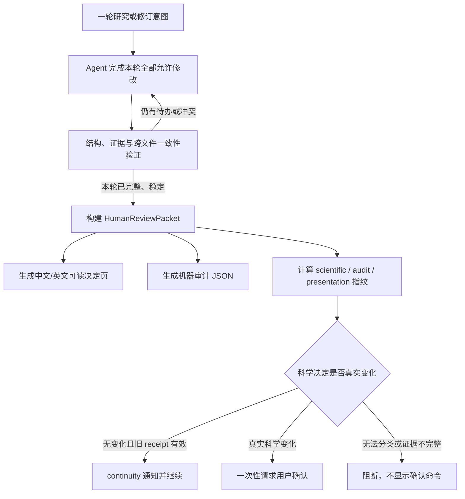

# Draftpaper-loop 统一可读审阅包、研究计划一次性确认与语义连续性优化执行方案

## 1. 文档定位

- 日期：2026-08-23
- 当前代码基线：Draftpaper-loop v0.41.1，`main` 提交 `9aeb8fd`
- 问题来源：Codex 任务 `019f89ab-fa21-7e31-858f-d2f9a37b1f01` 中的完整使用过程、研究计划多轮确认记录，以及研究计划审阅包与核心证据技术审计页的对照检查
- 适用范围：全部学科、全部新建项目、已有项目升级、多轮研究计划修订、核心证据确认、最终稿确认及受保护运维操作
- 方案性质：Draftpaper-loop 公共框架优化方案，不针对某篇论文写特判，不修改任何现有论文项目的科学内容、证据、图表、状态、快照或 ledger
- 建议目标版本：v0.41.2 完成兼容双写和 shadow，v0.42.0 完成统一严格发布

本方案直接继承并扩展：

- `docs/superpowers/plans/2026-08-23-core-evidence-human-readable-confirmation-and-semantic-reconfirmation-optimization.md`；
- `docs/superpowers/plans/2026-08-11-agent-delegated-review-stage-narrative-and-drift-governance.md`；
- `docs/superpowers/plans/2026-07-14-v026-project-workspace-statistics-figure-workflow.md`。

前一份方案已经解决核心证据页的主要问题。本方案不重复实现核心证据 v5，而是把已经验证有效的“可读决定页、语义指纹、确认连续性、Agent 路径合同”扩展到 `research_plan` 和全部受保护操作，并进一步取消默认生成和默认加载技术审计 HTML。

---

## 2. 核心结论

当前问题不是单纯的 HTML 排版问题，而是三项框架职责仍未统一：

1. `research_plan` 仍按一组文件的字节 hash 确认，普通投影、措辞和派生文件变化也可能产生新 hash；
2. Agent 可以在计划尚未完整修订时就生成新的确认请求，导致用户被要求逐段、逐次确认；
3. 命令注册表把 27 条性质完全不同的操作统一标成 `human_checkpoint`，混淆了“需要保护的写操作”和“必须由用户作出新的科学决定”。

目标流程应改为：



最终必须做到：

- 用户确认的是完整、可读、证据绑定的决定内容，不是 hash、文件存在性或技术审计清单；
- 一轮完整计划修订最多产生一次新的人工确认请求；
- 只有研究问题、claim、数据角色、cohort、方法、统计设计、主图语义、可行性边界或接受限制真实变化时，才重新确认研究计划；
- HTML 样式、翻译投影、JSON 排序、生成时间、绝对路径、审计清单和派生文件变化不能制造新的科学确认；
- `stage_audit.json` 保留完整机器审计，技术 HTML 改为按需渲染，不再成为每个新包的强制文件；
- Agent 默认只读取 HumanDecisionBrief 和必要的证据引用，不把完整审计页塞入上下文；
- C0 可自动通知，C1/C2 可在有效 delegation 下由 Agent 审查，C3 新科学决定、互斥路线、作者身份、许可证和最终发布仍由用户决定；
- 对已有有效用户决定的自动沿用只能写 `continuity receipt`，绝不能写成新的 `user_confirmed`。

---

## 3. 当前实现状态：哪些已经完成，哪些仍然缺失

| 能力 | v0.41.1 状态 | 本方案处理 |
|---|---|---|
| 核心证据默认可读 `stage_summary.zh-CN.html` | 已完成 | 保留并作为统一组件的参考实现 |
| HumanDecisionBrief、FigureClaimMap 和句子级 evidence refs | 已完成 | 抽象为可供其它确认族复用的公共能力 |
| scientific / audit / presentation 三指纹 | 核心证据已完成 | 扩展到研究计划和其它科学决定 |
| confirmation continuity | 核心证据已完成 | 扩展到研究计划；操作型命令采用独立 impact receipt |
| 当前活动窗口与 manifest-first scope | 核心证据已完成 | 继续保留 |
| Agent 首先给出可读页路径 | 核心证据已完成 | 提升为全部审阅包的强制输出合同 |
| 研究计划审阅包展示完整具体内容 | 尚未由框架稳定保证 | P0 优先实现 |
| 一轮 research plan 修改只请求一次确认 | 未实现 | 增加 revision aggregation 和 finalize gate |
| 研究计划语义 hash 与文件 hash 分离 | 未实现 | 增加 ScientificPlanFingerprint |
| 研究计划 confirmation continuity | 未实现 | 增加迁移、比较和 continuity receipt |
| 技术审计默认仅保留 JSON | 未实现 | v6 包改为 JSON-only，HTML 按需渲染 |
| 27 条 human checkpoint 按决定性质分族 | 未实现 | 增加动态风险与 packet policy |
| Agent 默认不加载完整 audit | 尚未形成硬合同 | 增加上下文预算和 evidence-on-demand |

因此，v0.41.1 不应被描述为“整套人工确认已经统一完成”。更准确的状态是：核心证据确认已经具备目标架构，研究计划和其它受保护操作仍在旧架构上。

---

## 4. 真实使用证据与根因

### 4.1 研究计划被多次拆散确认

目标任务中至少出现以下研究计划 hash 前缀：

| 时间 | plan hash 前缀 | 对话中的阶段 |
|---|---|---|
| 2026-07-24 | `27896b` | 初始计划确认 |
| 2026-07-26 | `8da20c` | 后续计划调整 |
| 2026-07-29 | `33c160` | 数据或方案继续修订 |
| 2026-08-10 | `56d041` | 用户连续提交多次才完成确认 |
| 2026-08-22 | `afecb7` | 图表方案修订 |
| 2026-08-22 | `e45e52` | 表格与合同继续修订 |
| 2026-08-23 | `49f874` | 后续完整性修订 |

核心证据也连续出现 `0d8b99e4ef62`、`36b4e2f49030`、`e16062622105` 和 `f52622df66a9` 等确认。

这些 hash 中一部分确实对应主图、表格或科学合同变化，重新确认本身合理；问题在于框架没有：

- 在请求确认前聚合完一轮完整修改；
- 给出每次 hash 变化的可读语义差异；
- 区分真正的科学变化与文件投影变化；
- 复用已经存在的等价用户决定。

因此不能把所有重复确认都简单归为“假阳性”，但可以确认当前流程把合理的多步修订放大成了不必要的多轮交互。

### 4.2 用户反馈直接指向审阅材料不完整

任务记录中出现了以下明确反馈：

- “你得给我展示这些具体的内容啊，不然我怎么确认呢？”
- “研究计划审阅包呢？”
- “你给我这个我也没办法审阅啊，什么都看不到。”
- “可以一次性修订完整的 research_plan 再让我确认，不要只修改一部分就让我确认。”

这说明确认失败不是用户拒绝参与，而是确认请求早于可审阅内容和完整修订结果。

### 4.3 两类 HTML 的实测差异

对照文件：

- 可读研究计划页：`projects/develop-and-demonstrate-an-auditable-di_a20ceb1f_v3/research_plan/research_plan_review_packet.html`
- 技术审计页：`projects/develop-and-demonstrate-an-auditable-di_a20ceb1f_v3/review/checkpoints/core_evidence-694713399ab9/stage_audit.zh-CN.html`

| 指标 | 可读研究计划页 | 技术审计页 |
|---|---:|---:|
| 文件大小 | 19,658 bytes | 104,069 bytes |
| 空白分词计数 | 341 | 3,127 |
| 二级标题 | 8 | 12 |
| 表格 | 2 | 13 |
| 链接 | 12 | 166 |
| 64 位 hash | 2 | 126 |

可读页直接组织为研究目标、主张边界、主图、数据与方法、正文表格、限制和确认入口。技术页首屏则包含命令、事务、路径和大量 hash。后者适合追责和调试，不适合作为用户做科学决定的主材料。

审计时点还暴露了另一个问题：上述可读页在本轮分析开始时存在并完成了 DOM/体量检查，但后续 research plan 再次进入 `confirmation_required` 后，根目录下的 `research_plan_review_packet.html` 和对应 JSON 被当前流程删除；技术审计页仍保留。目标任务 JSONL 中保留了该可读页的完整生成 patch、标题、正文结构和用户打开记录，因此上述比较仍可核验。这个变化说明当前审阅页只是可丢弃投影，而不是不可变、可回看的正式决定包。新架构必须版本化保留已经展示过的 HumanReviewPacket，只更新 active pointer；即使新修改使旧包失效，也只能标记 `superseded`，不能删除旧可读页。

需要特别说明：当前这份较好的研究计划页反映了目标体验，但现有公共实现中的 `_render_review_packet()` 仍主要输出确认说明和文件链接。也就是说，“可读完整版”尚未被框架合同稳定保证，不能依赖 Agent 每次临时补写。

### 4.4 代码层面的直接根因

当前 `draftpaper_cli/research_plan_confirmation.py` 存在以下结构性问题：

1. `SCIENTIFIC_ARTIFACTS` 同时包含中英文 Markdown、blueprint、claim、storyboard、method plan、discipline contract、capability contract 和统计合同；
2. `current_plan_hash()` 对上述文件的路径、字节 SHA-256 和大小整体再哈希；
3. 中文投影重新渲染、JSON 排序、普通措辞或非语义字段变化都可能改变总 hash；
4. `review_research_plan()` 生成审阅包前没有检查“一轮修订任务是否全部完成”；
5. `mark_research_plan_confirmation_required()` 会删除当前 review packet 和确认快照，但没有研究计划级 continuity；
6. `confirm_research_plan()` 只验证当前文件 hash，没有独立的用户决定语义 hash、明确 actor receipt 和 before/after 语义差异；
7. 现有 v5 checkpoint 已具备这些能力，但 research plan 尚未接入。

### 4.5 命令模型混淆了保护与决定

`docs/command_risk_matrix.md` 当前列出 27 条 `human_checkpoint` 命令。它们实际混合了：

- 科学路线和最终发布决定；
- 用户授权与许可证决定；
- 已预览修改的 apply；
- 可回滚迁移和 quarantine；
- job cancel、rebase、rollback 等运维动作；
- checkpoint 包生成与 receipt 消费。

“操作需要受保护”不等于“必须生成一份长篇科学审阅页并等待用户重新确认”。继续使用同一个静态布尔值，会让人工确认数量持续膨胀。

---

## 5. 设计原则

1. **决定对象优先。** 先定义用户实际决定什么，再决定页面、hash 和命令。
2. **完整后再请求确认。** 中间草稿可以验证和修复，但不得生成可消费确认请求。
3. **一个 revision cycle 一次集中确认。** 同一轮中的多文件、多 claim 和多图表修改先聚合，再形成单一语义差异。
4. **科学语义与文件呈现分离。** 字节、审计、翻译和页面变化不改变科学决定。
5. **官方可读页必须在受管包内。** 禁止依赖项目外临时 sidecar。
6. **完整不等于堆文件。** 主页面必须覆盖全部决定项，但技术细节通过 evidence refs 按需展开。
7. **无法证明等价时严格阻断。** unknown、missing、stale、conflict 和身份缺失不能自动 continuity。
8. **确认主体必须可审计。** `user_confirmed`、`agent_approved`、`system_acknowledged` 和 `continuity_preserved` 必须分开。
9. **用户当前明确指令可以充当操作意图。** 对“开始一轮修订”或“重新打开计划”不再重复问同一个问题，但新科学方案完成后仍需正式确认。
10. **跨学科核心保持中性。** 核心 schema 只描述研究问题、数据角色、方法、统计、图表和论断；学科字段由 adapter 注入。
11. **技术审计按需读取。** Agent 默认不加载完整 audit；只有定位具体冲突时才按 evidence ref 查询。
12. **历史记录只读。** 不原地改写 v1 研究计划快照或 v1-v5 checkpoint 包。

---

## 6. 统一 HumanReviewPacket 架构

### 6.1 决定族

新增 `decision_family`，至少支持：

| 决定族 | 典型对象 | 页面类型 |
|---|---|---|
| `scientific_plan` | 研究问题、claim、数据、方法、统计和主图合同 | 完整科学决定页 |
| `scientific_evidence` | 样本、run、指标、图表和论断支撑 | 完整科学决定页 |
| `scientific_route` | 补数据/方法、收窄 claim、停止或转向 | 完整路线选择页 |
| `manuscript_release` | 最终 PDF、引用、限制和发布 hash | 完整发布决定页 |
| `plugin_license` | 插件 promotion、许可证、第三方代码下载或执行 | 许可与影响页 |
| `content_change` | 已预览的稿件、文献和 metadata 修改 | 差异页 |
| `operational_change` | rollback、rebase、cancel、quarantine、reconcile | 简洁影响页 |
| `notification` | 无语义变化、连续确认、派生重建 | 通知页或 Agent 摘要 |

不同决定族使用不同 adapter 和模板，不能把论文式长页套在 job cancel 或 rollback 上。

### 6.2 包合同

新增 `dpl.human_review_packet.v1`。所有包至少包含：

| 字段 | 含义 |
|---|---|
| `packet_id`、`decision_family`、`risk_class` | 包身份和风险 |
| `review_state`、`review_requirement`、`decision_status` | 是否可审、谁审、是否完成 |
| `decision_question` | 用户真正要回答的问题 |
| `human_decision_brief_ref` | 可读页唯一事实源 |
| `scientific_or_effect_fingerprint` | 科学决定或操作影响身份 |
| `audit_bundle_sha256` | 完整技术审计身份 |
| `presentation_sha256` | 页面呈现身份 |
| `semantic_delta` | 与最近有效决定的 before/after |
| `unresolved_items` | 阻断项和非阻断限制 |
| `authority` | user、agent、system 或 continuity 的依据 |
| `expires_when` | 哪些变化会让该包失效 |

### 6.3 v6 包目录

新包建议使用：

```text
review/checkpoints/<packet_id>/
├── stage_summary.zh-CN.html
├── stage_summary.en.html
├── human_review_packet.json
├── human_decision_brief_v1.json
├── scientific_decision_fingerprint_v1.json
├── operation_effect_fingerprint_v1.json
├── semantic_diff.json
├── stage_audit.json
├── artifact_manifest.json
├── unresolved_issues.json
├── confirmation_request.json
├── agent_payload.json
└── review_decision_receipts/
```

不是每个包都同时需要 scientific 和 operation fingerprint；必须按决定族二选一或显式组合。

`research_plan/active_review_packet.json` 只保存当前 active packet ID、状态、可读页路径和三类 fingerprint。兼容入口 `research_plan/research_plan_review_packet.html` 可以投影或跳转到 active packet，但不得成为唯一副本。新修订开始时：

- 旧包目录保持不可变；
- active pointer 将旧包标记为 `superseded_pending_revision`；
- 未 finalize 的中间状态不生成新的可消费包；
- 新包完成后再原子切换 pointer；
- 用户、Agent 和审计工具仍可按 packet ID 打开历史可读页并比较语义差异。

### 6.4 技术审计改为 JSON-first

从 v6 开始：

- `stage_audit.json` 是必需的完整技术审计；
- `stage_audit.zh-CN.html` 不再是新包的必需文件；
- `show-checkpoint-audit` 改为读取 JSON 并返回摘要；
- 新增只读 `render-checkpoint-audit --checkpoint-package-id <id>`，按需在项目内 `.draftpaper/render_cache/audit/` 生成 HTML；
- audit HTML 只绑定 presentation/cache identity，不进入 scientific fingerprint，也不触发新确认；
- v5 及更早包已有的 audit HTML 保持只读，不删除；
- 用户可读页仍提供“查看技术审计”入口，但只有点击或显式命令时才渲染。

真正的 token 节省来自 Agent 上下文策略，而不只是少写一个 HTML 文件：

- 默认 payload 只包含 DecisionBrief、semantic delta、阻断项和最多 8 个主要交付物；
- 不把 `stage_audit.json`、完整 artifact manifest 或历史 ledger 自动放入 Agent 上下文；
- Agent 通过 `inspect-review-evidence --ref <evidence_ref>` 按需获取单项证据；
- 默认 Agent 审阅上下文建议控制在 12 KB 以内；
- 需要技术排障时再显式进入 audit 模式。

---

## 7. ResearchPlanDecisionBrief

### 7.1 必须展示的内容

研究计划的 `stage_summary.zh-CN.html` 必须在同一页面完整展示：

1. 本轮计划修订完成了什么，以及相对上一有效计划改变了什么；
2. 研究目标和每个核心研究问题；
3. 每项 claim 的允许表述、所需证据、边界和明确禁止外推；
4. 数据来源、数据角色、cohort、样本单位和关键筛选；
5. 方法步骤、对照、验证设计、统计量、不确定性和阈值来源；
6. 每张主图及 panel 回答什么、依赖什么、支持什么、不支持什么；
7. 正文关键表格的职责；
8. 当前插件、代码和数据能力是否足够；
9. 已知限制、缺失能力、待接受限制和不能进入执行的阻断项；
10. 用户确认后会冻结什么，哪些实现修复不需要重新确认；
11. 何种变化必须重新打开计划；
12. 完整研究方案和相关合同的可点击路径。

页面不能只显示“请确认研究问题、claim 和图表是否正确”这类问题清单，而不展示对应内容。

### 7.2 页面信息架构

建议固定为：

1. 首屏：本轮完成摘要、当前状态、是否有科学变化、需要用户决定的一句话；
2. 研究目标与问题；
3. claim 与边界矩阵；
4. 主图和表格故事板；
5. 数据、方法与统计设计；
6. 可行性、限制和未解决项；
7. 相对上一版本的语义差异；
8. 确认含义、重开条件和下一步；
9. 完整源文件和可选技术审计。

页面应提供中文和英文视图，二者必须读取同一组 fact ID 和 semantic key。翻译变化只能改变 presentation fingerprint。

### 7.3 可读性门禁

确认命令出现前必须通过：

- UTF-8 和中英文乱码检查；
- 所有 research question、claim、主图和阻断限制覆盖率为 100%；
- 每个决定陈述至少有一个结构化 evidence ref；
- 首屏不出现完整路径表、历史命令表或超过两个长 hash；
- 用户无需打开 JSON 才能理解决定；
- 主页面不因项目历史长度线性增长；
- 桌面和移动视口无文本重叠、横向溢出和不可点击路径；
- 若内容过多，使用分节和 `details`，但不得隐藏阻断项或决定差异；
- 估算阅读时间不超过 5 分钟，首屏应在 30 秒内说明决定对象和变化；
- 页面构建失败或覆盖不完整时状态必须是 `blocked`，不能显示确认命令。

---

## 8. 一轮完整修改后只确认一次

### 8.1 复用 RevisionCycle，不建立第二套状态机

现有 `dpl.revision_cycle.v1` 应增加 research-plan scope 的约束字段，而不是再创建平行的计划修订系统：

- `scope=research_plan`；
- `requested_changes`；
- `protected_facts`；
- `expected_artifacts`；
- `expected_decision_items`；
- `pending_tasks`；
- `revision_generation`；
- `producer_actor_id`；
- `status=drafting|validating|ready_for_review|awaiting_decision|closed`。

用户明确要求修改研究方案时，该请求可写入 `UserIntentReceipt` 并自动开始 revision cycle，不需要再问一次“是否开始修改”。

### 8.2 完整修订门禁

`review-research-plan` 只有在以下条件全部成立时才能生成可消费确认包：

1. 本轮 `requested_changes` 均已处理或明确记录为 accepted limitation；
2. `expected_artifacts` 全部存在并由当前 revision cycle 生成或验证；
3. blueprint、claim contract、method plan、statistical contract、figure storyboard 和可行性结论交叉一致；
4. 没有 queued/running repair task；
5. 没有 blocking capability、数据角色、统计或图表冲突；
6. 中文和英文投影均从同一 canonical semantics 生成；
7. 连续两次规范化语义构建得到相同 fingerprint；
8. 最新变更之后已经重新运行完整 plan validator；
9. 尚未存在同一 semantic fingerprint 的有效 active review packet。

这里的“稳定”是确定性的零待办和重复规范化结果，不采用“等待一周”或固定睡眠时间。

### 8.3 中间修改不生成确认请求

在 `drafting` 和 `validating` 状态：

- 可以反复生成预览和 validator 报告；
- 不写 `confirmation_request.json`；
- 不向用户输出 `confirm-research-plan` 命令；
- 不删除最近一次有效确认快照；
- 若当前修改真实改变科学语义，只把旧快照标为 `superseded_pending_revision`，并阻止下游使用；
- Agent 必须先完成整轮修订，再集中展示结果。

若修订过程中出现必须由用户先选择的互斥科学路线，可以提前请求一次路线决定，但这属于 `scientific_route`，不能伪装成最终 research plan 确认。

### 8.4 幂等与循环熔断

- 同一 revision cycle、同一 scientific fingerprint 重复运行 `review-research-plan` 时复用现有 packet；
- 只更新审计或 presentation 时不生成新 packet ID；
- 自动修复最多连续执行 3 轮；之后若仍无收敛，集中报告剩余 blocker；
- 不允许“改一个文件 -> 生成 hash -> 请求确认 -> 再改下一个文件”的循环；
- 任何新科学修改会使当前 pending packet 失效，但只有修订再次 finalize 后才向用户展示新包。

---

## 9. 研究计划三指纹与重新确认规则

### 9.1 ScientificPlanFingerprint

新增 `dpl.scientific_plan_fingerprint.v1`，只包含规范化语义：

- 研究问题和目标；
- claim ID、允许强度、边界和禁止外推；
- 数据源逻辑身份、数据角色、cohort、样本单位和筛选合同；
- 方法 ID、关键步骤、输入输出、对照和模型/算法语义；
- validation design、统计量、不确定性、阈值及其来源；
- 主图和 panel 的语义角色、输入、输出、claim 绑定；
- 关键表格职责；
- capability decision、阻断缺口和被接受限制；
- 会影响后续执行授权的明确用户选择。

规范化时排除：

- `generated_at`、绝对路径、本机环境和临时目录；
- JSON/YAML 键顺序、Markdown 空白、换行和标题编号；
- 中文/英文投影措辞；
- HTML、CSS、导航、折叠状态和链接显示文本；
- artifact 大小、manifest 排序和审计活动顺序；
- 不改变方法输入输出或科学含义的实现注释；
- 单纯引用格式、PDF 重编译和派生报告 hash。

### 9.2 AuditFingerprint

`audit_bundle_sha256` 覆盖：

- 精确文件 hash；
- validator 输出；
- activity receipt；
- artifact manifest；
- runtime、代码版本和生成工具；
- 失败、重试、恢复和迁移记录。

它用于复现和追责，但变化不自动触发研究计划确认。

### 9.3 PresentationFingerprint

`presentation_sha256` 覆盖：

- 中文和英文 HTML；
- CSS、页面结构和本地化文本；
- 可点击路径和渲染版本。

它只决定页面是否需要重建。

### 9.4 变化分类

| 变化 | scientific fingerprint | 默认动作 |
|---|---|---|
| 改写不改变含义的研究计划文字 | 不变 | 重建 presentation，沿用确认 |
| 中文/英文翻译修正 | 不变 | 双语覆盖检查后沿用 |
| JSON 排序、时间戳、路径、文件大小 | 不变 | audit 更新 |
| 补充不改变方法输入输出的实现说明 | 通常不变 | validator 证明后沿用 |
| 新增数据来源但不进入 active 数据角色 | 不变或 metadata-only | 记录 audit，不授权使用 |
| active 数据角色、cohort、样本单位或筛选变化 | 改变 | 新 C3 |
| 方法、模型、对照或统计设计变化 | 改变 | 新 C3 |
| 主图标题措辞调整但语义角色不变 | 不变 | presentation-only |
| 主图/panel 增删、语义或 claim 绑定变化 | 改变 | 新 C3 |
| claim 收窄、扩张或禁止外推变化 | 改变 | 新 C3 |
| capability 缺口被解决且可行性边界改变 | 改变 | 新 C3 |
| 同一科学语义但 audit 文件新增 | 不变 | continuity |
| 无法分类的文件变化 | unknown | 阻断并进入 reconciliation |

### 9.5 Continuity

只有以下条件全部成立，才可写 research-plan continuity receipt：

1. 最近有效 receipt 的 actor 是 user；
2. 旧快照可确定性投影出当前 schema；
3. `scientific_plan_sha256` 相同；
4. `decision_brief_semantic_sha256` 相同；
5. 没有 missing、stale、conflict、unknown 或未接受限制；
6. runtime/schema 迁移已经通过；
7. 当前 packet 的证据引用均可解析。

continuity 只表示“沿用用户已作出的同一决定”，状态不得写成新的 `user_confirmed`。

---

## 10. 27 条 human checkpoint 命令的重新分族

`CommandSpec.protected_action` 应继续表示写入保护，但不再自动等价于 `manual_only + human_checkpoint`。新增：

- `decision_family`；
- `packet_policy=none|notification|compact|full`；
- `risk_resolver`；
- `delegation_policy`；
- `external_side_effect_class`；
- `consumes_receipt_type`。

逐项建议如下：

| 命令 | 目标决定族和页面 | 默认审查策略 |
|---|---|---|
| `accept-revision` | `content_change` 差异页 | 按 change class 动态判定；prose-only 为 C1，科学变化升级 |
| `apply-literature-sync` | `content_change` 或 `operational_change` | 纯增量 metadata 可 C1；身份合并、删除或 active work 改变为 C2/C3 |
| `apply-manuscript-completion` | 作者补全差异页 | 普通 metadata/prose 可委托；作者身份、许可或新增科学内容为 C3/重开上游 |
| `apply-manuscript-revision` | 精确修订差异页 | prose-only C1；证据支持的方法/数据说明 C2；claim/科学合同变化 C3 |
| `apply-orphan-adoption` | 简洁影响与回滚页 | C2；仅在范围受限且可回滚时允许 Agent delegation |
| `apply-result-downgrade` | `scientific_route` 完整路线页 | C3 用户决定 |
| `begin-revision-cycle` | `notification` | 已有用户任务意图时直接开始；不再单独要求确认 |
| `checkpoint` | 包构建基础设施 | C0；命令本身不代表决定，风险由生成的 packet 决定 |
| `configure-review-policy` | 权限策略差异页 | C3 用户决定，页面简洁但必须完整显示权限影响 |
| `confirm-final-manuscript` | `manuscript_release` 完整发布页 | C3 用户决定 |
| `confirm-research-plan` | `scientific_plan` 完整计划页 | 新语义为 C3；等价决定走 continuity |
| `fetch-research-code-archive` | `plugin_license` 下载/许可影响页 | 有外部下载、许可证或执行风险时 C3 |
| `grant-agent-review` | 权限授权差异页 | C3 用户决定；显示 scope、期限、最大风险和撤销方式 |
| `job-cancel` | 简洁运维影响页 | C1/C2；同一任务中 Agent 创建且无科学产物提交的 job 可委托取消 |
| `prepare-result-rescue` | `scientific_route` 完整路线页 | C3 用户决定 |
| `promote-plugin-candidate` | `plugin_license` 完整插件页 | C3，必须显示来源、版本、许可证、静态检查、执行边界和回滚 |
| `quarantine-orphan-literature` | 简洁影响与回滚页 | 可逆且不影响 active citation 时 C1；影响 active work 时 C3 |
| `rebase-project-passport` | 简洁影响页 | 默认 C2；若会吸收未解释科学漂移则 C3 |
| `reconcile-project-drift` | 动态路线页 | 重建派生文件 C1；采纳预期变化 C2；重开科学基线 C3 |
| `reopen-core-evidence` | 用户意图 receipt 或科学重开提案 | 用户已明确要求修改时不二次确认；Agent 自行判断需要重开时先提交 C3 提案 |
| `reopen-research-plan` | 用户意图 receipt 或科学重开提案 | 与上项相同 |
| `resume` | receipt consumer | 不单独确认；继承当前 packet 风险并验证合法 receipt |
| `revoke-agent-review` | 权限收缩通知页 | 用户撤销或自动到期为 C0/C1，不应再要求二次确认 |
| `rollback-literature-migration` | 简洁影响与恢复页 | C2；若改变 active citation/work set 则 C3 |
| `rollback-manuscript-completion` | 差异与恢复页 | C2；作者身份或科学内容回滚时 C3 |
| `rollback-manuscript-revision` | 差异与恢复页 | prose-only 可 C1/C2；claim、方法、数据或结果回滚为 C3 |
| `rollback-orphan-literature` | 简洁影响与恢复页 | C2；恢复内容进入 active citation pool 时 C3 |

重要变化：

- `checkpoint` 负责生成审阅材料，不应自己成为一次用户决定；
- `resume` 负责消费已经存在的合法 receipt，不应再次制造确认；
- apply/rollback 的风险必须由具体 payload 和 change class 决定，不能只看命令名；
- 用户已经明确下达的修订或重开指令应记录为 intent，不应重复询问同一操作；
- 最终科学方案、互斥路线、作者/许可和对外发布仍保持硬性人工边界。

---

## 11. Agent 交互合同

### 11.1 请求确认前

Agent 必须：

1. 汇总本轮用户要求和 revision scope；
2. 完成所有可自动完成的计划修改；
3. 运行完整性、交叉一致性、能力和可读性验证；
4. 处理或集中列出剩余问题；
5. 确认 revision cycle 已到 `ready_for_review`；
6. 生成或复用官方 HumanReviewPacket；
7. 只在真正需要新决定时请求确认。

### 11.2 到达确认点时的输出顺序

Agent 面向用户的回复固定为：

1. 一段话说明本轮完整完成了什么；
2. 中文可读页的绝对路径和项目相对路径；
3. 英文页路径；
4. 本次相对上一决定的语义变化摘要；
5. 需要用户重点检查的 3 至 6 项；
6. 当前是新确认、continuity、Agent 可审还是 blocked；
7. 只有新确认时才给精确命令或 hash；
8. 技术审计只作为可选入口。

Agent 禁止：

- 只给 hash 或确认命令；
- 把技术审计页作为唯一审阅材料；
- 在 research plan 仍有 pending task 时请求确认；
- 每修改一个文件就生成一次新 packet；
- 自由发挥一个未绑定官方包的摘要来代替 DecisionBrief；
- 把 audit/presentation 变化说成科学变化；
- 在不知道变化类型时自动沿用确认；
- 把 C1/C2 Agent 审查伪装成用户确认。

### 11.3 Agent 自动审查边界

- C0：可 `system_acknowledged` 并继续；
- C1：有效 delegation 下可由当前 Agent 审查；
- C2：必须有 `allow_scientific_freeze=true`，并由不同于 producer 的 reviewer Agent 审查；
- C3：新科学决定、互斥路线、插件 promotion、许可证、作者身份、最终稿和 release 保持用户确认；
- scientific fingerprint 未变且旧用户 receipt 有效：写 continuity receipt，不调用 Agent “代替确认”。

---

## 12. CLI 和状态机调整

### 12.1 保留兼容命令

以下现有命令继续保留：

```powershell
draftpaper review-research-plan --project <project>
draftpaper confirm-research-plan --project <project> --plan-hash <hash>
draftpaper reopen-research-plan --project <project> --reason <reason>
```

但行为调整为：

- `review-research-plan` 先执行 finalize gate；未完整时只返回 grouped blockers，不创建 confirmation request；
- 同一科学语义重复调用时复用当前 packet；
- `confirm-research-plan` 内部确认 `scientific_plan_sha256 + decision_brief_semantic_sha256`；
- `--plan-hash` 在 v0.42 继续作为兼容别名，输出弃用提示；后续统一为 `--decision-hash`；
- `reopen-research-plan` 支持消费当前任务生成的 user intent receipt，避免二次确认。

### 12.2 新增只读命令

```powershell
draftpaper validate-research-plan-review --project <project>
draftpaper compare-research-plan-decision --project <project> --against latest-confirmed
draftpaper explain-research-plan-reconfirmation --project <project>
draftpaper show-human-review-packet --project <project> --decision-family scientific_plan
draftpaper inspect-review-evidence --project <project> --ref <evidence-ref>
draftpaper render-checkpoint-audit --project <project> --checkpoint-package-id <id>
draftpaper audit-human-checkpoint-policy
```

这些命令不修改科学状态。`audit-human-checkpoint-policy` 必须验证所有 protected command 都显式声明 packet policy、risk resolver 和 receipt 类型，防止以后新增命令再次默认落入统一人工确认。

### 12.3 Orchestrator 行为

`status`、`verify-next-action` 和 `continue` 应区分：

- `research_plan_drafting`：Agent 继续完成本轮修改；
- `research_plan_validation_failed`：自动修复或集中报告 blocker；
- `research_plan_ready_for_review`：生成/展示完整可读页；
- `research_plan_continuity_preserved`：通知并继续；
- `awaiting_research_plan_confirmation`：只在真实新决定时出现；
- `research_plan_unknown_drift`：阻断并进入 reconciliation。

---

## 13. 实现文件范围

### 13.1 新增模块

- `draftpaper_cli/human_review_packet.py`：统一包合同、决定族和 adapter 注册；
- `draftpaper_cli/research_plan_brief.py`：构建 ResearchPlanDecisionBrief；
- `draftpaper_cli/research_plan_fingerprint.py`：计划语义规范化、三指纹和 semantic diff；
- `draftpaper_cli/protected_action_policy.py`：动态风险、packet policy 和 receipt resolver；
- 对应 schemas：
  - `human_review_packet_v1.json`；
  - `research_plan_decision_brief_v1.json`；
  - `scientific_plan_fingerprint_v1.json`；
  - `operation_effect_fingerprint_v1.json`；
  - `user_intent_receipt_v1.json`。

### 13.2 修改模块

- `draftpaper_cli/research_plan_confirmation.py`；
- `draftpaper_cli/revision_cycle.py`；
- `draftpaper_cli/checkpoint_summary.py`；
- `draftpaper_cli/checkpoint_brief.py`；
- `draftpaper_cli/checkpoint_fingerprint.py`；
- `draftpaper_cli/checkpoint_html.py`；
- `draftpaper_cli/checkpoint_readability.py`；
- `draftpaper_cli/confirmation_continuity.py`；
- `draftpaper_cli/review_policy.py`；
- `draftpaper_cli/command_registry.py`；
- `draftpaper_cli/orchestrator.py`；
- `draftpaper_cli/cli.py`；
- `draftpaper_cli/schema_registry.py`。

### 13.3 Agent、文档和生成文件

- `codex_skills/draftpaper-workflow/SKILL.md`；
- `codex_skills/draftpaper-workflow/contract.json`；
- `draftpaper_cli/resources/draftpaper_workflow/`；
- `tools/claude_code_payload/dot_claude/skills/draftpaper-workflow/`；
- `docs/human_checkpoints.zh-CN.md` 和英文版；
- `docs/command_risk_matrix.md`；
- `docs/cli_reference.md`；
- README 中英文“人工确认与自动审查”说明；
- 使用 `tools/sync_workflow_skill_copies.py` 同步 Skill 副本，不能手工只改其中一份。

---

## 14. 兼容与迁移

### 14.1 研究计划 v1

- 现有 `confirmed_research_blueprint_snapshot.json` 和 confirmation history 保持只读；
- 迁移器从旧 snapshot 的 embedded contracts 构建 v2 semantic projection；
- 只有旧 snapshot 当前有效、来源可核验、全部合同可映射且新旧语义完全一致时，才写 migration continuity receipt；
- 不能证明等价时生成一次完整的新版可读页并请求用户确认；
- 绝不通过“文件 hash 恰好相同”猜测用户已经看过新版 DecisionBrief；
- 旧 `research_plan_review_packet.html` 可保留为当前 active 可读页的兼容入口，但不再是科学 identity；
- 迁移后所有已展示包进入版本化目录；重新打开或重建计划只切换 active pointer，不删除历史 HTML、DecisionBrief、semantic diff 或 receipt。

### 14.2 Checkpoint v1-v5

- v1-v4 保持现有只读规则；
- v5 包保留现有 `stage_audit.zh-CN.html`；
- v6 默认 JSON-first，不回删旧 HTML；
- v5 有效 receipt 只有在 semantic projection 完整时才能迁移 continuity；
- migration shadow 不修改原项目状态、PDF、ledger 或证据。

### 14.3 外部脚本

- `--plan-hash` 至少保留一个 minor release；
- `research_plan_review_packet.html` 兼容路径至少保留两个 minor release；
- `show-checkpoint-audit` 的返回 JSON 保留旧字段，同时增加按需 renderer 信息；
- CLI reference、Skill 和 wheel 内资源必须与 registry 同步发布。

---

## 15. 测试与验证

### 15.1 单元测试

新增或扩展：

- ResearchPlanDecisionBrief 字段完整性和 refs 覆盖；
- scientific plan canonicalization；
- audit/presentation 变化不改变 scientific hash；
- claim、cohort、split、方法、统计和主图语义变化必然改变 hash；
- unknown artifact 阻断；
- continuity receipt actor 和来源校验；
- revision cycle 零待办门禁；
- 同 fingerprint 重复 review 的幂等性；
- 27 条 protected command 的 policy 完整性；
- C0/C1/C2/C3 authority；
- audit HTML 按需生成且不改变决定 identity。

### 15.2 变化矩阵测试

至少建立以下成对样本：

| Before/after | 预期 |
|---|---|
| 仅 JSON 键顺序不同 | continuity |
| 仅中文措辞优化 | continuity |
| 仅英文翻译修正 | continuity |
| 仅 HTML/CSS 变化 | continuity |
| 仅绝对路径、时间戳、文件大小变化 | continuity |
| 相同数值但 cohort 不同 | 新 C3 |
| 相同数值但 split 不同 | 新 C3 |
| 方法名相同但关键参数/输入输出变化 | 新 C3 |
| 图像文件 hash 变化但语义和数据完全相同 | presentation/audit，需 validator 证明 |
| 图像像素近似但 panel/claim 绑定变化 | 新 C3 |
| claim 收窄或扩张 | 新 C3 |
| capability 缺口状态变化 | 新 C3 |
| 无 owner/schema 的新文件 | blocked |

### 15.3 端到端测试

1. 新建跨学科匿名 fixture；
2. 一轮中连续修改 claim、method 和 storyboard；
3. 中间每次调用 validator 都不得出现确认请求；
4. finalize 后只产生一个 research-plan packet；
5. 用户确认后只修改 HTML、翻译和 audit；
6. continuity 自动生效；
7. 再改变 cohort 或主图语义；
8. 页面展示精确 before/after，并要求一次新 C3；
9. Agent delegation 只处理 C1/C2，不越过 C3；
10. 最终下游图表只能读取当前有效 scientific plan fingerprint。

### 15.4 真实项目只读 shadow

将以下项目作为只读失败样本：

- `projects/develop-and-demonstrate-an-auditable-di_a20ceb1f_v3`；
- 其它至少一个非天文学、非地理学项目；
- 一个历史 v1 research plan 项目；
- 一个 v5 core-evidence 项目。

shadow 输出必须位于项目目录外或专用临时目录，记录前后项目状态 hash，并证明：

- 不修改 `project.json`、passport、ledger、确认快照和论文 PDF；
- 目标研究计划可生成完整可读页；
- 历史多次 plan hash 能被解释为 scientific、audit、presentation 或 unknown；
- 同一 revision 中可聚合的变化只形成一个候选确认；
- 任何真实科学差异不被错误 continuity。

### 15.5 浏览器与上下文测试

- 1440 x 900、1024 x 768、390 x 844 三种视口；
- 中文、英文切换；
- 相对路径和绝对路径可打开；
- 页面无乱码、重叠、横向溢出；
- 决定项覆盖率 100%；
- 主要页面目标大小不超过 80 KB，不内嵌大型图片或完整审计；
- Agent 默认 payload 不超过 12 KB；
- audit 大小不影响普通确认上下文；
- 100 次 review/checkpoint 重试后主页面体量不随历史线性增长。

---

## 16. 里程碑与执行顺序

### M0：合同冻结与 shadow 基线

目标：不改变生产行为，先固定问题和分类。

执行：

1. 冻结本方案、27 条命令分类和新 schemas；
2. 建立研究计划 hash 变化匿名 fixture；
3. 记录当前 v1 plan hash 与新 semantic hash 的 shadow divergence；
4. 建立两个 HTML 的体量、覆盖率和阅读基线；
5. 为现有测试增加“中间修订不得请求确认”的失败用例；
6. 输出 protected command policy 缺失报告。

验收：可以解释每类差异，且 shadow 不修改任何项目。

### M1：研究计划可读包和完整修订门禁

目标：先解决“用户看不到完整内容”和“改一部分就确认”。

执行：

1. 实现 ResearchPlanDecisionBrief；
2. 实现统一中文/英文 renderer；
3. 接入 RevisionCycle 和 finalize gate；
4. `review-research-plan` 只在 ready 时生成包；
5. 同一 fingerprint 复用 packet；
6. Agent 输出路径、摘要和确认含义；
7. 继续双写旧 packet 字段，确认仍使用旧 hash。

验收：一轮多文件修订只展示一次完整页面；页面覆盖全部问题、claim、图表、数据、方法、统计和限制。

### M2：研究计划语义指纹与 continuity

目标：不再因普通文件变化重复确认。

执行：

1. 实现 ScientificPlanFingerprint；
2. 实现 before/after semantic diff；
3. 并行记录旧 file hash 和新 semantic decision；
4. 抽检所有 divergence；
5. 启用 research-plan continuity receipt；
6. 加入 unknown/missing/stale/conflict 硬阻断；
7. 添加 v1 snapshot 迁移审计。

验收：no-op 变化全部 continuity；对抗样本中的真实科学变化 100% 重新确认。

### M3：统一决定族和 27 条命令动态策略

目标：减少无意义人工确认，同时保留真正的高风险边界。

执行：

1. 实现 HumanReviewPacket 和 protected action policy；
2. `checkpoint` 改为包构建动作；
3. `resume` 改为 receipt consumer；
4. apply/rollback 按 payload 和 change class 动态分级；
5. 接入 Agent delegation；
6. 为 policy/permission、plugin/license、operation impact 提供专用模板；
7. 更新风险矩阵并生成一致性测试。

验收：27 条命令全部有显式策略；没有命令因默认值意外落入长篇人工确认。

### M4：JSON-first audit 与按需 Agent 上下文

目标：降低页面噪声和 token 消耗。

执行：

1. 发布 checkpoint package v6；
2. 新包默认只写 `stage_audit.json`；
3. 实现按需 audit HTML renderer；
4. Agent payload 使用 DecisionBrief-first；
5. 增加 evidence-ref 单项查询；
6. 保持 v5 只读兼容；
7. 完成浏览器、token 和性能回归。

验收：普通确认不读取完整 audit，按需渲染不改变 scientific decision。

### M5：v0.42.0 严格发布

目标：完成全量回归、迁移和文档同步。

执行：

1. 全量单元、集成、端到端、browser、wheel 和跨平台测试；
2. 对至少四类项目执行只读 shadow；
3. 更新中英文 README、人工确认文档、CLI reference 和风险矩阵；
4. 同步 Codex、wheel resource 和 Claude Code Skill；
5. 验证从 v0.41.1 升级和回滚；
6. 发布 v0.42.0。

建议只对外发布 v0.41.2 兼容版本和 v0.42.0 正式版本；M0-M4 可按 PR/RC 切片，不必每个里程碑都创建公开 tag。

---

## 17. 量化验收指标

| 指标 | 目标 |
|---|---:|
| Research plan 决定项 HTML 覆盖率 | 100% |
| 可见决定陈述 evidence refs 覆盖率 | 100% |
| 一轮 revision 的 research-plan 人工确认请求 | 最多 1 次 |
| 同一 scientific fingerprint 的重复 C3 | 0 |
| presentation/audit-only 变化误触发 C3 | 0 |
| cohort/split/method/statistics/figure semantics/claim 变化漏触发 C3 | 0 |
| pending task 存在时可确认包生成数 | 0 |
| 默认 Agent 审阅 payload | 不超过 12 KB |
| 新决定页建议体量 | 不超过 80 KB |
| 技术 audit 默认进入 Agent 上下文 | 0 次 |
| 新增 protected command 缺少显式 policy | 0 |
| 中英文 fact/semantic key 一致率 | 100% |
| 真实项目 shadow 状态变更 | 0 |
| 用户确认命令前可读页路径展示率 | 100% |

---

## 18. 风险与控制

| 风险 | 控制 |
|---|---|
| semantic normalization 漏掉真实科学字段 | 字段白名单 + schema coverage + mutation testing + unknown 阻断 |
| 为减少确认而错误沿用旧决定 | continuity 必须同时校验 scientific hash、brief hash、actor receipt 和证据完整性 |
| 一次性确认导致页面过长 | 决定摘要、分节、claim/figure 表和 details；完整但不铺技术审计 |
| Agent 为了通过 finalize 隐藏待办 | pending task、blocking limitation 和 validator receipt 均由结构化状态生成 |
| 中英文页面语义不一致 | 两种语言共享 fact ID、semantic key 和 coverage gate |
| 移除默认 audit HTML 影响旧消费者 | v5 保留；v6 提供按需 renderer 和兼容字段 |
| 用户明确修改却被重复询问是否 reopen | UserIntentReceipt 消费当前任务意图；新方案完成后再确认科学内容 |
| Agent delegation 越权 | C2 独立 reviewer、scope/expiry/hash 绑定；C3 永不委托 |
| 动态风险分类被错误降级 | strict resolver、无匹配默认升级而非降级、命令矩阵全覆盖测试 |
| 历史有效确认被无故作废 | 可证明等价时 migration continuity；不能证明时只要求一次新版确认 |
| audit 不默认加载导致排障信息不足 | evidence-ref 按需查询和显式 audit 模式，不删除机器审计 |

---

## 19. 明确不做的事情

- 不降低研究蓝图、核心证据和最终发布的科学责任；
- 不允许 Agent 自行批准新 claim、互斥路线、作者身份、许可证或 release；
- 不把某篇论文的研究对象、样本数、图号、方法名或阈值写入核心模板；
- 不通过简单忽略文件变化解决漂移；
- 不把完整技术审计直接复制进可读页；
- 不删除历史 checkpoint、snapshot 或 receipt；
- 不在本方案阶段修改目标论文项目；
- 不把“最新版文件”自动视为用户已经确认的科学版本；
- 不用等待固定时间代替确定性稳定检查；
- 不把 audit HTML 的取消误解为取消审计。

---

## 20. Definition of Done

只有以下条件全部满足，本方案才算完成：

1. `research_plan` 使用正式、框架生成、hash-bound 的中文和英文可读决定页；
2. 页面直接展示具体研究问题、claim、图表、数据、方法、统计、限制和语义差异；
3. 研究计划仍在 drafting/validating 时绝不会请求确认；
4. 一轮完整 revision 最多产生一次新确认；
5. research plan 已使用独立 scientific、audit 和 presentation 指纹；
6. 等价科学决定可写 continuity receipt 并自动沿用；
7. 真实科学变化必定生成 before/after 并重新 C3；
8. unknown、missing、stale、conflict 和身份缺失永远不能 continuity；
9. 核心证据 v5 已有能力被公共组件复用，而不是复制第二套实现；
10. 新 v6 包默认保留完整 audit JSON，audit HTML 仅按需生成；
11. Agent 默认不读取技术审计全文；
12. 27 条现有 human checkpoint 命令全部拥有显式决定族、packet policy、risk resolver 和 receipt 合同；
13. `checkpoint` 不再冒充用户决定，`resume` 不再重复制造决定；
14. C0/C1/C2 自动化遵守 review policy，C3 保持人工；
15. UserIntentReceipt 能避免对同一修订/重开请求重复询问；
16. v1 research plan 和 v1-v5 checkpoint 历史保持只读；
17. 中英文页面 facts 和 semantic keys 完全一致；
18. 所有页面在桌面和移动端通过可读性测试；
19. 匿名跨学科和真实项目只读 shadow 均通过；
20. README、CLI reference、风险矩阵、Skill、wheel resource 和 schema registry 同步；
21. 已向用户展示的研究计划审阅包均版本化保留，重新修订只切换 active pointer，不删除历史可读页；
22. 全量测试、wheel、跨平台和迁移回归通过；
23. v0.42.0 正式发布后才宣称统一人工审阅架构完成。

---

## 21. 推荐优先级

P0 必须先完成：

1. ResearchPlanDecisionBrief；
2. 研究计划完整修订门禁；
3. 一轮一次确认；
4. 研究计划三指纹和 continuity；
5. Agent 首先展示官方可读页。

P1 紧随其后：

1. 27 条命令动态分族；
2. `checkpoint` / `resume` 职责拆分；
3. UserIntentReceipt；
4. JSON-first audit；
5. evidence-on-demand Agent 上下文。

P2 为发布完善：

1. 历史迁移；
2. 双语和浏览器验收；
3. 文档、Skill 和 wheel 同步；
4. 真实项目 shadow；
5. v0.42.0 发布。

本方案的完成标准不是某个项目少弹出几次确认，而是任何学科、任何项目都能在一次完整修订后，通过一份官方可读页理解“本轮完成了什么、当前科学方案是什么、相对上次改变了什么、自己正在确认什么”，同时让没有科学变化的后续操作自动沿用已有决定。
