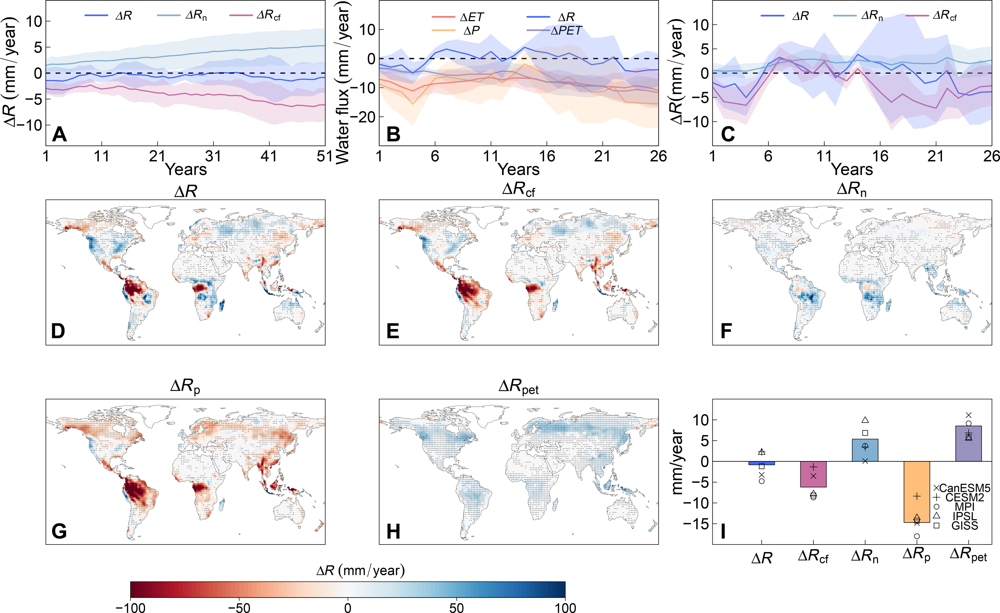
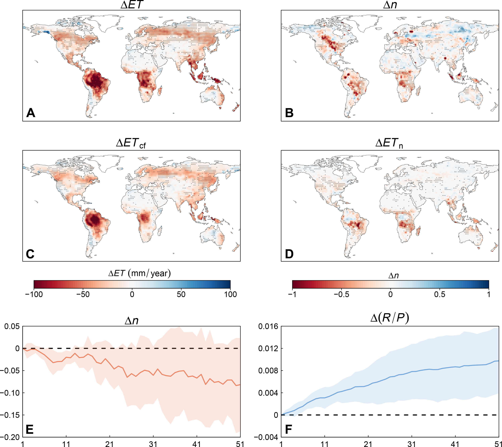
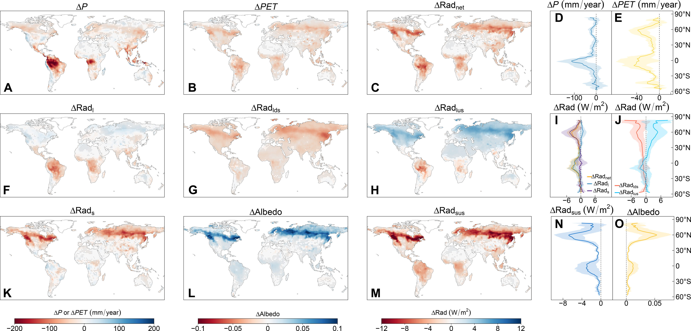
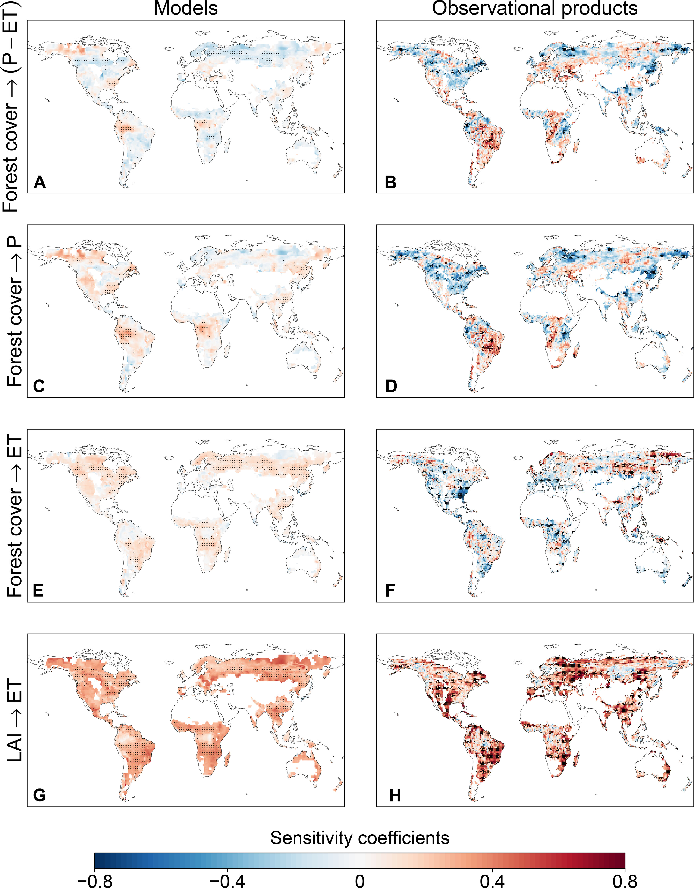
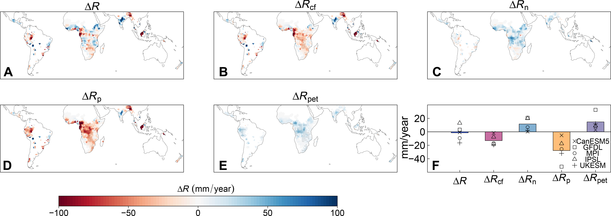

# Deforestation-induced runoff changes dominated by forest-climate feedbacks

## Abstract

Large-scale deforestation alters water availability through its direct effect on runoff generation and indirect effect through forest-climate feedbacks. However, these direct and indirect effects and their spatial variations are difficult to separate and poorly understood. Here, we develop an attribution framework that combines the Budyko theory and deforestation experiments with climate models, showing that widespread runoff reductions caused by the indirect effect of forest-climate feedbacks can largely offset the direct effect of reduced forest cover on runoff increases. The indirect effect dominates the hydrological responses to deforestation over 63% of deforested areas worldwide. This indirect effect arises from deforestation-induced reductions in precipitation and potential evapotranspiration, which decrease and increase runoff, respectively, leading to complex patterns of runoff responses. Our findings underscore the importance of forest-climate feedbacks for improved understanding and prediction of climate and hydrological changes caused by deforestation, with profound implications for sustainable management of forests and water resources.

## INTRODUCTION

Forests, which cover approximately 31% of the land surface on Earth, play an important role in regulating global water, energy, and carbon cycles1, 2. However, forests have undergone remarkable changes in recent decades due to natural disturbances (e.g., drought, fire, and pest) and human activities (e.g., afforestation, reforestation, and deforestation)3, 4. Despite satellite observations showing a global greening trend5–7, global forested area has decreased by 420 million ha, or 10.3%, from 1990 to 20208. Deforestation is mainly driven by agricultural expansion, most severely in the tropics9, 10, causing serious or even irreversible impacts on the water cycle and freshwater availability that is one of the most essential ecosystem services that forests provide11, 12. Large-scale deforestation in the tropics has seriously affected water supply to local and regional communities2, 11. While the topic “forests and water” has received widespread attention and discussion13, 14, the hydrological impact of large-scale deforestation is inadequately quantified and the underlying mechanisms, especially the indirect impact via forest-climate feedbacks, remain poorly understood. This knowledge gap may compromise human well-being and achievement of the United Nations Sustainable Development Goals (SDGs), in particular SDG6, which aims to ensure freshwater availability and sustainable management of water resources13, 15.

Forest cover change affects freshwater availability (precipitation minus evapotranspiration) and, hence, runoff by altering precipitation, evapotranspiration, soil water storage, and surface energy balance14, 16, 17. To investigate the impact of forest changes on runoff, previous studies typically used paired catchment experiments (one catchment underwent forest changes while the other did not)17–19 and/or empirical approaches, such as the Budyko framework that attributes observed changes in runoff to local climate change, i.e., altered precipitation and potential evapotranspiration (PET), and vegetation cover changes20–22. These studies consistently show that deforestation would increase runoff, as reduced forest cover decreases water loss through evapotranspiration and the partitioning of precipitation at land surface shifts toward runoff14, 23. However, the paired catchment experiments are often conducted at the small catchment scale (<100 km2, usually less than 10 km2). It remains uncertain whether the findings based on small-scale catchment experiments and observations can be extrapolated to runoff changes caused by large-scale deforestation. Recently, large-scale studies have shown that deforestation or forestation has complex effects on runoff due to climate change induced by forest-climate feedbacks16, 24–26. While the paired catchment experiments may identify changes in total runoff caused directly by reduced forest cover and, in some cases, also by indirect forest-climate feedbacks14, 19, 27, such direct and indirect effects cannot be clearly disentangled. In addition, the Budyko framework assumes that climate factors and vegetation cover as independent drivers of changes in runoff14, 21, 28; therefore, climate change induced by deforestation and associated impacts on runoff are ignored.

Deforestation may reduce local and downwind precipitation and runoff through reduced water vapor supply to the atmosphere by moisture recycling and may also influence precipitation through mesoscale circulation and moisture transport29–32. This precipitation feedback to vegetation changes is found to be scale and region dependent32. While small-scale deforestation and associated spatial gradients in surface roughness and atmospheric heating favor the generation of mesoscale circulations and increase precipitation33, the decrease in evapotranspiration caused by large-scale deforestation may reduce precipitation from local moisture recycling31, 34. Large decreases in precipitation have been observed recently at large scales (2° or about 200 km) in tropical deforested regions32. This suggests that negative vegetation-precipitation feedback appearing at a small scale may turn into positive at a larger scale, resulting in reduced precipitation and, hence, runoff due to deforestation, particularly when the scale of deforestation exceeds a threshold30. However, the question of whether the indirect impact of vegetation-precipitation feedback on runoff caused by large-scale deforestation can offset or even neutralize the direct impact of forest cover reduction is largely unresolved. In addition to precipitation, changes in surface roughness, albedo, and clouds caused by deforestation may affect the net radiation and, hence, PET27, 35, 36, but these effects, possibly secondary in magnitude, are often overlooked all together. Deforestation-induced changes in precipitation and PET may affect runoff in different ways, which, in turn, can lead to uncertainties in the net forest-climate feedbacks on runoff. The long-term impacts of continued large-scale deforestation on runoff changes around the world, particularly the local direct effect of reduced forest cover and the indirect forest-climate feedbacks, have yet to be examined and quantified.

Here, we directly assess the impact of continued large-scale deforestation on regional and global runoff changes and quantify the direct and indirect effects by developing an attribution framework that combines the empirical Budyko framework with an idealized global deforestation experiment (deforest-glob)37. Consistent with the preindustrial control simulation (piControl), all external forcings except for vegetation cover in deforest-glob are fixed at preindustrial levels to avoid the impact of other anthropogenic factors. The direct effect of large-scale deforestation from forest to natural grass and the indirect effect of forest-climate feedbacks have been fully represented in the coupled simulations of deforest-glob. Contributions from direct and indirect effects of forest changes to long-term runoff changes can be disentangled by applying the Budyko framework to deforest-glob38. We use five climate models, i.e., CanESM5, CESM2, GISS-E2-1-G, IPSL-CM6A-LR, and MPI-ESM1-2-LR, which provide deforest-glob simulations, in which 20 million km2 of forest is linearly converted to natural grassland in the first 50 years (table S1 and fig. S1), and forest cover remains constant in the following 30 years. In each model, runoff changes caused by deforestation are computed as the difference between all consecutive 30-year periods (51 periods in 80 years) from deforest-glob and the first 30-year period of piControl, which is representative of the period before the deforestation (Materials and Methods). The contributions of reduced forest cover and deforestation-induced climate change (i.e., changes in precipitation and PET) to runoff changes in deforest-glob are isolated using the Budyko attribution method38 (Materials and Methods). Our mechanistic understanding and quantification of the direct and indirect effects, derived from the idealized deforestation experiment under preindustrial conditions, would shed light on the hydrological consequences of deforestation in real-world scenarios. To evaluate the reliability of experimental results under current climate conditions, we further develop empirical regression models to assess the impacts of forest cover changes on evapotranspiration and precipitation over deforested areas, using observational products during 2001–2020.

## RESULTS

### Global runoff changes caused by deforestation

The five climate models show that the global runoff is projected to decrease slightly from the beginning of deforestation (Fig. 1A). While deforestation directly reduces evapotranspiration and increases runoff, this increase due to land surface effect is cancelled out by the indirect effect of forest-climate feedbacks, resulting in a net reduction in runoff in the first 30-year period of deforestation (Fig. 1, A and B). Considering that the isolated climate feedback effect may also arise from natural climate variability, we further identify the impact of deforestation on runoff changes as well as the contributions of land surface change (i.e, reduced forest cover) and forest-climate feedbacks for all consecutive 5-year periods in the first 30 years (years 1 to 30) relative to the reference period before deforestation in piControl. The positive land surface effect starts to appear from the first 5-year period and increases with the area of deforestation (Fig. 1C). While the climate feedback effect varies greatly due to climate variability, there was a significant negative trend (*P* < 0.01) from the seventh 5-year period, which was probably induced by forest-climate feedbacks associated with the scale of deforestation (Fig. 1C). Over time, both the positive land surface effect on runoff driven by deforestation and the negative climate feedback effect induced by deforestation are amplified with the increase of deforested areas (Fig. 1A). The finding that the direct land surface effect of large-scale deforestation increases runoff is consistent with previous studies14, 17, 18. However, the direct land surface effect is cancelled out by the indirect climate feedback effect, resulting in slight reductions in runoff throughout the simulation period (Fig. 1A).

**Figure 1.** Impacts of idealized deforestation on the terrestrial water cycle. (**A**) Thirty-year mean global runoff changes (Δ*R*) in deforest-glob (years 1 to 80) relative to piControl (years 1 to 30) and the isolated contributions of the climate feedback effect (Δ*R*cf) and the land surface effect (Δ*R*n) based on the Budyko attribution method. The *x* axis in (A) is the first year of each 30-year period. (**B**) Five-year mean changes in precipitation (Δ*P*), evapotranspiration (Δ*ET*), and potential evapotranspiration (Δ*PET*) in deforest-glob (years 1 to 30) relative to piControl. (**C**) Five-year mean Δ*R* in deforest-glob (years 1 to 30) relative to piControl and the isolated contributions of Δ*R*cf and Δ*R*n. The *x* axis in (B) is the first year of each 5-year period. The solid lines show multi-model means and the shading refers to 1 SD across the five climate models. (**D** to **F**) Multi-model mean Δ*R* (D) in the last 30-year period (years 51 to 80) of deforest-glob relative to piControl and the isolated contributions of Δ*R*cf(E) and Δ*R*n(F). (**G** and **H**) Contributions of changes in precipitation (Δ*R*p, G) and potential evapotranspiration (Δ*R*pet, H) to runoff changes. The stippling denotes regions where at least four of the five models agree on the sign of the runoff responses. (**I**) Changes in the global mean Δ*R*, Δ*R*cf, Δ*R*n, Δ*R*p, and Δ*R*pet among the five climate models.

We further examine the global patterns of runoff changes and isolated effects of land surface changes and climate feedbacks driven by deforestation in the last 30-year period (years 51 to 80) of deforest-glob. The runoff changes caused by deforestation vary geographically, which is mainly attributed to the climate feedback effect (Fig. 1, D to F, and fig. S2). Climate change induced by deforestation reduces runoff in South America, central Africa, and southeast Asia, and increases runoff in North America, northern Europe, and northern Asia (Fig. 1E). The negative climate feedback effect arises from the reduction in precipitation induced by deforestation, while concurrent decreases in PET contribute to runoff increases (Fig. 1, G to I, and figs. S3 and S4). Climate feedback effect also varies greatly in direction and magnitude across different models (fig. S3). In contrast, the direct land surface effects of five models increase runoff in most land areas (Fig. 1F and fig. S2). We also note variations in the magnitude of the land surface effect across regions and models due to differences in the location and fraction of deforestation in different models (figs. S1 and S2). A larger area of deforestation over the three tropical continents has caused larger impacts on regional climate and land surface changes, and hence runoff changes, compared to the boreal regions (Fig. 1, D to H). At the local (grid-cell) scale, deforestation-driven climate change dominates runoff changes over 64 ± 11% of assessed global land areas and 63 ± 12% of deforested areas (Fig. 1, D and E). Moreover, the climate feedback effect causes a strong decrease in runoff (−6.2 ± 3.6 mm/year, i.e., mean ± 1 SD across the five models) at the global scale, which cancels out the positive land surface effect (5.4 ± 4.0 mm/year), resulting in a net reduction in runoff (−0.8 ± 3.4 mm/year) induced by deforestation (Fig. 1, A and I). The negative climate feedback effect is evident in all five models, arising from the negative contribution of precipitation decreases (−14.7 ± 3.8 mm/year), while reductions in PET partially counteract this effect and contribute to runoff increases by 8.5 ± 2.6 mm/year (Fig. 1I). These findings demonstrate that deforestation-induced global runoff changes are dominated by the climate feedback effect, especially precipitation decreases.

### Direct and indirect effects of deforestation on runoff

We explore the mechanisms of the direct and indirect effects of deforestation based on the Budyko framework, which postulates that the precipitation partitioning between evapotranspiration and runoff is jointly controlled by available water (precipitation) and energy (PET) and regulated by land surface characteristics, such as vegetation cover22, 28. The five models consistently show decreases in global evapotranspiration after deforestation, which reduces forest transpiration and evaporation from canopy interception due to reduced leaf area and forces partitioning of precipitation in favor of runoff (Fig. 2 and fig. S5). Such direct effect of deforestation can be captured by the region-specific parameter *n* in the Budyko model (Materials and Methods), which has been widely used to evaluate the influence of vegetation cover changes39–41. A smaller value of the parameter *n* indicates that partitioning of precipitation shifts toward runoff instead of evapotranspiration, which is confirmed with an increasing ratio of runoff over precipitation in all models (Fig. 2, E and F). Considering that evapotranspiration is also affected by regional climate change, we further isolate the direct land surface effect associated with the parameter *n* and show that the direct effect induced by decreases in forest cover and evapotranspiration has caused runoff to increase, particularly in tropical regions (Figs. 1F and 2, B and D).

**Figure 2.** Changes in evapotranspiration and its drivers. (**A** and **B**) Multi-model mean changes in evapotranspiration (Δ*ET*, A) and the region-specific parameter *n* (Δ*n*, B) in the last 30-year period (years 51 to 80) of deforest-glob relative to piControl (years 1 to 30). (**C** and **D**) The same as (A), but for the isolated contributions of the climate feedback effect (Δ*ET*cf, C) and the land surface effect (Δ*ET*n, D). The stippling denotes regions where at least four of the five models agree on the sign of changes in the variables. (**E** and **F**) Changes in the region-specific parameter *n* and the fraction of precipitation partitioned to runoff (*R*/*P*) in deforest-glob relative to the first 30 years (years 1 to 30). The solid lines show multi-model means and the shading refers to 1 SD across the five climate models.

In addition to the direct land surface effect, decreases in forest cover also affect runoff via changes in precipitation and PET due to forest-climate feedbacks (Fig. 3). Most deforested areas have experienced reduced precipitation due to reduced moisture recycling via evapotranspiration as well as mesoscale circulation changes (Fig. 3, A and D, and fig. S4). The influence of deforestation and reduced evapotranspiration on precipitation is particularly strong in the Amazon and Congo (Fig. 3A and fig. S4), where precipitation largely relies on the recycling of local moisture input42, 43. It is important to note that deforestation does not necessarily reduce precipitation, with increased precipitation observed in southern South America and central North America (Fig. 3A and fig. S4). In response to deforestation, PET decreases over almost all deforested regions, yet the driving mechanisms vary geographically (Fig. 3, B and E, and fig. S4). PET represents the evaporative demand of the atmosphere and is largely driven by the net radiation. Deforestation induces a decrease in the net radiation, which is dominated by a decrease in the net long-wave radiation over tropical regions and by a decrease in the net short-wave radiation over boreal regions (Fig. 3, C, F and K). In the tropical regions, increases in surface temperature due to reduced evaporative cooling enhances upward long-wave radiation, and simultaneously, reduced moisture input to the atmosphere via evapotranspiration reduces the likelihood of cloud formation and reduces downward long-wave radiation, resulting in strong decreases in the net long-wave radiation (Fig. 3, F to J). In snow-covered boreal areas, reduced forest cover increases the surface albedo, leading to strong increases in the upward short-wave radiation and decreases in the net short-wave radiation (Fig. 3, K to O), while changes in the net long-wave radiation are relatively small (Fig. 3F).

**Figure 3.** Global patterns of changes in precipitation, potential evapotranspiration, and net radiation due to deforestation. (**A** to **O**) Multi-model mean changes in precipitation (Δ*P*, A), potential evapotranspiration (Δ*PET*, B), net radiation (ΔRadnet, C), net long-wave radiation (ΔRadl, F), downward long-wave radiation (ΔRadlds, G), upward long-wave radiation (ΔRadlus, H), net short-wave radiation (ΔRads, K), albedo (L), and upward short-wave radiation (Radsus, M) in the last 30-year period (years 51 to 80) of deforest-glob relative to piControl (years 1 to 30). Positive (negative) values indicate enhanced downward (upward) energy fluxes. The stippling denotes regions where at least four of five models agree on the sign of changes in the variables. The solid lines show multi-model means along the latitude and the shading refers to 1 SD across the five models (D, E, I, J, N, and O).

Comparing the direct effect on precipitation partitioning and the indirect effect of forest-climate feedbacks, deforestation affects evapotranspiration and runoff mainly through the indirect climate feedback effect over most land areas (Figs. 1 and 2). In particular, deforestation-driven climate change dominates the change in evapotranspiration over 69 ± 17% of deforested areas and contributes to 76 ± 14% of global evapotranspiration reductions (−21.9 ± 4.1 mm/year) across the five models (figs. S5 and S6). Given the two-way coupling of evapotranspiration and precipitation, the more pronounced indirect climate feedback effect compared to the direct effect is likely to have arisen from the cascading moisture recycling that reduces both evapotranspiration and precipitation following deforestation44. Reduced PET further amplifies the reductions in evapotranspiration and, hence, precipitation. However, as the reduced precipitation and PET affect runoff in opposite ways, the net climate feedback effect of deforestation depends on the interplay of complex mechanisms of land-atmosphere processes and varies markedly in space (Figs. 1, E, G, and H, and 3, A and B).

### Sensitivity of precipitation and evapotranspiration to forest cover changes

We further examine the effects of forest canopy cover on precipitation minus evapotranspiration (P − ET), which approximately equals runoff at the annual and longer timescales, based on remote sensing and observationally constrained reanalysis products. We estimate the sensitivity coefficients of P, ET, and P − ET to annual forest canopy cover over deforested regions using empirical statistical methods based on observational products and the deforest-glob simulations. The climate models show that forest canopy cover has a strong positive effect on P and ET over many tropical regions (Fig. 4, C and E). The spatial patterns of the effects of forest canopy cover on P, ET, and P − ET are broadly consistent with those of the simulated hydrological responses to deforestation based on the multi-model means (Figs. 4, A, C, and E, 3A, 2A, and 1D) as well as individual models (figs. S2 and S4 to S7), which support the effectiveness of the empirical statistical methods. The spatial pattern of the effect of forest canopy cover on P − ET varies with climate models (fig. S7), which may have arisen from uncertainties in how forest-climate feedbacks are represented. This also reflects the intricate nature of hydrological responses to deforestation due to the multifaceted interplay of underlying mechanisms across different climatic conditions.

**Figure 4.** Deforestation effects on precipitation and evapotranspiration. (**A** and **B**) Sensitivity coefficients for forest canopy cover → precipitation minus evapotranspiration (P − ET) identified based on the deforest-glob simulations (years 1 to 50) in the four climate models except for GISS-E2-1-G (forest cover is not available) and observational products (2001–2020). The sensitivity coefficient identified using observational products is shown for deforested areas where forest canopy cover was reduced by more than 0.01 during the study period. (**C** to **H**) The same as A and B, but for the sensitivity coefficients for forest canopy cover → P (C and D), forest canopy cover → ET (E and F), and leaf area index (LAI) → ET (G and H). The stippling denotes regions where the sensitivity coefficient is significant at the 95% level (B, D, F, and H), and where at least three of the four models agree on the sign of the significant sensitivity coefficients (A, C, E, and G).

Forest changes in the real world are more complex—deforestation and afforestation coexist, and forest loss may be covered by vegetation greening at a large scale, which complicate the hydrological responses to forest changes. Despite differences in the deforestation scenarios and climatic conditions, climate models in Fig. 4A and observational products in Fig. 4B consistently show significant impacts of forest canopy cover on P − ET, such as the positive effects in the Amazon and Congo and the negative effects in many high-latitude regions. Considering vegetation greening over deforested regions, due to land management such as agricultural expansion and the CO2 fertilization effect, climate models and observational products indicate that ET is more strongly related to leaf area index (LAI), which directly influences vegetation transpiration, than forest canopy cover in almost all deforested areas (Fig. 4, E to H). As deforestation reduces forest canopy cover, LAI, and vegetation transpiration, the reduced moisture input into the atmosphere and, hence, local and downwind precipitation through moisture recycling lead to a positive feedback of forest canopy cover on precipitation29, 30, 32. Both observational products and models show strong positive effects of forest canopy cover on precipitation in moist forests (the Amazon and Congo, Fig. 4, C and D) because they are “closed” atmospheric systems where most precipitation comes from local and upwind evapotranspiration43, 45. A recent study also noted a significant decrease in precipitation due to tropical deforestation32. In addition, we find negative effects of forest canopy cover on precipitation, mostly in the mid- and high-latitude regions (Fig. 4, C and D, and figs. S4 and S7), where precipitation is probably sensitive to deforestation-induced circulation changes, and these changes are more dynamic and variable in space and time than the moisture recycling effect25, 43. Overall, these observational results support the finding that climate change driven by deforestation may play a predominant role in runoff changes in most tropical areas based on the deforest-glob experiment.

### Local and remote effects of deforestation

Large-scale deforestation significantly affects local runoff, with spatial differences in the land surface and climate feedback effects (figs. S8 and S9). The negative climate feedback effect in many tropical deforested areas offsets the positive land surface effect, resulting in a net decrease in runoff, particularly in the Amazon and Congo rainforests (fig. S8). In many areas of North America and Europe, deforestation induces runoff increases as the effect of decreased PET outweighs that of decreased precipitation, causing a positive climate feedback effect on runoff (fig. S9). Deforestation affects not only local runoff, but also runoff in remote areas through atmospheric circulation and teleconnections30, 46. We find that changes in runoff occur in almost all nondeforested areas due to the remote effects of deforestation, except in the arid regions of Africa (fig. S10). The Northern Hemisphere experiences great changes in runoff over many nondeforested areas. A decrease in runoff is observed in many nondeforested areas of North America and Asia, while an increase in runoff is observed in some nondeforested areas of Europe (fig. S10). The runoff changes in nondeforested areas mainly arise from the climate feedback effect, and more precisely, precipitation changes (fig. S11). Compared to evapotranspiration, deforestation leads to decreases in precipitation and runoff to a larger spatial extent, which likely arises from circulation changes induced by large-scale deforestation30, 32. Nondeforested areas also experience weak land surface effects because vegetation cover in nondeforested areas is affected by climate change caused by deforestation35. While the sign and magnitude of deforestation-induced runoff changes vary geographically, all five models show strong signals of runoff changes in both deforested and nondeforested areas (figs. S8 and S10). This suggests the worldwide impact of large-scale deforestation on terrestrial water cycle through local land surface and climate changes as well as remote circulation and precipitation changes.

### Hydrological implications of future deforestation

The hydrological responses to large-scale deforestation under preindustrial (deforest-glob) and current (observations) climate conditions have important implications for projecting hydrological changes in future deforestation scenarios. To assess the hydrological impact of future deforestation, we identify runoff changes between the historical (1985–2014) and future (2071–2100) periods based on a pair of land use sensitivity experiments driven by the same anthropogenic forcings but different land use settings: a deforestation scenario (ssp126_370lu) and a reforestation scenario (ssp126) (fig. S12 and Materials and Methods). Using the Budyko attribution method, we can isolate the land surface effect and the climate change effect responsible for runoff changes in each of the two scenarios and their differences are attributed to the direct effect of deforestation and the indirect effect of forest-climate feedbacks over deforested areas in ssp126_370lu. It is clear from Fig. 5 that future deforestation increases runoff through the direct effect of reduced forest cover (11.6 ± 10.5 mm/year), but reduces runoff via forest-climate feedbacks (−13.0 ± 8.4 mm/year). In particular, the climate feedback effect dominates deforestation-induced runoff changes over 64 ± 11% of deforested areas. These attribution results are consistent with the findings from the deforest-glob experiment and underscore the importance of forest-climate feedbacks in hydrological changes under preindustrial, current, and future climate conditions.

**Figure 5.** Impacts of future deforestation on the terrestrial water cycle. (**A** to **C**) Deforestation-induced changes in runoff (Δ*R*, A) between the historical (1985–2014) and future (2071–2100, ssp126_ssp370lu) periods and the isolated contributions of the climate feedback effect (Δ*R*cf, B) and the land surface effect (Δ*R*n, C). (**D** and **E**) Contributions of deforestation-induced changes in precipitation (Δ*R*p, D) and potential evapotranspiration (Δ*R*pet, E) to runoff changes. The stippling denotes regions where at least four of the five models agree on the sign of the runoff responses. (**F**) Deforestation-induced changes in the global mean Δ*R*, Δ*R*cf, Δ*R*n, Δ*R*p, and Δ*R*pet among the five climate models.

## DISCUSSION

Our study demonstrates that large-scale deforestation reduces global runoff due to forest-climate feedbacks. The indirect negative climate feedback effect offsets the direct positive effect of reduced forest cover, resulting in a net decrease in global runoff. The negative climate feedback effect is particularly strong in the tropical rainforests of the Amazon and Congo basins, where precipitation largely relies on local moisture recycling43. Consequently, deforestation reduces the cascading moisture recycling between evapotranspiration and precipitation44. Moreover, decreased evapotranspiration reduces atmospheric moisture content and alters atmospheric circulations, which tend to reduce moisture convergence for precipitation under wet conditions but increase moisture convergence in dry environments47–49. This leads to a greater decrease in precipitation than in evapotranspiration and reduced runoff in the tropical rainforests and increased runoff over many subtropical dry zones. In addition, we find reduced net radiation and PET, which reduce evapotranspiration and increase runoff, particularly in boreal regions where reduced forest cover greatly increases the albedo and results in less solar radiation absorption. This counteracts the negative effect of reduced precipitation and leads to a net positive effect of forest-climate feedbacks on runoff over many high-latitude regions. Overall, the climate feedback effect is found to be negative due to reduced precipitation and dominates deforestation-induced runoff changes over 64% of global land areas and 63% of deforested areas.

By developing an attribution framework that integrates the Budyko theory with idealized deforestation experiments, our study enables mechanistic understanding and quantification of the direct effect of reduced forest cover and the indirect forest-climate feedbacks that are responsible for runoff changes induced by large-scale deforestation. The identified positive, direct effect is consistent with observational evidence and hydrological model simulations14, 21, 50, and has been regarded as the main hydrological impacts of deforestation or afforestation17, 18, 51. While the forest-climate feedbacks have been recognized, the indirect effects on runoff changes have not been fully accounted for in previous studies12, 30, 32. Recent large-scale studies have attempted to quantify the indirect effect of moisture transport from local and upwind vegetated areas based on representative evaporation-recycling patterns, but potential changes in atmospheric circulations are not considered16, 52. This is because the complex forest-climate feedbacks are not well understood and difficult to be fully incorporated for quantitative assessments, especially in observational studies. Our study presents both observational and modeling evidence, indicating significant signals of forest-climate feedbacks responsible for large-scale hydrological changes. The attribution analyses further suggest that the indirect forest-climate feedbacks can largely offset the direct effect on runoff over deforested areas and exert substantial impacts on the global water cycle and thus play a dominant role in the hydrological responses to deforestation over most land areas. The indirect effect arises not only from the well-recognized vegetation-precipitation feedback, but also from deforestation-induced reductions in the net radiation and PET, which partially or totally counteract the effect of reduced precipitation, resulting in complex patterns of increased and decreased runoff in different regions. Given the importance of these forest-climate feedbacks in global water cycle, it is critical to continue to understand the land-atmosphere processes underlying the hydrological responses to large-scale vegetation changes and fully account for their direct and indirect effects on freshwater availability.

We acknowledge that there are uncertainties and caveats in our analyses of the long-term hydrological responses to large-scale deforestation, which rely on the idealized deforestation experiments under preindustrial forcings and future anthropogenic emissions. In particular, the sign and magnitude of deforestation-induced runoff changes show large discrepancy across the five models (fig. S2). Despite the fact that the net effect of deforestation on runoff changes varies greatly across models and regions, all models consistently agree on the robust signals of a positive direct effect and a negative indirect effect of deforestation on global runoff (Fig. 1I). The inter-model difference in the spatial pattern of runoff changes is partly because the preindustrial forest cover and hence the location and magnitude of deforestation are different in the five models (fig. S1 and Materials and Methods). We also note the differences in how forest-climate feedbacks are represented in models29, 30, 53 and the resulting divergent responses of precipitation and PET to deforestation. These differences contribute to large uncertainties in the identified indirect effect of forest-climate feedbacks on runoff changes. An important caveat is that the deforestation experiments have not considered the biogeochemical effect of deforestation-induced carbon emissions on global climate change (i.e., precipitation and PET), which may further alter the indirect forest-climate feedbacks and global hydrological responses to large-scale deforestation36, 54. Further work is needed to compare the biophysical and biogeochemical effects of large-scale deforestation on hydrological changes under current and future climate conditions.

Our study highlights the importance of forest-climate feedbacks in the hydrological responses to large-scale deforestation, with profound implications for sustainable management of forests and water resources. While the deforestation-induced climate change is difficult to be isolated from background climate change and has often been overlooked, it is critical to the provision of ecosystem services by remaining forests, such as carbon storage35 and freshwater resources2. A better understanding and quantification of climate and hydrological changes caused by large-scale forest changes are urgently needed because afforestation and reforestation have been proposed as a nature-based solution to mitigate climate change, but the implementation of “land greening” programs has not taken into account the potential consequences for regional climate and freshwater availability16, 52, 55. This may increase ecological and social risks, such as enhanced drought and fire risks56, 57 and unsustainable water consumption by some restoration projects51, and compromise the mitigation goals13. There is a pressing need for future efforts to strengthen multi-scale observations and realistically represent forest-climate interactions in climate models to improve projections of the multifaceted impacts of large-scale forest changes on climate and water resources. Future forest restoration strategies ought to consider forest-climate interactions and evaluate the direct hydrological impact of forest cover changes as well as the indirect effects of forest-induced climate and hydrological changes, which are critical to ensure water supply for local and remote areas, particularly in water-scarce dryland regions where many forest restoration programs are located16, 58.

## MATERIALS AND METHODS

### CMIP6 simulations

We used the deforest-glob and piControl simulations from five climate models [CanESM559, CESM260, GISS-E2-1-G61, IPSL-CM6A-LR62, and MPI-ESM1–2-LR63], which participate in the Land Use Model Intercomparison Project (LUMIP) of the Coupled Model Intercomparison Project phase 6 (CMIP6)30. deforest-glob assumes a linear reduction of 20 million km2 in global forest area in the first 50 years (years 1 to 50), with deforestation occurring only in the top 30% of areas with the highest initial tree cover (fig. S1)37. Deforestation stops and tree cover remains stable in the following 30 years (years 51 to 80). piControl provides a reference climate background before large-scale industrialization, as the anthropogenic forcings are fixed at the level of the year 1850. All external forcings in deforest-glob are the same as in piControl except for forest cover.

The five climate models were used as (i) they provide monthly evapotranspiration (“evspsbl”), latent heat flux (“hfls”), sensible heat flux (“hfss”), total runoff (“mrro”), precipitation (“pr”), near surface air temperature (“tas”) and pressure (“ps”), surface downwelling and upwelling long-wave radiation (“rlds” and “rlus”), and surface downwelling and upwelling short-wave radiation (“rsds” and “rsus”), which are required for our analysis; (ii) they have accurately represented the climatological water balance, i.e., precipitation equals the sum of runoff and evapotranspiration at the 30-year scale; and (iii) they have strictly followed the experimental design for deforestation outlined in deforest-glob30. We also used tree cover fraction (“treeFrac”) and leaf area index (“lai”) from the five models (tree cover fraction is not available in GISS-E2-1-G). PET was calculated from air temperature, pressure, and the net radiation, i.e., the sum of latent and sensible heat fluxes in each model based on the Priestley-Taylor equation64 (see Eq. 2). The deforest-glob simulations in several other models were not used due to a lack of required variables, systematic biases in terrestrial water balance, and problems in the settings of deforestation experiment, e.g., forest cover increases in the last 30 years. The five selected models are the only ones to meet the data requirements for this attribution analysis.

For each model, the impact of deforestation on the mean annual runoff, precipitation, evapotranspiration, PET, radiation, and albedo was calculated as the difference between the last 30-year period (years 51 to 80) in deforest-glob and the first 30-year period (years 1 to 30) in piControl, which is representative of the climate and land surface characteristics before the large-scale deforestation. All model outputs were mapped to a common spatial resolution of 1° × 1° by utilizing bilinear interpolation to obtain multi-model ensemble results.

We also used climate and hydrological outputs from the historical simulations, future simulations under the low-emission scenario (ssp126, a reforestation scenario), and the ssp126 simulations with land use from ssp370 (ssp126_370lu, a deforestation scenario), which are provided in LUMIP30. Similar to deforest-glob, five climate models that provide required variables and accurately represent the terrestrial water balance were used for data analyses (table S1). As ssp126 and ssp126_370lu are driven by the same anthropogenic forcings but different land use settings, they could be used to identify the impact of deforestation on runoff changes between the historical (1985–2014) and future (2071–2100) periods. To assess the impact of large-scale deforestation on runoff changes, we focused on deforested areas where the forest cover is reduced by at least 10% in the tropics (south of 30°N). This approach allowed us to reduce the potential impact of afforestation in surrounding areas, particularly in the Northern mid- and high-latitude regions where deforestation and afforestation coexist in future simulations (fig. S12).

### Remote sensing and reanalysis datasets

To assess the effects of deforestation on evapotranspiration and precipitation, we also used forest canopy cover with a spatial resolution of 30 m from the Global Forest Change version 1.103, LAI with a spatial resolution of 500 m (MOD15A2H) from the Moderate Resolution Imaging Spectroradiometer (MODIS)65, evapotranspiration from the Global Land Evaporation Amsterdam Model (GLEAM, 0.25°) v3.6a66, precipitation from the Multi-Source Weighted-Ensemble Precipitation (MSWEP, 0.1°) V28067, air temperature from the European Centre for Medium-Range Weather Forecasts (ERA5, 0.25°)68, and surface net solar radiation from Clouds and Earth’s Radiant Energy System (CERES) Energy Balanced (CERES_SYN1deg_Ed4.1, 1°)69. We used forest canopy cover in 2000 and subsequent forest loss due to deforestation from the Global Forest Change to generate forest canopy cover during 2001–2020. As suggested by a recent study32, the effect of deforestation on precipitation is evident at large scales of 0.5° to 2°; we therefore calculated forest canopy cover change at each 30-m pixel, and calculated the average of all pixels within each 1° grid cell to obtain forest canopy cover at a spatial resolution of 1° × 1°. All other observational products covering the 2001–2020 period were also aggregated to a spatial resolution of 1° × 1° using the bilinear interpolation.

### Direct and indirect effects of deforestation on runoff

Deforestation affects runoff through the direct effect of reduced forest cover on the partitioning of precipitation into evapotranspiration (ET) and runoff and the indirect effect of climate change (e.g., changes in precipitation and PET) induced by forest-climate feedbacks16, 24. As these land-atmosphere processes are fully coupled in deforest-glob, the direct and indirect effects cannot be directly disentangled based on climate model experiments. To address this issue, we combined the Budyko attribution method with the deforest-glob and piControl experiments to isolate the direct effect of reduced forest cover on runoff from the indirect effect of forest-climate feedbacks.

The Budyko hypothesis states that climatological (30-year) mean ET for a given region is primarily controlled by available water (precipitation, P) and energy (PET), and regulated by land surface characteristics, such as vegetation, soil, and topography22, 70. These land surface factors can be encapsulated with a region-specific parameter, such as the parameter *n* in the Choudhury-Yang’s function71, 72, which is one of the most widely used Budyko model. Changes in the parameter *n* have been widely used to evaluate the hydrological impacts of vegetation changes in previous studies16, 38, 41.

**Equation 1.**

$$
ET = P{[{(\frac{PET}{P})}^{- n} + 1]}^{- \frac{1}{n}}, n \in (0, ∞)
$$

**Equation 2.**

$$
PET = 1.26\frac{s(Rad_{net} - G)}{λ(s + γ)}
$$

where *s* is the slope of the saturation vapor pressure with respect to air temperature (kPa∙K−1), λ is the latent heat of vaporization (MJ∙kg−1) as a function of air temperature, and γ the psychometric constant (kPa∙K−1). Radnet − *G* is the net radiation minus ground heat flux, which is equal to the sum of latent and sensible heat fluxes (MJ∙m−2∙day−1) at the monthly scale.

As changes in soil water storage can be negligible at the 30-year scale, the mean annual runoff (*R*) can be calculated as the difference between P and ET

**Equation 3.**

$$
R = P - P{[{(\frac{PET}{P})}^{- n} + 1]}^{- \frac{1}{n}}, n \in (0, ∞)
$$

The Budyko equations (Eqs. 2 and 3) above suggest that the hydrological impacts of deforestation are jointly controlled by changes in the parameter *n*, which represents the direct impact of land surface changes on precipitation partitioning between ET and runoff, and changes in precipitation and PET due to forest-climate feedbacks. According to Eq. 2, PET is largely driven by the net radiation, i.e., the sum of net short-wave radiation and net long-wave radiation, which are affected by deforestation-induced changes in surface albedo, surface and air temperatures, and cloud cover, among others73.

On the basis of Eq. 3, the direct effect of land surface changes, i.e., changes in the parameter *n* (∆*n*), and the indirect effect of forest-climate feedbacks, i.e., changes in P (∆*P*) and PET (∆*PET*), induced by deforestation could be separated and quantified based on the first-order Taylor approximation of change in runoff (∆*R*)74, 75.

**Equation 4.**

$$
∆R≈\frac{∂R}{∂P}∆P + \frac{∂R}{∂PET}∆PET + \frac{∂R}{∂n}∆n
$$

As the higher-order terms in the Taylor expansion have been ignored, the direct application of Eq. 4 would induce errors in attribution28. To solve this problem, we used an improved Budyko attribution method, i.e., the complementary method, in which the runoff changes induced by land surface changes $[\frac{∂R}{∂n}∆n]$ is evaluated with changes in the sensitivity coefficients $[P∆(\frac{∂R}{∂P}) + PET∆(\frac{∂R}{∂PET})]$, which are essentially identical in the differential form $[\frac{∂R}{∂n}dn = Pd(\frac{∂R}{∂P}) + PETd(\frac{∂R}{∂PET})]$28, 38. In this way, ∆*R* can be exactly decomposed into the climate feedback effect and the land surface effect

**Equation 5.**

$$
∆R = \frac{∂R}{∂P}∆P + \frac{∂R}{∂PET}∆PET + [P∆(\frac{∂R}{∂P}) + PET∆(\frac{∂R}{∂PET})]
$$

The two sensitive coefficients can be derived from Eq. 3 as

**Equation 6.**

$$
\frac{∂R}{∂P} = 1 - {[\frac{{(\frac{PET}{P})}^{n}}{1 + {(\frac{PET}{P})}^{n}}]}^{(1 + \frac{1}{n})}
$$

**Equation 7.**

$$
\frac{∂R}{∂PET} = - {[\frac{1}{1 + {(\frac{PET}{P})}^{n}}]}^{(1 + \frac{1}{n})}
$$

On the basis of the Budyko attribution method with Eq. 5, we can precisely isolate the direct, land surface effect of deforestation, from the indirect, climate feedback effect induced by deforestation. To do this, we computed the differences in R (∆*R*), P (∆*P*), and PET (∆*PET*) between the last 30-year period (years 51 to 80) in deforest-glob and the first 30-year period (years 1 to 30) in piControl, and solved the parameter *n* based on Eq. 3 to calculate the two sensitive coefficients in Eqs. 6 and 7 and their differences between deforest-glob and piControl. Therefore, the direct effect of reduced forest cover on runoff is quantified as $P∆(\frac{∂R}{∂P}) + PET∆(\frac{∂R}{∂PET})$, and the indirect effects of deforestation-induced climate change include the contributions of changes in precipitation $(\frac{∂R}{∂P}∆P)$ and PET $(\frac{∂R}{∂PET}∆PET)$. Considering differences in the sensitivity coefficients and climatic factors between deforest-glob and piControl, the reference sensitivity coefficients $(\frac{∂R}{∂P}$ and $\frac{∂R}{∂PET})$ and the reference climatic factors (*P* and *PET*) in Eq. 5 were calculated as the mean values of the two experiments to reduce the uncertainties in the attribution analysis28, 38. Similarly, the direct land surface effect and the indirect climate feedback effect of deforestation on ET can be isolated based on the sensitivity coefficients $(\frac{∂ET}{∂P}$ and $\frac{∂ET}{∂PET})$ derived from Eq. 1.

To show the long-term changes in terrestrial water balance caused by deforestation during the simulation period, we calculated global mean R, ET, P, PET, and the region-specific parameter *n* for all consecutive 30-year periods (51 in total) in deforest-glob for each model. On the basis of the Budyko attribution method, we attributed changes in global runoff and ET to the effect of deforestation-induced climate change and that of land surface changes, i.e., reduced forest cover, in each 30-year period in deforest-glob, relative to the first 30-year period in piControl (years 1 to 30).

The Budyko attribution method above was also used to isolate the contributions of climate change and land use changes to runoff changes between the historical (1985–2014) and future (2071–2100) periods under the ssp126 and ssp126_370lu scenarios. Comparing the climate change effects and land use effects in the two scenarios, we were able to isolate the direct effect of deforestation and the indirect effect of deforestation-induced climate change (i.e., ssp126_370lu minus ssp126) on future runoff changes over deforested areas.

### Impacts of vegetation changes on precipitation and evapotranspiration

To identify the effects of reduced forest canopy cover (*F*) on P, ET, and P − ET, which approximately equals moisture convergence and runoff at the annual scale, we examined the relationships between annual forest canopy cover and these hydrological variables over deforested areas. As forest canopy cover changes are mainly caused by human activities and rarely by regional precipitation changes in deforested areas, we directly assessed the sensitivities of P and P − ET to annual forest canopy cover changes based on linear regression.

**Equation 8.**

$$
P = m_{0} + m_{1}×F
$$

**Equation 9.**

$$
P - ET = m_{0} + m_{1} \times F
$$

where the slope *m*1 represents the feedback of forest canopy cover on P or P − ET, i.e., $\frac{\mathit{dP}}{\mathit{dF}}$ and $\frac{d(P - ET)}{dF}$. We estimated the standardized coefficient *m*1(dimensionless sensitivity coefficient), i.e., the derivative of standardized P or P − ET to standardized *F* with zero mean and unit variance, to enable comparison of the forest-precipitation feedbacks across different models/regions.

Unlike P and P − ET (or moisture convergence), which are strongly controlled by large-scale atmospheric dynamics, ET primarily depends on regional supply of water and energy and is also regulated by regional atmospheric and land surface conditions, such as precipitation, air temperature, forest canopy cover, and LAI76. Compared to forest canopy cover, i.e., the percent cover of tree canopy, LAI quantifies the amount of leaf area in a canopy and is therefore more closely related to forest transpiration. In addition, vegetation dynamics over deforested areas, such as agricultural expansion and grass growth, can be captured by LAI. To account for these land-atmosphere drivers, we established a multiple linear regression model to assess the effects of forest canopy cover (*F*) and LAI on ET, with potential effects of precipitation (*P*), air temperature (*T*), and net radiation (Radnet) included.

**Equation 10.**

$$
\mathit{ET} = m_{0} + m_{1}×F + m_{2}×\text{LAI} + m_{3}×P + m_{4}×T + m_{5}×\text{Rad}_{\text{net}}
$$

where the slopes *m*1 and *m*2 represent the effects of forest canopy cover and LAI on ET, respectively. Partial least-squares regression (PLSR) was used to obtain the standardized sensitivity coefficients *m*1 and *m*2 in Eq. 10. PLSR combines the characteristics of multiple linear regression and principal component analysis and can overcome the multicollinearity issue among independent variables. Similar to previous studies38, 49, we used a bootstrap test to determine the significance of the sensitivity coefficients. The time series of the variables in Eq. 10 were randomly resampled to obtain the 95% confidence intervals of the sensitivity coefficients, which are deemed statistically significant if zero does not fall with the 95% confidence interval38, 49.

## References (76 total, showing 76)

1. G. B. Bonan, Forests and climate change: Forcings, feedbacks, and the climate benefits of forests. Science 320 , 1444–1449 (2008).
2. M. Zhang, X. Wei, Deforestation, forestation, and water supply. Science 371 , 990–991 (2021).
3. M. C. Hansen, P. V. Potapov, R. Moore, M. Hancher, S. A. Turubanova, A. Tyukavina, D. Thau, S. V. Stehman, S. J. Goetz, T. R. Loveland, A. Kommareddy, A. Egorov, L. Chini, C. O. Justice, J. R. G. Townshend, High-resolution global maps of 21st-century forest cover change. Science 342 , 850–853 (2013).
4. X. P. Song, M. C. Hansen, S. V. Stehman, P. V. Potapov, A. Tyukavina, E. F. Vermote, J. R. Townshend, Global land change from 1982 to 2016. Nature 560 , 639–643 (2018).
5. C. Chen, T. Park, X. Wang, S. Piao, B. Xu, R. K. Chaturvedi, R. Fuchs, V. Brovkin, P. Ciais, R. Fensholt, H. Tømmervik, G. Bala, Z. Zhu, R. R. Nemani, R. B. Myneni, China and India lead in greening of the world through land-use management. Nat. Sustain. 2 , 122–129 (2019).
6. S. Piao, X. Wang, T. Park, C. Chen, X. Lian, Y. He, J. W. Bjerke, A. Chen, P. Ciais, H. Tømmervik, R. R. Nemani, R. B. Myneni, Characteristics, drivers and feedbacks of global greening. Nat. Rev. Earth. Environ. 1 , 14–27 (2020).
7. Z. Zhu, S. Piao, R. B. Myneni, M. Huang, Z. Zeng, J. G. Canadell, P. Ciais, S. Sitch, P. Friedlingstein, A. Arneth, C. Cao, L. Cheng, E. Kato, C. Koven, Y. Li, X. Lian, Y. Liu, R. Liu, J. Mao, Y. Pan, S. Peng, J. Peñuelas, B. Poulter, T. A. M. Pugh, B. D. Stocker, N. Viovy, X. Wang, Y. Wang, Z. Xiao, H. Yang, S. Zaehle, N. Zeng, Greening of the Earth and its drivers. Nat. Clim. Chang. 6 , 791–795 (2016).
8. Food and Agriculture Organization of the United Nations (FAO), Global Forest Resources Assessment (Food and Agriculture Organization, 2020).
9. F. Pendrill, T. A. Gardner, P. Meyfroidt, U. M. Persson, J. Adams, T. Azevedo, M. G. Bastos Lima, M. Baumann, P. G. Curtis, V. De Sy, R. Garrett, J. Godar, E. D. Goldman, M. C. Hansen, R. Heilmayr, M. Herold, T. Kuemmerle, M. J. Lathuillière, V. Ribeiro, A. Tyukavina, M. J. Weisse, C. West, Disentangling the numbers behind agriculture-driven tropical deforestation. Science 377 , (2022).
10. Z. Zeng, L. Estes, A. D. Ziegler, A. Chen, T. Searchinger, F. Hua, K. Guan, A. Jintrawet, E. F. Wood, Highland cropland expansion and forest loss in Southeast Asia in the twenty-first century. Nat. Geosci. 11 , 556–562 (2018).
11. V. B. P. Chagas, P. L. B. Chaffe, G. Blöschl, Climate and land management accelerate the Brazilian water cycle. Nat. Commun. 13 , 5136 (2022).
12. X. Xu, X. Zhang, W. J. Riley, Y. Xue, C. A. Nobre, T. E. Lovejoy, G. Jia, Deforestation triggering irreversible transition in Amazon hydrological cycle. Environ. Res. Lett. 17 , 034037 (2022).
13. A. M. Mapulanga, H. Naito, Effect of deforestation on access to clean drinking water. Proc. Natl. Acad. Sci. U.S.A. 116 , 8249–8254 (2019).
14. X. Wei, Q. Li, M. Zhang, K. Giles-Hansen, W. Liu, H. Fan, Y. Wang, G. Zhou, S. Piao, S. Liu, Vegetation cover—Another dominant factor in determining global water resources in forested regions. Glob. Chang. Biol. 24 , 786–795 (2018).
15. D. Ellison, C. E. Morris, B. Locatelli, D. Sheil, J. Cohen, D. Murdiyarso, V. Gutierrez, M. van Noordwijk, I. F. Creed, J. Pokorny, D. Gaveau, D. V. Spracklen, A. B. Tobella, U. Ilstedt, A. J. Teuling, S. G. Gebrehiwot, D. C. Sands, B. Muys, B. Verbist, E. Springgay, Y. Sugandi, C. A. Sullivan, Trees, forests and water: Cool insights for a hot world. Glob. Environ. Chang. 43 , 51–61 (2017).
16. A. J. Hoek van Dijke, M. Herold, K. Mallick, I. Benedict, M. Machwitz, M. Schlerf, A. Pranindita, J. J. E. Theeuwen, J.-F. Bastin, A. J. Teuling, Shifts in regional water availability due to global tree restoration. Nat. Geosci. 15 , 363–368 (2022).
17. M. Zhang, N. Liu, R. Harper, Q. Li, K. Liu, X. Wei, D. Ning, Y. Hou, S. Liu, A global review on hydrological responses to forest change across multiple spatial scales: Importance of scale, climate, forest type and hydrological regime. J. Hydrol. 546 , 44–59 (2017).
18. A. E. Brown, L. Zhang, T. A. McMahon, A. W. Western, R. A. Vertessy, A review of paired catchment studies for determining changes in water yield resulting from alterations in vegetation. J. Hydrol. 310 , 28–61 (2005).
19. J. J. McDonnell, J. Evaristo, K. D. Bladon, J. Buttle, I. F. Creed, S. F. Dymond, G. Grant, A. Iroume, C. R. Jackson, J. A. Jones, T. Maness, K. J. McGuire, D. F. Scott, C. Segura, R. C. Sidle, C. Tague, Water sustainability and watershed storage. Nat. Sustain. 1 , 378–379 (2018).
20. M. I. Budyko, Climate and Life (Academic Press, 1974).
21. G. Zhou, X. Wei, X. Chen, P. Zhou, X. Liu, Y. Xiao, G. Sun, D. F. Scott, S. Zhou, L. Han, Y. Su, Global pattern for the effect of climate and land cover on water yield. Nat. Commun. 6 , 5918 (2015).
22. S. Zhou, B. Yu, Y. Huang, G. Wang, The complementary relationship and generation of the Budyko functions. Geophys. Res. Lett. 42 , 1781–1790 (2015).
23. D. Ellison, M. N. Futter, K. Bishop, On the forest cover–water yield debate: From demand- to supply-side thinking. Glob. Chang. Biol. 18 , 806–820 (2012).
24. Y. Li, S. Piao, L. Z. X. Li, A. Chen, X. Wang, P. Ciais, L. Huang, X. Lian, S. Peng, Z. Zeng, K. Wang, L. Zhou, Divergent hydrological response to large-scale afforestation and vegetation greening in China. Sci.Adv. 4 , eaar4182 (2018).
25. R. Portmann, U. Beyerle, E. Davin, E. M. Fischer, S. De Hertog, S. Schemm, Global forestation and deforestation affect remote climate via adjusted atmosphere and ocean circulation. Nat. Commun. 13 , 5569 (2022).
26. S. J. De Hertog, C. E. Lopez-Fabara, R. van der Ent, J. Keune, D. G. Miralles, R. Portmann, S. Schemm, F. Havermann, S. Guo, F. Luo, I. Manola, Q. Lejeune, J. Pongratz, C. F. Schleussner, S. I. Seneviratne, W. Thiery, Effects of idealized land cover and land management changes on the atmospheric water cycle. Earth Syst. Dynam. 15 , 265–291 (2024).
27. R. M. Bright, K. Zhao, R. B. Jackson, F. Cherubini, Quantifying surface albedo and other direct biogeophysical climate forcings of forestry activities. Glob. Chang. Biol. 21 , 3246–3266 (2015).
28. S. Zhou, B. Yu, L. Zhang, Y. Huang, M. Pan, G. Wang, A new method to partition climate and catchment effect on the mean annual runoff based on the Budyko complementary relationship. Water Resour. Res. 52 , 7163–7177 (2016).
29. L. R. Boysen, V. Brovkin, J. Pongratz, D. M. Lawrence, P. Lawrence, N. Vuichard, P. Peylin, S. Liddicoat, T. Hajima, Y. Zhang, M. Rocher, C. Delire, R. Séférian, V. K. Arora, L. Nieradzik, P. Anthoni, W. Thiery, M. M. Laguë, D. Lawrence, M. H. Lo, Global climate response to idealized deforestation in CMIP6 models. Biogeosciences 17 , 5615–5638 (2020).
30. D. Lawrence, K. Vandecar, Effects of tropical deforestation on climate and agriculture. Nat. Clim. Chang. 5 , 27–36 (2015).
31. A. T. Leite-Filho, B. S. Soares-Filho, J. L. Davis, G. M. Abrahão, J. Börner, Deforestation reduces rainfall and agricultural revenues in the Brazilian Amazon. Nat. Commun. 12 , 2591 (2021).
32. C. Smith, J. C. A. Baker, D. V. Spracklen, Tropical deforestation causes large reductions in observed precipitation. Nature 615 , 270–275 (2023).
33. J. Khanna, D. Medvigy, S. Fueglistaler, R. Walko, Regional dry-season climate changes due to three decades of Amazonian deforestation. Nat. Clim. Chang. 7 , 200–204 (2017).
34. L. Garcia-Carreras, D. J. Parker, How does local tropical deforestation affect rainfall? Geophys. Res. Lett. 38 , L19802 (2011).
35. Y. Li, P. M. Brando, D. C. Morton, D. M. Lawrence, H. Yang, J. T. Randerson, Deforestation-induced climate change reduces carbon storage in remaining tropical forests. Nat. Commun. 13 , 1964 (2022).
36. D. Ellison, J. Pokorný, M. Wild, Even cooler insights: On the power of forests to (water the Earth and) cool the planet. Glob. Chang. Biol. 30 , e17195 (2024).
37. D. M. Lawrence, G. C. Hurtt, A. Arneth, V. Brovkin, K. V. Calvin, A. D. Jones, C. D. Jones, P. J. Lawrence, N. de Noblet-Ducoudré, J. Pongratz, S. I. Seneviratne, E. Shevliakova, The Land Use Model Intercomparison Project (LUMIP) contribution to CMIP6: Rationale and experimental design. Geosci. Model Dev. 9 , 2973–2998 (2016).
38. S. Zhou, B. Yu, B. R. Lintner, K. L. Findell, Y. Zhang, Projected increase in global runoff dominated by land surface changes. Nat. Clim. Chang. 13 , 442–449 (2023).
39. X. Xu, W. Liu, B. R. Scanlon, L. Zhang, M. Pan, Local and global factors controlling water-energy balances within the Budyko framework. Geophys. Res. Lett. 40 , 6123–6129 (2013).
40. L. Zhang, W. R. Dawes, G. R. Walker, Response of mean annual evapotranspiration to vegetation changes at catchment scale. Water Resour. Res. 37 , 701–708 (2001).
41. S. Zhang, H. Yang, D. Yang, A. W. Jayawardena, Quantifying the effect of vegetation change on the regional water balance within the Budyko framework. Geophys. Res. Lett. 43 , 1140–1148 (2016).
42. A. Staal, O. A. Tuinenburg, J. H. C. Bosmans, M. Holmgren, E. H. van Nes, M. Scheffer, D. C. Zemp, S. C. Dekker, Forest-rainfall cascades buffer against drought across the Amazon. Nat. Clim. Chang. 8 , 539–543 (2018).
43. O. A. Tuinenburg, J. J. E. Theeuwen, A. Staal, High-resolution global atmospheric moisture connections from evaporation to precipitation. Earth Syst. Sci. Data 12 , 3177–3188 (2020).
44. D. C. Zemp, C. F. Schleussner, H. M. J. Barbosa, R. J. van der Ent, J. F. Donges, J. Heinke, G. Sampaio, A. Rammig, On the importance of cascading moisture recycling in South America. Atmos. Chem. Phys. 14 , 13337–13359 (2014).
45. D. V. Spracklen, S. R. Arnold, C. M. Taylor, Observations of increased tropical rainfall preceded by air passage over forests. Nature 489 , 282–285 (2012).
46. D. V. Spracklen, J. C. A. Baker, L. Garcia-Carreras, J. H. Marsham, The effects of tropical vegetation on rainfall. Annu. Rev. Env. Resour. 43 , 193–218 (2018).
47. A. M. Makarieva, A. V. Nefiodov, A. D. Nobre, M. Baudena, U. Bardi, D. Sheil, S. R. Saleska, R. D. Molina, A. Rammig, The role of ecosystem transpiration in creating alternate moisture regimes by influencing atmospheric moisture convergence. Glob. Chang. Biol. 29 , 2536–2556 (2023).
48. S. Zhou, A. P. Williams, A. M. Berg, B. I. Cook, Y. Zhang, S. Hagemann, R. Lorenz, S. I. Seneviratne, P. Gentine, Land–atmosphere feedbacks exacerbate concurrent soil drought and atmospheric aridity. Proc. Natl. Acad. Sci. U.S.A. 116 , 18848–18853 (2019).
49. S. Zhou, A. P. Williams, B. R. Lintner, K. L. Findell, T. F. Keenan, Y. Zhang, P. Gentine, Diminishing seasonality of subtropical water availability in a warmer world dominated by soil moisture–atmosphere feedbacks. Nat. Commun. 13 , 5756 (2022).
50. Y. Hou, X. Wei, M. Zhang, I. F. Creed, S. G. McNulty, S. F. B. Ferraz, A global synthesis of hydrological sensitivities to deforestation and forestation. For. Ecol. Manage. 529 , 120718 (2023).
51. M. Zhao, G. A, J. Zhang, I. Velicogna, C. Liang, Z. Li, Ecological restoration impact on total terrestrial water storage. Nat. Sustain. 4 , 56–62 (2021).
52. J. Cui, X. Lian, C. Huntingford, L. Gimeno, T. Wang, J. Ding, M. He, H. Xu, A. Chen, P. Gentine, S. Piao, Global water availability boosted by vegetation-driven changes in atmospheric moisture transport. Nat. Geosci. 15 , 982–988 (2022).
53. S. Zhou, T. F. Keenan, A. P. Williams, B. R. Lintner, Y. Zhang, P. Gentine, Large divergence in tropical hydrological projections caused by model spread in vegetation responses to elevated CO 2 . Earths Future 10 , e2021EF002457 (2022).
54. N. Ramankutty, H. K. Gibbs, F. Achard, R. Defries, J. A. Foley, R. A. Houghton, Challenges to estimating carbon emissions from tropical deforestation. Glob. Chang. Biol. 13 , 51–66 (2007).
55. J. Ge, Q. Liu, B. Zan, Z. Lin, S. Lu, B. Qiu, W. Guo, Deforestation intensifies daily temperature variability in the northern extratropics. Nat. Commun. 13 , 5955 (2022).
56. P. M. Brando, B. Soares-Filho, L. Rodrigues, A. Assunção, D. Morton, D. Tuchschneider, E. C. M. Fernandes, M. N. Macedo, U. Oliveira, M. T. Coe, The gathering firestorm in southern Amazonia. Sci. Adv. 6 , eaay1632 (2020).
57. R. Fu, L. Yin, W. Li, P. A. Arias, R. E. Dickinson, L. Huang, S. Chakraborty, K. Fernandes, B. Liebmann, R. Fisher, R. B. Myneni, Increased dry-season length over southern Amazonia in recent decades and its implication for future climate projection. Proc. Natl. Acad. Sci. U.S.A. 110 , 18110–18115 (2013).
58. B. Zhang, L. Tian, Y. Yang, X. He, Revegetation does not decrease water yield in the loess plateau of China. Geophys. Res. Lett. 49 , e2022GL098025 (2022).
59. N. C. Swart, J. N. S. Cole, V. V. Kharin, M. Lazare, J. F. Scinocca, N. P. Gillett, J. Anstey, V. Arora, J. R. Christian, S. Hanna, Y. Jiao, W. G. Lee, F. Majaess, O. A. Saenko, C. Seiler, C. Seinen, A. Shao, M. Sigmond, L. Solheim, K. von Salzen, D. Yang, B. Winter, The Canadian Earth system model version 5 (CanESM5.0.3). Geosci. Model Dev. 12 , 4823–4873 (2019).
60. G. Danabasoglu, J. F. Lamarque, J. Bacmeister, D. A. Bailey, A. K. DuVivier, J. Edwards, L. K. Emmons, J. Fasullo, R. Garcia, A. Gettelman, C. Hannay, M. M. Holland, W. G. Large, P. H. Lauritzen, D. M. Lawrence, J. T. M. Lenaerts, K. Lindsay, W. H. Lipscomb, M. J. Mills, R. Neale, K. W. Oleson, B. Otto-Bliesner, A. S. Phillips, W. Sacks, S. Tilmes, L. van Kampenhout, M. Vertenstein, A. Bertini, J. Dennis, C. Deser, C. Fischer, B. Fox-Kemper, J. E. Kay, D. Kinnison, P. J. Kushner, V. E. Larson, M. C. Long, S. Mickelson, J. K. Moore, E. Nienhouse, L. Polvani, P. J. Rasch, W. G. Strand, The Community Earth system model version 2 (CESM2). J. Adv. Model. Earth Syst. 12 , e2019MS001916 (2020).
61. M. Kelley, G. A. Schmidt, L. S. Nazarenko, S. E. Bauer, R. Ruedy, G. L. Russell, A. S. Ackerman, I. Aleinov, M. Bauer, R. Bleck, V. Canuto, G. Cesana, Y. Cheng, T. L. Clune, B. I. Cook, C. A. Cruz, A. D. Del Genio, G. S. Elsaesser, G. Faluvegi, N. Y. Kiang, D. Kim, A. A. Lacis, A. Leboissetier, A. N. LeGrande, K. K. Lo, J. Marshall, E. E. Matthews, S. McDermid, K. Mezuman, R. L. Miller, L. T. Murray, V. Oinas, C. Orbe, C. P. García-Pando, J. P. Perlwitz, M. J. Puma, D. Rind, A. Romanou, D. T. Shindell, S. Sun, N. Tausnev, K. Tsigaridis, G. Tselioudis, E. Weng, J. Wu, M.-S. Yao, GISS-E2.1: Configurations and Climatology. J. Adv. Model. Earth Syst. 12 , e2019MS002025 (2020).
62. O. Boucher, J. Servonnat, A. L. Albright, O. Aumont, Y. Balkanski, V. Bastrikov, S. Bekki, R. Bonnet, S. Bony, L. Bopp, P. Braconnot, P. Brockmann, P. Cadule, A. Caubel, F. Cheruy, F. Codron, A. Cozic, D. Cugnet, F. D'Andrea, P. Davini, C. de Lavergne, S. Denvil, J. Deshayes, M. Devilliers, A. Ducharne, J.-L. Dufresne, E. Dupont, C. Éthé, L. Fairhead, L. Falletti, S. Flavoni, M.-A. Foujols, S. Gardoll, G. Gastineau, J. Ghattas, J.-Y. Grandpeix, B. Guenet, L. E. Guez, E. Guilyardi, M. Guimberteau, D. Hauglustaine, F. Hourdin, A. Idelkadi, S. Joussaume, M. Kageyama, M. Khodri, G. Krinner, N. Lebas, G. Levavasseur, C. Lévy, L. Li, F. Lott, T. Lurton, S. Luyssaert, G. Madec, J.-B. Madeleine, F. Maignan, M. Marchand, O. Marti, L. Mellul, Y. Meurdesoif, J. Mignot, I. Musat, C. Ottlé, P. Peylin, Y. Planton, J. Polcher, C. Rio, N. Rochetin, C. Rousset, P. Sepulchre, A. Sima, D. Swingedouw, R. Thiéblemont, A. K. Traore, M. Vancoppenolle, J. Vial, J. Vialard, N. Viovy, N. Vuichard, Presentation and Evaluation of the IPSL-CM6A-LR Climate Model. J. Adv. Model. Earth Syst. 12 , e2019MS002010 (2020).
63. T. Mauritsen, J. Bader, T. Becker, J. Behrens, M. Bittner, R. Brokopf, V. Brovkin, M. Claussen, T. Crueger, M. Esch, I. Fast, S. Fiedler, D. Fläschner, V. Gayler, M. Giorgetta, D. S. Goll, H. Haak, S. Hagemann, C. Hedemann, C. Hohenegger, T. Ilyina, T. Jahns, D. Jimenéz-de-la-Cuesta, J. Jungclaus, T. Kleinen, S. Kloster, D. Kracher, S. Kinne, D. Kleberg, G. Lasslop, L. Kornblueh, J. Marotzke, D. Matei, K. Meraner, U. Mikolajewicz, K. Modali, B. Möbis, W. A. Müller, J. E. M. S. Nabel, C. C. W. Nam, D. Notz, S.-S. Nyawira, H. Paulsen, K. Peters, R. Pincus, H. Pohlmann, J. Pongratz, M. Popp, T. J. Raddatz, S. Rast, R. Redler, C. H. Reick, T. Rohrschneider, V. Schemann, H. Schmidt, R. Schnur, U. Schulzweida, K. D. Six, L. Stein, I. Stemmler, B. Stevens, J.-S. von Storch, F. Tian, A. Voigt, P. Vrese, K.-H. Wieners, S. Wilkenskjeld, A. Winkler, E. Roeckner, Developments in the MPI-M Earth System Model version 1.2 (MPI-ESM1.2) and Its Response to Increasing CO 2 . J. Adv. Model. Earth Syst. 11 , 998–1038 (2019).
64. C. H. B. Priestley, R. J. Taylor, On the assessment of surface heat flux and evaporation using large-scale parameters. Mon. Weather Rev. 100 , 81–92 (1972).
65. R. Myneni, Y. Knyazikhin, T. Park, MOD15A2H MODIS/Terra Leaf Area Index/FPAR 8-day L4 Global 500 m SIN Grid V006 Data Set (NASA, 2015).
66. B. Martens, D. G. Miralles, H. Lievens, R. van der Schalie, R. A. M. de Jeu, D. Fernández-Prieto, H. E. Beck, W. A. Dorigo, N. E. C. Verhoest, GLEAM v3: Satellite-based land evaporation and root-zone soil moisture. Geosci. Model Dev. 10 , 1903–1925 (2017).
67. H. E. Beck, E. F. Wood, M. Pan, C. K. Fisher, D. G. Miralles, A. I. J. M. van Dijk, T. R. McVicar, R. F. Adler, MSWEP V2 Global 3-Hourly 0.1° precipitation: Methodology and quantitative assessment. Bull. Am. Meteorol. Soc. 100 , 473–500 (2019).
68. H. Hersbach, B. Bell, P. Berrisford, S. Hirahara, A. Horányi, J. Muñoz-Sabater, J. Nicolas, C. Peubey, R. Radu, D. Schepers, A. Simmons, C. Soci, S. Abdalla, X. Abellan, G. Balsamo, P. Bechtold, G. Biavati, J. Bidlot, M. Bonavita, G. De Chiara, P. Dahlgren, D. Dee, M. Diamantakis, R. Dragani, J. Flemming, R. Forbes, M. Fuentes, A. Geer, L. Haimberger, S. Healy, R. J. Hogan, E. Hólm, M. Janisková, S. Keeley, P. Laloyaux, P. Lopez, C. Lupu, G. Radnoti, P. de Rosnay, I. Rozum, F. Vamborg, S. Villaume, J.-N. Thépaut, The ERA5 global reanalysis. Q. J. Roy. Meteorol. Soc. 146 , 1999–2049 (2020).
69. B. A. Wielicki, B. R. Barkstrom, E. F. Harrison, R. B. Lee, G. L. Smith, J. E. Cooper, Clouds and the Earth's Radiant Energy System (CERES): An Earth observing system experiment. Bull. Am. Meteorol. Soc. 77 , 853–868 (1996).
70. L. Zhang, K. Hickel, W. R. Dawes, F. H. S. Chiew, A. W. Western, P. R. Briggs, A rational function approach for estimating mean annual evapotranspiration. Water Resour. Res. 40 , W02502 (2004).
71. B. Choudhury, Evaluation of an empirical equation for annual evaporation using field observations and results from a biophysical model. J. Hydrol. 216 , 99–110 (1999).
72. H. Yang, D. Yang, Z. Lei, F. Sun, New analytical derivation of the mean annual water-energy balance equation. Water Resour. Res. 44 , W03410 (2008).
73. X. Lee, M. L. Goulden, D. Y. Hollinger, A. Barr, T. A. Black, G. Bohrer, R. Bracho, B. Drake, A. Goldstein, L. Gu, G. Katul, T. Kolb, B. E. Law, H. Margolis, T. Meyers, R. Monson, W. Munger, R. Oren, K. T. Paw U, A. D. Richardson, H. P. Schmid, R. Staebler, S. Wofsy, L. Zhao, Observed increase in local cooling effect of deforestation at higher latitudes. Nature 479 , 384–387 (2011).
74. M. L. Roderick, G. D. Farquhar, A simple framework for relating variations in runoff to variations in climatic conditions and catchment properties. Water Resour. Res. 47 , W00G07 (2011).
75. H. Yang, D. Yang, Derivation of climate elasticity of runoff to assess the effects of climate change on annual runoff. Water Resour. Res. 47 , W07526 (2011).
76. Y. Yang, M. L. Roderick, H. Guo, D. G. Miralles, L. Zhang, S. Fatichi, X. Luo, Y. Zhang, T. R. McVicar, Z. Tu, T. F. Keenan, J. B. Fisher, R. Gan, X. Zhang, S. Piao, B. Zhang, D. Yang, Evapotranspiration on a greening Earth. Nat. Rev. Earth Environ. 4 , 626–641 (2023).
